# n8n 本地與雲端部署 20 週執行計劃

> 參考版型：MOVA AI 三個月陪跑提案的 A4 報告語氣、閱讀地圖、Project Shape、Lane 分流、每月檢核與期末交流。
> 來源文件：`/Users/linshangche/Desktop/deep-research-report (2).md`
> 生成日期：2026-05-27
> 原文收錄狀態：附錄 A 逐字收錄完整來源，來源共 954 個邏輯行（原檔 `wc -l` 顯示 953，因最後一行沒有結尾換行），SHA256 `ab54e7aa13174b364883acf49a864824c0176c3128329501bef18c98da47cc98`。

這份文件不是單純把研究報告翻成中文，而是把研究內容重組為一個 20 週可執行、可驗收、可交接的學習與導入計畫。正文以中文整理、摘要、延伸與圖示幫助理解；附錄 A 則完整保留原始英文研究報告，確保原始內容沒有被刪減或改寫。

## 00｜封面閱讀地圖

### Project Shape

| 維度 | 設計 |
| --- | --- |
| 計畫長度 | 20 週 |
| 主題 | n8n 本地、雲端與 production-grade self-hosting 部署能力 |
| 節奏 | 5 個 phase，每 4 週一個 gate |
| 主要產出 | 部署選型矩陣、本機與公開 webhook 測試、VPS/PaaS/Cloud 架構圖、備份還原 runbook、期末部署作品包 |
| 評估方式 | 每週交付物、phase gate、故障排除演練、期末 3 小時成果交流 |

### 閱讀地圖

| 章節 | 目的 |
| --- | --- |
| 01 提案核心 | 把原始研究轉成 20 週導入邏輯。 |
| 02 20 週總覽 | 一眼看懂五個階段與每週交付。 |
| 03 每週執行細節 | 每週都有問題、焦點、交付物與驗收條件。 |
| 04 逐章中文導讀 | 每個原始大章都有延伸摘要與圖示。 |
| 05 作品與檢核標準 | 定義每週要留下什麼可以被檢查的資產。 |
| 06 期末交流 | 把學習成果轉成部署與導入決策。 |
| 07 啟動準備 | 開始前需要準備的帳號、環境與資料。 |
| 附錄 A | 原始研究報告逐字完整收錄。 |

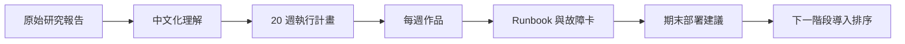
## 01｜提案核心：先收斂，再部署

### 此章回答

這份 954 個邏輯行的研究報告如何變成 20 週可以執行、可以檢核、可以教會團隊的部署能力？

### 延伸摘要

原始研究的重點不是列出很多平台名稱，而是建立一套判斷順序：先知道 n8n 如何保存狀態，再決定要不要公開，再決定 public URL、PostgreSQL、reverse proxy、backup、security、scaling。20 週計畫會把這個順序變成階段式學習，避免一開始就跳進 AWS、Kubernetes 或隨機 tunnel，卻沒有處理資料持久性與 webhook URL。

### 三條能力路線

| Lane | 能力 | 對應原始內容 | 20 週後的結果 |
| --- | --- | --- | --- |
| Lane A | Deployment Literacy | Cloud、local、VPS、PaaS、hyperscaler、Kubernetes 比較 | 能為不同使用者選擇合理部署路線。 |
| Lane B | Hands-on Build | Docker、npm、Compose、Tunnel、VPS、Caddy、Cloud Run | 能跑出可被驗證的本機與公開部署。 |
| Lane C | Operations Discipline | PostgreSQL、backup、security、updates、troubleshooting、queue mode | 能把 n8n 當成長期系統維運。 |

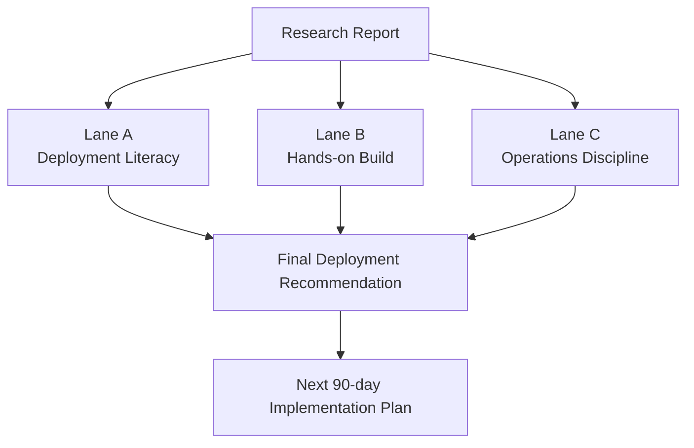

### 設計原則

1. 先建立判斷，再開始部署。
2. 每週都留下可交接作品，不只看懂文件。
3. 所有 public deployment 都要檢查 `WEBHOOK_URL`、`N8N_EDITOR_BASE_URL`、TLS、DNS 與 proxy headers。
4. 任何 production-like self-hosted 路線，都要把 PostgreSQL、encryption key、backup、restore、update、rollback 寫入 runbook。
5. Scaling 不提前神化。先單機穩定，再 PostgreSQL，再 Redis queue，再 workers，最後才考慮 Kubernetes 或 ECS。
## 02｜20 週總覽：五個 Phase Gate

| Phase | 週次 | 主題 | 此階段重點 | Gate 交付物 |
| --- | --- | --- | --- | --- |
| Phase 01 | Week 01-04 | Foundation | 先建立部署判斷、n8n 狀態模型、公開 URL、DNS/TLS/Proxy 基礎。 | 概念圖、決策矩陣、風險清單 |
| Phase 02 | Week 05-08 | Local Build | 從 Docker Desktop、npm、Compose 到 tunnel，讓學員真的跑起 n8n。 | 本機部署紀錄、Compose 筆記、公開 webhook 測試 |
| Phase 03 | Week 09-12 | Cloud Choice | 比較 n8n Cloud、VPS、PaaS、Cloud Run、AWS，不急著導入重架構。 | 平台比較表、VPS 藍圖、Cloud Run/AWS 架構圖 |
| Phase 04 | Week 13-16 | Production Readiness | 把資料庫、備份、安全、更新與 scaling 變成可維運流程。 | 備份還原 runbook、安全檢查表、sizing 與 scaling ladder |
| Phase 05 | Week 17-20 | Capstone | 用故障演練、選型矩陣與期末展示，把知識轉成可交接作品。 | 部署作品包、故障排除卡、最終建議報告 |

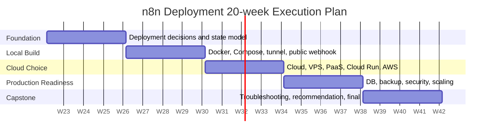

### 每週摘要表

| 週次 | 主題 | 來源章節 | 主要交付 | 驗收條件 |
| --- | --- | --- | --- | --- |
| 01 | 部署全景與決策框架 | Executive Summary；Research-Based Deployment Landscape | 完成 n8n 部署地圖、四大部署模式比較、自己的目標情境定義 | 能說清楚 Cloud、local、VPS、PaaS、hyperscaler 各自適用條件 |
| 02 | n8n 如何運作 | Course Roadmap / Part foundations | 畫出 application、database、credentials、executions、binary data、public URL 的關係 | 能解釋為什麼 n8n 不是純 stateless web app |
| 03 | 資料保存與安全基礎 | Databases and storage；Backups | 列出 SQLite、PostgreSQL、.n8n volume、encryption key、binary data 的備份責任 | 能定義最小可恢復備份組合 |
| 04 | DNS、HTTPS、反向代理與公開 URL | Domains, DNS, HTTPS, webhooks, and reverse proxies | 建立 DNS/TLS/Proxy/Webhook/OAuth callback 概念圖與檢查表 | 能判斷 webhook 或 OAuth 失敗時先查哪些變數 |
| 05 | 本機快速啟動：Docker Desktop | Guide for local deployment on macOS / Windows | 在 macOS 或 Windows 跑起本機 n8n，確認 volume persistence | 重啟容器後 workflow 與 credential 仍存在 |
| 06 | npm 與單容器路線比較 | Guide for local deployment with npm；local Docker | 跑一次 npx 或全域 npm，整理它與 Docker 的差異 | 能說出 npm 適合測試、Docker 適合長期維運的理由 |
| 07 | Docker Compose + PostgreSQL | Guide for local Docker Compose | 建立 Compose 架構筆記，理解 DB env vars、N8N_ENCRYPTION_KEY、volume | 能看懂 Postgres-backed Compose 檔每一段的目的 |
| 08 | 本機公開：Tunnel 與穩定網域 | Guide for local n8n with public internet access | 比較 n8n tunnel、Cloudflare Tunnel、ngrok、Tailscale、port forwarding | 能完成一個外部 POST webhook 測試，且 URL 設定正確 |
| 09 | n8n Cloud 與最低維運路線 | Guide for n8n Cloud | 建立 Cloud 適用情境、限制、execution volume 估算表 | 能判斷哪些工作負載應留在 Cloud，哪些需要 self-host |
| 10 | VPS + Docker Compose + Caddy | Guide for VPS deployment with Docker Compose | 設計一份 VPS 部署藍圖，包含 DNS、Caddy、Postgres、n8n env、firewall | 能指出正式 webhook URL 不應顯示 localhost |
| 11 | Railway、Zeabur、Render、Fly.io | Guide for a beginner-friendly cloud deployment；Platform notes | 整理各平台 persistent storage、Postgres、custom domain、pricing risk | 能辨認 ephemeral service 對 n8n 的風險 |
| 12 | Cloud Run Durable 與 AWS 路線 | Guide for a production-oriented cloud deployment | 畫出 Cloud Run + Cloud SQL + Secret Manager；AWS Lightsail/EC2/ECS 階梯 | 能說清楚何時用簡單平台，何時值得進 AWS/GCP |
| 13 | 資料庫、binary data 與容量規劃 | Operations / Databases and storage；Server sizing | 制定 sizing 起始表，標註 AI-heavy、binary-heavy、wait state 的影響 | 能為學習、個人、小企業、agency 提出初始規格 |
| 14 | 備份、還原與更新流程 | Backups, updates, maintenance, and scaling | 完成 pg_dump、volume archive、restore、image update、rollback runbook | 能在文件上演練一次備份與還原，不漏 encryption key |
| 15 | 安全責任、使用者管理與 patch cadence | Security responsibilities | 建立 HTTPS-only、2FA、SMTP、secrets、firewall、update policy 檢查表 | 能清楚區分 Cloud、PaaS、VPS 的責任分界 |
| 16 | Scaling：單機、Redis queue、workers | Scaling path | 建立 scaling ladder：single container 到 queue mode 到 multi-worker | 能避免過早 Kubernetes，並知道何時該加 Redis |
| 17 | 故障排除演練 | Troubleshooting table | 針對 container、DB、webhook、OAuth、HTTPS、secure cookie、memory 做排查卡 | 看到錯誤能先查 logs、env、DNS、proxy、DB，而不是盲改 |
| 18 | 平台選型與成本風險評估 | Final Recommendations；AWS vs simpler cloud options | 按 beginner、freelancer、agency、small business、production team 建議路線 | 能交出一頁 deployment recommendation matrix |
| 19 | Capstone：建立可複製部署作品 | Practical Deployment Guides；Operations | 完成一份可展示部署包：架構圖、env 範本、checklist、backup runbook | 另一位同仁能照文件理解與接手 |
| 20 | 期末驗收與下一階段導入排序 | Final Recommendations；Open questions and limitations | 3 小時成果交流：展示、壓力點、風險、成本、下一步排序 | 完成最終 recommendation report 與 90 天維運節奏 |

## 03｜每週執行細節

### Week 01｜部署全景與決策框架

**此週回答：** n8n 到底有哪些部署方式，為什麼不能只問 cloud 還是 local？

**學習焦點**

- 讀完 Executive Summary 與 deployment landscape
- 整理 n8n Cloud、local、VPS、PaaS、hyperscaler、Kubernetes 的定位
- 建立自己的學習情境與 production 情境

**交付物**

- 一頁部署選項矩陣
- 一張需求判斷流程圖
- 一份風險詞彙表：uptime、public URL、persistence、patching、backup

**驗收條件：** 能用三分鐘說明為什麼 local Docker 適合學習，但不適合長期 public webhook production。

### Week 02｜n8n 如何運作

**此週回答：** n8n 的 application、database、credentials、executions、binary data、public URL 如何互相影響？

**學習焦點**

- 理解 n8n application process 與 state layer
- 區分 workflow、credential、execution history、binary data 的保存位置
- 理解 `.n8n` user folder 與 encryption key

**交付物**

- n8n runtime architecture 圖
- state inventory 表
- credential-loss 風險說明卡

**驗收條件：** 能解釋為什麼換容器或換主機時，保存 encryption key 與 volume 不是可選項。

### Week 03｜資料保存與安全基礎

**此週回答：** SQLite、PostgreSQL、volume、binary data、encryption key 各自承擔什麼責任？

**學習焦點**

- 比較 SQLite 與 PostgreSQL
- 整理 backup minimum viable set
- 理解 binary data memory/filesystem/database 模式

**交付物**

- SQLite vs PostgreSQL 決策表
- 最小備份組合 checklist
- binary-heavy workflow 注意事項

**驗收條件：** 能列出 production self-host n8n 的最小備份內容：database、volume、encryption key、Compose/env/proxy config。

### Week 04｜DNS、HTTPS、反向代理與公開 URL

**此週回答：** 為什麼 webhook 與 OAuth 常常不是 workflow 錯，而是 URL、DNS、proxy 錯？

**學習焦點**

- 理解 domain、DNS A record、CNAME、subdomain、dynamic DNS
- 理解 TLS certificate 與 reverse proxy
- 理解 WEBHOOK_URL、N8N_EDITOR_BASE_URL、N8N_PROXY_HOPS

**交付物**

- public URL troubleshooting flow
- OAuth callback checklist
- DNS/TLS glossary

**驗收條件：** 看到 OAuth callback mismatch 時，能先檢查 provider callback、WEBHOOK_URL、EDITOR_BASE_URL 與 tunnel/domain 是否穩定。

### Week 05｜本機快速啟動：Docker Desktop

**此週回答：** 如何用最少摩擦在 macOS 或 Windows 上跑起可保存狀態的本機 n8n？

**學習焦點**

- Docker Desktop 安裝與基本概念
- `docker volume create n8n_data`
- `docker run` port mapping 與 volume mapping

**交付物**

- 本機部署紀錄
- container / volume 截圖或文字紀錄
- 重啟後 persistence 驗證

**驗收條件：** 重啟 Docker Desktop 或重建 container 後，workflow 與 credential 仍存在。

### Week 06｜npm 與單容器路線比較

**此週回答：** npm 為什麼快，但 Docker 為什麼通常更適合長期 self-host？

**學習焦點**

- 執行 `npx n8n` 或 `npm install -g n8n`
- 比較 Node.js 版本、全域依賴、升級、隔離性
- 回頭比較 Docker single-container 的穩定性

**交付物**

- npm vs Docker 比較表
- 本機啟動命令筆記
- 不適合 production 的原因清單

**驗收條件：** 能說明 npm quick start 的價值，也能說明何時該停止使用它當長期方案。

### Week 07｜Docker Compose + PostgreSQL

**此週回答：** 如何把單一 container 升級成 production-shaped local stack？

**學習焦點**

- 理解 Compose services、volumes、depends_on
- 設定 DB_TYPE=postgresdb 與 DB_POSTGRESDB_*
- 固定 N8N_ENCRYPTION_KEY

**交付物**

- Compose 架構解說
- env vars 對照表
- PostgreSQL-backed n8n 啟動紀錄

**驗收條件：** 能逐行說明 Compose 檔裡 n8n、postgres、volumes、environment 的用途。

### Week 08｜本機公開：Tunnel 與穩定網域

**此週回答：** 如何讓外部服務碰到本機 n8n，又不把測試 tunnel 誤當 production？

**學習焦點**

- 比較 n8n built-in tunnel、Cloudflare Quick Tunnel、named tunnel、ngrok、Tailscale Funnel、DDNS
- 設定 WEBHOOK_URL 與 EDITOR_BASE_URL
- 做一個外部 POST webhook 測試

**交付物**

- tunnel comparison table
- public webhook 測試紀錄
- learning-only vs production-ready 判斷表

**驗收條件：** 能指出 random tunnel URL 對 OAuth callback 與長期 webhook 的風險。

### Week 09｜n8n Cloud 與最低維運路線

**此週回答：** 什麼情況下最好的部署就是不要 self-host？

**學習焦點**

- 理解 n8n Cloud 的 hosted plan 與 execution billing
- 估算 schedule/webhook 的月執行量
- 列出 self-host 才適合的需求：custom nodes、CLI、bash、host-level control

**交付物**

- Cloud 適用情境卡
- execution volume 估算表
- Cloud vs self-host 責任分界

**驗收條件：** 能為 beginner 或非工程團隊提出 n8n Cloud 優先的理由。

### Week 10｜VPS + Docker Compose + Caddy

**此週回答：** 如何建立最平衡的 self-hosted n8n production 起點？

**學習焦點**

- VPS、DNS A record、firewall ports 80/443
- Caddy reverse proxy 與 automatic HTTPS
- Postgres + n8n + Caddy Compose 架構

**交付物**

- VPS 部署藍圖
- Caddyfile 與 env vars 解說
- firewall / DNS / HTTPS 檢查表

**驗收條件：** 能部署或完整模擬一個 `https://n8n.example.com` 架構，且 webhook URL 不會指回 localhost。

### Week 11｜Railway、Zeabur、Render、Fly.io

**此週回答：** PaaS 可以省下哪些維運，又在哪些地方最容易踩到持久化陷阱？

**學習焦點**

- 檢查 persistent volume、managed PostgreSQL、custom domain、TLS、env vars
- 辨認 Render/Fly/Zeabur/Railway 的狀態保存模型
- 理解 usage pricing 與 always-on 成本

**交付物**

- PaaS 平台比較表
- persistent storage risk card
- 平台選型建議

**驗收條件：** 能說明為什麼服務能啟動不代表 n8n state 能在 redeploy 後存活。

### Week 12｜Cloud Run Durable 與 AWS 路線

**此週回答：** 何時值得使用 hyperscaler，而不是普通 VPS 或 PaaS？

**學習焦點**

- Cloud Run easy mode vs durable mode
- Cloud SQL、Secret Manager、service account
- AWS Lightsail/EC2/ECS/RDS/Secrets Manager/ALB/CloudWatch 階梯

**交付物**

- Cloud Run durable 架構圖
- AWS 三階段演進圖
- hyperscaler adoption checklist

**驗收條件：** 能說明 AWS 的強大來自 building blocks，也能說明它帶來的組裝與維運成本。

### Week 13｜資料庫、binary data 與容量規劃

**此週回答：** 如何為不同負載選擇初始規格，並避免 binary-heavy workflow 拖垮記憶體？

**學習焦點**

- 讀 server sizing table
- 整理 learning、personal、freelancer、small business、agency、AI-heavy 的初始規格
- 辨認 frequency、concurrency、binary size、wait states、AI calls、browser automation 的影響

**交付物**

- sizing recommendation table
- binary-heavy workflow 風險說明
- 容量觀察指標清單

**驗收條件：** 能為一個 small business 情境提出 4 vCPU / 8 GB RAM / PostgreSQL / backup / monitoring 的合理起點或調整理由。

### Week 14｜備份、還原與更新流程

**此週回答：** 如何讓 n8n 不只會跑，還能在升級失敗或資料遺失時回得來？

**學習焦點**

- pg_dump 與 volume archive
- restore command 與演練
- release notes、image pinning、pull、restart、test、rollback

**交付物**

- backup runbook
- restore runbook
- update / rollback checklist

**驗收條件：** 文件中必須明確保存 database、volume、encryption key、Compose/env/proxy config，且做一次還原演練設計。

### Week 15｜安全責任、使用者管理與 patch cadence

**此週回答：** 公開 self-hosted n8n 時，哪些責任會回到自己身上？

**學習焦點**

- Cloud/local/tunnel/VPS/PaaS/hyperscaler 責任分界
- HTTPS-only、secure cookies、SMTP/user management、2FA、SSO、secrets
- 2026 之後 public instance 的 aggressively update 原則

**交付物**

- security responsibility matrix
- public exposure hardening checklist
- patch cadence policy

**驗收條件：** 能明確說出公開 instance 不更新就是安全邊界破洞，升級不是只有新功能。

### Week 16｜Scaling：單機、Redis queue、workers

**此週回答：** 何時該加大單機，何時該上 queue mode，何時才值得 Kubernetes？

**學習焦點**

- single instance first
- PostgreSQL first
- Redis queue mode 與 workers
- separate webhook processors、managed DB/Redis、centralized logs

**交付物**

- scaling ladder
- queue mode architecture diagram
- anti-overengineering checklist

**驗收條件：** 能提出一條從 single container + Postgres 到 Redis workers 的漸進路線，而不是一開始就上 Kubernetes。

### Week 17｜故障排除演練

**此週回答：** 遇到錯誤時，如何快速判斷是 container、DB、URL、proxy、OAuth、security 還是 resource 問題？

**學習焦點**

- 逐項演練 troubleshooting table
- 為常見問題寫第一檢查點
- 把症狀轉成排查流程

**交付物**

- 12 張故障排除卡
- log/env/DNS/proxy/DB 檢查順序
- incident note 範本

**驗收條件：** 能針對 wrong webhook URL、lost credentials、database connection failed、secure cookie error 提出第一步與修復方向。

### Week 18｜平台選型與成本風險評估

**此週回答：** 不同使用者類型應該選哪條路，成本與維運責任怎麼說清楚？

**學習焦點**

- 按 user type 閱讀 final recommendations
- 比較 AWS 與 simpler cloud options
- 整理 usage-priced 平台的 RAM/CPU/storage/egress 變動風險

**交付物**

- deployment recommendation matrix
- cost-risk worksheet
- AWS vs PaaS decision memo

**驗收條件：** 能為 beginner、freelancer、agency、production team 分別提出首選、替代方案、避免事項。

### Week 19｜Capstone：建立可複製部署作品

**此週回答：** 如何把 18 週學到的內容變成別人可以接手的部署作品包？

**學習焦點**

- 選一條主部署路線
- 整理 architecture、env template、DNS/TLS notes、backup/update/troubleshooting
- 準備期末展示資料

**交付物**

- 部署作品包
- README-style handoff
- final demo checklist

**驗收條件：** 另一位同仁只看作品包，就能理解架構、啟動方式、備份方式、風險與下一步。

### Week 20｜期末驗收與下一階段導入排序

**此週回答：** 最後如何把部署能力轉成下一階段導入判斷？

**學習焦點**

- 3 小時成果交流
- 展示部署選型、架構、runbook、風險、成本
- 排出 90 天後續維運與導入優先順序

**交付物**

- 最終建議報告
- 90 天維運節奏
- 導入候選清單與 owner

**驗收條件：** 期末不是只展示 n8n 有跑，而是能回答：為什麼選這條路、風險在哪、如何備份、如何更新、何時擴展。

## 04｜逐章中文導讀、延伸摘要與圖示

這一章對應原始研究報告的主要大章。每一節都包含：此章回答、中文摘要、延伸整理、圖示，以及該章落在 20 週計畫中的位置。原文完整內容請見附錄 A。

### 01｜Executive Summary

**此章回答：** 這份研究真正想先阻止哪些錯誤決策？

**中文摘要**

- n8n 的部署選擇不能只看 cloud vs local，而要看 uptime、安全、公網可達性、資料持久性與維運責任。
- 初學者最穩的起點是 n8n Cloud 或 local Docker Desktop；需要穩定 webhook 的個人或小團隊，常見甜蜜點是 VPS + Docker Compose + PostgreSQL + reverse proxy。
- 真正進入 production 時，優先順序通常是 PostgreSQL、正確 public URL、備份與更新，再考慮 Redis queue mode 與多 worker。
- 公開 self-hosted n8n 的最大風險不是安裝難度，而是版本過舊、proxy 設定錯、encryption key 或 backup 沒有保存。

**延伸整理：** 把這章轉成執行計畫時，第一週不要立刻寫部署指令，而要先讓學員建立判斷能力：我需要誰負責更新？我的 webhook 是否需要穩定網址？資料遺失是否可接受？這些答案會直接決定後面 19 週的技術路線。

**對應週次：** Week 01、Week 18、Week 20

**圖示**

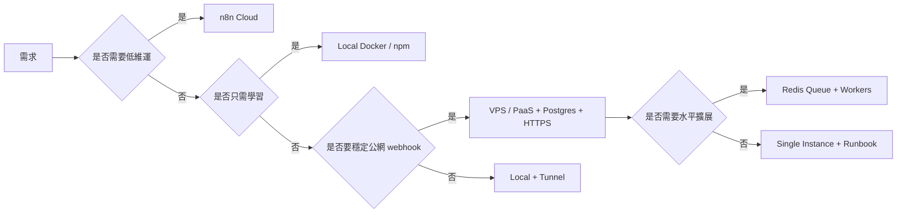

### 02｜Research-Based Deployment Landscape

**此章回答：** 目前可行路線有哪些，哪些是官方、常見、社群支援或高風險？

**中文摘要**

- 官方主路線包含 n8n Cloud、npm、Docker、Docker Compose 與部分雲端 server setup 指南。
- Railway、Render、Zeabur、Fly.io、Azure Container Apps 等不是全部都有 n8n first-party 教學，但只要 container、env vars、domain/TLS、Postgres、persistent storage 都處理好，就具備可行性。
- NAS、home server、Synology、TrueNAS、Unraid 可以自用，但公開上線要格外注意權限、cookie、OAuth callback、DDNS 與 uptime。
- 隧道工具對學習很有價值，但 random URL、Quick Tunnel、內建 tunnel 不應被誤認為 production-grade public edge。

**延伸整理：** 這章適合做成部署選型工作坊。每個平台不只問能不能跑 n8n，而要問：資料會不會消失？URL 會不會變？TLS 誰負責？Postgres 在哪裡？升級失敗怎麼回復？

**對應週次：** Week 01、Week 04、Week 11、Week 18

**圖示**

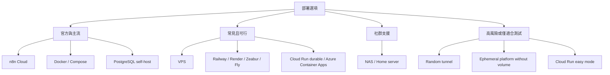

### 03｜Course Roadmap

**此章回答：** 如何把研究內容變成可以教、可以做、可以驗收的學習路徑？

**中文摘要**

- 原文已經把內容排成 course-style path：foundation、local deployment、cloud hosting、operations、capstone。
- 20 週計畫沿用這個結構，但拉長成每週都有主題、操作、交付與檢核。
- 學習順序不是先背一堆平台，而是先理解 n8n 的狀態層，再做本機，再做公網，再做雲端，最後補維運。
- 每個階段都要留下作品，否則課程會停留在看懂文件，沒有變成可部署能力。

**延伸整理：** 這章是整份 20 週計畫的骨架。MOVA 提案的精神是每月有檢核點；這裡改成每四週一個 phase gate，讓學員不會一路學到最後才發現前面沒有交付物。

**對應週次：** Week 01-20

**圖示**

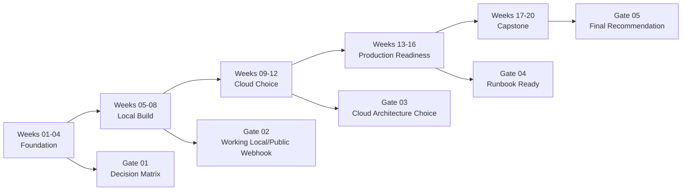

### 04｜Practical Deployment Guides

**此章回答：** 每一種部署方式要怎麼實作，實作時最容易錯在哪裡？

**中文摘要**

- 原文提供 n8n Cloud、本機 Docker、本機 npm、Docker Compose、本機公開、VPS、PaaS、Cloud Run、AWS 等路線。
- 共同主軸是 application、state layer、public-access layer；部署選項不同，這三層仍然存在。
- Docker Compose + PostgreSQL 是從學習走向 production-shaped setup 的關鍵橋樑。
- VPS + Caddy + Postgres 是最平衡的 self-hosted pattern；PaaS 則要嚴格檢查 persistent volume 與 managed Postgres。

**延伸整理：** 這章不要一次教完所有平台，而是做成比較式練習。學員要在同一張架構圖上換平台：入口是誰？TLS 誰處理？資料庫在哪？secret 放哪？n8n 如何知道自己的 public URL？

**對應週次：** Week 05-12、Week 19

**圖示**

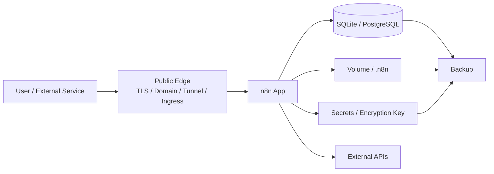

### 05｜Operations and Production Readiness

**此章回答：** 什麼時候一個 n8n 部署才算能被維運，而不是只會跑？

**中文摘要**

- 資料庫不是附屬品；credentials、past executions、workflows 都依賴它，production 應優先使用 PostgreSQL。
- 公開 URL、WEBHOOK_URL、N8N_EDITOR_BASE_URL、N8N_PROXY_HOPS 與 reverse proxy headers 是 webhook/OAuth 成敗核心。
- Production readiness 至少包含備份、還原、更新、rollback、安全、監控、sizing 與 scaling path。
- Queue mode 是真正需要擴展時的主路線，但它應該在單機與 PostgreSQL 都穩定後才導入。

**延伸整理：** 這章是從 builder 變成 operator 的轉折。若學員只會部署，出事時會慌；若學員有 runbook、backup、restore drill、update checklist，就能把 n8n 當成長期系統經營。

**對應週次：** Week 13-16

**圖示**

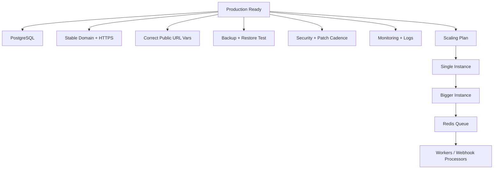

### 06｜Troubleshooting and Checklists

**此章回答：** 出問題時，如何從症狀回推最可能的層級？

**中文摘要**

- container 起不來多半先查 logs、env vars、DB auth、port conflict。
- credential 遺失通常指向 volume 或 N8N_ENCRYPTION_KEY 問題。
- webhook、OAuth、HTTPS、domain 問題大多在 public URL、DNS、proxy、cert 或 provider callback 設定。
- memory/slow workflow 問題要看 binary data、concurrency、workflow 類型與 worker 架構。

**延伸整理：** 故障排除要做成卡片，而不是塞在最後一頁。每張卡都要有症狀、第一個要看的地方、修復方式、預防方式，這會直接提高期末作品的可交接性。

**對應週次：** Week 17、Week 19

**圖示**

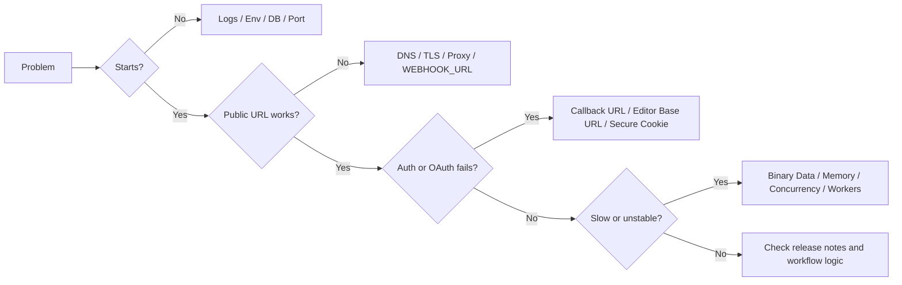

### 07｜Final Recommendations

**此章回答：** 不同使用者最後應該選哪條路，下一階段又該怎麼收斂？

**中文摘要**

- Beginner 適合 n8n Cloud 或 local Docker；個人自動化可以先 local，再視 webhook 需求進 VPS。
- Freelancer 與小團隊可在 Railway/Zeabur/VPS 之間選擇，核心不是潮流，而是穩定 URL、Postgres、volume、backup。
- Agency 與 production team 應先穩定 PostgreSQL、backup、monitoring，再依負載導入 queue mode 與 workers。
- AWS/GCP/Kubernetes 不是錯，只是需要有 enterprise、IAM、規模、治理或既有雲環境的真實需求。

**延伸整理：** 最後兩週要把技術選項翻譯成決策語言：成本、難度、風險、維運責任、成長路線。這樣期末成果不是『我會部署』，而是『我能為一個情境選出合理部署方案』。

**對應週次：** Week 18、Week 20

**圖示**

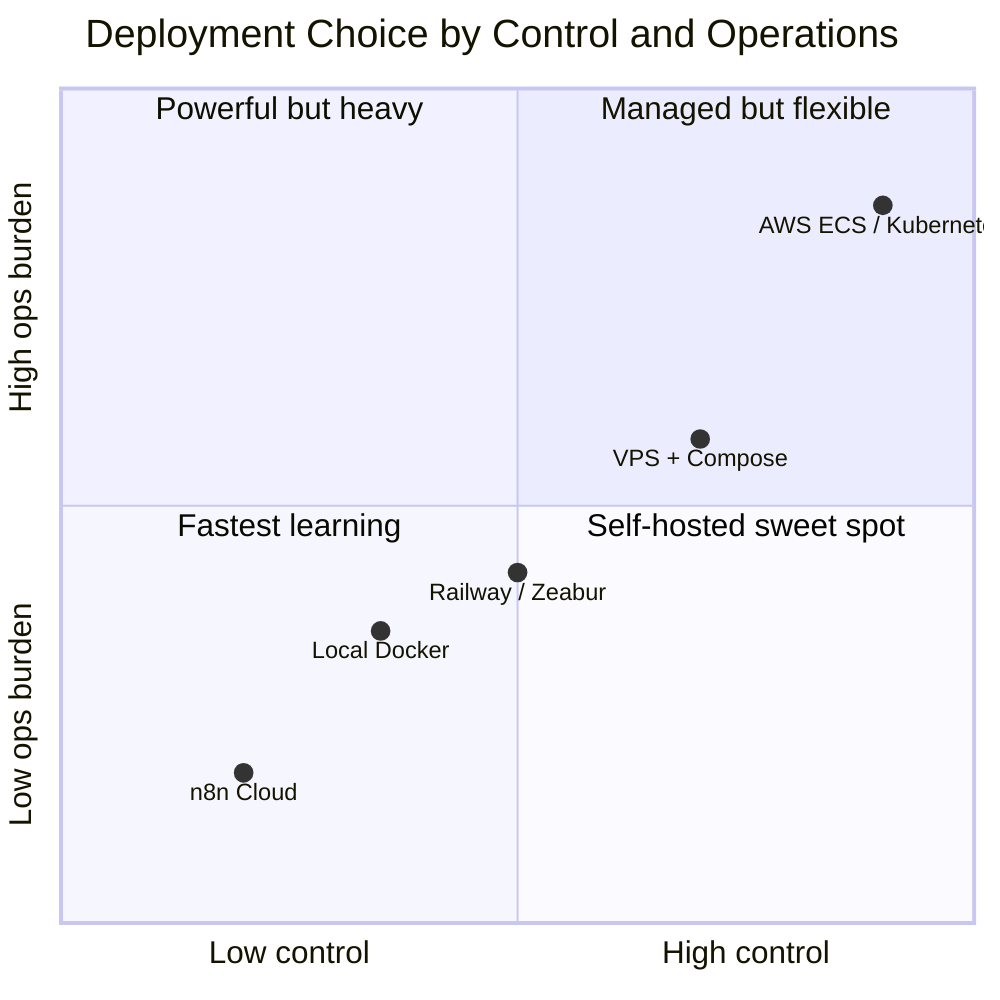

## 05｜作品與檢核標準

### 每週作品牆格式

每週成果不只交一段心得，而要交一個可被主管、同仁或後續維運者看懂的作品。建議每週都用同一個格式沉澱：

| 欄位 | 要填什麼 | 檢核方式 |
| --- | --- | --- |
| 解決的問題 | 本週回答哪一個部署或維運問題 | 能否用一句話說清楚問題 |
| 來源章節 | 對應原始研究哪一章 | 是否能回到附錄 A 找到依據 |
| 架構圖 | Mermaid 或手繪轉 Markdown | 是否呈現 application、state、public edge |
| 操作紀錄 | 指令、env vars、平台設定、截圖文字紀錄 | 是否可重現 |
| 風險與限制 | 資料保存、公開 URL、安全、成本、維運責任 | 是否說出 trade-off |
| 驗收證據 | 測試結果、檢查表、錯誤排除紀錄 | 是否可被第三方確認 |

### 期中 Gate

| Gate | 週次 | 評估問題 | 必備產物 |
| --- | --- | --- | --- |
| Gate 01 | Week 04 | 是否理解部署選型與 n8n 狀態模型？ | 決策矩陣、state diagram、public URL checklist |
| Gate 02 | Week 08 | 是否能在本機跑起並完成公開 webhook 測試？ | Docker/Compose 紀錄、tunnel 比較、webhook 測試 |
| Gate 03 | Week 12 | 是否能比較 Cloud、VPS、PaaS、hyperscaler？ | 平台比較表、VPS 藍圖、Cloud Run/AWS 圖 |
| Gate 04 | Week 16 | 是否具備 production readiness runbook？ | backup/restore、security、sizing、scaling ladder |
| Gate 05 | Week 20 | 是否能提出合理部署建議與下一階段導入？ | 最終建議報告、部署作品包、90 天維運節奏 |

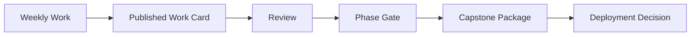

### 作品檢核標準

| 標準 | 通過條件 |
| --- | --- |
| 判斷清楚 | 能說明為什麼選某一部署方式，也能說明為什麼不選其他方式。 |
| 資料清楚 | database、volume、encryption key、binary data、backup 位置都被記錄。 |
| URL 清楚 | public domain、TLS、WEBHOOK_URL、EDITOR_BASE_URL、proxy hops 都被檢查。 |
| 安全清楚 | 更新節奏、2FA/SSO、SMTP、secret handling、firewall、secure cookie 都有判斷。 |
| 維運清楚 | backup、restore、update、rollback、troubleshooting 都有 runbook。 |
| 可交接 | 另一位同仁能照文件理解架構、重建環境或接手維運。 |
## 06｜期末交流：3 小時成果驗收

### 此章回答

20 週結束時，如何把學習成果轉成下一階段真正導入 n8n 的判斷？

### 交流流程

| 時間 | 主題 | 產出 |
| --- | --- | --- |
| 00:00-00:20 | 成果總覽 | 20 週作品數、平台比較、主要學習結論 |
| 00:20-01:00 | 部署作品展示 | 本機、VPS/PaaS 或 Cloud 架構圖與測試證據 |
| 01:00-01:40 | Runbook 展示 | backup、restore、update、rollback、troubleshooting |
| 01:40-02:10 | 風險討論 | 安全、成本、維運責任、public exposure、scaling |
| 02:10-02:40 | 選型決策 | 依使用者類型或公司情境選出首選與替代方案 |
| 02:40-03:00 | 下一步排序 | 90 天導入節奏、owner、資料缺口與驗收指標 |

### 期末輸出

| 輸出 | 說明 |
| --- | --- |
| Final Recommendation Report | 說明建議部署路線、成本型態、風險、替代方案與不建議事項。 |
| Deployment Package | 架構圖、env 範本、Compose 或平台設定筆記、DNS/TLS notes。 |
| Operations Runbook | backup、restore、update、rollback、patch cadence、incident flow。 |
| Troubleshooting Cards | container、DB、webhook、OAuth、HTTPS、secure cookie、memory、failed update。 |
| 90-day Plan | 進入正式導入後的維運節奏、監控項目、下一個 scaling gate。 |

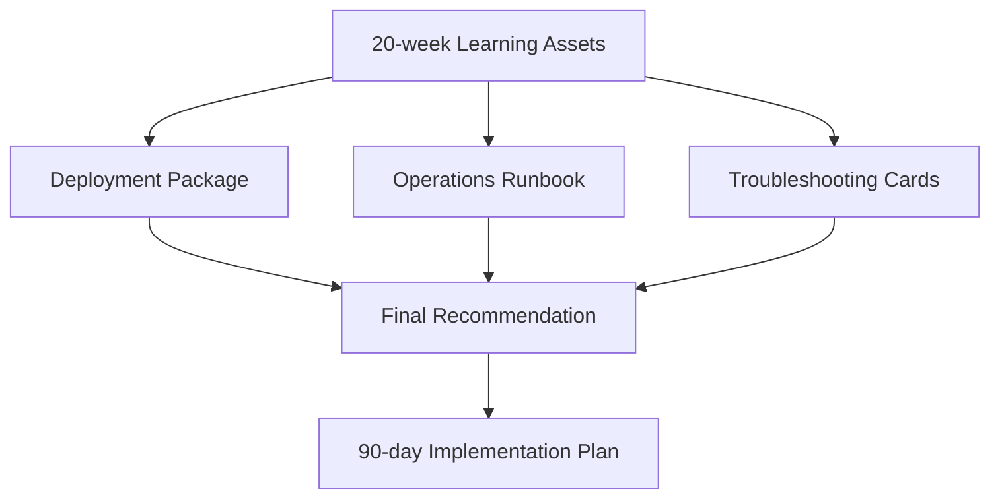
## 07｜啟動準備

### 開始前需要準備

| 類別 | 項目 |
| --- | --- |
| 本機環境 | Docker Desktop、Node.js、Terminal、文字編輯器、瀏覽器。 |
| n8n 測試 | n8n Cloud 試用或本機 Docker 測試環境。 |
| 網路與網域 | 可選：測試 domain、Cloudflare 帳號、ngrok 或 Tailscale 帳號。 |
| 雲端平台 | 可選：VPS provider、Railway、Zeabur、Render、GCP、AWS 帳號。 |
| 安全資料 | password manager、secret storage 習慣、encryption key 產生與保存方式。 |
| 報告工具 | Markdown、Mermaid、每週作品牆位置、review 節奏。 |

### 啟動前檢核

- 已確認學習目標是「能部署與維運 n8n」，不是只會打開 n8n editor。
- 已確認是否需要真實公網 webhook；若需要，會準備穩定 domain 或 named tunnel。
- 已確認任何 production-like 實作都會使用 PostgreSQL 或至少明確說明為何暫時不用。
- 已確認每週交付物會保留在同一份作品牆或 repo 中。
- 已確認第 20 週要交的是部署建議與 runbook，不只是課程心得。

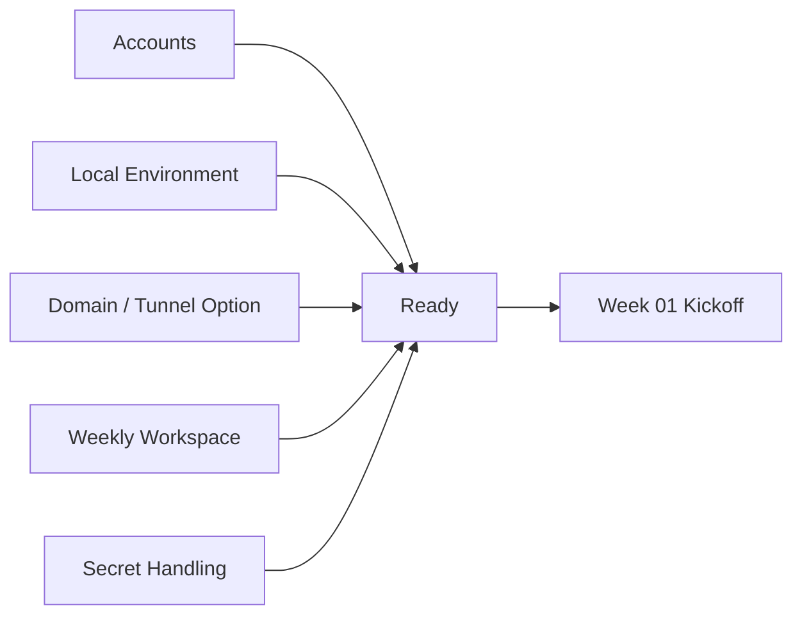
## 附錄 A｜完整原始研究報告（逐字收錄）

以下內容從來源文件逐字嵌入，未翻譯、未刪節、未改寫。此附錄用來保留原始研究依據；正文的中文計畫、摘要與圖示則是基於這份原文延伸整理。

- 來源路徑：`/Users/linshangche/Desktop/deep-research-report (2).md`
- 來源行數：954 個邏輯行（原檔 `wc -l` 顯示 953，因最後一行沒有結尾換行）
- SHA256：`ab54e7aa13174b364883acf49a864824c0176c3128329501bef18c98da47cc98`

<!-- ORIGINAL_SOURCE_BEGIN sha256=ab54e7aa13174b364883acf49a864824c0176c3128329501bef18c98da47cc98 lines=954 -->
# Complete Guide to Deploying n8n Locally and in the Cloud

## Executive Summary

n8n can realistically be deployed in four broad ways today: as **n8n Cloud**, as a **local install** on your own machine, as a **self-hosted single-server deployment** on a VPS or cloud VM, or as a **multi-service production deployment** using managed databases, reverse proxies, and optional queue workers. Official n8n documentation strongly favors **Docker for most self-hosting**, still supports **npm for local quick starts**, and publishes server-setup guides for **Docker Compose, DigitalOcean, Hetzner, AWS, Azure, Google Cloud Run, Google Kubernetes Engine, and OpenShift CRC**. n8n also explicitly warns that self-hosting is for users who can manage servers, security, scaling, and backups; otherwise, it recommends n8n Cloud. citeturn5search19turn31search8turn33view0turn3search17

The best deployment choice depends less on “cloud vs local” and more on **how much uptime, security, public access, and operational responsibility** you need. For most beginners, the cleanest path is either **n8n Cloud** or **local Docker Desktop**. For solo builders who need public webhooks and stable URLs, the practical sweet spot is usually **a small VPS with Docker Compose, PostgreSQL, and a reverse proxy**, or a simpler container platform such as **Railway, Render, or Zeabur** if persistent storage is configured correctly. For serious production workloads, the breakpoint is usually **PostgreSQL first**, then **Redis queue mode**, then **multiple worker processes**, and only after that **ECS, GKE, AKS, or Kubernetes-style orchestration**. citeturn7view0turn6search1turn34search9turn34search2turn31search9

Two findings matter more than anything else. First, **SQLite is acceptable for learning and low-risk single-instance use**, but production-grade deployments should move to **PostgreSQL**, especially once you care about backups, external connectivity, upgrades, or scaling. Second, **public URLs must be configured correctly**. Behind tunnels or reverse proxies, n8n needs the right public editor and webhook URLs, plus correct proxy settings, or webhooks and OAuth redirects will fail in confusing ways. citeturn6search1turn34search18turn32view0turn33view0turn5search20

A final security point is non-negotiable: if you expose self-hosted n8n to the public internet, **patching and upgrade hygiene are essential**. n8n had critical vulnerabilities disclosed in 2026, including an unauthenticated issue affecting versions from 1.65.0 up to but not including 1.121.0, fixed in 1.121.0, plus later authenticated RCE-path issues fixed in newer releases. A publicly reachable but stale n8n instance is significantly riskier than a private local instance or n8n Cloud. citeturn37search6turn37search1turn37search5turn37search8

## Research-Based Deployment Landscape

### What the current landscape actually looks like

The realistic n8n deployment landscape is wider than “n8n Cloud vs VPS.” In practice, there are **officially documented** paths, **provider-supported container paths**, and **community-supported paths**. Official n8n docs cover Cloud, npm, Docker, Docker Compose, and several server setups; platforms such as Railway, Render, Fly.io, and Zeabur are not first-party n8n setup guides, but they are viable because they support container images, environment variables, domains, TLS, and some form of persistent storage. Home servers, NAS boxes, Synology, TrueNAS, and Unraid are all in real-world use, but they are better understood as **community-supported Docker deployments**, not first-party support tiers. citeturn33view0turn5search19turn31search8turn13search9turn24search14turn24search1turn24search8

If you meant a platform name like **“Zipper”**, the current, relevant platform in this category is **Zeabur**. Zeabur’s official docs show Docker-image deployment, template-based deployment, injected environment variables, free `*.zeabur.app` hostnames, custom domains, persistent volumes, backups, and an n8n template in its marketplace. In other words, **Zeabur is real and relevant**; “Zipper” does not appear to be the current platform name in this ecosystem. citeturn13search9turn13search10turn12search1turn12search3turn13search1turn13search5

### Comparison table of the practical options

| Deployment option | Officially documented by n8n | Beginner friendly | Production ready | Persistent storage | Custom domain / HTTPS | PostgreSQL support | Scaling path | Typical cost pattern | Maintenance burden |
|---|---|---:|---:|---:|---:|---:|---:|---|---:|
| n8n Cloud | Yes | Very high | Yes | Managed by n8n | Managed by n8n | Managed by n8n | Plan-based | Subscription | Very low |
| Local npm | Yes | High for testing | No | Local files / SQLite | No, unless extra tooling | Yes, manually | Limited | Free plus your machine | Low for dev, poor for uptime |
| Local Docker Desktop | Yes | High | No / limited | Local Docker volume | No, unless extra tooling | Yes | Limited | Free plus your machine | Low for dev |
| Local + tunnel | Partly | Medium | Dev only for most tunnel options | Local | Yes, through tunnel | Yes | Limited | Free to low | Medium |
| VPS + Docker Compose | Yes | Medium | Yes | Volumes + DB | Yes | Yes | Add Redis/workers later | Low monthly VM + domain | Medium |
| Generic cloud VM | Partly | Medium | Yes | Disk + DB | Yes | Yes | Same as VPS | Low to medium monthly | Medium |
| Railway | No n8n guide, platform supports it | High | Yes, with volumes + Postgres | Yes | Yes | Yes | Vertical first | Subscription + usage | Low to medium |
| Render | No n8n guide, platform supports it | Medium | Yes, with paid disk + Postgres | Yes on paid services | Yes | Yes | Vertical first | Usage-based | Low to medium |
| Zeabur | No n8n guide, platform supports it | High | Yes, if volumes are configured | Yes | Yes | Yes | Vertical first | Usage-based | Low to medium |
| Fly.io | No n8n guide, platform supports it | Medium | Conditional | Yes, via volumes | Yes | Yes, but DB choice matters | Good network/distribution, more ops | Usage-based | Medium |
| Google Cloud Run durable mode | Yes | Medium | Yes | External DB, secrets, optional external storage patterns | Yes | Yes | Good | Usage-based | Medium |
| Azure Container Apps | No n8n guide, platform supports it | Medium | Yes | Azure Files mount | Yes | Yes | Good | Usage-based | Medium |
| AWS Lightsail / EC2 | AWS path is documented by n8n | Medium | Yes | Disks + DB | Yes | Yes | Strong | Low to medium | Medium |
| AWS ECS / Fargate + RDS | Not a step-by-step n8n first-party guide in the sources reviewed | Low to medium | Yes | Yes | Yes | Yes | Strong | Medium to high | High |
| Kubernetes / GKE / AKS / EKS | GKE officially documented by n8n | Low | Yes | Yes | Yes | Yes | Excellent | Medium to high | High |
| NAS / home server / Synology / Unraid / TrueNAS | Community only | Medium | Conditional, but risky for public prod | Yes | Possible | Yes | Limited | Hardware you own + extras | Medium to high |

The table above synthesizes official n8n docs, provider documentation, and current platform capabilities. It reflects the current state that Docker and Compose are the mainstream self-hosting routes; PaaS/container platforms can work well if they support **persistent volumes**, **environment variables**, **managed Postgres**, and **custom domains/TLS**; and free or ephemeral platforms become risky as soon as n8n needs durable state. citeturn5search19turn31search8turn38view0turn9search0turn9search3turn9search9turn8search5turn10search0turn10search1turn13search1turn12search3turn8search14turn11search0turn17search0turn18view0turn22search0turn23search1

### What is officially supported, what is common, and what is risky

A useful mental model is:

- **Official and mainstream**: n8n Cloud, npm for local trials, Docker, Docker Compose, official n8n server-setup guides, and PostgreSQL-backed self-hosting. citeturn5search19turn31search8turn38view0turn33view0
- **Common and viable**: generic VPS, Railway, Render, Zeabur, Fly.io, Azure Container Apps, Cloud Run durable mode. These are not all first-party n8n tutorials, but they align well with n8n’s container-plus-env-var model. citeturn9search13turn10search3turn13search10turn11search1turn23search3turn18view0
- **Community-supported**: Synology, TrueNAS, Unraid, home servers. These can be excellent for personal control, but the forum evidence shows recurring issues with permissions, OAuth callback URLs, secure cookies, and webhook/public access. citeturn24search0turn24search8turn24search9turn24search13turn24search6
- **Risky or explicitly not for production**: n8n’s built-in tunnel, Cloudflare Quick Tunnels, ephemeral App Platform-style services with no volumes, and Cloud Run “easy mode” with in-memory state. citeturn38view0turn25search4turn17search0turn18view0

### Cloud vs self-hosted, local vs cloud, and VPS vs PaaS vs hyperscaler

| Decision | Best when | Main advantage | Main trade-off |
|---|---|---|---|
| n8n Cloud | You want the fastest safe start | Managed operations, backups, upgrades, TLS | Ongoing subscription, plan limits, less infrastructure control |
| Self-hosted local | You are learning or prototyping | Lowest cost, fastest experimentation, full privacy | Poor uptime, poor public reachability |
| Self-hosted VPS | You want control with manageable complexity | Stable public URL, predictable cost, domain-friendly | You own patching, backup, security |
| PaaS/container host | You want less ops than a VPS | Easier deploys, built-in TLS/logging/UI | Must understand storage model and pricing |
| Hyperscaler managed stack | You need scale, policy, integration | Enterprise-grade building blocks | Complexity and cost discipline required |
| Kubernetes | You already run Kubernetes or need HA/multi-env scale | Strong operational control | Highest complexity by far |

n8n Cloud and self-hosted also differ at the feature layer. The current pricing matrix shows Cloud Starter and Pro as fully hosted plans, while Business is self-hosted and Enterprise can be either hosted or self-hosted. Self-hosted unlocks things like **CLI control, custom nodes, and running bash scripts**; higher tiers add **SSO/LDAP, environments, Git-based version control, scaling options, log streaming, external secret stores, and S3-style external storage** depending on plan. Cloud plans are billed by **monthly workflow executions**, not per workflow step. citeturn7view0turn6search3

| Topic | n8n Cloud | Self-hosted |
|---|---|---|
| Setup speed | Fastest | Slower |
| Upgrades | n8n handles them | You handle them |
| Backups | n8n-managed | You design them |
| TLS / domain | n8n-managed | You configure or delegate to host |
| Privacy / data locality | Depends on plan and vendor environment | Maximum control |
| Custom nodes / bash / CLI | Limited vs self-hosted | Best here |
| Infrastructure tuning | Minimal | Full control |
| Security responsibility | Shared, mostly n8n/platform | Mostly yours |
| Scaling mechanics | Plan-based | Architectural choice |

These differences explain why the “best” choice is not universal. A beginner usually benefits from **less control**, not more; a privacy-focused or compliance-heavy team usually wants **more control**, not less. citeturn3search17turn7view0turn4search8turn35search16

## Course Roadmap

The roadmap below is intentionally designed as a **course-style learning path**, not just a list of commands. It starts with foundations, moves through local deployment and public access, then into cloud platforms, and ends with production operations.

### Part foundations

#### Chapter how n8n actually runs

- **Lesson runtime basics**
  *Learning goal:* understand the moving parts of n8n: application process, database, credentials, execution history, binary data, and public URLs.
  *Why it matters:* most deployment mistakes happen because people treat n8n like a stateless web app when it is not. citeturn6search1turn32view0turn33view0turn4search17

- **Lesson what n8n stores**
  *Learning goal:* understand what lives in SQLite or PostgreSQL, what lives in `.n8n`, and what changes with binary-data settings.
  *Why it matters:* this determines backups, portability, and upgrade safety. citeturn32view0turn4search10turn4search18turn4search0

- **Lesson public URLs and callbacks**
  *Learning goal:* understand editor URL, webhook URL, OAuth redirect URI, and proxy headers.
  *Why it matters:* broken URLs are the most common reason webhooks and OAuth fail. citeturn32view0turn33view0turn5search20

- **Lesson local versus public deployments**
  *Learning goal:* learn why localhost is excellent for development but poor for inbound triggers.
  *Why it matters:* the moment you need webhooks, your deployment model changes. citeturn31search2turn38view0

- **Lesson support tiers and risk**
  *Learning goal:* distinguish officially documented, platform-supported, community-supported, and risky setups.
  *Why it matters:* it helps you choose realistic support expectations. citeturn33view0turn24search8turn25search4

#### Chapter internet basics for automation

- **Lesson domains and DNS**
- **Lesson A records, CNAME records, and subdomains**
- **Lesson dynamic IPs and dynamic DNS**
- **Lesson HTTPS, TLS, and certificates**
- **Lesson reverse proxies and why n8n needs them**
- **Lesson webhook URLs and OAuth redirect URLs**

These lessons are essential because self-hosting n8n almost always intersects with modern DNS and HTTPS concepts. citeturn28search1turn27search2turn28search8turn28search3turn28search4turn29search0turn29search7turn26search3

### Part local deployment skills

#### Chapter local quick starts

- **Lesson npm on macOS, Windows, and Linux**
- **Lesson Docker Desktop on macOS**
- **Lesson Docker Desktop on Windows with WSL2**
- **Lesson local volumes and persistence**
- **Lesson test webhooks and n8n tunnel for development**

These lessons give the fastest path to seeing n8n work locally without mixing in production-grade complexity too early. citeturn38view0turn30search0turn30search1turn30search4turn31search2

#### Chapter local public access

- **Lesson when a tunnel is enough**
- **Lesson Cloudflare Tunnel**
- **Lesson ngrok**
- **Lesson Tailscale Funnel**
- **Lesson port forwarding and DDNS**
- **Lesson why stable domains matter for OAuth**

These lessons bridge the gap between “n8n works on my laptop” and “external services can reach my workflows.” citeturn25search8turn25search4turn25search13turn25search1turn25search2turn27search10turn5search20

### Part cloud hosting choices

#### Chapter single-server cloud deployment

- **Lesson what a VPS is**
- **Lesson why Docker Compose is the default self-hosting pattern**
- **Lesson DigitalOcean, Hetzner, Lightsail, Linode, and Vultr**
- **Lesson adding a reverse proxy**
- **Lesson choosing SQLite or PostgreSQL**

#### Chapter simpler platforms

- **Lesson Railway**
- **Lesson Render**
- **Lesson Zeabur**
- **Lesson Fly.io**
- **Lesson why some PaaS products are a bad match if storage is ephemeral**

#### Chapter major cloud architectures

- **Lesson AWS beginner path**
- **Lesson AWS production path**
- **Lesson Google Cloud Run durable mode**
- **Lesson Azure Container Apps**
- **Lesson when Kubernetes is justified**

### Part operations and production readiness

#### Chapter persistence and data safety

- **Lesson SQLite vs PostgreSQL**
- **Lesson database backups**
- **Lesson Docker volumes**
- **Lesson binary data modes**
- **Lesson encryption keys**
- **Lesson migration and restore planning**

#### Chapter security

- **Lesson HTTPS and secure cookies**
- **Lesson user management and SMTP**
- **Lesson 2FA and SSO**
- **Lesson secrets management**
- **Lesson firewall and SSH hygiene**
- **Lesson public exposure risks**
- **Lesson patching against current n8n vulnerabilities**

#### Chapter scaling

- **Lesson when one container is enough**
- **Lesson when PostgreSQL becomes essential**
- **Lesson queue mode and Redis**
- **Lesson separate workers and webhook processors**
- **Lesson monitoring, metrics, and logs**
- **Lesson high availability and multi-main trade-offs**

### Part capstone and operations

#### Chapter runbook discipline

- **Lesson deployment checklists**
- **Lesson update workflow**
- **Lesson rollback workflow**
- **Lesson disaster recovery**
- **Lesson troubleshooting patterns**
- **Lesson choosing the right long-term architecture**

## Practical Deployment Guides

### Core architecture diagrams

At minimum, a safe n8n deployment has three concerns: the **application**, the **state layer**, and the **public-access layer**. As soon as n8n is not strictly local-only, you must think about correct public URLs, TLS, and proxy awareness. citeturn32view0turn33view0turn5search20

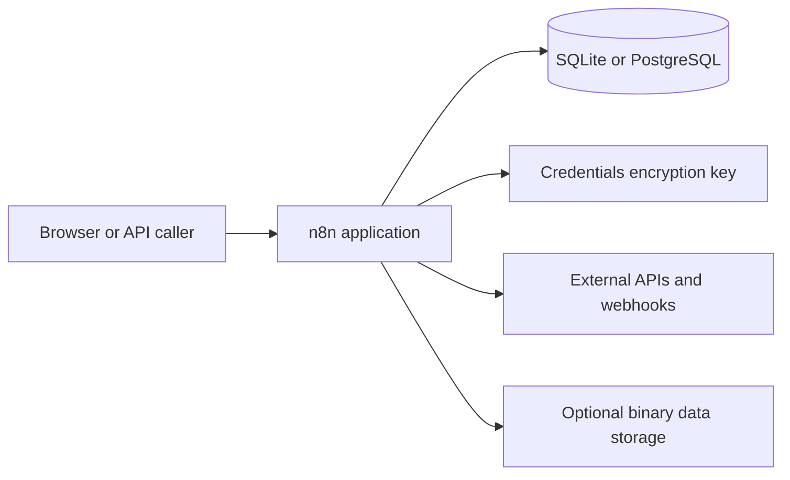

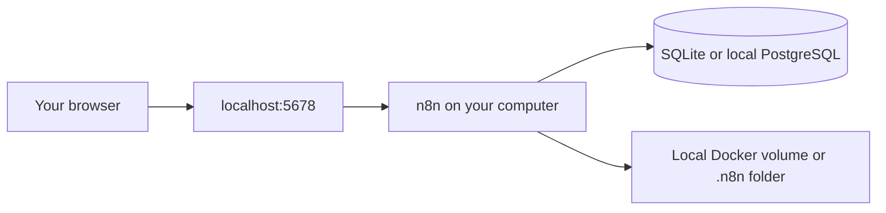

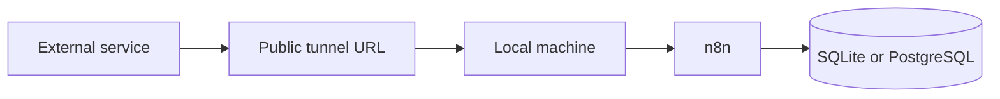

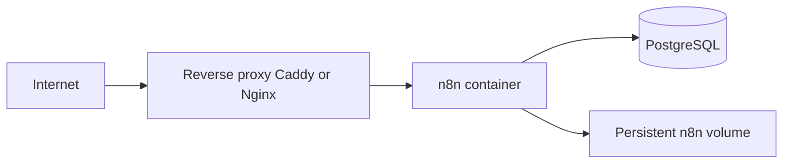

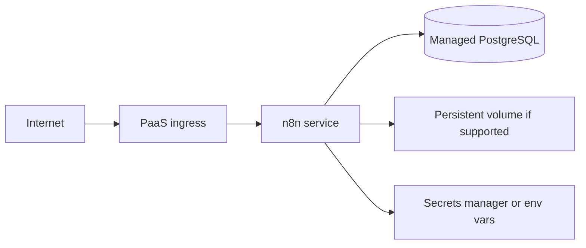

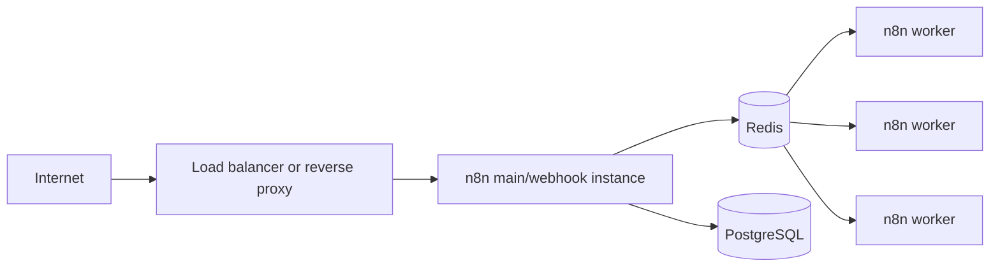

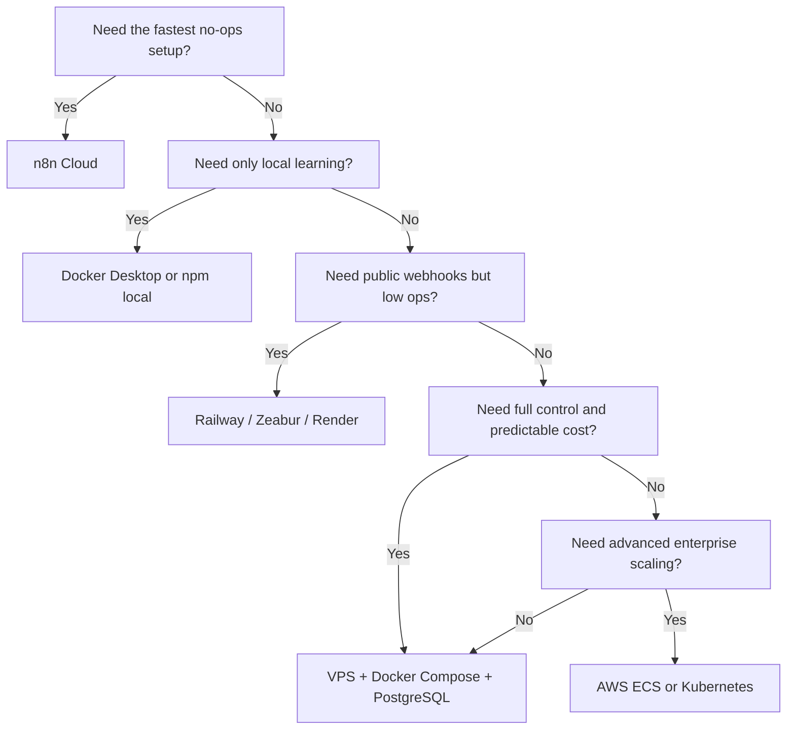

### Guide for n8n Cloud

#### Lesson cloud onboarding

**Learning goal:** launch n8n without managing infrastructure.

**Explanation:** n8n Cloud is the lowest-friction option. Hosted plans come with managed infrastructure, hosted URLs, and plan-based concurrency and execution quotas. The current pricing page lists Starter, Pro, Business, and Enterprise tiers; Starter and Pro are hosted by n8n, Business is self-hosted, and Enterprise can be cloud or self-hosted. Cloud plans include unlimited users and workflows, and bill by **workflow executions**, not individual workflow steps. citeturn7view0

**Step by step**

1. Create an account and choose a hosted plan.
2. Create your workspace and owner login.
3. Build workflows in the hosted editor.
4. When you need Google, Slack, or other OAuth providers, use the cloud instance URL n8n provides.
5. Monitor executions and concurrency inside the hosted plan limits. citeturn7view0turn35search12

**Common mistakes**

The most common mistake is choosing Cloud for workloads that need deep host-level customization. Self-hosted is better if you require **custom nodes**, **CLI workflows**, or **running bash scripts** directly from the host context. Another common mistake is underestimating monthly execution volume. n8n Cloud counts full workflow runs, not steps, so schedules that fire every minute can consume plans much faster than people expect. citeturn7view0

**Practical exercise**

Create one scheduled workflow and one webhook-based workflow, then estimate your monthly production executions using the examples on the pricing page. citeturn7view0

### Guide for local deployment on macOS

#### Lesson local Docker Desktop on macOS

**Learning goal:** run n8n locally on a Mac with persistence.

**Explanation:** Docker Desktop is the most practical local path because n8n itself recommends Docker for most self-hosting. Docker Desktop on macOS requires a supported macOS version and at least 4 GB RAM; Docker Compose is included with Docker Desktop. citeturn5search19turn30search0turn30search3

**Step by step**

Install Docker Desktop for Mac, then create a local volume and run a single-container learning setup:

```bash
docker volume create n8n_data

docker run -it --rm \
  --name n8n \
  -p 5678:5678 \
  -v n8n_data:/home/node/.n8n \
  docker.n8n.io/n8nio/n8n:stable
```

This command maps port `5678` on your Mac to port `5678` inside the container and stores n8n state in a named Docker volume so your local data survives container recreation. The mounted path is important because n8n’s user folder stores user-specific data, including the default database file and encryption key when using local defaults. citeturn32view0turn5search19

**What each line means**

- `docker volume create n8n_data`: creates durable local storage managed by Docker.
- `-p 5678:5678`: exposes n8n in your browser at `http://localhost:5678`.
- `-v n8n_data:/home/node/.n8n`: persists local state.
- `docker.n8n.io/n8nio/n8n:stable`: pins an official stable image channel rather than blindly floating on beta. n8n publishes stable and beta channels and recommends stable for production use. citeturn35search8turn5search19

**Common mistakes**

Do not treat this as production. If your Mac sleeps, shuts down, changes networks, or Docker Desktop is not running, your webhooks stop being reachable. Also, if you later need external access, you must add a stable public URL layer rather than expecting `localhost` to work for third-party webhook or OAuth callbacks. citeturn31search2turn5search20

**Practical exercise**

Create a simple schedule-trigger workflow locally, then restart Docker Desktop and confirm the workflow and credentials still exist.

### Guide for local deployment on Windows

#### Lesson local Docker Desktop on Windows

**Learning goal:** run n8n locally on Windows with the least friction.

**Explanation:** Docker Desktop on Windows typically uses **WSL 2**. Docker’s current requirements call for a 64-bit processor with SLAT, at least 8 GB system RAM, and hardware virtualization enabled; Docker also recommends a sufficiently current WSL version. Docker Compose is included. citeturn30search1turn30search4turn30search3

**Step by step**

1. Install Docker Desktop for Windows.
2. Ensure WSL 2 is installed and enabled.
3. Open PowerShell and run the same `docker run` command used above.
4. Open `http://localhost:5678` in a browser.
5. Confirm your Docker volume was created so your local n8n state persists. citeturn30search1turn30search4turn30search3

**Common mistakes**

Users often confuse Windows host paths, WSL paths, and Docker volumes. For n8n, named volumes are simpler than bind mounts when you are learning. If you use npm instead of Docker, n8n’s own Windows troubleshooting points you back to making sure the Node.js environment is correct. citeturn38view0

**Practical exercise**

Use Docker Desktop’s UI to inspect the container, confirm the mapped port, and verify the `n8n_data` volume exists.

### Guide for local deployment with npm

#### Lesson npm-based install

**Learning goal:** understand the quickest local path and why it is not the long-term default.

**Explanation:** n8n still officially supports npm-based installs, and it explicitly says npm is a quick way to get started on a local machine. Current docs require **Node.js 20.19 through 24.x inclusive**. For one-off testing, `npx n8n` is the fastest possible start; for persistent local use, `npm install -g n8n` is the next step. citeturn38view0

**Step by step**

```bash
npx n8n
```

or:

```bash
npm install -g n8n
n8n start
```

The `npx` path is ideal if you just want to see the editor. The global install is more suitable if you want to restart n8n repeatedly without redownloading. Updates use `npm update -g n8n`. citeturn38view0

**Common mistakes**

npm local installs are fine for experimentation, but Docker usually wins later because it isolates dependencies, simplifies upgrades, and makes database and environment management more predictable. That is why n8n recommends Docker for most self-hosting needs. citeturn5search19turn38view0

### Guide for local Docker Compose

#### Lesson a better local learning stack

**Learning goal:** move from “single container” to a more realistic stack.

**Explanation:** Docker Compose is the most useful halfway step between pure local learning and real hosting. n8n has an official Docker Compose installation guide and an official `n8n-hosting` repository with Compose examples, including PostgreSQL-backed setups. citeturn31search8turn3search19

Use a simple, production-shaped Compose stack:

```yaml
services:
  postgres:
    image: postgres:16
    restart: unless-stopped
    environment:
      POSTGRES_USER: n8n
      POSTGRES_PASSWORD: change_me
      POSTGRES_DB: n8n
    volumes:
      - postgres_data:/var/lib/postgresql/data

  n8n:
    image: docker.n8n.io/n8nio/n8n:stable
    restart: unless-stopped
    ports:
      - "5678:5678"
    environment:
      N8N_HOST: localhost
      N8N_PORT: 5678
      N8N_PROTOCOL: http
      N8N_EDITOR_BASE_URL: http://localhost:5678
      WEBHOOK_URL: http://localhost:5678
      N8N_ENCRYPTION_KEY: replace_with_a_long_random_value
      DB_TYPE: postgresdb
      DB_POSTGRESDB_HOST: postgres
      DB_POSTGRESDB_PORT: 5432
      DB_POSTGRESDB_DATABASE: n8n
      DB_POSTGRESDB_USER: n8n
      DB_POSTGRESDB_PASSWORD: change_me
    depends_on:
      - postgres
    volumes:
      - n8n_data:/home/node/.n8n

volumes:
  postgres_data:
  n8n_data:
```

This stack is preferable to SQLite once you want durable backups, better recovery, or a cleaner path to later scaling. The custom `N8N_ENCRYPTION_KEY` matters because n8n otherwise generates a random key on first launch; if that key disappears, stored credentials become unreadable. citeturn4search7turn32view0turn6search1

**Line-by-line explanation**

- `postgres`: dedicated database service.
- `postgres_data`: persists database files.
- `n8n_data`: persists user folder data.
- `DB_TYPE=postgresdb`: switches n8n off the default SQLite path.
- `WEBHOOK_URL` and `N8N_EDITOR_BASE_URL`: teach n8n what public/base URL to use even in simple setups.
- `restart: unless-stopped`: makes a restart after crashes or host reboots easier to manage.
  n8n’s own Docker/Compose guidance does not force a restart policy, but using one is a strongly practical operator choice. citeturn31search8turn5search19

**Common mistakes**

Misaligned URLs are the top issue: `localhost` is fine for local browser access, but not for third-party callbacks from outside your machine. The moment you put a tunnel or proxy in front, update `WEBHOOK_URL`, and if there is a reverse proxy, set `N8N_PROXY_HOPS=1`. citeturn5search20turn33view0

### Guide for local n8n with public internet access

#### Lesson choosing the right exposure method

**Learning goal:** expose local n8n safely enough for learning, and understand which options are suitable for production.

**Comparison**

| Method | Stable URL | Custom domain | HTTPS | Works for webhooks | Works for OAuth | Good for learning | Good for production |
|---|---:|---:|---:|---:|---:|---:|---:|
| n8n built-in tunnel | Random / semi-stable | Limited | Yes | Yes | Sometimes | Yes | No |
| Cloudflare Quick Tunnel | Random | No | Yes | Yes | Poor for long-lived callbacks | Yes | No |
| Cloudflare named tunnel | Yes | Yes | Yes | Yes | Yes | Yes | Often yes |
| ngrok dev domain | Yes-ish, provider domain | No on free | Yes | Yes | Sometimes | Yes | Rarely |
| ngrok paid custom domain | Yes | Yes | Yes | Yes | Yes | Yes | Yes |
| Tailscale Funnel | Yes, public over HTTPS | Tailnet domain patterns | Yes | Yes | Provider-dependent | Yes | Conditional |
| Port forwarding + DDNS + reverse proxy | Yes | Yes | Yes | Yes | Yes | Yes, if you want to learn networking | Yes, if hardened |
| VPS reverse proxy in front of home tunnel | Yes | Yes | Yes | Yes | Yes | Medium | Yes |

The safest “I want this to just work” learning path is **Cloudflare named tunnel**. The easiest “no account, just test it” path is **Quick Tunnel**, but Cloudflare explicitly says Quick Tunnels are for testing and development only. n8n itself also marks its tunnel feature as **not safe for production**. citeturn25search8turn25search4turn38view0

**Recommended learning path: Cloudflare Tunnel**

1. Keep n8n running locally on port `5678`.
2. Create a named Cloudflare Tunnel.
3. Publish a hostname such as `n8n.example.com` to `http://localhost:5678`.
4. Add the DNS CNAME that points your hostname to the tunnel’s generated `cfargotunnel.com` target.
5. Set `N8N_EDITOR_BASE_URL=https://n8n.example.com` and `WEBHOOK_URL=https://n8n.example.com`.
6. If you have another reverse-proxy hop in the chain, set `N8N_PROXY_HOPS=1`. citeturn25search8turn25search12turn32view0turn33view0turn5search20

**When do you need to buy a domain?**

For throwaway learning, you do **not** need a domain. n8n tunnel, Quick Tunnel, ngrok dev domains, and Tailscale Funnel can all expose public HTTPS endpoints without you purchasing a domain. But for anything involving **stable webhooks, third-party OAuth callbacks, client-facing URLs, or long-lived automation**, buying a domain is strongly recommended because many providers expect a stable callback URL and some users do not want provider-branded tunnel domains in production. citeturn25search13turn25search2turn25search4turn5search20

**Common mistakes**

The biggest mistakes are:

- using a **random tunnel URL** and later discovering OAuth redirects changed;
- forgetting to update `WEBHOOK_URL`;
- exposing a local machine without understanding that the service becomes unavailable whenever the computer or connection disappears;
- assuming tunnel HTTPS means the local machine itself is production-ready.
These are architectural, not just tooling, mistakes. citeturn25search4turn38view0turn5search20

### Guide for VPS deployment with Docker Compose

#### Lesson the best all-purpose self-hosted pattern

**Learning goal:** deploy n8n to a public server with a stable domain and automatic HTTPS.

**Explanation:** a small Linux VPS with Docker Compose remains the most balanced self-hosting choice because it is simple enough to understand, cheap enough for solo builders, and structured enough to become production-worthy with PostgreSQL, a reverse proxy, backups, and a domain. n8n publishes Compose-based guidance and documents reverse-proxy webhook configuration. Low-cost VPS options remain common across providers such as DigitalOcean, Hetzner, Lightsail, Linode/Akamai, and Vultr. DigitalOcean even publishes an official n8n 1-click droplet image. citeturn31search8turn5search20turn15search1turn14search13turn20search11turn14search11

Use Caddy for reverse proxy because it handles certificates automatically:

```yaml
services:
  postgres:
    image: postgres:16
    restart: unless-stopped
    environment:
      POSTGRES_USER: n8n
      POSTGRES_PASSWORD: ${POSTGRES_PASSWORD}
      POSTGRES_DB: n8n
    volumes:
      - postgres_data:/var/lib/postgresql/data

  n8n:
    image: docker.n8n.io/n8nio/n8n:stable
    restart: unless-stopped
    environment:
      N8N_HOST: ${N8N_HOST}
      N8N_PORT: 5678
      N8N_PROTOCOL: https
      N8N_EDITOR_BASE_URL: https://${N8N_HOST}
      WEBHOOK_URL: https://${N8N_HOST}
      N8N_PROXY_HOPS: 1
      N8N_ENCRYPTION_KEY: ${N8N_ENCRYPTION_KEY}
      DB_TYPE: postgresdb
      DB_POSTGRESDB_HOST: postgres
      DB_POSTGRESDB_PORT: 5432
      DB_POSTGRESDB_DATABASE: n8n
      DB_POSTGRESDB_USER: n8n
      DB_POSTGRESDB_PASSWORD: ${POSTGRES_PASSWORD}
    volumes:
      - n8n_data:/home/node/.n8n
    depends_on:
      - postgres

  caddy:
    image: caddy:2
    restart: unless-stopped
    ports:
      - "80:80"
      - "443:443"
    volumes:
      - ./Caddyfile:/etc/caddy/Caddyfile:ro
      - caddy_data:/data
      - caddy_config:/config
    depends_on:
      - n8n

volumes:
  postgres_data:
  n8n_data:
  caddy_data:
  caddy_config:
```

```caddyfile
{$N8N_HOST} {
    reverse_proxy n8n:5678
}
```

```env
N8N_HOST=n8n.example.com
POSTGRES_PASSWORD=replace_with_a_real_password
N8N_ENCRYPTION_KEY=replace_with_a_long_random_key
```

This layout works because Caddy terminates TLS and forwards web traffic to the n8n container; n8n, in turn, uses the correct public hostname for editor links, emails, webhooks, and OAuth. n8n’s docs explicitly say that when running behind a reverse proxy, you should manually set `WEBHOOK_URL` and `N8N_PROXY_HOPS`. n8n’s SSL guidance also recommends using a reverse proxy for TLS. citeturn5search20turn31search10turn32view0turn33view0

**Step by step**

1. Rent a VPS.
2. Install Docker Engine and Compose.
3. Point your domain’s DNS `A` record at the server IP.
4. Put the three files above on the server.
5. Start the stack with `docker compose up -d`.
6. Wait for DNS propagation and automatic certificate issuance.
7. Open `https://n8n.example.com` and complete n8n setup. citeturn30search2turn30search3turn28search8turn29search7turn26search3

**Common mistakes**

- forgetting to open ports `80` and `443` in the firewall;
- putting n8n behind a proxy but leaving `WEBHOOK_URL` unset;
- leaving SQLite in place on a server you plan to keep;
- not saving the encryption key outside the container;
- exposing the editor on the public internet without at least keeping the instance fully patched and HTTPS-only. citeturn5search20turn4search7turn37search6turn31search10

**Practical exercise**

Deploy a webhook workflow that receives a POST from an external service and confirm the production webhook URL uses your domain, not `localhost`.

### Guide for a beginner-friendly cloud deployment

#### Lesson railway or zeabur

**Learning goal:** deploy n8n without managing a Linux VM.

**Why these platforms matter:** Railway and Zeabur are the two simplest modern fits for n8n in this research set because both support **public domains**, **environment variables**, **persistent storage**, and **PostgreSQL services**. Railway documents Docker image deployment, public networking, custom domains with automatic SSL, volumes, and a PostgreSQL template. Zeabur documents template deployment, free `*.zeabur.app` domains, custom domains, environment-variable injection, persistent volumes, backups, and a marketplace that explicitly includes n8n. citeturn9search13turn9search1turn9search5turn9search9turn9search0turn9search3turn13search9turn12search3turn12search1turn13search1turn13search5

**Recommended pattern**

- Add an n8n service from the official Docker image.
- Add a PostgreSQL service.
- Mount a persistent volume to the n8n user folder.
- Set environment variables: `N8N_EDITOR_BASE_URL`, `WEBHOOK_URL`, `N8N_ENCRYPTION_KEY`, and database settings.
- Generate a platform URL first.
- Add a custom domain after the service is healthy. citeturn32view0turn33view0turn9search13turn9search9turn12search3

**Railway-specific notes**

Railway charges a base subscription that goes toward usage, starting with a Free plan and a Hobby subscription at $5/month; it charges separately for RAM, CPU, egress, and volume storage, and includes one-click PostgreSQL and custom domains. This makes it a strong “personal production” option, but not necessarily the cheapest at higher sustained usage. citeturn39view0turn9search3turn9search9

**Zeabur-specific notes**

Zeabur is more template-centric and beginner-friendly. Its docs are very explicit that services are stateless by default and that you must mount **Volumes** anywhere you need data to persist. That single detail is the difference between “n8n works” and “your instance silently resets on restart.” citeturn13search1turn12search3turn12search1

### Guide for a production-oriented cloud deployment

#### Lesson google cloud run durable mode

**Learning goal:** understand a serverless-but-durable n8n pattern from official n8n docs.

**Explanation:** n8n now has an official Cloud Run guide with two modes. **Easy mode** is explicitly for demos only because data is stored in memory and lost when the service scales to zero or redeploys. **Durable mode** adds Cloud SQL PostgreSQL, Secret Manager, a dedicated service account, and a Cloud Run deployment with correct environment variables. n8n also notes that Cloud Run reserves `/healthz`, so `N8N_ENDPOINT_HEALTH` should be changed to avoid conflicts. citeturn18view0turn19view0

**Step by step summary**

1. Enable Cloud Run, Cloud SQL, and Secret Manager APIs.
2. Create a Cloud SQL PostgreSQL instance and a dedicated database/user.
3. Store the DB password and `N8N_ENCRYPTION_KEY` in Secret Manager.
4. Create a least-privilege Cloud Run service account.
5. Deploy the official n8n image with PostgreSQL settings and attached Cloud SQL.
6. Update `N8N_HOST`, `WEBHOOK_URL`, and `N8N_EDITOR_BASE_URL` once the service URL is known.
7. Add OAuth redirect URIs for providers that need them. citeturn19view0

A representative deployment command from the official guide looks like this:

```bash
gcloud run deploy n8n \
  --image=n8nio/n8n:latest \
  --region=$REGION \
  --allow-unauthenticated \
  --port=5678 \
  --memory=2Gi \
  --no-cpu-throttling \
  --set-env-vars="N8N_PORT=5678,N8N_PROTOCOL=https,N8N_ENDPOINT_HEALTH=health,DB_TYPE=postgresdb,DB_POSTGRESDB_DATABASE=n8n,DB_POSTGRESDB_USER=n8n-user,DB_POSTGRESDB_HOST=/cloudsql/$PROJECT_ID:$REGION:n8n-db,DB_POSTGRESDB_PORT=5432,DB_POSTGRESDB_SCHEMA=public,GENERIC_TIMEZONE=UTC,QUEUE_HEALTH_CHECK_ACTIVE=true" \
  --set-secrets="DB_POSTGRESDB_PASSWORD=n8n-db-password:latest,N8N_ENCRYPTION_KEY=n8n-encryption-key:latest" \
  --add-cloudsql-instances=$PROJECT_ID:$REGION:n8n-db \
  --service-account=n8n-service-account@$PROJECT_ID.iam.gserviceaccount.com
```

This is one of the strongest “managed infrastructure but still self-hosted n8n” patterns currently available because it keeps the app stateless where it can and externalizes the durable, sensitive parts to managed services. citeturn19view0

#### Lesson AWS production architecture

**Learning goal:** understand why AWS is powerful and why it feels heavier than a VPS or PaaS.

A beginner-friendly AWS path is usually **Lightsail** or a simple **EC2** instance, because the pricing is flatter and the mental model is closer to “a server I rent.” Lightsail’s least-expensive plans begin around the low-single-digit monthly range, container services start very low as well, and Lightsail supports custom domains with validated TLS certificates for container services. By contrast, a production-grade AWS design typically layers **ECS/Fargate**, **ECR**, **RDS PostgreSQL**, **Secrets Manager**, **ALB/NLB**, **CloudWatch**, and often **S3** for adjacent storage patterns or backups. That gives you security controls, elastic deployment, and enterprise integration, but at a definite complexity premium. citeturn20search11turn20search23turn20search2turn20search10turn20search7turn20search1turn20search4turn20search5turn26search10

A good AWS progression therefore looks like this:

- **Stage one:** Lightsail or EC2 + Docker Compose + Caddy + Route 53.
- **Stage two:** EC2/ECS + RDS PostgreSQL + Secrets Manager.
- **Stage three:** ECS/Fargate or EKS with Redis queue mode, workers, centralized logs, and infrastructure-as-code. citeturn20search15turn20search1turn20search4turn26search10

### Platform notes that change the recommendation

A few platforms deserve special caution notes.

**Render** is viable for n8n because it supports Docker-based services, custom domains, managed TLS, environment variables, persistent disks, and managed Postgres. But Render services are ephemeral by default, so you must attach a persistent disk for any state you expect to survive restarts or redeploys. citeturn10search2turn10search0turn10search20turn10search8turn10search1

**Fly.io** is viable for n8n containers and volumes, but database decisions need more care. Fly supports custom domains, TLS, Docker-image deployment, and volumes. However, Fly’s older “Fly Postgres” model is explicitly described as **unmanaged and unsupported** by Fly support; if you want production confidence there, use their managed database offering or an external managed Postgres rather than casually self-managing database HA on Fly. citeturn11search1turn11search0turn8search14turn11search3turn11search4

**DigitalOcean App Platform** is a weak fit for long-lived n8n unless you are very deliberate. DigitalOcean’s own docs say App Platform instances are ephemeral, local files are temporary, and App Platform **does not support volumes**. Since n8n expects durable state somewhere and its user folder matters, App Platform is usually not the first recommendation for n8n unless you deliberately externalize state to managed Postgres and avoid relying on local filesystem persistence. For most DigitalOcean users, a **Droplet** or the official **n8n 1-click app** is a better fit. citeturn17search0turn32view0turn15search1

## Operations and Production Readiness

### Databases and storage

n8n’s database is not a side detail. The docs state that n8n uses its database to store **credentials, past executions, and workflows**, and creates an SQLite database by default if nothing else is configured. This makes SQLite natural for local learning. But the moment you care about reliable backups, durability, migration, scaling, or worker separation, PostgreSQL becomes the practical default. citeturn6search1turn34search18

| Choice | Use it when | Avoid it when | Why |
|---|---|---|---|
| SQLite | Local learning, short-lived tests, single instance | Production, multi-instance, queue mode, serious teams | Simple, but operationally weak for scaling and durable ops |
| PostgreSQL | Any meaningful self-hosted deployment | Only if you truly need a zero-dependency toy setup | Better backup, migration, recovery, and scaling characteristics |

SQLite also has an operational quirk that catches people: if you prune execution data, disk space is not automatically freed in the same way some people expect; n8n documents `DB_SQLITE_VACUUM_ON_STARTUP` or manual vacuuming for reclaim behavior. PostgreSQL avoids many of the awkward edges that surface once an instance lives for months instead of days. citeturn4search18

Binary data matters too. By default, n8n stores binary data in memory, which can crash workflows that handle large files. n8n documents a `filesystem` mode to keep large files off RAM, but also notes that **filesystem mode is not supported with queue mode**, where `database` is the supported mode. External S3-compatible binary storage exists, but n8n documents that as an **Enterprise-tier feature**. citeturn4search10turn4search2turn4search6

### Domains, DNS, HTTPS, webhooks, and reverse proxies

A **domain name** is the human-friendly address people type, while **DNS** translates that name into the server’s IP address. An **A record** points a name to an IPv4 address; a **CNAME** points one hostname to another hostname. A **subdomain** is just a child name under a root domain, such as `n8n.example.com`. **Dynamic DNS** exists because some residential internet connections change IP addresses over time, so the DNS record must be updated automatically. citeturn28search1turn27search2turn28search8turn28search3turn28search4

HTTPS is HTTP protected by TLS. TLS depends on a certificate whose purpose is to authenticate the server identity and encrypt traffic. Let’s Encrypt is a well-known free certificate authority, and reverse proxies such as Caddy, Nginx, Traefik, Cloudflare, Render, and Fly often automate certificate issuance and renewal for you. citeturn29search7turn26search3turn26search7turn10search20turn11search0

A **reverse proxy** is a server that sits in front of your application, intercepts incoming requests, and forwards them to the origin app. For n8n, a reverse proxy usually handles three jobs at once: **terminating TLS**, **mapping your public domain to the internal n8n port**, and **passing the correct forwarded headers** so n8n knows the real scheme and host. n8n’s own docs explicitly say that behind a reverse proxy, you should set `WEBHOOK_URL` manually and configure `N8N_PROXY_HOPS=1`. citeturn29search0turn5search20turn32view0turn33view0

This is why webhook and OAuth failures happen so often. If `WEBHOOK_URL` is wrong, n8n can show or register **the wrong callback address**. If `N8N_EDITOR_BASE_URL` is wrong, links and auth flows can be confused. If the reverse proxy does not pass forwarded headers correctly, n8n may think it is on `http://localhost:5678` even though users see `https://n8n.example.com`. citeturn32view0turn33view0turn5search20

### Server sizing recommendations

n8n does not publish one universal sizing table because workflows vary enormously. But the docs do give enough to make reasonable starting recommendations: Cloud Run examples use **2 GiB** for a modest service, Cloud plans publish concurrency caps and memory bands, queue mode is the recommended scaling model, and benchmark examples show multi-instance setups with separate webhook instances, workers, Redis, and a database. Binary-heavy workflows need more memory discipline because default in-memory binary handling can cause crashes. The table below is therefore a **practical starting guide**, not a vendor guarantee. citeturn19view0turn7view0turn34search9turn34search10turn4search10

| Use case | Suggested starting point | Database | Notes |
|---|---|---|---|
| Learning only | 2 vCPU, 2–4 GB RAM, 20–40 GB disk | SQLite or Postgres | Local Docker Desktop is fine |
| Personal automation | 2 vCPU, 4 GB RAM, 40–80 GB disk | PostgreSQL preferred | Stable if a few workflows run continuously |
| Solo creator / freelancer | 2–4 vCPU, 4–8 GB RAM, 80+ GB disk | PostgreSQL | Small VPS or PaaS is usually enough |
| Small business | 4 vCPU, 8 GB RAM, 100–200 GB disk | PostgreSQL | Add good backups and monitoring |
| Agency / many clients | 4–8 vCPU, 8–16 GB RAM | PostgreSQL, then Redis if needed | Expect separate workers sooner |
| AI-heavy workflows | 4–8+ vCPU, 8–16+ GB RAM | PostgreSQL, careful binary settings | Browser automation and large files distort sizing |
| Production with growth | Main + DB + reverse proxy, scale to workers | PostgreSQL, Redis when queue mode starts | Single container is often still enough at first |
| High availability | Multiple app instances + Redis + managed PG + LB | PostgreSQL | Kubernetes or ECS becomes more justified |

What changes the sizing answer the most is not “number of workflows,” but **frequency**, **concurrency**, **binary size**, **wait states**, **AI model calls**, and **browser automation**. Workflows that process PDFs, images, audio, or headless-browser tasks can require far more memory and disk than text-only integrations. citeturn4search10turn34search10

### Security responsibilities

The security model changes dramatically by deployment type.

| Deployment type | Who patches OS/runtime | Who handles TLS | Who protects the public edge | Who backs up data | Who rotates secrets |
|---|---|---|---|---|---|
| n8n Cloud | n8n | n8n | n8n / cloud fronting | n8n | n8n + you for app creds |
| Local only | You | Usually not applicable | No public edge | You | You |
| Local with tunnel | You | Tunnel provider + you | Tunnel provider + you | You | You |
| VPS | You | You / reverse proxy | You / your CDN/WAF | You | You |
| PaaS | Platform patches infra, you patch app image/config | Platform + you | Platform + you | Shared | Shared |
| Hyperscaler managed stack | Shared | Shared | Shared | Shared | Shared |

n8n’s self-hosted guidance covers SSL, SSO, 2FA, encryption-key rotation, security audits, telemetry opt-out, and user management. Important current specifics: self-hosted user management requires SMTP setup, 2FA can be enabled or configured, SSO is a Business/Enterprise feature, and recent versions no longer support the old “disable login screen/basic auth style” shortcuts that some older blog posts still reference. citeturn5search6turn5search0turn5search4turn35search20turn36search6turn36search7

A small but important security nuance: `N8N_SECURE_COOKIE` defaults to `true`, which is correct for HTTPS deployments. Some NAS and local HTTP forum workarounds involve turning it off, but that should remain a **local-only workaround**, not a production norm. citeturn34search8turn24search6

For secret handling, n8n supports file-based configuration via `_FILE` suffixes, which is useful with container secret mounts. In more advanced environments, the docs also show patterns that integrate cloud secret stores, such as AWS Secrets Manager and Azure Key Vault in Kubernetes contexts. citeturn32view0turn36search3

Because of the public vulnerabilities disclosed in 2026, security discipline should now include a very simple rule: **if the instance is public, update aggressively**. Upgrades are not just for features. They are part of your security perimeter. citeturn37search6turn37search1turn37search5turn37search8

### Backups, updates, maintenance, and scaling

For self-hosted n8n, the minimum viable backup set is:

- the **database**;
- the **n8n user folder / volume** if you use it;
- the **encryption key**;
- your **Compose files**, `.env` files, and reverse-proxy config;
- optionally exported workflows and credentials for belt-and-suspenders recovery. citeturn4search0turn32view0turn4search7turn4search3

**Backup commands**

Database:

```bash
pg_dump -U n8n -h localhost -d n8n > n8n-$(date +%F).sql
```

n8n volume:

```bash
docker run --rm \
  -v n8n_data:/source \
  -v "$PWD:/backup" \
  alpine \
  sh -c "tar czf /backup/n8n-data-$(date +%F).tgz -C /source ."
```

These are operator examples, not vendor-provided one-liners, but they directly reflect what n8n actually needs restored. n8n’s CLI also supports export/import for workflows, credentials, and broader entity backup workflows. citeturn4search0turn4search3

**Restore commands**

Database:

```bash
psql -U n8n -h localhost -d n8n < n8n-2026-05-27.sql
```

Volume:

```bash
docker run --rm \
  -v n8n_data:/target \
  -v "$PWD:/backup" \
  alpine \
  sh -c "tar xzf /backup/n8n-data-2026-05-27.tgz -C /target"
```

**Update process**

1. Read release notes and security advisories.
2. Back up database and volume.
3. Pin or change the image tag deliberately.
4. Pull the new image.
5. Restart the stack.
6. Test UI, webhooks, and one OAuth credential.
7. If the update fails, roll back the image and restore backup.
n8n’s update guidance recommends updating frequently, checking release notes, and testing upgrades in a separate environment where possible. citeturn5search16turn37search2

**Scaling path**

n8n’s scaling guidance is clear in spirit: **single instance first**, then **queue mode** when you genuinely need parallelism and separation. Queue mode uses Redis as a broker; the main instance handles timers and webhook calls, pushes execution IDs into Redis, and workers pick them up and execute against the shared database. The queue docs and scaling overview both describe queue mode as the best scalability route. citeturn34search2turn34search9turn31search9

That leads to a practical upgrade ladder:

1. **Single container + PostgreSQL**
2. **Bigger single container**
3. **Queue mode + Redis + one or more workers**
4. **Separate webhook processors if HTTP pressure grows**
5. **Managed DB, managed Redis, centralized logs/metrics**
6. **Multi-main / Kubernetes / ECS only when justified**

This sequence avoids the most common overengineering mistake: adopting Kubernetes before you have enough n8n load to need it. citeturn34search2turn34search9turn35search5turn35search2

## Troubleshooting and Checklists

### Troubleshooting table

| Problem | Likely cause | Where to look first | Fix |
|---|---|---|---|
| Container will not start | bad env vars, DB auth failure, port conflict | container logs | validate DB settings, ports, image tag |
| Lost credentials after redeploy | missing persistent storage or missing encryption key | volume mounts, `N8N_ENCRYPTION_KEY` | restore the same key and volume |
| Wrong webhook URL | reverse proxy or tunnel not reflected in config | `WEBHOOK_URL`, `N8N_EDITOR_BASE_URL` | set correct public URLs |
| OAuth callback mismatch | unstable or wrong public domain | OAuth app settings and n8n public URL vars | use a stable domain and correct callback |
| HTTPS issues | DNS not propagated, cert issuance failed, proxy misrouted | reverse proxy / platform cert status | verify DNS records, wait for cert, fix host mapping |
| Domain not resolving | DNS record type or target wrong | `A` / `CNAME` / platform DNS instructions | correct DNS and wait for propagation |
| Tunnel not working | wrong local target port, provider limitations | tunnel config | repoint to `localhost:5678`, avoid dev tunnel for prod |
| Database connection failed | wrong host, user, password, SSL/network issue | DB env vars, provider networking | recheck credentials and private networking |
| Secure cookie error on local HTTP | running HTTP with secure cookies | local-only config | use HTTPS or only locally set cookie config carefully |
| Slow or high-memory workflows | binary data in memory, too many parallel jobs | execution logs and metrics | change binary mode, reduce concurrency, scale out |
| Failed update | migration issue or breaking change | release notes and DB backup | roll back and restore |
| Public instance feels unsafe | outdated version or overexposed endpoints | version and exposure model | patch immediately, reduce exposure |

This troubleshooting set is grounded in n8n’s environment-variable model, queue-mode behavior, reverse-proxy webhook requirements, binary-data behavior, and recent security advisories. citeturn32view0turn33view0turn4search10turn34search2turn37search6

### Checklists

#### Local deployment checklist

- Docker Desktop or Node.js version is supported.
- Persistent local storage is configured.
- You can reach `http://localhost:5678`.
- You saved your encryption key if moving beyond the most disposable test setup.
- You understand that local uptime equals machine uptime. citeturn30search0turn30search1turn38view0turn32view0

#### Public internet exposure checklist

- You know your intended public URL.
- DNS points to the right place, or the tunnel hostname is stable.
- HTTPS is active.
- `WEBHOOK_URL` is set correctly.
- `N8N_EDITOR_BASE_URL` is set correctly.
- `N8N_PROXY_HOPS=1` is set if a reverse proxy is involved.
- OAuth providers have the exact callback URL registered. citeturn28search8turn28search3turn29search7turn5search20turn32view0turn33view0

#### Cloud deployment checklist

- Persistent storage model is understood.
- Database is explicitly chosen, not accidentally defaulted.
- Secrets live in env vars, mounted files, or a secret manager.
- Logging and health checks are enabled.
- Backups are scheduled or delegated to the managed service.
- Upgrade and rollback steps are written down. citeturn17search0turn9search0turn10search8turn35search5turn5search16

#### Domain and DNS checklist

- Root domain vs subdomain chosen deliberately.
- Correct `A` or `CNAME` record created.
- DNS propagation allowed to complete.
- TLS issuance or reverse-proxy certificate path verified.
- Public hostname matches n8n config exactly. citeturn28search1turn28search8turn28search3turn26search3turn11search0turn10search20

#### Security checklist

- Instance runs current patched n8n.
- HTTPS-only public access.
- Firewall exposes only required ports.
- SSH is hardened on VPS/VM deployments.
- SMTP and user management are configured if you have multiple users.
- 2FA enabled where appropriate.
- SSO considered for business/enterprise use.
- Telemetry settings reviewed. citeturn37search6turn31search10turn5search0turn5search4turn35search20turn35search17

#### Backup checklist

- Database dump scheduled.
- n8n volume archived.
- Encryption key stored separately and securely.
- Restore test performed.
- Snapshot/managed backup retention known. citeturn4search0turn4search7turn10search23turn14search16turn13search5

#### Update checklist

- Read release notes.
- Back up first.
- Pin version.
- Test webhooks and OAuth after upgrade.
- Keep rollback plan ready. citeturn5search16turn37search2

#### Production readiness checklist

- PostgreSQL in place.
- Stable public domain and HTTPS.
- Reverse proxy or platform ingress understood.
- Monitoring/logging enabled.
- Backup and restore proven.
- Patch cadence established.
- Redis and workers only added when justified by workload. citeturn6search1turn5search20turn35search5turn35search0turn34search2

## Final Recommendations

### Recommended paths by user type

| User type | Best option | Alternative | Expected cost pattern | Difficulty | Why this is the best choice | What to avoid |
|---|---|---|---|---:|---|---|
| Beginner | n8n Cloud | Local Docker Desktop | Subscription or free local | Low | Fastest safe learning curve | Raw VPS first |
| Personal automation user | Local Docker Desktop | Small VPS + Compose | Free local or low monthly | Low to medium | Cheap and understandable | Public prod on laptop |
| AI automation builder | VPS + Compose + Postgres | Cloud Run durable | Low to medium monthly | Medium | Better control over file size, memory, and custom tooling | SQLite-only production |
| Freelancer | Railway or small VPS | Zeabur | Low to medium monthly | Medium | Stable URLs without hyperscaler tax | Ephemeral PaaS with no volume |
| Agency | VPS + Postgres, then queue mode | AWS ECS / GCP durable | Medium | Medium to high | Good balance of cost and control | Overbuilding Kubernetes too early |
| Small business | VPS or managed container platform with Postgres | n8n Cloud Pro/Enterprise depending needs | Medium | Medium | Predictable costs and ownership | Local/NAS internet exposure |
| Developer | VPS + Compose | Fly.io / Railway | Low to medium | Medium | Best learning ROI for real ops | Staying on ad-hoc local tunnel forever |
| Privacy-focused user | Self-hosted VPS or home server with care | Dedicated VM in region of choice | Low to medium | Medium to high | Maximum data-location control | Public cloud service if data locality matters |
| Budget-conscious user | Local for learning, Hetzner/Lightsail for hosting | DigitalOcean droplet | Very low to low | Medium | Lowest recurring cost self-hosting | Usage-priced platforms without guardrails |
| Production team | Managed DB + queue mode on VM/PaaS | ECS / GKE / AKS | Medium to high | High | Clear path to workers, logs, and controlled upgrades | SQLite, random tunnels, unmanaged secrets |
| Enterprise-like deployment | n8n Enterprise Cloud or self-hosted enterprise stack | ECS/EKS/GKE with managed DB and log streaming | High | High | Governance, SSO, logs, secret stores, support | DIYing critical workloads without support |

These recommendations follow the broad evidence pattern from the docs: start with the **simplest thing that preserves your actual requirements**, then add infrastructure only when a real requirement appears. n8n Cloud is the best answer when your real requirement is “I want to build workflows, not operate servers.” A **small VPS + Docker Compose + PostgreSQL + reverse proxy** is the best answer when your real requirement is “I want stable public automation and full control without a platform tax.” Queue mode and multi-instance designs are best reserved for the point where a single instance is genuinely becoming a bottleneck. citeturn3search17turn5search19turn31search8turn34search9turn34search2turn7view0

### AWS vs simpler cloud options

If you are deciding specifically between AWS and simpler providers:

- Choose **AWS** if you need deep IAM control, integrated managed services, formal enterprise patterns, or already operate there.
- Choose **Railway, Zeabur, Render, Hetzner, Lightsail, or a plain VPS** if your real goal is to get n8n reliably online with low operational drag.

AWS is powerful because it gives you every building block: EC2, Lightsail, ECS/Fargate, RDS, Route 53, Secrets Manager, CloudWatch, load balancers, and optional storage services. It is also more complex because you must assemble those blocks intentionally. Providers like Railway or Zeabur replace much of that assembly work with one opinionated interface. citeturn20search7turn20search11turn20search1turn20search4turn20search5turn26search10turn39view0turn13search9

### Open questions and limitations

A few points remain platform-dependent rather than universally settled. Exact monthly costs on usage-priced platforms can move materially with **RAM, CPU, storage, egress, and always-on versus scale-to-zero behavior**, so the cost guidance in this report is best treated as **deployment-pattern guidance**, not a quote. Also, some platforms are fully viable for n8n only when specific persistence features are purchased or configured correctly, which means a platform can look “cheap” in marketing and still be a poor n8n fit if the required disk, database, or network features are missing. citeturn39view0turn10search8turn17search0turn13search1

The core conclusion, however, is high confidence: if you want one default self-hosting recommendation that is both teachable and durable, use **Docker Compose, PostgreSQL, a persistent volume, a custom `N8N_ENCRYPTION_KEY`, and a reverse proxy with a real domain**. If you want the least operational burden, use **n8n Cloud**. Everything else is a variation on those two anchors. citeturn31search8turn6search1turn4search7turn5search20turn7view0
<!-- ORIGINAL_SOURCE_END -->
