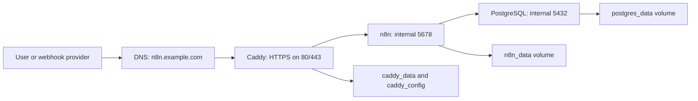

# n8n Deployment Package｜VPS Docker Compose + PostgreSQL + Caddy

## Purpose

This package is a handoff-ready deployment blueprint for a small production n8n instance. It is designed for a freelancer or agency baseline and can be extended later toward PaaS, n8n Cloud, queue mode, or AWS/GCP when requirements justify the extra operational responsibility.

## Architecture

## Package Files

| File | Purpose |
| --- | --- |
| `compose.yaml` | Defines PostgreSQL, n8n, Caddy, named volumes, dependencies, health checks, and restart policy. |
| `.env.template` | Defines required public URL, database, encryption key, runtime, security, and log settings. |
| `Caddyfile` | Terminates TLS and reverse proxies public traffic to `n8n:5678`. |
| `backup-restore-runbook.md` | Defines backup scope, commands, restore order, and restore verification. |
| `update-runbook.md` | Defines safe update, rollback point, and post-update checks. |
| `troubleshooting-playbook.md` | Defines incident checks for URL, credentials, DB, cookie, container, and resource failures. |
| `final-demo-checklist.csv` | Defines the final demo path for handoff review. |

## Startup

1. Provision a VPS with Docker Engine and Docker Compose installed.
2. Point DNS `A` or `AAAA` record for `N8N_DOMAIN` to the VPS public IP.
3. Open firewall ports `80` and `443`; do not expose `5678` publicly.
4. Create `.env` from `.env.template`.
5. Replace every `CHANGE_ME` value in `.env`, especially `POSTGRES_PASSWORD` and `N8N_ENCRYPTION_KEY`.
6. Run `docker compose --env-file .env -f compose.yaml up -d`.
7. Verify `docker compose ps`.
8. Verify `https://N8N_DOMAIN/healthz` and `https://N8N_DOMAIN/healthz/readiness`.
9. Create the owner account in the n8n UI.
10. Create a test workflow and verify a webhook Production URL uses `https://N8N_DOMAIN/`.

## State Ownership

| State | Owner | Backup requirement |
| --- | --- | --- |
| PostgreSQL data | `postgres_data` volume | Required before update and at scheduled backup interval. |
| n8n local state | `n8n_data` volume | Required because settings and local files can affect restore. |
| Caddy state | `caddy_data` and `caddy_config` volumes | Required for stable TLS operations and proxy recovery. |
| Secrets | `.env` and secret store | Required because credentials depend on `N8N_ENCRYPTION_KEY`. |

## Environment Rules

| Rule | Reason |
| --- | --- |
| Keep `N8N_ENCRYPTION_KEY` stable forever for this instance. | Changing it breaks existing credential decryption. |
| Keep `WEBHOOK_URL=https://N8N_DOMAIN/`. | Reverse proxy deployments need the public URL to generate correct webhook URLs. |
| Keep `N8N_PROXY_HOPS=1`. | Caddy is the trusted proxy hop in this blueprint. |
| Keep `N8N_SECURE_COOKIE=true` in production. | Public production access must use HTTPS cookies. |
| Keep `N8N_DEFAULT_BINARY_DATA_MODE=database` for this baseline. | This makes binary behavior explicit and easier to back up with PostgreSQL. |

## DNS and TLS Notes

| Item | Required state |
| --- | --- |
| DNS | `N8N_DOMAIN` resolves to the VPS public IP. |
| Caddy ports | Caddy owns public ports `80` and `443`. |
| n8n port | `5678` is only reachable inside the Docker network. |
| TLS | Caddy obtains and renews certificates. |
| Proxy headers | Caddy passes host, scheme, and client IP headers to n8n. |

## Backup Summary

Use `backup-restore-runbook.md` before every update and at the agreed backup interval. A complete backup includes PostgreSQL dump, named volume metadata, Caddy state, `.env`, and the secret-store record for `N8N_ENCRYPTION_KEY`.

## Update Summary

Use `update-runbook.md`. The safe update sequence is: read release notes, backup, pull image, start services, check readiness, test webhook, record result. Rollback requires the previous image tag and a verified backup.

## Troubleshooting Summary

Use `troubleshooting-playbook.md` and follow this fixed order:

1. log
2. env
3. DNS
4. proxy
5. DB
6. container
7. credentials
8. OAuth
9. security
10. resource
11. queue
12. workflow

## Handoff Risks

| Risk | What to check first |
| --- | --- |
| wrong webhook URL | `WEBHOOK_URL`, `N8N_DOMAIN`, Caddy route, editor Production URL. |
| lost credentials | `N8N_ENCRYPTION_KEY` and the original deployment secret. |
| database connection failed | `/healthz/readiness`, PostgreSQL logs, `DB_POSTGRESDB_*`. |
| secure cookie error | HTTPS, Caddy forwarded headers, `N8N_SECURE_COOKIE`. |
| storage growth | execution pruning, DB storage, binary data mode, backup size. |
| unsafe update | backup freshness, previous image tag, release notes, restore test. |

## Next Steps

| Trigger | Next platform move |
| --- | --- |
| Beginner needs low operations | Use n8n Cloud. |
| Freelancer needs faster deploy and less VM maintenance | Use Railway, Render, or Fly with managed/external PostgreSQL and budgets; Railway template databases require explicit backup, DR, security, and monitoring ownership. |
| Agency needs repeatability | Turn this package into a client blueprint with separate instance, DB, key, backup, and incident notes per client. |
| Production team needs VPC, IAM, audit, queue workers, and RPO/RTO | Move toward AWS/GCP or n8n Cloud Enterprise with managed state and centralized logs. |
