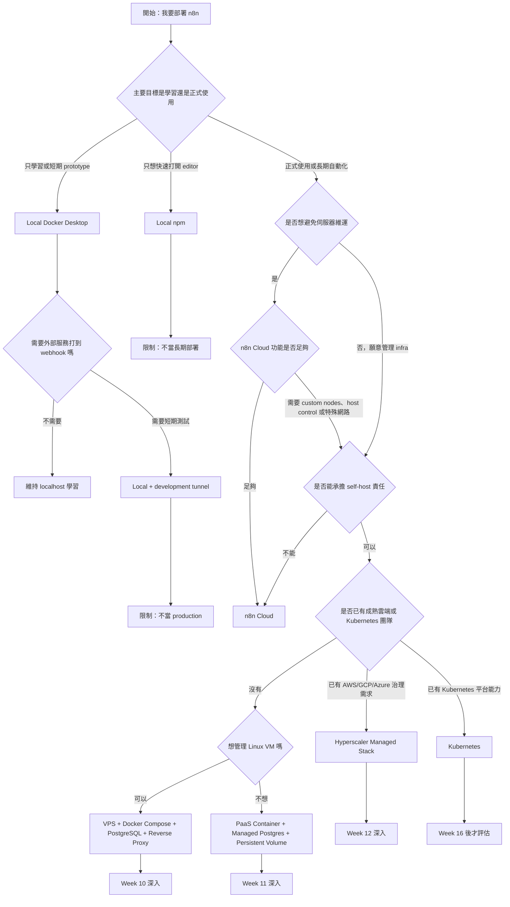
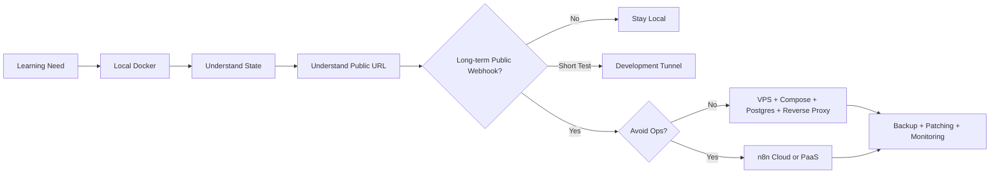

# Week 01｜n8n 部署全景與決策框架

> 執行依據：`20 周的執行計劃.md` 的 Week 01。
> 執行日期：2026-05-27。
> 本週目標：回答「n8n 到底有哪些部署方式，為什麼不能只問 cloud 還是 local？」
> 本週狀態：完成。三個交付物已全部產出，並附上官方來源核對。

## 1. 本週交付物總覽

| 交付物 | 狀態 | 對應章節 | 驗收方式 |
| --- | --- | --- | --- |
| 一頁部署選項矩陣 | 完成 | 第 3 章 | 能快速比較 Cloud、local、VPS、PaaS、hyperscaler、Kubernetes 的定位。 |
| 一張需求判斷流程圖 | 完成 | 第 4 章 | 能從需求回答走到合理部署路線。 |
| 一份風險詞彙表 | 完成 | 第 5 章 | 至少涵蓋 uptime、public URL、persistence、patching、backup。 |
| 三分鐘驗收說明 | 完成 | 第 6 章 | 能說清楚 local Docker 適合學習，但不適合長期 public webhook production。 |

## 2. 官方來源核對

本週只採用官方文件作為事實基礎，避免用部落格或二手整理當成決策依據。

| 事實 | 核對結果 | 官方來源 |
| --- | --- | --- |
| n8n 建議多數 self-hosting 使用 Docker；self-hosting 需要能管理伺服器、容器、資源、擴展與安全。 | 確認。Docker 是主要 self-hosting 路線；缺乏維運經驗時，n8n 建議使用 n8n Cloud。 | [n8n Docker Installation](https://docs.n8n.io/hosting/installation/docker/) |
| n8n Cloud 是託管方案，主打免技術設定與維護、uptime monitoring、managed OAuth、one-click upgrades。 | 確認。這是低維運起點。 | [n8n Cloud Overview](https://docs.n8n.io/choose-n8n/cloud/) |
| self-hosted n8n 預設使用 SQLite 儲存 credentials、past executions、workflows，也支援 PostgreSQL。 | 確認。production-like 部署應優先把資料庫責任納入設計。 | [n8n Supported Databases](https://docs.n8n.io/hosting/configuration/supported-databases-settings/) |
| 反向代理後需要明確設定 public webhook URL；官方文件要求設定 `WEBHOOK_URL`，並在 proxy 情境設定 `N8N_PROXY_HOPS=1`。 | 確認。這是 webhook 與 OAuth URL 正確性的核心。 | [n8n Webhook URL with Reverse Proxy](https://docs.n8n.io/hosting/configuration/configuration-examples/webhook-url/) |
| n8n 內建 tunnel 僅供本機開發與測試，不適合 production。 | 確認。不能把隨機或開發 tunnel 當長期 public edge。 | [n8n Docker Installation](https://docs.n8n.io/hosting/installation/docker/) |
| Cloudflare Quick Tunnels 僅供 testing and development；production 應使用 remotely-managed tunnel。 | 確認。Quick Tunnel 的 random subdomain 不適合長期 callback。 | [Cloudflare Quick Tunnels](https://developers.cloudflare.com/cloudflare-one/networks/connectors/cloudflare-tunnel/do-more-with-tunnels/trycloudflare/) |
| Docker Desktop 包含 Docker Engine、Docker CLI、Docker Compose。 | 確認。這就是 Week 05 本機實作會採用 Docker Desktop 的原因。 | [Docker Desktop Docs](https://docs.docker.com/desktop/) |
| n8n queue mode 透過 worker instances 擴展，並可加入 webhook processors 作為下一層 scaling。 | 確認。但這是 Week 16 的內容，本週只放入決策圖，不提前實作。 | [n8n Queue Mode](https://docs.n8n.io/hosting/scaling/queue-mode/) |
| self-hosted n8n 必須保持版本更新。 | 確認。patching 是 public self-hosted 的基本責任。 | [Update self-hosted n8n](https://docs.n8n.io/hosting/installation/updating/) |
| Railway、Render、Zeabur、Fly 均提供某種 persistent storage 或 managed database 能力，但使用方式與限制不同。 | 確認。PaaS 可行性取決於 volume、database、domain、TLS 與 secrets 是否正確配置。 | [Railway Data & Storage](https://docs.railway.com/data-storage), [Render Persistent Disks](https://render.com/docs/disks), [Zeabur Best Practices](https://zeabur.com/docs/en-US/get-started/best-practices), [Fly Databases and Storage](https://fly.io/docs/database-storage-guides/) |

## 3. 交付物一：部署選項矩陣

### 一頁版本

| 部署選項 | 最適合情境 | State 層 | Public URL | 維運責任 | Production 判斷 | 第一週結論 |
| --- | --- | --- | --- | --- | --- | --- |
| n8n Cloud | 初學者、非工程團隊、想專注做 workflow 而不是管伺服器 | n8n 管理 | n8n 管理 | 最低，主要是 workflow 與帳號治理 | 是，視 plan 與功能需求而定 | 最低風險起點。若沒有明確 self-host 理由，應優先評估。 |
| Local Docker Desktop | 學習、練習、短期 prototype、本機測試 | Docker volume 或本機 `.n8n` | 無；只在 localhost | 使用者本機 | 否 | 適合學習 n8n 概念與本機持久化，不適合長期公開 webhook。 |
| Local npm | 快速看 editor、一次性測試、教學展示 | 本機 `.n8n` | 無；只在 localhost | 使用者本機與 Node.js 環境 | 否 | 啟動最快，但環境隔離與長期維護弱於 Docker。 |
| Local + Tunnel | 本機測試外部 webhook、短期 demo、OAuth callback 實驗 | 本機 Docker volume 或 `.n8n` | tunnel provider 提供 | 使用者本機加 tunnel provider | 通常否 | 可學習 public webhook，但 random 或 quick tunnel 不能當長期 production edge。 |
| VPS + Docker Compose | 個人 production、小團隊、freelancer、需要穩定 domain 與完整控制 | PostgreSQL 加 Docker volumes | 自有 domain 加 reverse proxy | 使用者負責 OS、Docker、n8n、DB、backup、security | 是 | self-hosted sweet spot。複雜度可控，責任也明確。 |
| PaaS container platform | 想減少 Linux server 維運，但仍想 self-host container | managed Postgres 加 persistent volume | 平台 domain 或 custom domain | 平台負責部分 infra，使用者負責 app config、storage、secrets、backup 策略 | 有條件是 | 可行，但必須先確認 storage 非 ephemeral。不能只看部署成功。 |
| Hyperscaler managed stack | 已在 AWS/GCP/Azure、有 IAM、合規、內網、企業治理需求 | managed DB、secret manager、object storage | load balancer 或 managed ingress | shared responsibility，架構與成本較高 | 是 | 強大但組裝成本高。沒有治理或規模需求時，不是第一週建議起點。 |
| Kubernetes / GKE / EKS / AKS | 已有 Kubernetes 團隊、需要多環境、HA、標準化平台能力 | managed DB、PVC、secret manager | ingress controller 或 load balancer | 最高，需要平台工程能力 | 是 | 不應作為初學起點。只有既有平台能力或明確 HA 需求時才合理。 |

### 矩陣判讀

第一週的核心判斷不是「哪個平台最好」，而是「哪個平台的責任剛好匹配目前需求」。n8n Cloud 把最多維運責任交給 n8n；local Docker 把學習成本降到最低；VPS + Compose 在控制、成本與理解度之間取得平衡；PaaS 用平台能力換取部分維運簡化；hyperscaler 與 Kubernetes 則用複雜度換取企業級控制。

### 本週不可混淆的三件事

1. 能在平台上啟動 n8n，不等於 state 已經安全。
2. 有 HTTPS，不等於 webhook 與 OAuth callback URL 一定正確。
3. 可以 public access，不等於適合 production exposure。

## 4. 交付物二：需求判斷流程圖

### 流程圖使用規則

| 問題 | 如果答案是「是」 | 如果答案是「否」 |
| --- | --- | --- |
| 只是學習嗎？ | 用 Local Docker Desktop，先理解 state 與 workflow。 | 繼續問是否需要 public access 與 production 責任。 |
| 需要長期 public webhook 嗎？ | 需要穩定 domain、HTTPS、`WEBHOOK_URL`、backup、patching。 | 可以先留在 localhost 或短期 tunnel。 |
| 想避免伺服器維運嗎？ | 優先看 n8n Cloud 或 PaaS。 | 可以評估 VPS + Compose。 |
| 需要 host-level control 嗎？ | self-host 比 Cloud 更合理。 | Cloud 通常是更穩的低維運路線。 |
| 是否已有雲端平台治理需求？ | 可以進 AWS/GCP/Azure managed stack。 | 不要為了看起來正式而過早採用 hyperscaler。 |
| 是否已有 Kubernetes 操作能力？ | Kubernetes 可被列入長期架構。 | 不把 Kubernetes 當第一階段部署方案。 |

## 5. 交付物三：風險詞彙表

### 必備風險詞彙

| 詞彙 | 本週定義 | 常見錯誤 | 正確判斷 | 第一個檢查點 |
| --- | --- | --- | --- | --- |
| uptime | n8n 可以被使用者、外部服務或排程穩定觸發的時間比例。 | 以為本機能跑就等於服務穩定。 | 本機 uptime 等於電腦、網路、Docker、睡眠設定都穩定；正式使用要看平台與維運能力。 | 服務是否依賴個人電腦開機與網路？ |
| public URL | 外部服務、OAuth provider、使用者實際看到並呼叫的 n8n 網址。 | 用 `localhost`、random tunnel URL 或錯誤 proxy host 設 webhook。 | production webhook 需要穩定、可預期、HTTPS 的 public URL。 | `WEBHOOK_URL` 與 `N8N_EDITOR_BASE_URL` 是否等於外部看到的網址？ |
| persistence | workflow、credentials、executions、binary data、community nodes、設定能否在重啟、redeploy、換機後保留。 | 只看到容器啟動，沒有確認 volume 或 DB。 | production-like 部署要明確設計 database、volume、encryption key。 | 重建 container 後資料是否還在？ |
| patching | 持續更新 n8n、OS、container image、proxy、database 的安全與相容性責任。 | 以為 automation tool 裝好後可以不更新。 | public self-hosted instance 必須有固定更新節奏與 rollback 方法。 | 目前 n8n 版本、image tag、更新流程是否記錄？ |
| backup | 可以在資料遺失、升級失敗、主機故障後恢復 n8n 的完整資料集合與流程。 | 只備份 workflow JSON，忘了 DB、volume、encryption key。 | backup 至少要涵蓋 database、n8n volume、encryption key、Compose/env/proxy config。 | 是否做過 restore drill，而不是只有 backup 檔？ |

### 擴充風險詞彙

| 詞彙 | 本週定義 | 決策影響 |
| --- | --- | --- |
| state layer | n8n 依賴的資料層，包含 DB、volume、binary data、credential encryption key。 | 決定 local、VPS、PaaS、cloud stack 是否可靠。 |
| public edge | 接收 internet traffic 的入口，可能是 tunnel、reverse proxy、platform ingress、load balancer。 | 決定 HTTPS、headers、domain、firewall、exposure risk。 |
| shared responsibility | 平台與使用者各自負責的維運邊界。 | Cloud 責任較少，VPS 責任較多，PaaS 介於兩者之間。 |
| ephemeral filesystem | redeploy 或 restart 後可能消失的檔案系統。 | 對 n8n 是高風險，因為 user folder 與 community nodes 可能需要持久化。 |
| stable callback | OAuth 或 webhook provider 設定中可長期使用、不會隨機改變的 callback URL。 | 影響 tunnel 是否可用、domain 是否必買、production 是否穩定。 |
| scaling path | 從單機到 PostgreSQL、Redis queue、worker、webhook processor 的漸進路線。 | 防止太早 Kubernetes，也防止單機過載後沒有升級路線。 |
| cost model | plan、execution、RAM、CPU、storage、egress、always-on 的計價方式。 | PaaS 與 hyperscaler 必須估算使用量，不能只看起始價格。 |
| recovery point | 發生事故時可以回復到哪個時間點的資料。 | 決定 backup 頻率與是否需要 managed DB snapshot。 |
| recovery time | 發生事故後多久可以恢復服務。 | 決定 Cloud、VPS、PaaS 或 managed stack 是否符合業務要求。 |
| security perimeter | public exposure、login、2FA、SSO、firewall、proxy、secret handling 的整體邊界。 | public self-hosted n8n 的風險遠高於 local-only instance。 |

## 6. 驗收條件：三分鐘說明稿

### 題目

為什麼 Local Docker 適合學習，但不適合長期 public webhook production？

### 三分鐘回答

Local Docker 適合學習，但不適合長期 public webhook production。Local Docker Desktop 是很好的 n8n 學習起點，因為它能用最少設定讓使用者看見 n8n editor、建立 workflow、測試 credential，並透過 Docker volume 學到「資料需要持久化」這件事。它也比 npm 更接近正式部署，因為 container、port mapping、volume、image tag 這些概念會延伸到 Docker Compose 與 VPS。

但 local Docker 不適合長期 public webhook production，原因有五個。第一，uptime 依賴個人電腦；只要電腦睡眠、關機、網路斷線、Docker Desktop 停止，webhook 就無法被外部服務觸發。第二，localhost 不是外部服務可以長期呼叫的 public URL；如果透過 tunnel 補上 public access，random 或 development tunnel 又會帶來 URL 不穩定、callback 變動與 production exposure 的問題。第三，本機環境通常沒有正式的 reverse proxy、TLS、firewall、monitoring、alerting 與 backup discipline。第四，production n8n 要保護 database、volume、encryption key 與 workflow execution data，本機測試環境很容易漏掉 restore drill。第五，公開 self-hosted n8n 必須持續 patch，local Docker 學習環境通常沒有明確的更新、rollback 與安全責任分工。

所以 Week 01 的結論是：local Docker 適合學習 n8n 如何運作，也適合作為 Week 05 到 Week 08 的實作基礎；但只要需求變成長期 public webhook、OAuth callback、多人使用、客戶服務或營運流程，部署路線就要升級到 n8n Cloud、VPS + Docker Compose + PostgreSQL + reverse proxy，或具備 persistent storage 與 managed database 的 PaaS。

## 7. 本週決策地圖

## 8. 第一週結論

### 正式結論

本週完成的判斷是：n8n 部署不是二選一題，而是責任分配題。最重要的五個變數是 uptime、public URL、persistence、patching、backup。只要其中任何一項變成 production requirement，local-only 或 random tunnel setup 就不能被視為正式部署。

### 推薦路線

| 使用者型態 | 第一週推薦路線 | 理由 |
| --- | --- | --- |
| 完全初學者 | n8n Cloud 或 Local Docker Desktop | Cloud 降低維運風險；Local Docker 建立技術理解。 |
| 想做個人自動化 | Local Docker Desktop 開始，之後依 public webhook 需求進 VPS 或 PaaS | 不先過度設計，保留升級路徑。 |
| 需要長期 webhook 的 freelancer | VPS + Docker Compose + PostgreSQL + reverse proxy | 成本、控制與可理解性平衡。 |
| 想少管伺服器的小團隊 | n8n Cloud 或 PaaS container platform | 維運責任較低，但 PaaS 必須確認 persistence。 |
| 已有企業雲端治理需求的團隊 | Hyperscaler managed stack | IAM、network、secrets、logging、compliance 可整合。 |
| 已有 Kubernetes 團隊 | Kubernetes 可列入長期選項 | 只有既有平台能力時才值得承擔複雜度。 |

### 下一週銜接

Week 02 會進入「n8n 如何運作」，把本週的 decision matrix 往下拆到 application、database、credentials、executions、binary data、public URL 的關係。Week 01 不實作部署指令，因為本週的工作是防止一開始選錯路線。

## 9. 第一週完成檢查

| 檢查項 | 結果 |
| --- | --- |
| 已讀 Week 01 計畫要求 | 通過 |
| 已核對官方來源 | 通過 |
| 已完成部署選項矩陣 | 通過 |
| 已完成需求判斷流程圖 | 通過 |
| 已完成風險詞彙表 | 通過 |
| 已完成三分鐘驗收說明 | 通過 |
| 未把後續週次內容提前實作 | 通過 |
| 未使用未核對的第三方平台宣稱作為核心依據 | 通過 |
