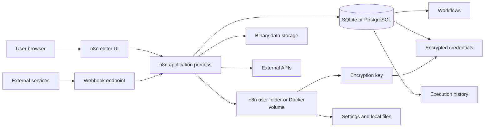
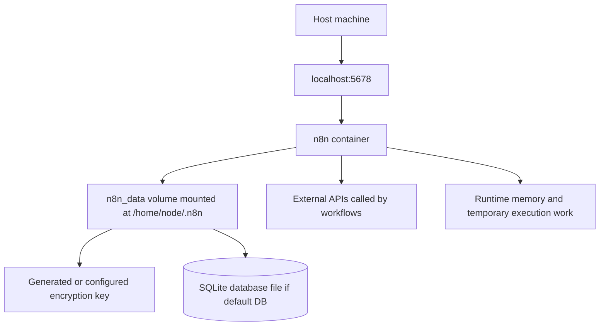
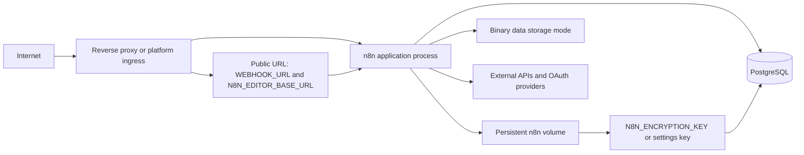
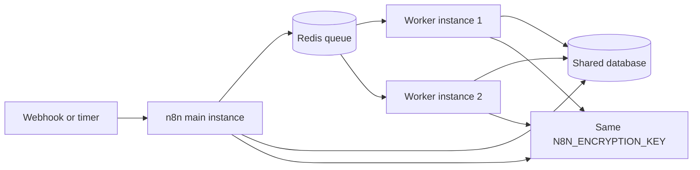

# Week 02｜n8n 如何運作：Runtime 與 State Model

> 執行依據：`20 周的執行計劃.md` 的 Week 02。
> 執行日期：2026-05-27。
> 本週目標：回答「n8n 的 application、database、credentials、executions、binary data、public URL 如何互相影響？」
> 本週狀態：完成。三個交付物已全部產出，並附上官方來源核對。

## 1. 本週交付物總覽

| 交付物 | 狀態 | 對應章節 | 驗收方式 |
| --- | --- | --- | --- |
| n8n runtime architecture 圖 | 完成 | 第 3 章 | 能看懂 browser、public edge、n8n process、database、user folder、binary data、external APIs 的關係。 |
| state inventory 表 | 完成 | 第 4 章 | 能逐項說明 workflow、credential、execution history、binary data、`.n8n`、encryption key 的保存位置與備份責任。 |
| credential-loss 風險說明卡 | 完成 | 第 5 章 | 能判斷 credentials 為什麼會在換容器、換主機、換 volume 或換 encryption key 時失效。 |
| 驗收說明 | 完成 | 第 6 章 | 能解釋為什麼換容器或換主機時，保存 encryption key 與 volume 不是可選項。 |

## 2. 官方來源核對

本週只採用官方文件作為事實基礎。尤其是 state 與 encryption key，不能靠印象處理。

| 事實 | 核對結果 | 官方來源 |
| --- | --- | --- |
| self-hosted n8n 預設使用 SQLite，資料庫儲存 credentials、past executions、workflows，也支援 PostgreSQL。 | 確認。database 是 n8n state layer 的核心，不是附屬品。 | [n8n Supported Databases](https://docs.n8n.io/hosting/configuration/supported-databases-settings/) |
| n8n 會在使用者的 `.n8n` 資料夾保存 user-specific data，例如 encryption key、SQLite database file、tunnel ID。 | 確認。`.n8n` 不是暫存目錄，對本機與 Docker volume 都是關鍵。 | [Specify user folder path](https://docs.n8n.io/hosting/configuration/configuration-examples/user-folder/) |
| Docker 安裝範例會把 `n8n_data` volume 掛到 `/home/node/.n8n`，用來在 container restart 後保留資料。 | 確認。container 本身可重建，但 volume 不可隨便丟。 | [n8n Docker Installation](https://docs.n8n.io/hosting/installation/docker/) |
| n8n 第一次啟動會產生 random encryption key 並保存在 `~/.n8n`；credentials 在存進 database 前會用這個 key 加密。 | 確認。資料庫和 encryption key 必須成對保存。 | [Set a custom encryption key](https://docs.n8n.io/hosting/configuration/configuration-examples/encryption-key/) |
| `N8N_ENCRYPTION_KEY` 可提供自訂 key；queue mode 下所有 workers 都必須指定同一個 encryption key。 | 確認。多 process 或 worker 架構更不能讓 key 漂移。 | [Set a custom encryption key](https://docs.n8n.io/hosting/configuration/configuration-examples/encryption-key/), [n8n Queue Mode](https://docs.n8n.io/hosting/scaling/queue-mode/) |
| `N8N_EDITOR_BASE_URL` 是使用者可存取 editor 的 public URL，也用於 email 與 SAML redirect URL。 | 確認。public URL 不只影響瀏覽器，也影響身份驗證與通知連結。 | [Deployment environment variables](https://docs.n8n.io/hosting/configuration/environment-variables/deployment/) |
| reverse proxy 後需設定 `WEBHOOK_URL`，並設定 `N8N_PROXY_HOPS=1`，讓 n8n 註冊正確 webhook URL。 | 確認。public edge 與 n8n process 的內外網址不一致時，必須顯式設定。 | [Configure webhook URLs with reverse proxy](https://docs.n8n.io/hosting/configuration/configuration-examples/webhook-url/) |
| execution data 會讓 database 成長；n8n 建議不要保存不必要資料，並啟用 pruning。 | 確認。execution history 是容量與隱私風險來源。 | [Execution data](https://docs.n8n.io/hosting/scaling/execution-data/) |
| binary data 位置依版本與 `N8N_DEFAULT_BINARY_DATA_MODE` 設定而定；官方 scaling 文件警告 memory mode 會因大檔案造成 crash，v2 breaking changes 說 regular mode 預設 filesystem、queue mode 預設 database。 | 確認。不能在文件裡把 binary data 永遠寫死在單一位置。 | [Binary data scaling](https://docs.n8n.io/hosting/scaling/binary-data/), [n8n v2.0 breaking changes](https://docs.n8n.io/2-0-breaking-changes/) |
| community nodes 安裝在硬碟；Docker 重建或升級時若沒有保存 `~/.n8n/nodes`，可能出現 missing packages。 | 確認。custom/community nodes 也屬於 state inventory。 | [Community nodes troubleshooting](https://docs.n8n.io/integrations/community-nodes/troubleshooting/) |

## 3. 交付物一：n8n Runtime Architecture 圖

### 3.1 單一 instance 的核心運作

### 3.2 Docker 單機學習模式

Docker learning mode 的重點是：container 可以刪掉重建，但 `n8n_data` volume 不可以被當成暫存物。若使用預設 SQLite，database file 與 encryption key 都會落在 `.n8n` 這個 state boundary 裡。

### 3.3 Production-shaped self-hosted 模式

Production-shaped 模式要把三層分清楚：public edge 負責接 internet traffic，n8n application process 負責執行 workflow，state layer 負責保存 workflow、credential、execution、binary data 與 encryption material。三層任何一層錯，都會讓同一個 workflow 呈現不同錯誤。

### 3.4 Queue mode 的概念位置

Queue mode 是 Week 16 才深入的擴展主題。本週只建立一個基本觀念：只要同一個 n8n deployment 有多個 main 或 worker process，所有 process 都必須共享能讀取 credentials 的同一組 encryption key，並共同指向一致的 database state。

## 4. 交付物二：State Inventory 表

### 4.1 核心 State Inventory

| State 項目 | 主要用途 | 典型保存位置 | 可否重建 | 遺失後影響 | 第一備份責任 |
| --- | --- | --- | --- | --- | --- |
| Workflows | 保存節點、連線、trigger、workflow 設定與版本內容。 | n8n database：預設 SQLite，production 常用 PostgreSQL。 | 可從 export 或 source control 部分重建，但不是完整替代 database。 | workflow 消失、trigger 不存在、團隊無法編輯或執行既有流程。 | database backup；另可搭配 workflow export。 |
| Credentials | 保存 API key、OAuth token、database password 等敏感連線資料。 | n8n database 中的 encrypted credentials。 | 不能靠 workflow JSON 完整重建；通常要重新授權或重新輸入。 | workflow 仍在，但節點無法連外部服務；OAuth integration 失效。 | database backup 加同一個 encryption key。 |
| Encryption key | 解密 credentials 與敏感資料的 master key 或 instance key。 | `~/.n8n` settings file，或以 `N8N_ENCRYPTION_KEY` 環境變數注入。 | 不可等價重建；新 key 不能解舊資料。 | database 還在但 credentials 無法解密，等同 credential loss。 | secret manager、`.env` 安全備份、deployment config。 |
| Executions | 保存 workflow run 的狀態、輸入輸出、錯誤與除錯資訊。 | n8n database；保存量受 execution settings 與 pruning 影響。 | 歷史紀錄不可完整重建。 | 無法追蹤歷史錯誤、稽核與除錯資訊消失。 | database backup；同時設定 pruning 策略。 |
| Binary data | 工作流處理的檔案，例如圖片、PDF、文件、音訊。 | 依版本與 `N8N_DEFAULT_BINARY_DATA_MODE`：memory、filesystem、database、S3-compatible storage。 | 通常不可重建，除非來源系統仍保留原檔。 | 文件處理 workflow 失敗，歷史 execution 的檔案參照失效。 | 依實際 mode 備份 volume、database 或 external storage。 |
| `.n8n` user folder | 保存 user-specific data，例如 encryption key、SQLite database file、tunnel ID、settings、部分本機資料。 | Linux/macOS 常見為 `~/.n8n`；Docker official path 為 `/home/node/.n8n`，通常掛 volume。 | 不可當成純 cache。 | 使用預設 SQLite 時可能同時失去 database 與 encryption key。 | Docker volume backup 或 host folder backup。 |
| Community nodes | 自行安裝的 community node packages。 | `~/.n8n/nodes` 等本機硬碟位置。 | 可重新安裝，但版本與啟動時間會有風險。 | workflow 找不到 node package，啟動或執行失敗。 | 保存 `.n8n/nodes` 或記錄版本並配置 reinstall 策略。 |
| Environment variables | 控制 DB、URL、execution、binary data、security、proxy、feature flags。 | `.env`、平台 env settings、secret manager、container config。 | 可重建，但前提是有文件與 secret。 | public URL 錯、DB 連不上、credentials 無法解密、binary data mode 改變。 | deployment config backup 與 secret manager。 |
| Public URL settings | 讓 n8n 產生正確 editor links、webhook URL、email link、SAML/OAuth redirect。 | `N8N_EDITOR_BASE_URL`、`WEBHOOK_URL`、`N8N_HOST`、`N8N_PROTOCOL`、`N8N_PROXY_HOPS`。 | 可修正，但錯誤期間會造成 integration 失敗。 | webhook 註冊錯誤、OAuth callback mismatch、email 或 SAML redirect 錯誤。 | `.env`、reverse proxy config、DNS 記錄。 |
| Reverse proxy config | TLS termination、domain routing、forwarded headers、public edge。 | Caddyfile、Nginx config、Traefik labels、platform ingress settings。 | 可重建，但需知道 domain 與 headers。 | HTTPS、webhook、OAuth、UI 存取錯誤。 | proxy config backup 與 DNS 記錄。 |

### 4.2 優先保護順序

| 優先級 | State | 原因 |
| --- | --- | --- |
| P0 | Encryption key | 沒有同一把 key，encrypted credentials 可能無法解密。 |
| P0 | Database | workflows、credentials、executions 的主要保存地。 |
| P0 | `.n8n` volume 或 user folder | 預設 SQLite、settings、generated encryption key、community nodes 都可能在這裡。 |
| P1 | Environment variables and secrets | 決定 database、URL、binary data、security 與 worker 是否正確。 |
| P1 | Reverse proxy and DNS config | 決定 public access、OAuth、webhook URL 是否正確。 |
| P1 | Binary data storage | 檔案型 workflow 與 execution data 需要它才能完整回復。 |
| P2 | Workflow exports | 可當輔助備份，但不能取代 database 與 credentials。 |
| P2 | Screenshots and manual setup notes | 可協助人工恢復，但不是正式 backup。 |

### 4.3 State Boundary 判斷表

| 情境 | 需要保存什麼 | 不保存會怎樣 |
| --- | --- | --- |
| 只刪除並重建 Docker container | 保留 `n8n_data` volume；若使用 external DB，也要保留 DB 連線與 encryption key。 | container 會回來，但 workflows、credentials 或 SQLite DB 可能消失。 |
| 從 SQLite 搬到 PostgreSQL | 保存舊 SQLite database、encryption key、migration/export 流程、volume。 | credentials 可能不可讀，workflow migration 不完整。 |
| 從一台 VPS 搬到另一台 VPS | 搬 database、`.n8n` volume、`N8N_ENCRYPTION_KEY`、env、proxy、DNS。 | 新主機能啟動 n8n，但舊 credentials、webhook URL 或 binary data 失效。 |
| PaaS redeploy | 確認 database 是 managed 或 volume 持久化，確認 env secrets 沒有變。 | service 看似 redeploy 成功，但 state 被重置。 |
| 加入 queue workers | 所有 main 與 workers 使用同一 database、Redis、`N8N_ENCRYPTION_KEY`。 | worker 拿到 execution ID 卻無法讀取或解密 workflow credential。 |
| 改變 binary data mode | 記錄舊 mode，確保舊資料仍能被讀取或遷移。 | historical execution 的 binary references 可能無法被 pruning 或讀取。 |

## 5. 交付物三：Credential-loss 風險說明卡

### 風險卡 01：Database 在，key 不在

| 欄位 | 說明 |
| --- | --- |
| 症狀 | workflows 還在，credential records 也可能還在 database 裡，但節點授權失敗或 credential 無法正常使用。 |
| 根因 | n8n credentials 存入 database 前會用 encryption key 加密；換了 key，就不能等價解舊資料。 |
| 高風險動作 | 刪掉 `.n8n` folder、換 Docker volume、換 VPS 沒帶 `N8N_ENCRYPTION_KEY`、PaaS 重建 env secrets。 |
| 預防 | production-like deployment 一律顯式設定 `N8N_ENCRYPTION_KEY`，並放在 secret manager 或安全的 `.env` 備份中。 |
| 修復 | 找回原 key；若找不回，只能重新建立或重新授權 credentials。 |
| 驗收句 | database backup 沒有 encryption key，不是完整 backup。 |

### 風險卡 02：Key 在，database 不在

| 欄位 | 說明 |
| --- | --- |
| 症狀 | n8n 能啟動，key 也正確，但 workflow、credential、execution history 不存在。 |
| 根因 | database 是 workflows、credentials、past executions 的主要保存地；只有 key 沒有資料可解。 |
| 高風險動作 | SQLite database file 隨 `.n8n` 消失、PostgreSQL volume 被刪、PaaS 沒有 managed DB 或 persistent volume。 |
| 預防 | 使用 PostgreSQL 時安排 database backup；使用 SQLite 學習時保留整個 `.n8n` volume。 |
| 修復 | 還原 database backup，再使用同一把 key 啟動。 |
| 驗收句 | encryption key 是鑰匙，database 是保險箱；兩者缺一個都不能恢復 credential state。 |

### 風險卡 03：Volume 在，但 public URL 設錯

| 欄位 | 說明 |
| --- | --- |
| 症狀 | workflow 與 credentials 都存在，但 webhook 或 OAuth callback 失敗。 |
| 根因 | n8n process 內部可能只知道 `localhost:5678`，但外部服務需要看到 `https://n8n.example.com`。 |
| 高風險動作 | 加 reverse proxy 或 tunnel 後，沒設定 `WEBHOOK_URL`、`N8N_EDITOR_BASE_URL`、`N8N_PROXY_HOPS`。 |
| 預防 | public edge 一變，就同步檢查 n8n public URL env vars、OAuth provider callback、proxy headers。 |
| 修復 | 設定正確 public URL，重新註冊或更新外部服務 webhook/OAuth callback。 |
| 驗收句 | state 正確只能保證資料還在，不能保證外部世界打得到正確入口。 |

### 風險卡 04：Binary data storage 漂移

| 欄位 | 說明 |
| --- | --- |
| 症狀 | workflow history 還在，但歷史 execution 的檔案、圖片、PDF 或附件讀不到；或大檔 workflow 不穩定。 |
| 根因 | binary data 位置依 `N8N_DEFAULT_BINARY_DATA_MODE` 與 n8n 版本而定，可能在 memory、filesystem、database 或 S3-compatible storage。 |
| 高風險動作 | 改 binary data mode、換 worker/queue mode、只備份 DB 但漏備 volume 或 external storage。 |
| 預防 | 在 deployment inventory 中記錄實際 binary data mode，並把對應 storage 納入 backup。 |
| 修復 | 回復原 storage mode 與資料位置；若原始 binary files 已遺失，只能從外部來源重跑或重新上傳。 |
| 驗收句 | binary data 不是「一定在 database」或「一定在 volume」，它必須按實際設定檢查。 |

### 風險卡 05：Community nodes 消失

| 欄位 | 說明 |
| --- | --- |
| 症狀 | n8n 啟動後提示 missing packages，或 workflow 裡的 community node 無法載入。 |
| 根因 | community nodes 安裝在 hard disk；Docker 重建或升級時如果沒保存 `~/.n8n/nodes`，package 可能消失。 |
| 高風險動作 | 沒有掛載 `.n8n` volume、清空 node package folder、PaaS filesystem 是 ephemeral。 |
| 預防 | 保存 `~/.n8n/nodes`，或清楚記錄 community node package 與版本。 |
| 修復 | 還原 nodes folder 或重新安裝相同 packages。 |
| 驗收句 | workflow JSON 只能描述 node，用不到 node package 時照樣跑不起來。 |

## 6. 驗收條件說明

### 題目

為什麼換容器或換主機時，保存 encryption key 與 volume 不是可選項？

### 標準回答

換容器或換主機時，保存 encryption key 與 volume 不是可選項，因為 n8n 不是無狀態 web app。n8n 的 database 會保存 workflows、credentials 和 past executions；credentials 在進 database 前會用 encryption key 加密；`.n8n` user folder 或 Docker volume 又可能保存 generated encryption key、SQLite database file、settings、tunnel ID 和 community nodes。這代表 container image 本身只是一個可重建的 application package，真正能讓舊 workflow 繼續工作的，是 database、volume、encryption key 與 deployment config。

如果只搬 database、不搬 encryption key，encrypted credentials 可能無法解密。反過來，如果只搬 key、不搬 database，workflow、credential records 和 execution history 都不在。若只搬 database 和 key，但漏掉 `.n8n` volume、binary data storage、community nodes 或 public URL settings，則可能出現檔案遺失、node package missing、webhook URL 錯誤或 OAuth callback mismatch。這就是為什麼 Week 02 的核心結論是：n8n 遷移與備份要以 state inventory 為單位，不是以 container 為單位。

### 30 秒版本

n8n container 可以重建，但 n8n state 不能靠重建補回。database 保存 workflows、credentials、executions；encryption key 決定 credentials 能不能被解密；`.n8n` volume 可能保存 SQLite、key、settings 和 community nodes。因此換容器或換主機時，database、volume、encryption key、env 與 public URL config 必須一起管理。

## 7. Week 02 實務檢查表

| 檢查項 | 通過標準 |
| --- | --- |
| Database type 已知 | 明確知道目前是 SQLite 還是 PostgreSQL。 |
| `.n8n` 位置已知 | 明確知道 host path、Docker volume 或 `N8N_USER_FOLDER`。 |
| Encryption key 已保存 | production-like deployment 有固定 `N8N_ENCRYPTION_KEY`，不是只靠未備份的 generated key。 |
| Credential restore 路徑已知 | 能說明 credentials 需要 database 加同一把 key。 |
| Execution data policy 已知 | 知道是否保存成功/失敗/手動 execution，以及 pruning 設定。 |
| Binary data mode 已知 | 知道實際 `N8N_DEFAULT_BINARY_DATA_MODE` 與對應 storage。 |
| Public URL 已知 | `N8N_EDITOR_BASE_URL` 與 `WEBHOOK_URL` 對得上外部可見網址。 |
| Reverse proxy hops 已知 | behind reverse proxy 時有設定 `N8N_PROXY_HOPS` 與 forwarded headers。 |
| Community nodes 已盤點 | 若有使用 community nodes，知道 package 保存位置與版本。 |
| Migration bundle 已定義 | 搬家時至少包含 database、volume、encryption key、env、proxy/DNS、binary storage。 |

## 8. Week 02 完成檢查

| 檢查項 | 結果 |
| --- | --- |
| 已讀 Week 02 計畫要求 | 通過 |
| 已核對官方來源 | 通過 |
| 已完成 n8n runtime architecture 圖 | 通過 |
| 已完成 state inventory 表 | 通過 |
| 已完成 credential-loss 風險說明卡 | 通過 |
| 已完成驗收說明 | 通過 |
| 已處理 binary data 版本差異，不寫死單一保存位置 | 通過 |
| 未把 Week 05 或 Week 07 的部署實作提前執行 | 通過 |

## 9. 下一週銜接

Week 03 會進入「資料保存與安全基礎」，把本週的 state inventory 轉成 SQLite vs PostgreSQL、最小備份組合與 binary-heavy workflow 風險。Week 02 的輸出會直接成為 Week 03 的備份責任表基礎。
