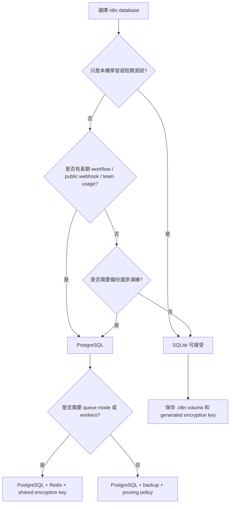
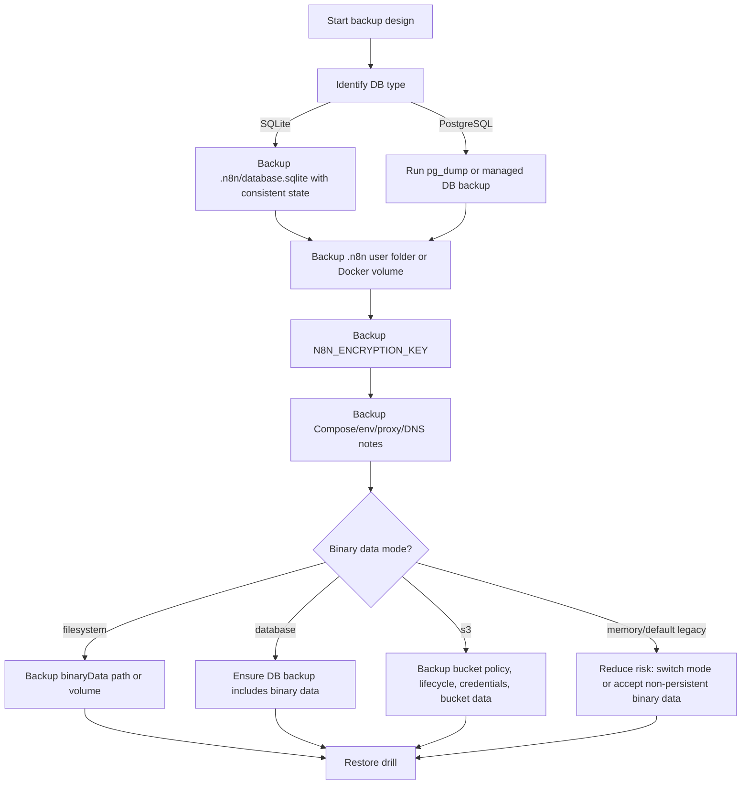

# Week 03｜資料保存與安全基礎

> 執行依據：`20 周的執行計劃.md` 的 Week 03。
> 執行日期：2026-05-27。
> 本週目標：回答「SQLite、PostgreSQL、volume、binary data、encryption key 各自承擔什麼責任？」
> 本週狀態：完成。三個交付物已全部產出，並附上官方來源核對。

## 1. 本週交付物總覽

| 交付物 | 狀態 | 對應章節 | 驗收方式 |
| --- | --- | --- | --- |
| SQLite vs PostgreSQL 決策表 | 完成 | 第 3 章 | 能說明 SQLite 適合學習與單機低風險使用，PostgreSQL 適合 production-like self-hosted 部署。 |
| 最小備份組合 checklist | 完成 | 第 4 章 | 能列出 production self-host n8n 的最小備份內容：database、volume、encryption key、Compose/env/proxy config。 |
| binary-heavy workflow 注意事項 | 完成 | 第 5 章 | 能判斷 binary data mode、容量、queue mode、pruning 與 external storage 的影響。 |
| 驗收說明 | 完成 | 第 6 章 | 能在 60 秒內列出 production self-host n8n 的最小備份內容與理由。 |

## 2. 官方來源核對

本週只採用官方文件作為事實基礎。資料保存與備份不能靠平台印象或「應該會在某處」來判斷。

| 事實 | 核對結果 | 官方來源 |
| --- | --- | --- |
| self-hosted n8n 預設使用 SQLite；SQLite 會保存 credentials、past executions、workflows；n8n 也支援 PostgreSQL。 | 確認。database 是 workflows、credentials、executions 的主要保存地。 | [Supported databases and settings](https://docs.n8n.io/hosting/configuration/supported-databases-settings/) |
| SQLite database file 位置是 `~/.n8n/database.sqlite`。 | 確認。若使用 Docker 預設 volume，這個檔案會落在 container 的 `/home/node/.n8n` 對應 volume 中。 | [Supported databases and settings](https://docs.n8n.io/hosting/configuration/supported-databases-settings/) |
| n8n database env vars 使用 `DB_TYPE=sqlite` 或 `DB_TYPE=postgresdb`；MySQL/MariaDB 已 deprecated。 | 確認。Week 03 決策表只比較 SQLite 與 PostgreSQL。 | [Database environment variables](https://docs.n8n.io/hosting/configuration/environment-variables/database/) |
| n8n CLI 可 export entities，支援從 SQLite 匯出並匯入到 Postgres；execution history data tables 預設排除，因為可能很大。 | 確認。CLI export 是遷移與輔助備份工具，不等於完整基礎設施備份。 | [CLI commands](https://docs.n8n.io/hosting/cli-commands/) |
| workflow JSON 可匯出/匯入；匯出的 workflow JSON 會包含 credential names 和 IDs。 | 確認。workflow export 是輔助備份，不可當成完整 credential backup。 | [Export and import workflows](https://docs.n8n.io/workflows/export-import/) |
| credentials 可用 CLI export；`--decrypted` 會輸出明文敏感資料。 | 確認。明文 credential export 只應作為受控遷移手段，不應成為一般備份習慣。 | [CLI commands](https://docs.n8n.io/hosting/cli-commands/) |
| execution data 會讓 database 成長；n8n 建議不要保存不必要 execution data，並啟用 pruning；SQLite pruning 後磁碟空間不一定立即釋放，可用 `DB_SQLITE_VACUUM_ON_STARTUP` 或 manual VACUUM。 | 確認。execution retention 是 storage 與隱私管理議題。 | [Execution data](https://docs.n8n.io/hosting/scaling/execution-data/) |
| binary data 是檔案型資料，例如 image 或 document；大型 binary data 若留在 memory 可能造成 crash；可用 `N8N_DEFAULT_BINARY_DATA_MODE=filesystem` 讓資料存到 disk。 | 確認。binary-heavy workflow 必須檢查 storage mode 與容量。 | [Binary data scaling](https://docs.n8n.io/hosting/scaling/binary-data/) |
| queue mode 不支援 filesystem binary data storage；queue mode 文件也不建議 SQLite database。 | 確認。需要 worker/queue 時，Week 03 的資料層建議必須升級。 | [Queue mode](https://docs.n8n.io/hosting/scaling/queue-mode/) |
| binary data environment variables 文件仍列出 memory/default 模式；v2 breaking changes 說 v2 起 regular mode 使用 filesystem、queue mode 使用 database，且 `N8N_AVAILABLE_BINARY_DATA_MODES` 會移除。 | 確認。因此文件不得寫死「永遠 memory」或「永遠 filesystem」，必須要求檢查實際版本與 `N8N_DEFAULT_BINARY_DATA_MODE`。 | [Binary data environment variables](https://docs.n8n.io/hosting/configuration/environment-variables/binary-data/), [n8n v2.0 breaking changes](https://docs.n8n.io/2-0-breaking-changes/) |
| S3 external storage for binary data 是 Self-hosted Enterprise 功能；n8n 支援 AWS S3，其他 S3-compatible service 可用但不屬官方支援。 | 確認。不能把 S3 external storage 當所有 self-hosted 方案的預設選項。 | [External storage for binary data](https://docs.n8n.io/hosting/scaling/external-storage/) |
| source control / environments 不會同步 credentials 與 variable values 到 Git。 | 確認。Git/source control 不是 credential backup。 | [Environments in n8n](https://docs.n8n.io/source-control-environments/understand/environments/) |

## 3. 交付物一：SQLite vs PostgreSQL 決策表

### 3.1 一頁決策表

| 判斷維度 | SQLite | PostgreSQL | Week 03 結論 |
| --- | --- | --- | --- |
| 預設性 | self-hosted n8n 沒有設定 database 時的預設。 | 需要明確設定 `DB_TYPE=postgresdb` 與 `DB_POSTGRESDB_*`。 | 初學可以接受預設；正式環境應主動選擇。 |
| 保存內容 | 保存 credentials、past executions、workflows。 | 同樣保存 credentials、past executions、workflows。 | 兩者都不是「只放設定」；都是核心 state。 |
| 檔案位置 | `~/.n8n/database.sqlite`。Docker 中通常在 `/home/node/.n8n` volume。 | 外部 PostgreSQL server、managed DB 或 Compose 裡的 postgres volume。 | SQLite 備份常和 `.n8n` volume 綁一起；PostgreSQL 要有 DB backup 策略。 |
| 適合情境 | 本機學習、短期測試、低風險單 instance。 | production-like self-hosted、VPS、PaaS、multi-worker、可恢復性要求高的情境。 | 只要進入長期 public automation，PostgreSQL 優先。 |
| 備份方式 | 備份 `.n8n` folder 或 SQLite file，停機/一致性要小心。 | `pg_dump`、managed DB backup、snapshot、PITR 視平台能力。 | PostgreSQL 的備份與還原流程更適合長期維運。 |
| execution data 成長 | pruning 後空間可能被重用而非立即釋放；可能需 VACUUM。 | 可搭配成熟 DB 維運、監控與容量管理。 | execution retention policy 對 SQLite 更容易變成隱性磁碟問題。 |
| queue mode | 官方文件不建議 queue mode 搭配 SQLite。 | queue mode 的合理資料庫基礎。 | 想走 scaling path，就不要停在 SQLite。 |
| 搬遷能力 | 可用 CLI export entities 作為 SQLite 到 Postgres 的遷移工具。 | 可作為遷移目標，也可再用 DB backup/restore 管理。 | 遷移前要保留 encryption key 和完整備份。 |
| 操作複雜度 | 最低，幾乎不需另外管理 DB。 | 需要 DB 帳密、權限、連線、backup、監控。 | 初期省事，後期可能把風險留到事故時才爆出來。 |
| production 建議 | 不建議作為嚴肅 production default。 | 建議作為 meaningful self-hosted default。 | Week 03 的標準建議：production self-host 以 PostgreSQL 為基準。 |

### 3.2 決策流程圖

### 3.3 不可犯錯的判斷

1. SQLite 不是「沒有資料庫」；它就是資料庫，只是以檔案形式存在。
2. PostgreSQL 不是只為了效能；它是為了備份、遷移、監控、可靠性與未來 scaling path。
3. workflow JSON export 不能取代 database backup，因為 credentials、executions、版本資料、變數與部分 instance state 不會完整等價。
4. source control 不同步 credentials 和 variable values；Git 不是完整 recovery plan。
5. PostgreSQL backup 沒有 encryption key，credentials 仍可能不可用。

## 4. 交付物二：最小備份組合 Checklist

### 4.1 Production self-host n8n 最小備份內容

| 必備等級 | 備份項目 | 為什麼必備 | 最低可接受形式 | 驗收方式 |
| --- | --- | --- | --- | --- |
| P0 | Database | 保存 workflows、encrypted credentials、past executions。 | PostgreSQL：`pg_dump`、managed backup 或 volume snapshot；SQLite：一致性備份 `database.sqlite`。 | 能在測試環境還原並看到 workflow 和 credential records。 |
| P0 | Encryption key | 解密 credentials 與敏感資料。 | `N8N_ENCRYPTION_KEY` 的 secret backup，或保留含 generated key 的 `.n8n` settings。 | 還原後既有 credentials 可正常使用。 |
| P0 | `.n8n` user folder / Docker volume | 可能保存 SQLite file、generated encryption key、settings、binary data path、community nodes。 | Docker volume archive、host folder backup、平台 persistent volume snapshot。 | 重建 container 後 `.n8n` 內容一致。 |
| P0 | Deployment config | 定義 DB、URL、binary mode、security、execution settings。 | `docker-compose.yml`、`.env`、platform env export、secret inventory。 | 新環境可用同一設定啟動。 |
| P0 | Reverse proxy config | 決定 TLS、domain、headers、public edge。 | Caddyfile、Nginx config、Traefik labels、platform ingress 設定。 | public editor URL、webhook URL、OAuth callback 都正確。 |
| P1 | Binary data storage | 檔案型 workflow 需要的實際 binary payload。 | 依 mode 備份 filesystem path、database、S3 bucket 或 managed storage。 | 歷史 execution 的檔案可讀，binary-heavy workflow 可重跑。 |
| P1 | Community nodes | workflow 執行所需的 community package。 | `.n8n/nodes` backup 或 package/version inventory。 | 重建後 workflow 不出現 missing packages。 |
| P1 | Workflow exports | 輔助版本管理與人工比對。 | `n8n export:workflow --backup --output=backups/latest/workflows/`。 | 可獨立檢視 workflow JSON，但不把它當唯一備份。 |
| P1 | Credentials export | 輔助遷移，特別是跨 database 或特殊情境。 | `n8n export:credentials --backup --output=backups/latest/credentials/`；必要時受控使用 `--decrypted`。 | 未授權人員無法讀取 sensitive data；若用 decrypted export，必須加密保存。 |
| P2 | Restore procedure | 避免只有 backup 沒有 recovery。 | 一份可執行 restore checklist。 | 至少每個 phase gate 做一次文件演練，正式前做測試還原。 |

### 4.2 一句話版本

production self-host n8n 的最小備份內容是：database、`.n8n` volume 或 user folder、`N8N_ENCRYPTION_KEY`、Compose/env/proxy config，並依 binary data mode 補上 binary storage backup。

### 4.3 Backup coverage matrix

| 備份方式 | Workflow | Credentials | Executions | Encryption key | Binary data | Config | 適合作為唯一備份嗎 |
| --- | --- | --- | --- | --- | --- | --- | --- |
| Workflow JSON export | 部分可 | 否，只含 credential names/IDs 等參照 | 否 | 否 | 否 | 否 | 否 |
| CLI workflow + credentials backup | 可 | 可，但仍需 key 或安全處理 | 通常否 | 否 | 否 | 否 | 否 |
| CLI export entities | 可 | 可 | 可選，需 `--includeExecutionHistoryDataTables=true`，但可能很大 | 否 | 視模式而定 | 否 | 否 |
| PostgreSQL backup | 可 | 可，仍需同一 encryption key | 可 | 否 | 若 binary mode=database 才包含 binary payload | 否 | 否 |
| `.n8n` volume backup | 視 DB 而定；SQLite 情境可 | 視 DB/key 而定 | 視 DB 而定 | 可能可 | 若 binary mode=filesystem 且 path 在此 volume 可 | 部分可 | 否 |
| Full recovery bundle | 可 | 可 | 可 | 可 | 可 | 可 | 是 |

### 4.4 最小備份流程圖

### 4.5 備份時機

| 時機 | 必做備份 | 原因 |
| --- | --- | --- |
| 第一次正式上線前 | Full recovery bundle | 建立 baseline。 |
| 每次 n8n 版本升級前 | Database、volume、encryption key、config | 防 migration 或 breaking change。 |
| 改 `N8N_ENCRYPTION_KEY` 或啟用 key rotation 前 | Full database backup、key inventory | key 相關變更不可草率。 |
| SQLite 轉 PostgreSQL 前 | SQLite DB、`.n8n` volume、key、CLI export entities | 遷移失敗時可回退。 |
| 改 binary data mode 前 | 原 mode 對應 storage、DB、config | 避免歷史 binary references 失效。 |
| 加 queue workers 前 | DB、key、env、binary mode 記錄 | workers 需要共同 DB 與 key；filesystem binary mode 不適用 queue mode。 |

## 5. 交付物三：Binary-heavy Workflow 注意事項

### 5.1 Binary-heavy 的定義

Binary-heavy workflow 是大量處理 file-type data 的 workflow，例如圖片、PDF、文件、壓縮檔、音訊、影片、附件、爬蟲下載檔案、AI 生成檔案、OCR 或報表輸出。它的風險不是 workflow 節點多，而是檔案 payload 會佔用 memory、disk、database 或 external storage。

### 5.2 Binary data mode 判斷表

| Mode | 典型意義 | 優點 | 風險 | 備份責任 | Week 03 建議 |
| --- | --- | --- | --- | --- | --- |
| memory / default legacy | binary data 在 execution 期間留在 memory。 | 最少設定。 | 大檔案可能造成 crash；不適合嚴肅 binary-heavy workload。 | 通常不應依賴它保存 binary payload。 | 若處理大檔案，應改成明確 storage mode。 |
| filesystem | binary data 存到 disk，預設 storage path 與 `N8N_USER_FOLDER/binaryData` 相關。 | 減少 memory 壓力，適合一般 single-instance regular mode。 | 需要 disk capacity、volume backup；queue mode 不支援 filesystem binary data storage。 | 備份 binary data path 或包含它的 volume。 | single-instance self-host 可優先評估。 |
| database | binary data 存到 database。 | queue mode 情境更一致；DB backup 可涵蓋更多 state。 | DB 成長快，backup/restore 變大，效能與容量要監控。 | DB backup、retention policy、storage monitoring。 | queue mode 或多 worker 情境優先確認。 |
| s3 / external storage | binary data 存到 S3 或 S3-compatible store。 | 避免本機 filesystem 承擔大量檔案；適合大規模 binary storage。 | Self-hosted Enterprise 功能；AWS S3 是官方支援，其他 S3-compatible 非官方支援；bucket lifecycle 需要管理。 | bucket data、bucket policy、lifecycle、S3 credentials。 | 只有 enterprise 或大規模 binary data 才納入主方案。 |

### 5.3 Binary-heavy 風險卡

| 風險 | 觸發情境 | 影響 | 預防 |
| --- | --- | --- | --- |
| Memory crash | 大圖片、PDF、影片、批次附件留在 memory。 | workflow 或 instance crash。 | 設定 filesystem/database/S3 mode，並限制單次檔案大小。 |
| Disk fill-up | filesystem mode 沒有容量監控或 pruning。 | n8n 無法寫入 execution/binary data，甚至整機不穩。 | 監控 `binaryData` path、設定 retention、安排 volume backup。 |
| Database bloat | database mode 保存大量 binary payload 或 execution data。 | DB backup 變慢、storage 成本增加、restore time 拉長。 | 調整 execution save policy、pruning、DB capacity planning。 |
| Queue incompatibility | queue mode 搭配 filesystem binary data。 | worker 架構不符合官方支援模式。 | queue mode 使用 database 或 enterprise external storage。 |
| S3 lifecycle gap | external storage 沒有 lifecycle policy。 | 舊 binary data 無限累積，成本與隱私風險上升。 | 設定 bucket lifecycle，並記錄 retention policy。 |
| Mode drift | 從 S3 改回 filesystem 或反向切換，沒有保留舊 mode。 | 舊 binary data 可能讀不到或不會被正確 pruning。 | 保留 `N8N_AVAILABLE_BINARY_DATA_MODES` 與舊 storage credentials，遷移前先盤點。 |
| File node security | Read/Write Files from Disk 或 Local File 類 workflow 讀寫主機檔案。 | 安全邊界擴大，可能讀到不該讀的檔案。 | 限制可讀寫路徑，審核需要 file access 的 workflow。 |

### 5.4 Binary-heavy checklist

| 檢查項 | 通過標準 |
| --- | --- |
| 實際 mode 已確認 | 知道目前 `N8N_DEFAULT_BINARY_DATA_MODE` 與 n8n 版本。 |
| storage path 已確認 | 若是 filesystem，知道 `N8N_BINARY_DATA_STORAGE_PATH` 或實際 `binaryData` path。 |
| queue compatibility 已確認 | 若使用 queue mode，不使用 filesystem binary data storage。 |
| capacity 已估算 | 預估單檔大小、每日檔案數、retention days、總 storage。 |
| pruning 已設定 | execution data 和 binary data retention 都有政策。 |
| backup 已覆蓋 | binary payload 所在位置已納入 backup，不只備份 workflow JSON。 |
| restore 已驗證 | 還原後能開啟歷史 execution 的 binary file 或重跑 workflow。 |
| security 已審核 | Read/Write Files from Disk、Local File Trigger、Execute Command 類能力有明確邊界。 |

## 6. 驗收條件說明

### 題目

production self-host n8n 的最小備份內容是什麼？

### 60 秒標準回答

production self-host n8n 的最小備份內容不是單一檔案，而是一組 recovery bundle。第一是 database，因為 workflows、encrypted credentials、past executions 都在裡面；如果是 PostgreSQL，要有 `pg_dump`、managed backup 或等價方式，如果是 SQLite，要有一致性的 `database.sqlite` 備份。第二是 `.n8n` volume 或 user folder，因為它可能保存 SQLite file、generated encryption key、settings、binary data path 和 community nodes。第三是 encryption key，尤其是 `N8N_ENCRYPTION_KEY`，因為 database 裡的 credentials 需要同一把 key 才能解密。第四是 Compose/env/proxy config，因為 DB 連線、public URL、binary data mode、TLS 和 reverse proxy 都靠這些設定恢復。第五是 binary data storage，要依實際 mode 備份 filesystem path、database 或 S3 bucket。workflow JSON export 可以當輔助，但不能取代完整備份。

### 15 秒版本

最小備份內容是 database、`.n8n` volume 或 user folder、`N8N_ENCRYPTION_KEY`、Compose/env/proxy config，再依 binary data mode 補上 binary storage。少了其中任何一項，都可能出現 workflow 在、credential 不能用，或資料在、public URL 與檔案失效。

## 7. Week 03 實務檢查表

| 檢查項 | 通過標準 |
| --- | --- |
| Database decision 已完成 | 明確知道目前使用 SQLite 或 PostgreSQL，並知道為什麼。 |
| PostgreSQL trigger point 已定義 | 一旦進入 public webhook、長期 automation、team usage、queue mode 或 production，就切換 PostgreSQL。 |
| SQLite backup 風險已理解 | 知道 SQLite file 在 `.n8n`，並知道 pruning 後可能需要 VACUUM 才釋放磁碟空間。 |
| Encryption key 已納入 P0 | `N8N_ENCRYPTION_KEY` 或 generated key 被視為 P0 secret。 |
| Full recovery bundle 已列出 | database、volume、key、env、proxy、binary storage 全部列入。 |
| Workflow export 定位正確 | workflow JSON export 只作輔助，不當唯一備份。 |
| Credential export 安全 | 若使用 `--decrypted`，必須加密保存並限制存取。 |
| Execution retention 已決定 | 知道保存成功/失敗/手動 executions 的策略，並配置 pruning。 |
| Binary mode 已確認 | 不寫死預設值，依實際版本和 `N8N_DEFAULT_BINARY_DATA_MODE` 判斷。 |
| Restore drill 已排程 | 至少有文件演練，正式前要做測試還原。 |

## 8. Week 03 完成檢查

| 檢查項 | 結果 |
| --- | --- |
| 已讀 Week 03 計畫要求 | 通過 |
| 已核對官方來源 | 通過 |
| 已完成 SQLite vs PostgreSQL 決策表 | 通過 |
| 已完成最小備份組合 checklist | 通過 |
| 已完成 binary-heavy workflow 注意事項 | 通過 |
| 已完成驗收說明 | 通過 |
| 已避免把 workflow JSON export 誤寫為完整備份 | 通過 |
| 已處理 binary data 版本差異，不寫死單一預設模式 | 通過 |
| 未把 Week 07 Docker Compose 實作或 Week 14 backup command runbook 提前執行 | 通過 |

## 9. 下一週銜接

Week 04 會進入 DNS、HTTPS、反向代理與公開 URL。Week 03 的資料安全結論會在 Week 04 補上 public edge：資料就算保存正確，只要 `WEBHOOK_URL`、`N8N_EDITOR_BASE_URL`、TLS 或 reverse proxy headers 錯，外部服務仍然無法可靠觸發 workflow。
