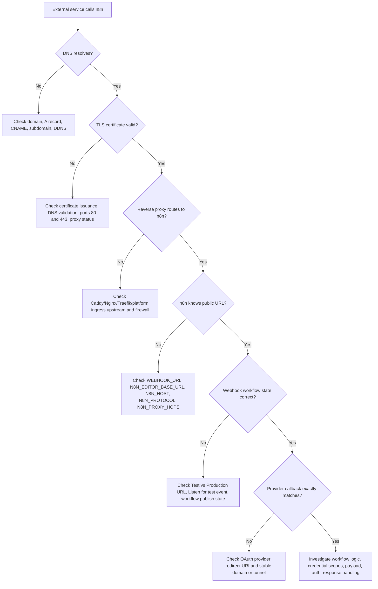
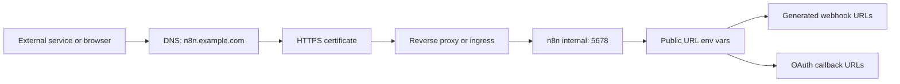
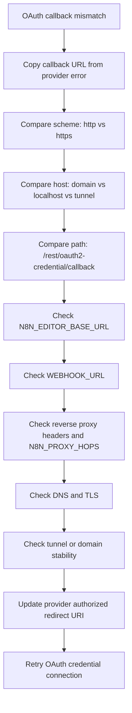

# Week 04｜DNS、HTTPS、反向代理與公開 URL

> 執行依據：`20 周的執行計劃.md` 的 Week 04。
> 執行日期：2026-05-27。
> 本週目標：回答「為什麼 webhook 與 OAuth 常常不是 workflow 錯，而是 URL、DNS、proxy 錯？」
> 本週狀態：完成。三個交付物已全部產出，並附上官方來源核對。

## 1. 本週交付物總覽

| 交付物 | 狀態 | 對應章節 | 驗收方式 |
| --- | --- | --- | --- |
| public URL troubleshooting flow | 完成 | 第 3 章 | 能從 DNS、TLS、reverse proxy、n8n env vars、webhook publish 狀態逐層排查。 |
| OAuth callback checklist | 完成 | 第 4 章 | 能確認 provider callback、`WEBHOOK_URL`、`N8N_EDITOR_BASE_URL`、domain 或 tunnel 穩定性。 |
| DNS/TLS glossary | 完成 | 第 5 章 | 能解釋 domain、A record、CNAME、subdomain、dynamic DNS、TLS certificate、reverse proxy。 |
| 驗收說明 | 完成 | 第 6 章 | 看到 OAuth callback mismatch 時，能先查 provider callback、public URL env vars、proxy headers 與 domain/tunnel。 |

## 2. 官方來源核對

本週只採用官方文件作為事實基礎。公開 URL 問題不能靠「瀏覽器打得開」就判定成功。

| 事實 | 核對結果 | 官方來源 |
| --- | --- | --- |
| n8n 會用 `N8N_PROTOCOL`、`N8N_HOST`、`N8N_PORT` 組 webhook URL；在 reverse proxy 後這通常不正確。 | 確認。因為 n8n 內部可能跑在 `5678`，但外部是 `443` 與正式 domain。 | [Configure webhook URLs with reverse proxy](https://docs.n8n.io/hosting/configuration/configuration-examples/webhook-url/) |
| reverse proxy 情境應設定 `WEBHOOK_URL`，讓 n8n 在 editor UI 顯示並向外部服務註冊正確 webhook URL。 | 確認。這是 public webhook 成敗核心。 | [Configure webhook URLs with reverse proxy](https://docs.n8n.io/hosting/configuration/configuration-examples/webhook-url/) |
| reverse proxy 情境應設定 `N8N_PROXY_HOPS=1`，並讓最後一層 proxy 傳遞 `X-Forwarded-For`、`X-Forwarded-Host`、`X-Forwarded-Proto`。 | 確認。proxy hop 與 forwarded headers 會影響 n8n 對外部 scheme 與 host 的理解。 | [Configure webhook URLs with reverse proxy](https://docs.n8n.io/hosting/configuration/configuration-examples/webhook-url/) |
| `N8N_EDITOR_BASE_URL` 是使用者可存取 editor 的 public URL，也用於 n8n email 與 SAML redirect URL。 | 確認。它不是單純 UI 顯示設定。 | [Deployment environment variables](https://docs.n8n.io/hosting/configuration/environment-variables/deployment/) |
| Webhook node 有 Test URL 與 Production URL；Test URL 要先 Listen for test event，且測試 webhook 只維持 120 秒。 | 確認。把 Test URL 當 production endpoint 是錯誤排查常見陷阱。 | [Webhook workflow development](https://docs.n8n.io/integrations/builtin/core-nodes/n8n-nodes-base.webhook/workflow-development/) |
| Production webhook URL 要在 workflow 準備好後使用，並 publish workflow 才會自動觸發。 | 確認。production webhook 失敗不一定是 DNS，有可能 workflow 沒 publish。 | [Webhook workflow development](https://docs.n8n.io/integrations/builtin/core-nodes/n8n-nodes-base.webhook/workflow-development/) |
| n8n 官方 Cloud Run 指南的 OAuth redirect URI 範例是 `<YOUR-N8N-URL>/rest/oauth2-credential/callback`，且同時更新 `N8N_HOST`、`WEBHOOK_URL`、`N8N_EDITOR_BASE_URL`。 | 確認。OAuth provider 裡的 redirect URI 必須與 n8n public URL 精準一致。 | [Google Cloud Run setup](https://docs.n8n.io/hosting/installation/server-setups/google-cloud-run/) |
| Cloudflare 建立 subdomain 時，需建立 `A`、`AAAA` 或 `CNAME`，依目標是 IPv4、IPv6 或 FQDN 決定。 | 確認。DNS record type 不是任意選。 | [Cloudflare subdomain records](https://developers.cloudflare.com/dns/manage-dns-records/how-to/create-subdomain/) |
| CNAME 是 alias，指向 canonical domain。 | 確認。PaaS 或 tunnel provider 常要求 CNAME 指到平台 hostname。 | [Cloudflare CNAME record](https://www.cloudflare.com/en-in/learning/dns/dns-records/dns-cname-record/) |
| Caddy 可作 reverse proxy；若使用非 localhost domain，Caddy 會嘗試取得 publicly trusted certificate，前提是 DNS 指向機器且 80/443 對外開放。 | 確認。TLS 自動化仍依賴 DNS 與 port 可達。 | [Caddy reverse proxy quick-start](https://caddyserver.com/docs/quick-starts/reverse-proxy) |
| Let’s Encrypt 提供 SSL/TLS certificates，用於推廣 HTTPS。 | 確認。TLS certificate 是 HTTPS public edge 的必要元件。 | [Let’s Encrypt FAQ](https://letsencrypt.org/docs/faq/) |
| n8n 建議設定 SSL 來強制安全連線。 | 確認。public self-hosted n8n 不應長期停留在 HTTP。 | [Securing n8n](https://docs.n8n.io/hosting/securing/overview/) |

## 3. 交付物一：Public URL Troubleshooting Flow

### 3.1 一張總圖

### 3.2 排查順序

| 順序 | 檢查層 | 要問的問題 | 通過標準 | 失敗時先修什麼 |
| --- | --- | --- | --- | --- |
| 1 | DNS | `n8n.example.com` 是否解析到正確 server、platform 或 tunnel target？ | `A`、`AAAA` 或 `CNAME` 指向正確目標。 | DNS record、subdomain、DDNS 更新、Cloudflare proxy 狀態。 |
| 2 | TLS | 外部看到的是有效 `https://` 嗎？ | 瀏覽器與外部 service 都接受 certificate。 | certificate issuance、80/443 port、reverse proxy、provider SSL 設定。 |
| 3 | Reverse proxy | public domain 是否轉到 n8n internal port？ | request 能到 `n8n:5678` 或 `localhost:5678` 等正確 upstream。 | Caddyfile、Nginx config、Traefik labels、platform ingress、firewall。 |
| 4 | Forwarded headers | n8n 是否知道原始 request 的 host 與 protocol？ | 最後一層 proxy 傳 `X-Forwarded-For`、`X-Forwarded-Host`、`X-Forwarded-Proto`。 | proxy header 設定與 `N8N_PROXY_HOPS`。 |
| 5 | n8n public URL env | editor 與 webhook 產出的 URL 是否是外部 URL？ | `WEBHOOK_URL` 與 `N8N_EDITOR_BASE_URL` 指向穩定 public HTTPS URL。 | env vars 與 container restart。 |
| 6 | Webhook mode | 使用的是 Test URL 還是 Production URL？ | 測試用 Test URL 且已 Listen；正式用 Production URL 且 workflow 已 publish。 | URL 類型、workflow publish、provider registered URL。 |
| 7 | OAuth provider | provider 裡的 redirect URI 是否完全一致？ | redirect URI 精準等於 n8n 的 callback URL，例如 `https://n8n.example.com/rest/oauth2-credential/callback`。 | provider console 的 authorized redirect URI。 |
| 8 | Tunnel/domain stability | URL 會不會每次重啟就變？ | production 使用穩定 domain 或 named tunnel，不使用 random tunnel。 | domain、named tunnel、provider hostname。 |
| 9 | Workflow layer | DNS/TLS/proxy/URL 都正確後，才查 workflow。 | payload、method、auth、response code、node logic 正確。 | Webhook node method、auth、Respond to Webhook、credential scopes。 |

### 3.3 n8n URL 變數矩陣

| 變數 | 用途 | 常見錯誤 | 正確範例 |
| --- | --- | --- | --- |
| `N8N_HOST` | n8n host name，用於基礎 host 設定。 | 寫成 `localhost`，但外部使用 `n8n.example.com`。 | `N8N_HOST=n8n.example.com` |
| `N8N_PROTOCOL` | n8n 對外 protocol 設定。 | reverse proxy 外部是 HTTPS，n8n 仍生成 HTTP。 | `N8N_PROTOCOL=https` |
| `N8N_PORT` | n8n process 內部 port。 | 外部 443 與內部 5678 混淆。 | `N8N_PORT=5678` |
| `WEBHOOK_URL` | n8n 顯示與註冊 webhook 用的 public URL。 | 沒設定，導致 webhook URL 變成 internal host 或錯誤 port。 | `WEBHOOK_URL=https://n8n.example.com` |
| `N8N_EDITOR_BASE_URL` | 使用者可存取 editor 的 public URL，也用於 email 與 SAML redirect。 | editor link、auth flow 或 email link 指錯 domain。 | `N8N_EDITOR_BASE_URL=https://n8n.example.com` |
| `N8N_PROXY_HOPS` | 告訴 n8n 前面有幾層 reverse proxy。 | behind proxy 但仍為 `0`，n8n 不信任 forwarded headers。 | `N8N_PROXY_HOPS=1` |

### 3.4 正確公開 URL 心智模型

public URL 的正確性不是單點設定，而是 DNS、TLS、reverse proxy、forwarded headers、n8n env vars 和 provider callback 六層一起正確。

## 4. 交付物二：OAuth Callback Checklist

### 4.1 OAuth callback 正確性檢查表

| 檢查項 | 通過標準 | 失敗症狀 |
| --- | --- | --- |
| Provider callback 精準一致 | OAuth provider console 中的 redirect URI 等於 n8n public callback URL。 | `redirect_uri_mismatch`、callback mismatch、invalid redirect URI。 |
| Callback path 正確 | 常見 n8n OAuth callback path 是 `/rest/oauth2-credential/callback`。 | provider 回到錯誤 endpoint，n8n 收不到 token。 |
| Scheme 正確 | provider 使用 `https://`，不是 `http://`。 | provider 拒絕 redirect 或 browser blocked。 |
| Host 正確 | provider 使用 `n8n.example.com`，不是 `localhost`、container name 或舊 tunnel host。 | OAuth 成功登入 provider 後回不到 n8n。 |
| Domain 穩定 | production 不使用每次重啟會變的 random tunnel。 | 昨天可用，今天 callback 失效。 |
| `N8N_EDITOR_BASE_URL` 正確 | 指向使用者實際打開 editor 的 public URL。 | auth/email/SAML 或 editor redirect 指錯。 |
| `WEBHOOK_URL` 正確 | 指向外部 service 能呼叫的 public base URL。 | webhook 或 OAuth-like provider registration 顯示錯誤 base URL。 |
| `N8N_PROXY_HOPS` 正確 | reverse proxy 前方設定 `N8N_PROXY_HOPS=1`，多層 proxy 依實際層數評估。 | n8n 誤判 protocol 或 host。 |
| Forwarded headers 正確 | 最後一層 proxy 傳 `X-Forwarded-For`、`X-Forwarded-Host`、`X-Forwarded-Proto`。 | n8n 看到 internal host 或 HTTP。 |
| TLS certificate 有效 | provider 與 browser 都信任 certificate。 | OAuth provider 拒絕 callback，或 browser 顯示 certificate warning。 |
| Credential scopes 正確 | OAuth client scopes 與 n8n credential 所需服務一致。 | callback 成功但 credential 無權限或 API call 失敗。 |

### 4.2 OAuth callback 排查流程

### 4.3 Provider 設定範例

| 欄位 | 正確值範例 | 不正確值範例 |
| --- | --- | --- |
| Authorized JavaScript origin | `https://n8n.example.com` | `http://localhost:5678` |
| Authorized redirect URI | `https://n8n.example.com/rest/oauth2-credential/callback` | `https://random-tunnel.trycloudflare.com/rest/oauth2-credential/callback` |
| n8n editor base | `N8N_EDITOR_BASE_URL=https://n8n.example.com` | `N8N_EDITOR_BASE_URL=http://localhost:5678` |
| n8n webhook base | `WEBHOOK_URL=https://n8n.example.com` | `WEBHOOK_URL=http://n8n:5678` |

### 4.4 不可犯錯的 OAuth 判斷

1. OAuth callback mismatch 先查 URL，不先改 workflow node。
2. provider console 裡的 redirect URI 必須和 n8n public URL 精準一致，包含 scheme、host、path。
3. tunnel URL 若會變，就不適合作為 production OAuth callback。
4. `N8N_EDITOR_BASE_URL` 與 `WEBHOOK_URL` 服務不同目的，但 production 應共同指向同一個穩定 public base URL。
5. reverse proxy 能打開 UI，不代表 OAuth callback 一定正確；callback 還依賴 forwarded headers 與 n8n env vars。

## 5. 交付物三：DNS/TLS Glossary

| 詞彙 | 定義 | n8n 部署影響 | 第一檢查點 |
| --- | --- | --- | --- |
| Domain name | 人類可讀的網域，例如 `example.com`。 | 提供穩定 public identity。 | 是否擁有並控制該 domain？ |
| Subdomain | root domain 底下的子網域，例如 `n8n.example.com`。 | 建議給 n8n 獨立 subdomain，避免 path proxy 複雜度。 | 是否已建立 `n8n` 這個 DNS record？ |
| DNS | 將 domain 解析到 IP 或另一個 hostname 的系統。 | 外部服務能否找到 n8n 的第一層。 | domain 是否解析到正確 server/platform/tunnel？ |
| A record | 將 hostname 指向 IPv4 address。 | VPS 常用 `A` record 指向 server IP。 | `n8n.example.com A 203.0.113.10` 是否正確？ |
| AAAA record | 將 hostname 指向 IPv6 address。 | IPv6 環境使用；若設錯可能導致部分 client 走錯路。 | 是否真的有 IPv6 service 可用？ |
| CNAME record | 將 hostname 作為另一個 hostname 的 alias。 | PaaS、tunnel、managed platform 常要求 CNAME。 | target 是否為 provider 給的 FQDN？ |
| TTL | DNS record cache 時間。 | 變更 DNS 後外部可能仍暫時看到舊值。 | 是否等 TTL 與 DNS propagation？ |
| Dynamic DNS | 當 residential IP 改變時，自動更新 DNS record。 | home server 或 dynamic IP 情境可能需要。 | 更新腳本或 provider API 是否可靠？ |
| HTTPS | HTTP over TLS。 | public n8n 應使用 HTTPS，尤其是 credentials 與 OAuth callback。 | browser 是否顯示 valid HTTPS？ |
| TLS certificate | 用來證明 server identity 並加密連線的 certificate。 | certificate invalid 會導致 browser 或 provider 拒絕連線。 | certificate domain 是否符合 public hostname？ |
| Certificate authority | 簽發 certificate 的受信任機構，例如 Let’s Encrypt。 | 讓外部 client 信任你的 n8n domain。 | certificate 是否由受信任 CA 簽發？ |
| Reverse proxy | 位於 internet 與 n8n 之間，處理 TLS、routing、headers 的前置服務。 | 把 `https://n8n.example.com` 轉到 internal `n8n:5678`。 | proxy upstream 是否正確？ |
| Public edge | 外部流量第一個進入點，可能是 reverse proxy、platform ingress、tunnel 或 load balancer。 | 決定外部看到的 scheme、host、port。 | public edge 是否穩定且可監控？ |
| Origin service | reverse proxy 後方真正跑 n8n 的服務。 | 通常是 `localhost:5678` 或 Docker service `n8n:5678`。 | proxy 是否能連到 origin？ |
| Forwarded headers | `X-Forwarded-For`、`X-Forwarded-Host`、`X-Forwarded-Proto` 等 header。 | 讓 n8n 知道原始 request 的 public host 與 protocol。 | proxy 是否傳遞這些 headers？ |
| `WEBHOOK_URL` | n8n 用來顯示與註冊 webhook 的 public base URL。 | webhook URL 錯誤時第一優先檢查。 | 是否為 `https://n8n.example.com`？ |
| `N8N_EDITOR_BASE_URL` | n8n editor 的 public base URL，也影響 email 與 SAML redirect。 | auth redirect 與 editor link 錯誤時必查。 | 是否為實際使用者打開的 URL？ |
| `N8N_PROXY_HOPS` | 告訴 n8n 前方 proxy hop 數。 | behind reverse proxy 時必須正確設定。 | 單層 reverse proxy 通常設 `1`。 |
| Test webhook URL | Webhook node 的測試 URL。 | 需要 Listen for test event，且短時間有效。 | 是否按下 Listen 並在 120 秒內測試？ |
| Production webhook URL | Webhook node 的正式 URL。 | workflow publish 後才適合外部 production service 使用。 | workflow 是否已 publish？ |
| OAuth callback URL | OAuth provider 完成授權後回到 n8n 的 URL。 | mismatch 時 credential connection 失敗。 | provider console 是否完全符合 n8n callback？ |

## 6. 驗收條件說明

### 題目

看到 OAuth callback mismatch 時，第一輪要先檢查什麼？

### 60 秒標準回答

看到 OAuth callback mismatch 時，不要先改 workflow。第一步先把 provider 錯誤訊息中的 redirect URI 複製出來，逐字比對 scheme、host、port 與 path。n8n 常見 OAuth callback path 是 `/rest/oauth2-credential/callback`，所以 provider 裡應該是類似 `https://n8n.example.com/rest/oauth2-credential/callback`。第二步檢查 n8n 的 public URL env vars：`N8N_EDITOR_BASE_URL` 是否是使用者實際開 editor 的 public URL，`WEBHOOK_URL` 是否是外部服務能呼叫的 public base URL，`N8N_HOST`、`N8N_PROTOCOL` 是否和 domain/HTTPS 一致。第三步檢查 reverse proxy：`N8N_PROXY_HOPS` 是否正確，proxy 是否傳 `X-Forwarded-For`、`X-Forwarded-Host`、`X-Forwarded-Proto`。第四步檢查 DNS 與 TLS：domain 是否解析到正確 public edge，certificate 是否有效。第五步檢查 tunnel 或 domain 是否穩定；如果用 random tunnel，callback 變掉是預期風險，不應當 production callback。

### 15 秒版本

OAuth callback mismatch 先查 provider redirect URI、`N8N_EDITOR_BASE_URL`、`WEBHOOK_URL`、`N8N_PROXY_HOPS`、forwarded headers、DNS/TLS，以及 tunnel 或 domain 是否穩定；這些都正確後，才查 credential scopes 或 workflow。

## 7. Week 04 實務檢查表

| 檢查項 | 通過標準 |
| --- | --- |
| Domain 已固定 | production 使用穩定 domain 或 named tunnel，不使用 random tunnel。 |
| DNS record 正確 | `A`、`AAAA` 或 `CNAME` 指向正確 server、platform 或 tunnel target。 |
| HTTPS 有效 | public URL 使用有效 TLS certificate。 |
| Reverse proxy upstream 正確 | public edge 能轉到 n8n internal port。 |
| Forwarded headers 正確 | proxy 傳 `X-Forwarded-For`、`X-Forwarded-Host`、`X-Forwarded-Proto`。 |
| `N8N_PROXY_HOPS` 正確 | 單層 reverse proxy 設 `1`，多層依實際情境評估。 |
| `WEBHOOK_URL` 正確 | 指向外部服務能呼叫的 HTTPS public base URL。 |
| `N8N_EDITOR_BASE_URL` 正確 | 指向使用者實際打開 editor 的 HTTPS public base URL。 |
| Webhook URL 類型正確 | 測試使用 Test URL 與 Listen；正式使用 Production URL 與 published workflow。 |
| OAuth callback 正確 | provider redirect URI 精準等於 n8n callback URL。 |
| DNS/TLS 變更有等待 | 變更 DNS 或 certificate 後，考慮 TTL、propagation、certificate issuance 時間。 |
| Workflow 排查放後面 | DNS/TLS/proxy/public URL 都通過後，才查 method、auth、payload、response logic。 |

## 8. Week 04 完成檢查

| 檢查項 | 結果 |
| --- | --- |
| 已讀 Week 04 計畫要求 | 通過 |
| 已核對官方來源 | 通過 |
| 已完成 public URL troubleshooting flow | 通過 |
| 已完成 OAuth callback checklist | 通過 |
| 已完成 DNS/TLS glossary | 通過 |
| 已完成驗收說明 | 通過 |
| 已明確區分 Test webhook URL 與 Production webhook URL | 通過 |
| 已明確標示 OAuth callback path 與 provider redirect URI 必須精準一致 | 通過 |
| 未提前執行 Week 08 tunnel 實作或 Week 10 VPS/Caddy 部署 | 通過 |

## 9. 下一週銜接

Week 05 會進入本機快速啟動：Docker Desktop。Week 04 的公開 URL 模型會先放在腦中，不急著公開本機服務；Week 05 的目標是把 n8n 在本機穩定跑起來，確認 volume persistence，等 Week 08 才正式處理 tunnel 與本機 public webhook。
