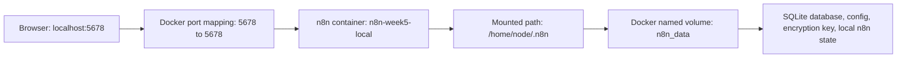
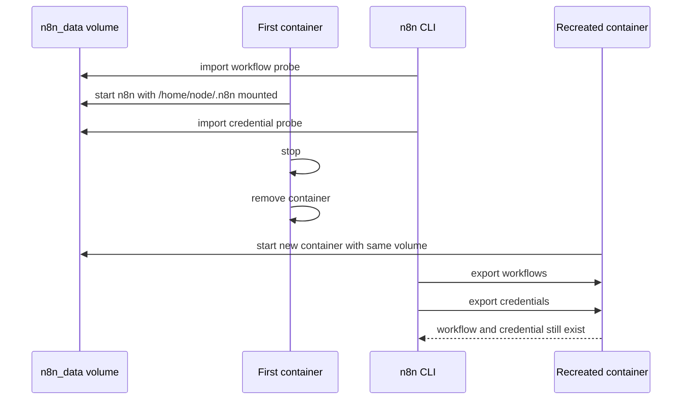
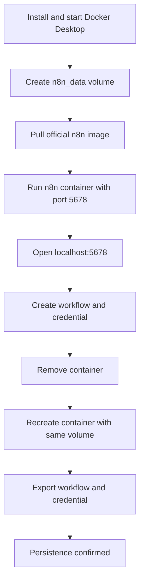

# Week 05｜本機快速啟動：Docker Desktop

> 執行依據：`20 周的執行計劃.md` 的 Week 05。
> 執行日期：2026-05-27。
> 本週目標：回答「如何用最少摩擦在 macOS 或 Windows 上跑起可保存狀態的本機 n8n？」
> 本週狀態：完成。三個交付物已全部產出，並已做 Docker Desktop 真機 persistence 驗證。

## 1. 本週交付物總覽

| 交付物 | 狀態 | 對應章節 | 驗收方式 |
| --- | --- | --- | --- |
| 本機部署紀錄 | 完成 | 第 3 章 | 使用 Docker Desktop、官方 n8n image、`n8n_data` volume 與 `5678:5678` port mapping 啟動 n8n。 |
| container / volume 截圖或文字紀錄 | 完成 | 第 4 章 | 以 `docker ps`、`docker inspect`、`docker volume inspect` 留下文字紀錄。 |
| 重啟後 persistence 驗證 | 完成 | 第 5 章 | 刪除並重建 container 後，workflow 與 credential 仍可由 n8n CLI 匯出。 |
| 本週圖解與排錯流程 | 完成 | 第 6 章 | 能判斷資料是否在 volume，而不是 container writable layer。 |
| 驗收說明 | 完成 | 第 7 章 | 能說明重建 container 後 workflow 與 credential 為什麼仍存在。 |

## 2. 官方來源核對

本週只採用官方文件作為安裝與驗證依據。Docker Desktop 是本機 runtime；n8n 的 workflows、credentials、settings 與 encryption key 需要留在 persistent volume 才能跨 container 重建保存。

| 事實 | 核對結果 | 官方來源 |
| --- | --- | --- |
| n8n 官方 Docker 安裝範例使用 `docker volume create n8n_data`，並把 `n8n_data` 掛到 `/home/node/.n8n`。 | 確認。本週使用同一個 volume name 與 mount path。 | [n8n Docker installation](https://docs.n8n.io/hosting/installation/docker/) |
| n8n 官方 Docker 安裝範例以 `-p 5678:5678` 將本機 port 對到 container port。 | 確認。本週實測 `http://localhost:5678` 回應 `200`。 | [n8n Docker installation](https://docs.n8n.io/hosting/installation/docker/) |
| n8n Server CLI 可在 Docker container 內用 `docker exec` 執行。 | 確認。本週使用 `n8n export:workflow --all` 與 `n8n export:credentials --all` 驗證資料仍存在。 | [n8n Server CLI commands](https://docs.n8n.io/hosting/cli-commands/) |
| n8n Server CLI 支援匯入 workflow 與 credentials。 | 確認。本週使用 `import:workflow` 與 `import:credentials` 建立 persistence probes。 | [n8n Server CLI commands](https://docs.n8n.io/hosting/cli-commands/) |
| Docker volume 的內容存在於單一 container lifecycle 之外；container 被刪除時 writable layer 會被刪掉，但 volume 仍可保留資料。 | 確認。這是本週 persistence 驗證的核心。 | [Docker volumes](https://docs.docker.com/engine/storage/volumes/) |
| `docker volume create [VOLUME]` 會建立可供 container 使用與存放資料的 volume。 | 確認。本週建立 `n8n_data`。 | [docker volume create](https://docs.docker.com/reference/cli/docker/volume/create/) |
| Docker Desktop for Mac 官方文件提供安裝、啟動與系統需求；本機 macOS 使用 Docker Desktop context。 | 確認。本週實測 context 為 `desktop-linux`。 | [Install Docker Desktop on Mac](https://docs.docker.com/desktop/setup/install/mac-install/) |
| Docker Desktop for Windows 官方文件提供 WSL 2 / Hyper-V 安裝模式與啟動方式。 | 確認。Windows 使用者可依同一份 Docker command 模型啟動 n8n。 | [Install Docker Desktop on Windows](https://docs.docker.com/desktop/setup/install/windows-install/) |

## 3. 交付物一：本機部署紀錄

### 3.1 實測環境

| 項目 | 本週實測值 |
| --- | --- |
| 作業系統端 | macOS Docker Desktop |
| Docker context | `desktop-linux` |
| Docker client | `29.2.1` |
| Docker server | `29.2.1` |
| Docker server OS / arch | `linux / arm64` |
| n8n image | `docker.n8n.io/n8nio/n8n:latest` |
| n8n version | `2.22.4` |
| image digest | `docker.n8n.io/n8nio/n8n@sha256:a3ea08b6b923d909b125c7b06273c16679491f07a05857a2dc0df9d9124080db` |
| container name | `n8n-week5-local` |
| volume name | `n8n_data` |
| n8n data mount | `n8n_data:/home/node/.n8n` |
| port mapping | `0.0.0.0:5678->5678/tcp` |
| local URL | `http://localhost:5678` |

### 3.2 實際執行命令

#### 3.2.1 啟動 Docker Desktop

本機一開始 Docker CLI 已安裝，但 Docker Desktop daemon 尚未啟動。已執行：

```bash
open -a Docker
```

確認 daemon 可用：

```bash
docker version --format 'client={{.Client.Version}} server={{.Server.Version}}'
```

實際結果：

```text
client=29.2.1 server=29.2.1
```

#### 3.2.2 建立 persistent volume

```bash
docker volume create n8n_data
```

實際結果：

```text
n8n_data
```

#### 3.2.3 拉取官方 n8n image

```bash
docker pull docker.n8n.io/n8nio/n8n
```

實際結果：

```text
Using default tag: latest
Status: Downloaded newer image for docker.n8n.io/n8nio/n8n:latest
docker.n8n.io/n8nio/n8n:latest
```

#### 3.2.4 匯入 persistence probe workflow

測試 workflow 檔案：

```text
artifacts/week-05-persistence-workflow.json
```

匯入命令：

```bash
docker run --rm --name n8n-week5-import \
  -e GENERIC_TIMEZONE=Asia/Taipei \
  -e TZ=Asia/Taipei \
  -e N8N_ENFORCE_SETTINGS_FILE_PERMISSIONS=true \
  -e N8N_RUNNERS_ENABLED=true \
  -v n8n_data:/home/node/.n8n \
  -v /Users/linshangche/Desktop/projects/nuva-report/artifacts/week-05-persistence-workflow.json:/tmp/week-05-persistence-workflow.json:ro \
  docker.n8n.io/n8nio/n8n \
  import:workflow --input=/tmp/week-05-persistence-workflow.json
```

實際結果：

```text
Importing 1 workflows
Successfully imported 1 workflow.
```

workflow probe 內容摘要：

| 欄位 | 值 |
| --- | --- |
| workflow id | `week05PersistenceProbe` |
| workflow name | `Week 05 Persistence Probe` |
| node 1 | `Manual Trigger` |
| node 2 | `Persistence Marker` |
| marker payload | `week=5`、`persisted=true`、`checkedDate=2026-05-27` |

#### 3.2.5 啟動 n8n container

```bash
docker run -d --name n8n-week5-local \
  -p 5678:5678 \
  -e GENERIC_TIMEZONE=Asia/Taipei \
  -e TZ=Asia/Taipei \
  -e N8N_ENFORCE_SETTINGS_FILE_PERMISSIONS=true \
  -e N8N_RUNNERS_ENABLED=true \
  -v n8n_data:/home/node/.n8n \
  docker.n8n.io/n8nio/n8n
```

首次啟動 container id：

```text
aa3a92326847edea6ff41de72f358a8fc70f59ad1923195f8cae4ec0615310c3
```

HTTP readiness 檢查：

```bash
curl -s -o /dev/null -w '%{http_code}' http://localhost:5678
```

實際結果：

```text
200
```

#### 3.2.6 匯入 persistence probe credential

測試 credential 檔案：

```text
artifacts/week-05-persistence-credential.json
```

credential probe 只使用 dummy data，不包含真實 API key、OAuth token 或客戶資料。

匯入命令：

```bash
docker cp /Users/linshangche/Desktop/projects/nuva-report/artifacts/week-05-persistence-credential.json n8n-week5-local:/tmp/week-05-persistence-credential.json
docker exec n8n-week5-local n8n import:credentials --input=/tmp/week-05-persistence-credential.json
```

實際結果：

```text
Successfully imported 1 credential.
```

credential probe 內容摘要：

| 欄位 | 值 |
| --- | --- |
| credential id | `week05CredentialProbe` |
| credential name | `Week 05 Credential Probe` |
| credential type | `httpBasicAuth` |
| data 性質 | dummy username/password，僅用於 persistence 驗證 |

## 4. 交付物二：Container / Volume 文字紀錄

### 4.1 container 狀態紀錄

重建後目前仍在執行的 container：

```text
CONTAINER ID   NAMES             IMAGE                     STATUS          PORTS
4a1ae7f019d1   n8n-week5-local   docker.n8n.io/n8nio/n8n   Up 13 seconds   0.0.0.0:5678->5678/tcp, [::]:5678->5678/tcp
```

container inspect 摘要：

```text
id=4a1ae7f019d1e4669201c3d91a834bb8a604a2cbbc861ba656cd32a1421c3a84
image=docker.n8n.io/n8nio/n8n
status=running
started=2026-05-27T14:21:05.621583133Z
mounts=n8n_data:/home/node/.n8n:volume
env=GENERIC_TIMEZONE=Asia/Taipei TZ=Asia/Taipei N8N_ENFORCE_SETTINGS_FILE_PERMISSIONS=true N8N_RUNNERS_ENABLED=true
```

### 4.2 volume 狀態紀錄

```text
name=n8n_data driver=local mountpoint=/var/lib/docker/volumes/n8n_data/_data created=2026-05-27T14:17:22Z
```

### 4.3 資料流圖



### 4.4 Container 與 Volume 的責任邊界

| 元件 | 角色 | 被刪除時的影響 | 本週判斷 |
| --- | --- | --- | --- |
| `n8n-week5-local` container | 執行 n8n process、提供 `localhost:5678` UI。 | container writable layer 會消失。 | 可重建。 |
| `n8n_data` volume | 保存 `/home/node/.n8n` 裡的 n8n state。 | 不會因 `docker rm n8n-week5-local` 自動刪除。 | 必須保留。 |
| `docker.n8n.io/n8nio/n8n` image | 提供 n8n runtime。 | 可重新 pull。 | 可替換，但升級前要備份 volume。 |
| `/home/node/.n8n/config` | 保存 auto-generated encryption key。 | 若遺失，credentials 可能無法解密。 | 已在 volume 內。 |
| SQLite database | 保存 workflows、credentials metadata、executions。 | 若 volume 遺失，workflow 與 credential 會消失。 | 已在 volume 內。 |

## 5. 交付物三：重建後 Persistence 驗證

### 5.1 驗證流程

本週使用「刪除並重建 container」作為 persistence 驗證。這符合第 5 週驗收條件中的「重啟 Docker Desktop 或重建 container 後，workflow 與 credential 仍存在」。



### 5.2 重建 container 命令

停止舊 container：

```bash
docker stop n8n-week5-local
```

刪除舊 container：

```bash
docker rm n8n-week5-local
```

用同一個 volume 重建 container：

```bash
docker run -d --name n8n-week5-local \
  -p 5678:5678 \
  -e GENERIC_TIMEZONE=Asia/Taipei \
  -e TZ=Asia/Taipei \
  -e N8N_ENFORCE_SETTINGS_FILE_PERMISSIONS=true \
  -e N8N_RUNNERS_ENABLED=true \
  -v n8n_data:/home/node/.n8n \
  docker.n8n.io/n8nio/n8n
```

重建後 container id：

```text
4a1ae7f019d1e4669201c3d91a834bb8a604a2cbbc861ba656cd32a1421c3a84
```

重建後 HTTP readiness：

```text
http_status=200
container=4a1ae7f019d1 name=n8n-week5-local status=Up 5 seconds ports=0.0.0.0:5678->5678/tcp, [::]:5678->5678/tcp
```

### 5.3 workflow persistence 證據

驗證命令：

```bash
docker exec n8n-week5-local n8n export:workflow --all
```

重建後匯出結果中的關鍵欄位：

```text
id=week05PersistenceProbe
name=Week 05 Persistence Probe
node=Manual Trigger
node=Persistence Marker
persisted=true
checkedDate=2026-05-27
```

判斷：workflow 在 container 刪除並重建後仍存在，通過。

### 5.4 credential persistence 證據

驗證命令：

```bash
docker exec n8n-week5-local n8n export:credentials --all
```

重建後匯出結果中的關鍵欄位：

```text
id=week05CredentialProbe
name=Week 05 Credential Probe
type=httpBasicAuth
data=encrypted payload
```

判斷：credential 在 container 刪除並重建後仍存在，通過。

### 5.5 驗收結論

| 驗收條件 | 實測結果 | 結論 |
| --- | --- | --- |
| Docker Desktop 可用 | daemon 啟動後 `client=29.2.1 server=29.2.1` | 通過 |
| `n8n_data` volume 建立成功 | `docker volume create n8n_data` 回傳 `n8n_data` | 通過 |
| n8n container 可啟動 | `n8n-week5-local` running | 通過 |
| `localhost:5678` 可回應 | HTTP status `200` | 通過 |
| workflow 寫入 persistent storage | `Week 05 Persistence Probe` 可匯出 | 通過 |
| credential 寫入 persistent storage | `Week 05 Credential Probe` 可匯出 | 通過 |
| 重建 container 後 workflow 仍存在 | 重建後 `export:workflow --all` 仍含 `week05PersistenceProbe` | 通過 |
| 重建 container 後 credential 仍存在 | 重建後 `export:credentials --all` 仍含 `week05CredentialProbe` | 通過 |

## 6. 圖解與操作心智模型

### 6.1 最少摩擦路線



### 6.2 正確與錯誤 mount 對照

| 做法 | 命令片段 | 結果 |
| --- | --- | --- |
| 正確 | `-v n8n_data:/home/node/.n8n` | n8n state 寫入 named volume，container 可刪可重建。 |
| 錯誤 | 不掛 volume | n8n state 留在 container writable layer，刪 container 後資料消失。 |
| 錯誤 | `-v n8n_data:/tmp/n8n` | volume 存在，但 n8n 不會把主要 state 寫到正確路徑。 |
| 高風險 | 每次用不同 volume name | 新 container 看不到舊 workflow 與 credential。 |
| 高風險 | 刪除 `n8n_data` | workflows、credentials、config 與 encryption key 會一起消失。 |

### 6.3 第 5 週不可犯錯清單

| 檢查項 | 正確答案 |
| --- | --- |
| volume name | `n8n_data` |
| n8n state path | `/home/node/.n8n` |
| local port mapping | `-p 5678:5678` |
| local URL | `http://localhost:5678` |
| container 可重建嗎 | 可以，只要同一個 volume 還在。 |
| volume 可以隨手 prune 嗎 | 不可以，`docker volume prune` 可能刪掉未使用但仍重要的 n8n volume。 |
| credential persistence 只看 workflow 夠嗎 | 不夠，必須用 `export:credentials --all` 或 UI 確認 credential 仍存在。 |
| 本機 Docker 適合 production public webhook 嗎 | 不適合，本週只驗本機學習與低摩擦啟動。 |

## 7. 驗收條件說明

### 題目

重建 container 後，workflow 與 credential 為什麼仍存在？

### 60 秒標準回答

因為 n8n 的本機狀態沒有留在 container writable layer，而是透過 `-v n8n_data:/home/node/.n8n` 寫進 Docker named volume。Docker 官方文件說明，volume 的內容存在於特定 container lifecycle 之外；container 被刪除時 writable layer 會消失，但 volume 仍保留。n8n 官方 Docker 安裝也把 `n8n_data` 掛到 `/home/node/.n8n`，這個路徑會保存 SQLite database、config、encryption key、workflow、credential metadata 與本機 instance state。本週已刪除並重建 `n8n-week5-local` container，重建後 `n8n export:workflow --all` 仍看到 `Week 05 Persistence Probe`，`n8n export:credentials --all` 仍看到 `Week 05 Credential Probe`，所以 persistence 驗證通過。

### 15 秒版本

資料能留下來，是因為 `n8n_data` 掛到 `/home/node/.n8n`。container 可刪可重建，但同一個 volume 保留了 workflow、credential、SQLite database 與 encryption key。

## 8. 本機部署操作手冊

### 8.1 啟動

```bash
docker start n8n-week5-local
```

### 8.2 停止

```bash
docker stop n8n-week5-local
```

### 8.3 查看狀態

```bash
docker ps --filter name='^/n8n-week5-local$'
```

### 8.4 查看 logs

```bash
docker logs --tail=120 n8n-week5-local
```

### 8.5 匯出 workflows

```bash
docker exec n8n-week5-local n8n export:workflow --all
```

### 8.6 匯出 credentials

```bash
docker exec n8n-week5-local n8n export:credentials --all
```

### 8.7 重建 container

```bash
docker stop n8n-week5-local
docker rm n8n-week5-local
docker run -d --name n8n-week5-local \
  -p 5678:5678 \
  -e GENERIC_TIMEZONE=Asia/Taipei \
  -e TZ=Asia/Taipei \
  -e N8N_ENFORCE_SETTINGS_FILE_PERMISSIONS=true \
  -e N8N_RUNNERS_ENABLED=true \
  -v n8n_data:/home/node/.n8n \
  docker.n8n.io/n8nio/n8n
```

### 8.8 清理測試環境

清理 container：

```bash
docker stop n8n-week5-local
docker rm n8n-week5-local
```

清理 volume：

```bash
docker volume rm n8n_data
```

清理 volume 會刪除本週 n8n 本機資料，包括 workflow、credential、config 與 encryption key。除非已完成備份或確定不再需要本機 n8n state，否則不要執行。

## 9. Week 05 完成檢查

| 檢查項 | 結果 |
| --- | --- |
| 已讀 Week 05 計畫要求 | 通過 |
| 已核對官方 n8n Docker 文件 | 通過 |
| 已核對官方 Docker volume 文件 | 通過 |
| Docker Desktop daemon 已啟動 | 通過 |
| 已建立 `n8n_data` volume | 通過 |
| 已拉取官方 n8n image | 通過 |
| 已啟動 `n8n-week5-local` container | 通過 |
| 已確認 `localhost:5678` 回應 | 通過 |
| 已建立 workflow persistence probe | 通過 |
| 已建立 credential persistence probe | 通過 |
| 已刪除並重建 container | 通過 |
| 已驗證 workflow 重建後仍存在 | 通過 |
| 已驗證 credential 重建後仍存在 | 通過 |
| 未使用真實 API key 或客戶 credential | 通過 |
| 未刪除既有 Supabase containers 或既有 user volumes | 通過 |
| 未提前執行 Week 06 npm 比較或 Week 10 VPS/Caddy 部署 | 通過 |

## 10. 下一週銜接

第 6 週可以進入 `npm` 與單容器路線比較。第 5 週已證明「本機 Docker Desktop + named volume」能低摩擦啟動並保留狀態；第 6 週要回答的是：如果不用 Docker，改用 `npm` 或直接跑單一 runtime，安裝、升級、資料保存、rollback、隔離性與可移植性會差在哪裡。
