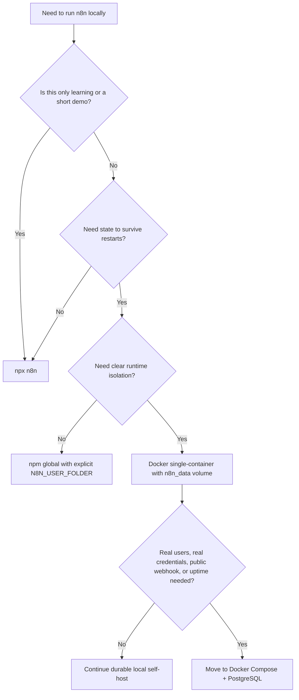

# Week 06｜npm 與單容器路線比較

> 執行依據：`20 周的執行計劃.md` 的 Week 06。
> 執行日期：2026-05-27。
> 本週目標：回答「npm 為什麼快，但 Docker 為什麼通常更適合長期 self-host？」
> 本週狀態：完成。三個交付物已全部產出，並已做 npm/npx 實機啟動驗證。

## 1. 本週交付物總覽

| 交付物 | 狀態 | 對應章節 | 驗收方式 |
| --- | --- | --- | --- |
| npm vs Docker 比較表 | 完成 | 第 4 章 | 能從啟動速度、Node.js 版本、全域依賴、升級、rollback、隔離性、資料保存與 production 風險比較。 |
| 本機啟動命令筆記 | 完成 | 第 5 章 | 實際執行 `npx --yes n8n --version` 與 `npx --yes n8n start`，並避開第 5 週 Docker port。 |
| 不適合 production 的原因清單 | 完成 | 第 6 章 | 能說明 npm quick start 何時應停止作為長期方案。 |
| 路線決策圖 | 完成 | 第 7 章 | 能從 local learning、durable local self-host、team/production 三種狀態選路線。 |
| 驗收說明 | 完成 | 第 8 章 | 能同時說明 npm quick start 的價值與停止使用它的時機。 |

## 2. 官方來源核對

本週只採用官方文件作為事實基礎。npm 路線不是錯；它的價值是快。真正要分清楚的是：快啟動不等於長期可維運。

| 事實 | 核對結果 | 官方來源 |
| --- | --- | --- |
| n8n npm 安裝頁說明 npm 是在本機快速開始 n8n 的方式，且需要 Node.js。 | 確認。本週本機 Node.js 為 `v24.13.1`。 | [n8n npm installation](https://docs.n8n.io/hosting/installation/npm/) |
| n8n npm 安裝頁要求 Node.js 版本介於 `20.19` 到 `24.x`，含兩端。 | 確認。本週本機 `v24.13.1` 符合要求。 | [n8n npm installation](https://docs.n8n.io/hosting/installation/npm/) |
| n8n 可用 `npx n8n` 不安裝到 global 直接試跑。 | 確認。本週使用 `npx --yes n8n --version` 與 `npx --yes n8n start` 實測。 | [n8n npm installation](https://docs.n8n.io/hosting/installation/npm/) |
| n8n 可用 `npm install n8n -g` 安裝到 global，啟動命令是 `n8n` 或 `n8n start`。 | 確認。本週保留為命令筆記，未污染 global install。 | [n8n npm installation](https://docs.n8n.io/hosting/installation/npm/) |
| n8n npm 更新可用 `npm update -g n8n`，也可用 `npm install -g n8n@next` 安裝 next。 | 確認。這同時代表 npm 路線的升級責任落在本機 npm/global package 管理上。 | [n8n npm installation](https://docs.n8n.io/hosting/installation/npm/) |
| n8n tunnel 文件明確標示 tunnel 用於 local development/testing，不安全於 production。 | 確認。npm quick start 若要 public webhook，常會自然走到 tunnel，因此 production 界線要特別清楚。 | [n8n npm installation](https://docs.n8n.io/hosting/installation/npm/) |
| npx 可以從 local 或 remote npm package 執行 command；缺少 package 時會裝到 npm cache 並加到 PATH。 | 確認。本週第一次 npx 執行下載了 n8n package 並出現 npm dependency warnings。 | [npm npx command](https://docs.npmjs.com/cli/v11/commands/npx/) |
| n8n Docker 安裝頁建議 Docker 用於多數 self-host 需求，因為它提供乾淨、隔離的環境並降低 OS/tooling incompatibility。 | 確認。這是 Docker single-container 勝過 npm 長期路線的核心。 | [n8n Docker installation](https://docs.n8n.io/hosting/installation/docker/) |
| n8n Docker 安裝頁使用 `n8n_data:/home/node/.n8n` 保存資料。 | 確認。第 5 週已真機驗證重建 container 後 workflow 與 credential 仍存在。 | [n8n Docker installation](https://docs.n8n.io/hosting/installation/docker/) |
| Docker volume 是 Docker 管理的 persistent data store。 | 確認。Docker single-container 以 named volume 取得比 npm user folder 更清楚的資料邊界。 | [Docker volumes](https://docs.docker.com/engine/storage/volumes/) |
| `N8N_USER_FOLDER` 可指定 n8n 建立 `.n8n` 的路徑，該目錄保存 database file 與 encryption key 等 user-specific data。 | 確認。本週使用獨立 user folder 實測後移除，避免把 encryption key 留在 repo。 | [n8n deployment environment variables](https://docs.n8n.io/hosting/configuration/environment-variables/deployment/) |
| n8n 預設使用 SQLite，也支援 PostgreSQL。 | 確認。第 6 週先比較 npm 與 single-container；第 7 週再進入 Docker Compose + PostgreSQL。 | [n8n database environment variables](https://docs.n8n.io/hosting/configuration/environment-variables/database/) |

## 3. 實測環境與結果

### 3.1 本機 runtime

| 項目 | 實測值 |
| --- | --- |
| Node.js | `v24.13.1` |
| npm | `11.8.0` |
| npx | `11.8.0` |
| npx n8n version | `2.22.4` |
| npm/npx 測試 port | `5686` |
| npm/npx 測試 URL | `http://localhost:5686` |
| npm/npx readiness | HTTP status `200` |
| npm/npx 測試 user folder | `artifacts/week-06-npm-user-folder` |
| npm/npx 測試 user folder 狀態 | 測試後已刪除，只保留去敏紀錄 |
| 去敏紀錄 | `artifacts/week-06-npm-launch-record.json` |

### 3.2 第 5 週 Docker baseline

| 項目 | 實測值 |
| --- | --- |
| Docker container | `n8n-week5-local` |
| Docker n8n version | `2.22.4` |
| Docker image | `docker.n8n.io/n8nio/n8n:latest` |
| Docker volume | `n8n_data` |
| Docker mount | `n8n_data:/home/node/.n8n` |
| Docker port | `0.0.0.0:5678->5678/tcp` |
| Docker persistence | 第 5 週已驗證 workflow 與 credential 重建 container 後仍存在 |

### 3.3 npm/npx 實測觀察

| 觀察 | 結果 | 判讀 |
| --- | --- | --- |
| `npx --yes n8n --version` | 回傳 `2.22.4` | npm quick start 能快速取得 n8n。 |
| 首次 npx 下載 | 出現多個 `ERESOLVE overriding peer dependency` warning | npm 路線直接暴露在本機 npm dependency resolution 中。 |
| 首次 npx 下載 | 出現多個 deprecated package warning | npm quick start 不等於「無維運成本」。 |
| `npx --yes n8n start` | 啟動成功，editor 可由 `http://localhost:5686` 存取 | 本機快速試跑通過。 |
| runtime user folder | 產生 `.n8n/config`、`database.sqlite`、WAL/SHM、event log、nodes package file | npm route 的 state 會落在 user folder，不是 Docker volume。 |
| n8n runtime warning | `N8N_RUNNERS_ENABLED` 在 `2.22.4` 已提示不再需要 | 實際版本與文件範例可能有時間差，production 應以當前版本 release notes 與 logs 校正。 |
| test cleanup | 已停止 port `5686` npx process，並刪除測試 user folder | 避免臨時 encryption key 與 SQLite state 留在 repo。 |

## 4. 交付物一：npm vs Docker 比較表

### 4.1 總表

| 比較面向 | npm / npx quick start | npm global install | Docker single-container | 判斷 |
| --- | --- | --- | --- | --- |
| 啟動速度 | 最快，`npx n8n` 可直接下載並跑。 | 快，但要先 global install。 | 中等，要有 Docker Desktop 或 Docker Engine。 | 學習與臨時 demo：npm/npx 勝。 |
| 本機污染 | 主要污染 npm cache；若不指定 `N8N_USER_FOLDER`，會寫到使用者 `.n8n`。 | 污染 global npm package space，升級也在 global。 | 狀態集中在 Docker volume，runtime 在 container。 | 長期管理：Docker 勝。 |
| Node.js 版本 | 依賴本機 Node.js，必須符合 n8n 支援範圍。 | 同左。 | image 內已封裝 runtime，不依賴 host Node.js。 | 版本隔離：Docker 勝。 |
| npm dependency warnings | 可能直接看到 peer/deprecated warnings。 | 同左，且 global 更容易累積歷史狀態。 | 使用 image 交付，host 不直接解 npm dependency tree。 | 降低本機 dependency friction：Docker 勝。 |
| 升級方式 | 下次 npx 可能抓新 package；可用版本 spec 固定。 | `npm update -g n8n` 或 `npm install -g n8n@version`。 | `docker pull` image，重建 container 並沿用 volume。 | 可重建性與 rollback：Docker 較清楚。 |
| rollback | 需指定舊 npm version，且 database migration 仍要小心。 | 同左。 | 可改用舊 image tag，但 database migration 仍要搭配備份與 release notes。 | 兩者都要備份；Docker 的 runtime 回退較明確。 |
| 資料保存 | 取決於 `N8N_USER_FOLDER` 或 default user `.n8n`。 | 同左。 | `n8n_data:/home/node/.n8n` 很明確。 | persistence 邊界：Docker 勝。 |
| encryption key | 存在 user folder 的 `.n8n/config`。 | 同左。 | 存在 volume 的 `/home/node/.n8n/config`。 | 兩者都要備份；Docker 更容易制度化。 |
| public URL / webhook | 常搭配 tunnel 做 local testing，但不該當 production。 | 同左。 | 可接 reverse proxy、fixed domain、TLS，但 single-container 仍不是完整 production 架構。 | public self-host：Docker 起步較合理。 |
| process supervision | 手動 terminal process，終端關掉就停。 | 仍需 PM2/systemd/launchd 等額外配置。 | Docker restart policy / Compose / orchestrator 更自然。 | 長期運行：Docker 勝。 |
| port 管理 | 直接占 host port，容易與其他本機服務衝突。 | 同左。 | port mapping 明確，例如 `5678:5678`。 | 可讀性：Docker 稍勝。 |
| team 可移植性 | 每個人本機 Node/npm 狀態可能不同。 | 同左，global install 更不一致。 | image、env、volume、compose file 可文件化。 | 團隊一致性：Docker 勝。 |
| 適合場景 | 快速學習、CLI 測試、短期 demo、探索 nodes。 | 個人長期本機開發但仍不建議 production。 | 本機 durable self-host、低摩擦保存狀態、進入 Compose 前的穩定過渡。 | npm 是入口，Docker 是更好的長期起點。 |

### 4.2 一句話判斷

| 路線 | 一句話 |
| --- | --- |
| `npx n8n` | 最快看到 n8n UI，但最不像 production。 |
| `npm install -g n8n` | 比 npx 固定一點，但仍受 host Node/npm/global state 影響。 |
| Docker single-container | 還不是完整 production，但已把 runtime、port、volume 與重建流程整理成可維運的形狀。 |
| Docker Compose + PostgreSQL | 第 7 週目標，開始把 database、service definition、backup 與升級流程制度化。 |

## 5. 交付物二：本機啟動命令筆記

### 5.1 npm/npx route：本週實測命令

本週沒有直接使用 default `~/.n8n`，而是指定獨立 `N8N_USER_FOLDER`，避免污染使用者真正的 n8n state。因第 5 週 Docker container 已占用 `5678`，本週 npm/npx route 使用 `5686`。

#### 5.1.1 檢查本機 Node/npm/npx

```bash
node --version
npm --version
npx --version
```

實測結果：

```text
v24.13.1
11.8.0
11.8.0
```

#### 5.1.2 檢查 npx 可取得的 n8n 版本

```bash
N8N_USER_FOLDER=/Users/linshangche/Desktop/projects/nuva-report/artifacts/week-06-npm-user-folder \
N8N_PORT=5686 \
GENERIC_TIMEZONE=Asia/Taipei \
TZ=Asia/Taipei \
N8N_ENFORCE_SETTINGS_FILE_PERMISSIONS=true \
N8N_RUNNERS_ENABLED=true \
npx --yes n8n --version
```

實測結果：

```text
2.22.4
```

#### 5.1.3 用 npx 短暫啟動 n8n

```bash
N8N_USER_FOLDER=/Users/linshangche/Desktop/projects/nuva-report/artifacts/week-06-npm-user-folder \
N8N_PORT=5686 \
GENERIC_TIMEZONE=Asia/Taipei \
TZ=Asia/Taipei \
N8N_ENFORCE_SETTINGS_FILE_PERMISSIONS=true \
N8N_RUNNERS_ENABLED=true \
npx --yes n8n start
```

實測關鍵 log：

```text
No encryption key found - Auto-generating and saving to: /Users/linshangche/Desktop/projects/nuva-report/artifacts/week-06-npm-user-folder/.n8n/config
n8n ready on ::, port 5686
Version: 2.22.4
Editor is now accessible via:
http://localhost:5686
```

HTTP readiness：

```bash
curl -s -o /dev/null -w 'npm_http_status=%{http_code}\n' http://localhost:5686
```

實測結果：

```text
npm_http_status=200
```

#### 5.1.4 npm/npx route 產生的 state

本週實測時，指定 user folder 內出現：

```text
.n8n/config
.n8n/database.sqlite
.n8n/database.sqlite-shm
.n8n/database.sqlite-wal
.n8n/n8nEventLog.log
.n8n/nodes/package.json
```

這些檔案說明 npm route 不是「無狀態」。只要 n8n 啟動，就會建立 user-specific state。`.n8n/config` 包含 encryption key，`database.sqlite` 保存本機 instance database。測試後已刪除該 user folder，只留下去敏的 `artifacts/week-06-npm-launch-record.json`。

### 5.2 npm global route：命令筆記

本週未執行 global install，原因是它會改變使用者全域 npm 狀態；但依官方文件，正確命令如下。

安裝 latest：

```bash
npm install n8n -g
```

安裝指定版本：

```bash
npm install -g n8n@2.22.4
```

啟動：

```bash
n8n
n8n start
```

更新：

```bash
npm update -g n8n
```

安裝 next：

```bash
npm install -g n8n@next
```

global route 比 npx 更固定，但它仍依賴 host Node.js、global npm package space、使用者資料夾、process manager 與本機 OS。長期 self-host 不能只靠「global install 成功」判定可維運。

### 5.3 Docker single-container route：第 5 週 baseline 命令

```bash
docker volume create n8n_data
docker run -d --name n8n-week5-local \
  -p 5678:5678 \
  -e GENERIC_TIMEZONE=Asia/Taipei \
  -e TZ=Asia/Taipei \
  -e N8N_ENFORCE_SETTINGS_FILE_PERMISSIONS=true \
  -e N8N_RUNNERS_ENABLED=true \
  -v n8n_data:/home/node/.n8n \
  docker.n8n.io/n8nio/n8n
```

第 5 週已驗證：刪除並重建 container 後，`Week 05 Persistence Probe` workflow 與 `Week 05 Credential Probe` credential 仍存在。這是 Docker single-container 比 npm quick start 更適合長期 self-host 的核心證據。

## 6. 交付物三：不適合 production 的原因清單

### 6.1 npm quick start 何時有價值

| 情境 | 為什麼 npm/npx 合理 |
| --- | --- |
| 第一次看 n8n UI | `npx n8n` 可以最快進入 editor。 |
| 本機短期 demo | 不需要先寫 Docker/Compose 文件。 |
| CLI command 試驗 | 可以快速跑 `n8n --version` 或其他 CLI command。 |
| 個人探索 nodes | 適合短時間確認功能概念。 |
| 教學現場 | 只要學員已有符合版本的 Node.js，就能快速進入操作。 |

### 6.2 何時停止把 npm 當長期方案

| 停止訊號 | 原因 | 建議下一步 |
| --- | --- | --- |
| 開始放真實 credentials | encryption key、SQLite、credential state 要有明確備份與 restore discipline。 | 轉 Docker single-container，然後規劃 Compose + PostgreSQL。 |
| 需要穩定 public webhook | npm 本機 process 加 tunnel 只適合 development/testing。 | 轉固定 domain、reverse proxy、TLS。 |
| 需要 OAuth callback | random local/tunnel URL 會破壞 callback 穩定性。 | 用穩定 public URL 與正式 reverse proxy。 |
| 需要 uptime | terminal process、sleep、logout、OS reboot 都可能停服務。 | Docker restart policy、Compose 或 systemd。 |
| 多人共用 instance | host global npm state 不適合當團隊一致環境。 | 用 image tag、env file、Compose 文件化。 |
| 要做可預期升級 | npm update 與 host dependency tree 會讓升級責任分散。 | image pinning、backup、staging、rollback procedure。 |
| 要做 rollback | npm rollback 還要面對 database migration，不只是降 package。 | 先備份 DB/user folder，再按 release notes 回退。 |
| 要處理大量 executions | SQLite 與本機 user folder 對長期 execution growth 不理想。 | 進入 PostgreSQL 與 pruning 策略。 |
| 要裝 community nodes | npm route 會加重 host package 與 supply-chain 管理責任。 | 容器化、鎖版本、審查來源。 |
| 需要監控與告警 | npm process 本身不提供 production supervision。 | Docker/Compose + logs/metrics/health check。 |

### 6.3 npm quick start 不是 production 的核心原因

1. 它依賴 host Node.js 版本；n8n 支援範圍會隨版本變動。
2. 它依賴 host npm/npx dependency resolution；本週實測出現 peer dependency 與 deprecated package warnings。
3. 它的 state 預設落在使用者 `.n8n`，如果沒有明確設定 `N8N_USER_FOLDER`，很容易混在個人環境裡。
4. 它沒有自然的 container boundary；Node runtime、package cache、global npm package 與 process 都在 host。
5. 它沒有自然的 port mapping 文件；port 衝突常被當成 n8n 問題，但其實是 host process 管理問題。
6. 它沒有自然的 restart policy；terminal 關閉、登出、睡眠或 reboot 都會中斷服務。
7. 它不自然支援固定 public URL、TLS termination、reverse proxy、headers 與 webhook/OAuth production flow。
8. 它不自然支援 image pinning；production 更需要明確知道目前 runtime 從哪個 artifact 啟動。
9. 它不自然支援 team handoff；另一台機器的 Node/npm/global state 可能完全不同。
10. 它容易讓人誤判「能打開 UI」等於「能長期維運」。

## 7. 路線決策圖

### 7.1 何時用哪條路線



### 7.2 npm 與 Docker 的 state map

```mermaid
flowchart LR
    subgraph NPM[npm/npx route]
      A[npx or global n8n package] --> B[host Node.js]
      B --> C[N8N_USER_FOLDER/.n8n]
      C --> D[config, SQLite, logs, nodes]
    end

    subgraph DOCKER[Docker single-container route]
      E[docker image] --> F[n8n container]
      F --> G[n8n_data volume]
      G --> H[/home/node/.n8n: config, SQLite, logs, nodes]
    end
```

### 7.3 升級與 rollback 心智模型

| 路線 | 升級動作 | 回退動作 | 風險 |
| --- | --- | --- | --- |
| npx | 下次執行可能解析到新 package，或用 `npx n8n@version` 固定。 | 改指定舊 version。 | package 可回退不代表 database migration 可安全回退。 |
| npm global | `npm update -g n8n` 或 `npm install -g n8n@version`。 | `npm install -g n8n@olderVersion`。 | global npm state、host Node.js、migration 都要一起考慮。 |
| Docker single-container | `docker pull` 新 image，stop/rm/run 新 container，沿用 volume。 | 使用舊 image tag 重建 container。 | volume 內 database 若已 migrate，仍需 backup/restore 或官方 revert 流程。 |
| Compose + PostgreSQL | 更新 compose image tag，配合 DB backup。 | 回退 compose tag 與 DB backup/restore。 | 較重，但最接近可制度化維運。 |

## 8. 驗收條件說明

### 題目

npm quick start 的價值是什麼？何時該停止使用它當長期方案？

### 60 秒標準回答

npm quick start 的價值是「最快看到 n8n 跑起來」。如果本機 Node.js 符合 n8n 支援版本，`npx n8n` 可以不用 global install 就下載並啟動 n8n；`npm install n8n -g` 則可以把 n8n 裝到 global 後用 `n8n` 或 `n8n start` 啟動。它非常適合第一次學習、短期 demo、CLI 試驗與個人探索。但一旦開始保存真實 workflow、credentials、OAuth callback、public webhook 或需要 uptime，就應停止把 npm 當長期方案。原因是 npm route 依賴 host Node.js、npm cache、global package 或 user folder；資料會落在 `.n8n`，包含 database 與 encryption key；process supervision、backup、public URL、TLS、rollback 與 team handoff 都不自然。長期 self-host 應先轉 Docker single-container，讓 runtime、port 與 volume 邊界清楚；再於第 7 週進入 Docker Compose + PostgreSQL。

### 15 秒版本

`npx n8n` 很適合快速學習；但只要有真實 credentials、public webhook、OAuth、uptime、升級回退或團隊使用，就該停止把 npm 當長期方案，改走 Docker，下一步是 Compose + PostgreSQL。

## 9. Week 06 完成檢查

| 檢查項 | 結果 |
| --- | --- |
| 已讀 Week 06 計畫要求 | 通過 |
| 已核對 n8n npm 官方文件 | 通過 |
| 已核對 n8n Docker 官方文件 | 通過 |
| 已核對 npm npx 官方文件 | 通過 |
| 已核對 Docker volume 官方文件 | 通過 |
| 已核對 `N8N_USER_FOLDER` 官方說明 | 通過 |
| 已確認本機 Node.js 版本 | 通過，`v24.13.1` |
| 已確認本機 npm/npx 版本 | 通過，`11.8.0` |
| 已執行 `npx --yes n8n --version` | 通過，回傳 `2.22.4` |
| 已短暫啟動 npm/npx n8n | 通過，`http://localhost:5686` 回應 `200` |
| 已停止 npm/npx 測試 process | 通過 |
| 已移除 npm/npx 測試 user folder | 通過 |
| 已保留去敏啟動紀錄 | 通過，`artifacts/week-06-npm-launch-record.json` |
| 已完成 npm vs Docker 比較表 | 通過 |
| 已完成本機啟動命令筆記 | 通過 |
| 已完成不適合 production 的原因清單 | 通過 |
| 未污染 global npm install | 通過 |
| 未破壞第 5 週 Docker `n8n_data` volume | 通過 |
| 未提前執行 Week 07 Docker Compose + PostgreSQL | 通過 |

## 10. 下一週銜接

第 7 週要進入 Docker Compose + PostgreSQL。第 6 週的結論是：npm/npx 是最好的「第一眼看到 UI」路線；Docker single-container 是更穩的本機 self-host 路線；但只要開始需要 production-like reliability，就不能停在 SQLite + single container，下一步要把 database 與 service definition 拆清楚，讓 backup、restore、upgrade 與 rollback 進入可維運狀態。
