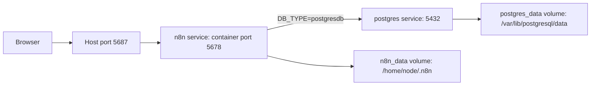
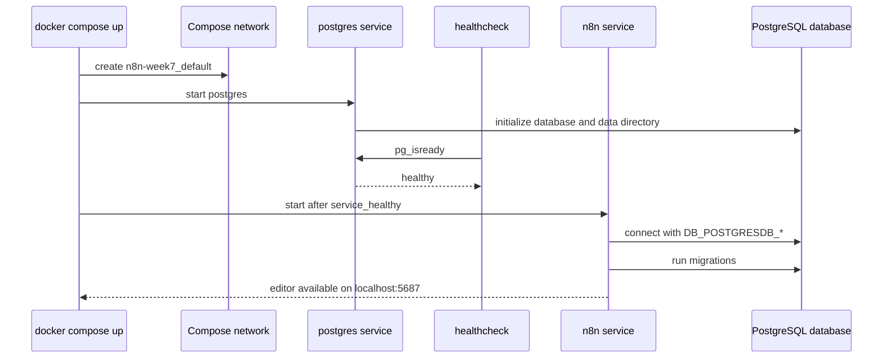

# Week 07｜Docker Compose + PostgreSQL

> 執行依據：`20 周的執行計劃.md` 的 Week 07。
> 執行日期：2026-05-27。
> 本週目標：回答「如何把單一 container 升級成 production-shaped local stack？」
> 本週狀態：完成。三個交付物已全部產出，並已做 Docker Compose + PostgreSQL 實機啟動驗證。

## 1. 本週交付物總覽

| 交付物 | 狀態 | 對應章節 | 驗收方式 |
| --- | --- | --- | --- |
| Compose 架構解說 | 完成 | 第 4 章 | 能逐行說明 `services`、`postgres`、`n8n`、`depends_on`、`volumes`、`ports`、`environment` 的用途。 |
| env vars 對照表 | 完成 | 第 5 章 | 能說明 `DB_TYPE=postgresdb`、`DB_POSTGRESDB_*`、`N8N_ENCRYPTION_KEY` 與 Postgres `POSTGRES_*` 的用途。 |
| PostgreSQL-backed n8n 啟動紀錄 | 完成 | 第 6 章 | Compose stack 成功啟動，n8n 走 `5687`，PostgreSQL healthy，n8n tables 與 workflow probe 寫入 PostgreSQL。 |
| production-shaped local stack 判斷 | 完成 | 第 7 章 | 能說明為什麼它比單容器更接近 production，也能說明它尚未是完整 production。 |
| 驗收說明 | 完成 | 第 8 章 | 能逐行解釋 Compose 檔中的 n8n、postgres、volumes、environment。 |

## 2. 官方來源核對

本週只採用官方文件作為事實基礎。Compose 的價值不是「多開幾個容器」，而是把服務、網路、volume、啟動順序與環境變數寫成可重建的描述。

| 事實 | 核對結果 | 官方來源 |
| --- | --- | --- |
| Docker Compose 用單一 YAML 定義並啟動 multi-container application。 | 確認。本週用 `compose.yaml` 管理 `n8n` 與 `postgres` 兩個 service。 | [Docker Compose](https://docs.docker.com/compose/) |
| Compose service 的 `environment` 可以用 map 或 array 設定 container environment variables。 | 確認。本週採 map syntax，避免布林與字串混淆。 | [Compose services: environment](https://docs.docker.com/reference/compose-file/services/#environment) |
| Compose 的 top-level `volumes` 可宣告 named volumes；`docker compose up` 會建立缺少的 volume。 | 確認。本週建立 `n8n-week7_postgres_data` 與 `n8n-week7_n8n_data`。 | [Compose volumes](https://docs.docker.com/reference/compose-file/volumes/) |
| Compose 的 `depends_on` 可表達 service dependency；本週使用 health condition 讓 n8n 等 PostgreSQL healthy 後再啟動。 | 確認。`n8n` service 依賴 `postgres: service_healthy`。 | [Compose services](https://docs.docker.com/reference/compose-file/services/) |
| n8n 預設使用 SQLite，也支援 PostgreSQL。 | 確認。本週明確設定 `DB_TYPE=postgresdb`。 | [n8n database environment variables](https://docs.n8n.io/hosting/configuration/environment-variables/database/) |
| n8n PostgreSQL 設定包含 `DB_POSTGRESDB_DATABASE`、`DB_POSTGRESDB_HOST`、`DB_POSTGRESDB_PORT`、`DB_POSTGRESDB_USER`、`DB_POSTGRESDB_PASSWORD`、`DB_POSTGRESDB_SCHEMA` 等。 | 確認。本週使用 database、host、port、user、password；schema 採預設 `public`。 | [n8n database environment variables](https://docs.n8n.io/hosting/configuration/environment-variables/database/) |
| n8n `N8N_ENCRYPTION_KEY` 可提供自訂 key，用於加密 database 中的 credentials；預設是首次啟動隨機產生。 | 確認。本週固定 local-only test key，避免重建 n8n user folder 時 credential key 漂移。 | [n8n deployment environment variables](https://docs.n8n.io/hosting/configuration/environment-variables/deployment/) |
| n8n 官方 Docker Compose setup 文件提供 Compose 路線，並提醒 self-hosting 需要 server、security、configuration 等知識。 | 確認。本週只是 production-shaped local stack，不宣稱已達完整 production。 | [n8n Docker Compose setup](https://docs.n8n.io/hosting/installation/server-setups/docker-compose/) |
| Postgres Official Image 使用 `POSTGRES_PASSWORD` 設定 superuser password，並可用 `POSTGRES_USER`、`POSTGRES_DB` 指定使用者與初始 database。 | 確認。本週 Postgres service 使用 `POSTGRES_DB=n8n_week7`、`POSTGRES_USER=n8n_week7`、`POSTGRES_PASSWORD` local test value。 | [Postgres Official Image](https://hub.docker.com/_/postgres/) |

## 3. 實測環境與結果

### 3.1 實測檔案

| 檔案 | 用途 |
| --- | --- |
| `artifacts/week-07-compose/compose.yaml` | 第 7 週 Docker Compose stack 定義。 |
| `artifacts/week-07-compose/.env` | 第 7 週 local-only environment values。 |
| `artifacts/week-07-compose/week-07-postgres-workflow.json` | 用來驗證 n8n workflow 會寫入 PostgreSQL 的 dummy workflow。 |
| `artifacts/week-07-compose/week-07-marker.sql` | PostgreSQL 狀態檢查 SQL。 |
| `artifacts/week-07-compose/week-07-launch-record.json` | 去敏後的第 7 週啟動與驗證紀錄。 |

### 3.2 Docker Compose stack

| 項目 | 實測值 |
| --- | --- |
| Docker Compose version | `v5.1.0` |
| Compose project | `n8n-week7` |
| n8n service | `n8n-week7-n8n-1` |
| n8n image | `docker.n8n.io/n8nio/n8n:2.22.4` |
| n8n version | `2.22.4` |
| n8n host URL | `http://localhost:5687` |
| n8n HTTP readiness | `200` |
| Postgres service | `n8n-week7-postgres-1` |
| Postgres image | `postgres:16-alpine` |
| Postgres status | `running` |
| Postgres health | `healthy` |
| Postgres host exposure | 未發布到 host，只在 Compose network 內提供 `5432` |
| n8n data volume | `n8n-week7_n8n_data:/home/node/.n8n` |
| PostgreSQL data volume | `n8n-week7_postgres_data:/var/lib/postgresql/data` |

### 3.3 PostgreSQL-backed 證據

PostgreSQL 狀態查詢：

```text
database_name | database_user | public_table_count
n8n_week7     | n8n_week7     | 93
```

關鍵 n8n tables：

```text
credentials_entity
execution_entity
migrations
workflow_entity
```

workflow probe 查詢：

```text
id                   | name                      | active
week07PostgresProbe  | Week 07 PostgreSQL Probe  | f
```

n8n service restart 後再次驗證：

```text
http_status_after_restart=200
workflow_count=1
migration_count=184
```

結論：n8n 並不是只啟動 UI，而是以 `DB_TYPE=postgresdb` 連到 Compose network 內的 `postgres` service，完成 migration，建立 PostgreSQL tables，並能將 workflow 寫入 PostgreSQL。

## 4. 交付物一：Compose 架構解說

### 4.1 Compose 檔完整內容

```yaml
name: n8n-week7

services:
  postgres:
    image: postgres:16-alpine
    restart: unless-stopped
    environment:
      POSTGRES_DB: ${POSTGRES_DB}
      POSTGRES_USER: ${POSTGRES_USER}
      POSTGRES_PASSWORD: ${POSTGRES_PASSWORD}
    healthcheck:
      test: ["CMD-SHELL", "pg_isready -U $$POSTGRES_USER -d $$POSTGRES_DB"]
      interval: 5s
      timeout: 5s
      retries: 20
    volumes:
      - postgres_data:/var/lib/postgresql/data

  n8n:
    image: docker.n8n.io/n8nio/n8n:2.22.4
    restart: unless-stopped
    depends_on:
      postgres:
        condition: service_healthy
    ports:
      - "5687:5678"
    environment:
      DB_TYPE: postgresdb
      DB_POSTGRESDB_HOST: postgres
      DB_POSTGRESDB_PORT: 5432
      DB_POSTGRESDB_DATABASE: ${POSTGRES_DB}
      DB_POSTGRESDB_USER: ${POSTGRES_USER}
      DB_POSTGRESDB_PASSWORD: ${POSTGRES_PASSWORD}
      N8N_ENCRYPTION_KEY: ${N8N_ENCRYPTION_KEY}
      N8N_HOST: ${N8N_HOST}
      N8N_PORT: ${N8N_PORT}
      N8N_PROTOCOL: ${N8N_PROTOCOL}
      GENERIC_TIMEZONE: ${GENERIC_TIMEZONE}
      TZ: ${TZ}
      N8N_ENFORCE_SETTINGS_FILE_PERMISSIONS: "true"
    volumes:
      - n8n_data:/home/node/.n8n

volumes:
  postgres_data:
  n8n_data:
```

### 4.2 逐行說明

| 行或區塊 | 用途 | 本週判斷 |
| --- | --- | --- |
| `name: n8n-week7` | 固定 Compose project name。 | 讓 containers、network、volumes 都以 `n8n-week7` 命名，避免和第 5 週 `n8n-week5-local` 混淆。 |
| `services:` | 宣告這個 stack 由哪些 container services 組成。 | 本週有 `postgres` 與 `n8n` 兩個 service。 |
| `postgres:` | 定義 PostgreSQL database service。 | 讓 database 從 n8n container 分離出來。 |
| `image: postgres:16-alpine` | 使用官方 Postgres image。 | local stack 使用輕量 Alpine 版本；真 production 要評估版本、備份與升級策略。 |
| `restart: unless-stopped` | Docker daemon 重啟後，除非曾手動停止，否則嘗試重啟 service。 | 比手動 npm process 更接近長期運行。 |
| `POSTGRES_DB` | 初始化 database name。 | 本週為 `n8n_week7`。 |
| `POSTGRES_USER` | 初始化 database user。 | 本週為 `n8n_week7`。 |
| `POSTGRES_PASSWORD` | 初始化 database user password。 | 本週使用 local-only test value，不可重用於 production。 |
| `healthcheck:` | 定義 Postgres 健康檢查。 | n8n 可等待 database ready 後再啟動。 |
| `pg_isready -U $$POSTGRES_USER -d $$POSTGRES_DB` | 用 Postgres 工具確認 database 可接受連線。 | `$$` 讓 Compose 保留 `$` 給 container shell 展開。 |
| `interval: 5s` | 每 5 秒檢查一次。 | local 驗證足夠快。 |
| `timeout: 5s` | 每次檢查最多等 5 秒。 | 避免健康檢查卡太久。 |
| `retries: 20` | 最多重試 20 次。 | 給首次 database init 足夠時間。 |
| `postgres_data:/var/lib/postgresql/data` | 把 Postgres data directory 放到 named volume。 | database 不會因 container 重建消失。 |
| `n8n:` | 定義 n8n application service。 | 這是 workflow editor 與 execution runtime。 |
| `image: docker.n8n.io/n8nio/n8n:2.22.4` | 使用 pin 版 n8n image。 | 比 floating `latest` 更可追蹤。 |
| `depends_on: postgres: condition: service_healthy` | n8n 等 Postgres healthy 後才啟動。 | 降低 n8n 啟動時 database 尚未 ready 的失敗機率。 |
| `ports: "5687:5678"` | host `5687` 對 container `5678`。 | 避開第 5 週 `5678`，本週 editor URL 是 `http://localhost:5687`。 |
| `DB_TYPE: postgresdb` | 告訴 n8n 使用 PostgreSQL。 | 第 7 週核心設定。 |
| `DB_POSTGRESDB_HOST: postgres` | n8n 用 Compose service name 連 database。 | 在 Compose network 裡，service name 可作 internal hostname。 |
| `DB_POSTGRESDB_PORT: 5432` | PostgreSQL container internal port。 | 不需要 publish 到 host。 |
| `DB_POSTGRESDB_DATABASE` | n8n 要連的 database name。 | 與 `POSTGRES_DB` 對齊。 |
| `DB_POSTGRESDB_USER` | n8n 要使用的 database user。 | 與 `POSTGRES_USER` 對齊。 |
| `DB_POSTGRESDB_PASSWORD` | n8n 連 PostgreSQL 的 password。 | 與 `POSTGRES_PASSWORD` 對齊。 |
| `N8N_ENCRYPTION_KEY` | 固定 n8n credential encryption key。 | 避免 credentials 因 key 漂移而無法解密。 |
| `N8N_HOST` | n8n 自身 host 設定。 | 本週 local 為 `localhost`。 |
| `N8N_PORT` | n8n container 內部 port。 | 本週保持 `5678`，host port mapping 才是 `5687`。 |
| `N8N_PROTOCOL` | n8n protocol 設定。 | 本週 local 為 `http`；production public edge 應使用 HTTPS。 |
| `GENERIC_TIMEZONE` | n8n schedule-oriented nodes 使用的 timezone。 | 本週使用 `Asia/Taipei`。 |
| `TZ` | container OS timezone。 | 本週使用 `Asia/Taipei`。 |
| `N8N_ENFORCE_SETTINGS_FILE_PERMISSIONS: "true"` | 強制 n8n config file 權限更安全。 | 保留官方 Docker 安裝精神。 |
| `n8n_data:/home/node/.n8n` | 保存 n8n user folder。 | 即使用 PostgreSQL，仍要保存 config、encryption key 相關 local state。 |
| top-level `volumes:` | 宣告 Compose-managed named volumes。 | Compose 會建立並管理 `n8n-week7_postgres_data` 與 `n8n-week7_n8n_data`。 |

### 4.3 架構圖



### 4.4 啟動順序圖



## 5. 交付物二：env vars 對照表

### 5.1 `.env` 檔內容

```dotenv
POSTGRES_DB=n8n_week7
POSTGRES_USER=n8n_week7
POSTGRES_PASSWORD=week7_local_postgres_password_do_not_reuse
N8N_ENCRYPTION_KEY=week7_fixed_local_encryption_key_2026_05_27_do_not_reuse
N8N_HOST=localhost
N8N_PORT=5678
N8N_PROTOCOL=http
GENERIC_TIMEZONE=Asia/Taipei
TZ=Asia/Taipei
```

這是 local-only test `.env`。其中 `POSTGRES_PASSWORD` 與 `N8N_ENCRYPTION_KEY` 是第 7 週驗證用固定值，不可重用在 production。

### 5.2 Postgres 初始化變數

| 變數 | 設定值 | 給誰用 | 用途 | 錯誤後果 |
| --- | --- | --- | --- | --- |
| `POSTGRES_DB` | `n8n_week7` | `postgres` service | 初始化 database name。 | n8n 連到不存在的 database，或連到錯誤 database。 |
| `POSTGRES_USER` | `n8n_week7` | `postgres` service | 初始化 database user。 | n8n 使用者不存在，連線失敗。 |
| `POSTGRES_PASSWORD` | local-only test value | `postgres` service | 初始化 user password。 | password 不一致時 n8n 無法連 DB。 |

### 5.3 n8n database 變數

| 變數 | 設定值 | 給誰用 | 用途 | 錯誤後果 |
| --- | --- | --- | --- | --- |
| `DB_TYPE` | `postgresdb` | `n8n` service | 讓 n8n 使用 PostgreSQL，不使用預設 SQLite。 | 忘記時 n8n 可能回到 SQLite。 |
| `DB_POSTGRESDB_HOST` | `postgres` | `n8n` service | Compose network 內的 Postgres service hostname。 | 寫 `localhost` 會指向 n8n container 自己，不是 Postgres container。 |
| `DB_POSTGRESDB_PORT` | `5432` | `n8n` service | Postgres internal port。 | port 錯誤會 connection refused 或 timeout。 |
| `DB_POSTGRESDB_DATABASE` | `${POSTGRES_DB}` | `n8n` service | n8n 要連的 database。 | database name 不一致時連線或 migration 失敗。 |
| `DB_POSTGRESDB_USER` | `${POSTGRES_USER}` | `n8n` service | n8n 要使用的 database user。 | user 不一致時 authentication failed。 |
| `DB_POSTGRESDB_PASSWORD` | `${POSTGRES_PASSWORD}` | `n8n` service | n8n 連 DB 的 password。 | password 不一致時 authentication failed。 |

### 5.4 n8n runtime 變數

| 變數 | 設定值 | 用途 | 第 7 週判斷 |
| --- | --- | --- | --- |
| `N8N_ENCRYPTION_KEY` | fixed local-only test value | 加密 database 中的 credentials。 | 必須固定，不能靠首次啟動隨機 key。 |
| `N8N_HOST` | `localhost` | n8n host 設定。 | local stack 合理；public self-host 時要改成正式 domain。 |
| `N8N_PORT` | `5678` | n8n container 內部 port。 | 不等於 host port；host port 是 `5687`。 |
| `N8N_PROTOCOL` | `http` | n8n protocol。 | local stack 合理；production public edge 應改成 HTTPS。 |
| `GENERIC_TIMEZONE` | `Asia/Taipei` | n8n schedule-oriented nodes timezone。 | 保持工作流排程符合台北時間。 |
| `TZ` | `Asia/Taipei` | container OS timezone。 | 讓 container 內系統時間行為一致。 |
| `N8N_ENFORCE_SETTINGS_FILE_PERMISSIONS` | `"true"` | 強制 config file 權限。 | 使用字串避免 YAML boolean 解析歧義。 |

## 6. 交付物三：PostgreSQL-backed n8n 啟動紀錄

### 6.1 Compose config 解析

執行：

```bash
docker compose --env-file artifacts/week-07-compose/.env -f artifacts/week-07-compose/compose.yaml config
```

確認項目：

| 項目 | 結果 |
| --- | --- |
| project name | `n8n-week7` |
| n8n image | `docker.n8n.io/n8nio/n8n:2.22.4` |
| Postgres image | `postgres:16-alpine` |
| n8n port mapping | host `5687` to container `5678` |
| n8n database host | `postgres` |
| top-level volumes | `n8n_data`、`postgres_data` |
| depends_on | `postgres: service_healthy` |

### 6.2 啟動 stack

執行：

```bash
docker compose --env-file artifacts/week-07-compose/.env -f artifacts/week-07-compose/compose.yaml up -d
```

實測結果摘要：

```text
Network n8n-week7_default Created
Volume n8n-week7_n8n_data Created
Volume n8n-week7_postgres_data Created
Container n8n-week7-postgres-1 Healthy
Container n8n-week7-n8n-1 Started
```

### 6.3 服務狀態

```text
NAME                   IMAGE                            SERVICE    STATUS
n8n-week7-n8n-1        docker.n8n.io/n8nio/n8n:2.22.4   n8n        Up
n8n-week7-postgres-1   postgres:16-alpine               postgres   Up healthy
```

n8n readiness：

```text
http_status=200
```

restart 後 readiness：

```text
http_status_after_restart=200
```

### 6.4 n8n log 重點

```text
Version: 2.22.4
Building workflow dependency index
Finished building workflow dependency index
Editor is now accessible via:
http://localhost:5678
```

log 裡 editor 顯示的是 container 內部 n8n port `5678`；從 host 瀏覽器要開的是 Compose port mapping 後的 `http://localhost:5687`。

### 6.5 PostgreSQL 查詢

database 與 table count：

```sql
select
  current_database() as database_name,
  current_user as database_user,
  count(*) filter (where schemaname = 'public') as public_table_count
from pg_tables;
```

結果：

```text
database_name=n8n_week7
database_user=n8n_week7
public_table_count=93
```

必要 tables：

```sql
select tablename
from pg_tables
where schemaname='public'
  and tablename in ('workflow_entity','credentials_entity','execution_entity','migrations')
order by tablename;
```

結果：

```text
credentials_entity
execution_entity
migrations
workflow_entity
```

### 6.6 workflow probe 寫入 PostgreSQL

匯入命令：

```bash
docker cp artifacts/week-07-compose/week-07-postgres-workflow.json n8n-week7-n8n-1:/tmp/week-07-postgres-workflow.json
docker compose --env-file artifacts/week-07-compose/.env -f artifacts/week-07-compose/compose.yaml exec -T n8n n8n import:workflow --input=/tmp/week-07-postgres-workflow.json
```

匯入結果：

```text
Importing 1 workflows
Successfully imported 1 workflow.
```

PostgreSQL 查詢：

```sql
select id, name, active
from workflow_entity
where id='week07PostgresProbe';
```

結果：

```text
week07PostgresProbe | Week 07 PostgreSQL Probe | f
```

restart n8n 後：

```text
workflow_count=1
```

這證明 workflow state 寫入 PostgreSQL，而不是留在 n8n container layer。

## 7. production-shaped local stack 判斷

### 7.1 比單一 container 更像 production 的原因

| 改善點 | 單容器 Docker | Compose + PostgreSQL |
| --- | --- | --- |
| database | 通常預設 SQLite。 | PostgreSQL 獨立 service。 |
| service boundary | n8n process 與 local DB state 容易綁在同一 user folder。 | n8n 與 database 分 service。 |
| startup order | 手動啟動單 container。 | `depends_on` + healthcheck。 |
| state boundary | `n8n_data` 保存 `.n8n`。 | `n8n_data` 保存 n8n local state，`postgres_data` 保存 DB state。 |
| network | 單 container 對外 port。 | n8n 與 postgres 走 internal Compose network。 |
| DB host | 不需要 DB host。 | n8n 用 service name `postgres` 連 DB。 |
| image control | 可 pin，也常被寫成 latest。 | 本週 pin `docker.n8n.io/n8nio/n8n:2.22.4`。 |
| migration visibility | SQLite file 內部狀態較不直覺。 | 可用 `psql` 查 `migrations` 與 n8n tables。 |
| production 過渡 | 離正式架構較遠。 | 可延伸 reverse proxy、TLS、backup、monitoring。 |

### 7.2 仍不是完整 production 的原因

| 缺口 | 為什麼還不夠 |
| --- | --- |
| TLS | 本週仍是 local HTTP。 |
| Reverse proxy | 尚未接 Caddy/Nginx/Traefik。 |
| Public URL | 尚未有穩定 domain 與 `WEBHOOK_URL`。 |
| Secrets management | `.env` 仍是 local file，production 應改用 secrets manager 或至少權限嚴格控管。 |
| Backups | 尚未做 `pg_dump`、volume backup、restore drill。 |
| Monitoring | 尚未做 health alerts、log retention、metrics。 |
| Upgrade staging | 尚未做 staging stack 與 release notes 驗證。 |
| External task runners | n8n log 提醒 Python task runner internal mode 不建議 production。 |
| Resource limits | 尚未設定 CPU/memory limits。 |
| Access control | 尚未完成正式使用者、SSO、network policy 或 firewall。 |

## 8. 驗收條件說明

### 題目

能逐行說明 Compose 檔裡 n8n、postgres、volumes、environment 的用途。

### 60 秒標準回答

這份 Compose 檔用 `name: n8n-week7` 固定 project name，避免和其他 Docker 資源混在一起。`services.postgres` 使用 `postgres:16-alpine`，透過 `POSTGRES_DB`、`POSTGRES_USER`、`POSTGRES_PASSWORD` 初始化 `n8n_week7` database 與 user，並把 `/var/lib/postgresql/data` 掛到 `postgres_data` named volume，確保 DB state 不因 container 重建消失。`healthcheck` 用 `pg_isready` 確認 PostgreSQL healthy。`services.n8n` 使用 `docker.n8n.io/n8nio/n8n:2.22.4`，透過 `depends_on.postgres.condition=service_healthy` 等 database ready 後再啟動，`ports` 將 host `5687` 對到 container `5678`。n8n 的 `environment` 裡最重要的是 `DB_TYPE=postgresdb` 與 `DB_POSTGRESDB_HOST=postgres`，這讓 n8n 透過 Compose network 連 PostgreSQL，而不是用 SQLite；`DB_POSTGRESDB_DATABASE`、`USER`、`PASSWORD` 要和 Postgres 初始化變數一致。`N8N_ENCRYPTION_KEY` 必須固定，因為 credentials 需要同一把 key 才能解密。`volumes.n8n_data:/home/node/.n8n` 保存 n8n local state，top-level `volumes` 讓 Compose 建立並管理 `postgres_data` 與 `n8n_data`。

### 15 秒版本

`postgres` service 保存 PostgreSQL data，`n8n` service 用 `DB_TYPE=postgresdb` 與 `DB_POSTGRESDB_HOST=postgres` 連它；`depends_on` 等 DB healthy；`postgres_data` 存 DB，`n8n_data` 存 n8n user folder；`N8N_ENCRYPTION_KEY` 固定 credential 加密 key。

## 9. Week 07 完成檢查

| 檢查項 | 結果 |
| --- | --- |
| 已讀 Week 07 計畫要求 | 通過 |
| 已核對 Docker Compose 官方文件 | 通過 |
| 已核對 Compose services / environment / volumes 官方文件 | 通過 |
| 已核對 n8n PostgreSQL environment variables | 通過 |
| 已核對 `N8N_ENCRYPTION_KEY` 官方說明 | 通過 |
| 已核對 Postgres Official Image environment variables | 通過 |
| 已建立 `artifacts/week-07-compose/compose.yaml` | 通過 |
| 已建立 `artifacts/week-07-compose/.env` | 通過 |
| 已固定 `N8N_ENCRYPTION_KEY` | 通過 |
| 已設定 `DB_TYPE=postgresdb` | 通過 |
| 已設定 `DB_POSTGRESDB_*` | 通過 |
| 已使用 `depends_on` 與 Postgres healthcheck | 通過 |
| 已建立 Postgres named volume | 通過 |
| 已建立 n8n named volume | 通過 |
| 已啟動 PostgreSQL-backed n8n | 通過 |
| 已確認 `http://localhost:5687` 回應 | 通過 |
| 已確認 PostgreSQL 有 n8n tables | 通過 |
| 已匯入 workflow probe 並查到 PostgreSQL row | 通過 |
| 已重啟 n8n service 後確認 workflow 仍存在 | 通過 |
| 未影響第 5 週 `n8n-week5-local` container | 通過 |
| 未提前執行 Week 08 tunnel 與穩定網域 | 通過 |

## 10. 下一週銜接

第 8 週要處理本機公開、tunnel 與穩定網域。第 7 週已把 n8n 從單容器升級為 Compose + PostgreSQL local stack；第 8 週的重點不是再換 database，而是讓外部服務能穩定呼叫這個 stack，並處理 tunnel URL、`WEBHOOK_URL`、OAuth callback 與 public URL 穩定性。
