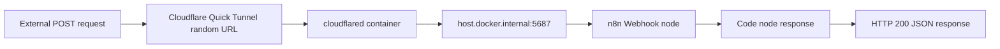
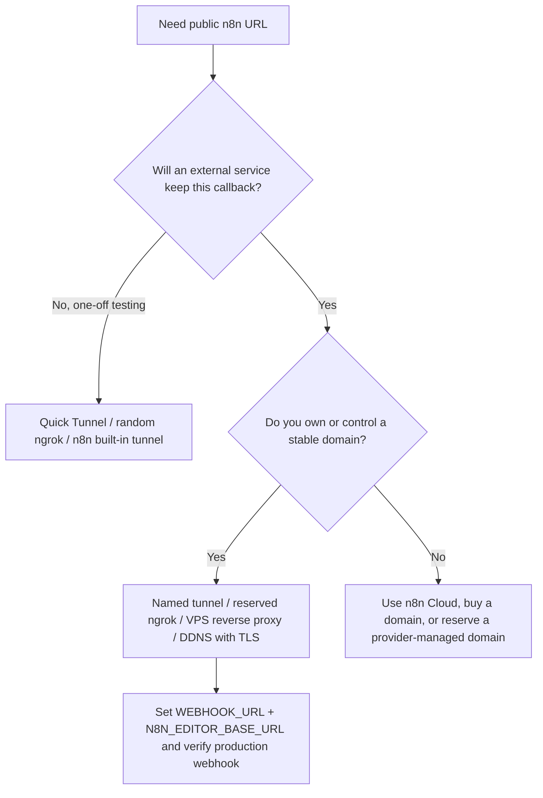

# Week 08｜本機公開：Tunnel 與穩定網域

> 執行日期：2026-05-27
> 目標：讓外部服務真的碰到本機 n8n，同時明確切開 learning-only tunnel 與 production-ready public URL。
> 實作結果：完成 Cloudflare Quick Tunnel 公開 POST webhook 測試，HTTP 200，測試完成後已取消發布 workflow、移除 live container 的臨時公開 URL、停止 quick tunnel。

## 1. 本週交付物總覽

| 交付物 | 狀態 | 檔案 |
| --- | --- | --- |
| tunnel comparison table | 完成 | 本文件第 4 節 |
| public webhook 測試紀錄 | 完成 | `artifacts/week-08-tunnel/week-08-public-webhook-record.json` |
| learning-only vs production-ready 判斷表 | 完成 | 本文件第 6 節 |
| n8n public URL override | 完成 | `artifacts/week-08-tunnel/compose.public-url.override.yaml` |
| webhook workflow artifact | 完成 | `artifacts/week-08-tunnel/week-08-public-webhook-workflow.json` |
| Week 08 驗證腳本 | 完成 | `scripts/verify-week-eight.mjs` |



本週真正驗證的不是「可以開一個公開網址」而已，而是完整驗證 public URL 會進入 production webhook。n8n 的 production webhook 需要 workflow 被發布；用 CLI 發布或取消發布後，需要重啟 n8n 讓變更生效。測試完成後已把臨時 URL 從 live n8n 移除，避免未來誤把 random tunnel URL 當成長期 callback。

## 2. 官方來源核對

| 主題 | 官方來源 | 本週採用的判斷 |
| --- | --- | --- |
| Webhook 測試與 production webhook | https://docs.n8n.io/integrations/builtin/core-nodes/n8n-nodes-base.webhook/workflow-development/ | Test URL 只適合建置與調試；Production URL 需要 workflow 已保存並發布。 |
| `WEBHOOK_URL` 與 reverse proxy | https://docs.n8n.io/hosting/configuration/configuration-examples/webhook-url/ | n8n 在 proxy 後面時，要用 `WEBHOOK_URL` 讓 editor 與外部服務看到正確公開 URL。 |
| deployment env vars | https://docs.n8n.io/hosting/configuration/environment-variables/deployment/ | 本週使用 `WEBHOOK_URL`、`N8N_EDITOR_BASE_URL`、`N8N_PROXY_HOPS`；計劃書的 `EDITOR_BASE_URL` 在 n8n 實際變數名稱是 `N8N_EDITOR_BASE_URL`。 |
| n8n built-in tunnel | https://docs.n8n.io/hosting/installation/docker/ | n8n built-in tunnel 是 local development/testing convenience，不是 production 安全做法。 |
| Cloudflare Quick Tunnel | https://developers.cloudflare.com/cloudflare-one/networks/connectors/cloudflare-tunnel/do-more-with-tunnels/trycloudflare/ | Quick Tunnel 會產生 random `trycloudflare.com` subdomain，適合測試與開發，不適合 production。 |
| Cloudflare named tunnel / routing | https://developers.cloudflare.com/tunnel/routing/ | production 需要把穩定 hostname 映射到 tunnel service，通常搭配 Cloudflare DNS CNAME 或 tunnel route dns。 |
| ngrok domains | https://ngrok.com/docs/universal-gateway/domains | ngrok 可用 managed/custom domain；random domain 適合臨時分享，reserved/custom domain 才比較適合 callback。 |
| Tailscale Funnel | https://tailscale.com/docs/features/tailscale-funnel | Tailscale Funnel 可把 tailnet 內本機服務公開到 broader internet；適合 controlled sharing，但仍要看 beta、policy 與 domain 穩定性。 |
| DDNS | https://developers.cloudflare.com/dns/manage-dns-records/how-to/managing-dynamic-ip-addresses/ | DDNS 是把動態 IP 更新到 DNS 的方法，仍需要 TLS、reverse proxy、firewall 與 ISP port 條件。 |

## 3. 實測環境與結果

| 項目 | 實測值 |
| --- | --- |
| 本機 n8n stack | Week 07 Compose stack：`n8n-week7` |
| n8n URL | `http://localhost:5687` |
| n8n image | `docker.n8n.io/n8nio/n8n:2.22.4` |
| database | PostgreSQL 16 Alpine，DB `n8n_week7` |
| quick tunnel image | `cloudflare/cloudflared:latest` |
| cloudflared version | `2026.5.2` |
| quick tunnel public URL | `https://gif-decent-pharmacies-eligibility.trycloudflare.com` |
| temporary `WEBHOOK_URL` | `https://gif-decent-pharmacies-eligibility.trycloudflare.com` |
| temporary `N8N_EDITOR_BASE_URL` | `https://gif-decent-pharmacies-eligibility.trycloudflare.com` |
| temporary `N8N_PROXY_HOPS` | `1` |
| workflow ID | `week08PublicWebhookProbe` |
| production webhook path | `/webhook/week-08-public-post` |
| POST result | HTTP 200 |
| cleanup result | workflow 已取消發布；n8n 已重啟回 local-only；quick tunnel 已停止 |

本週採取「短時間公開、完成測試、立刻收回」的方式。這讓我們可以證明 public webhook pipeline 成立，同時不留下長時間公開的本機 editor 或 webhook。

## 4. 交付物一：tunnel comparison table

| 路線 | 網域穩定性 | 設定複雜度 | 優點 | 主要風險 | 建議定位 |
| --- | --- | --- | --- | --- | --- |
| n8n built-in tunnel | 通常是臨時或版本實作相關 | 低 | 與 n8n local dev 整合，快速測試 trigger webhook | 官方明確定位 local development/testing；production 安全性與穩定性不足 | learning-only |
| Cloudflare Quick Tunnel | random `trycloudflare.com` | 低 | 不需 Cloudflare account 或 DNS，能快速驗證外部 POST | random URL 無 uptime 保證，不適合 OAuth callback 或長期 webhook | learning-only |
| Cloudflare named tunnel | 自有穩定 hostname | 中 | 不需開 inbound port，可配 DNS、Access、WAF、DDoS protection | 需管理 Cloudflare account、DNS、tunnel lifecycle 與 access policy | production-ready candidate |
| ngrok random domain | random domain | 低 | 開發者體驗好，適合短期分享與 webhook debug | random URL 會變，外部 service callback 容易失效 | learning-only |
| ngrok reserved/custom domain | reserved ngrok domain 或自有 domain | 中 | 穩定 callback、TLS 與 inspection tooling 友善 | 依方案、流量、domain ownership 與帳號設定 | production-ready candidate |
| Tailscale Funnel | tailnet DNS name，公開到 internet | 中 | 對既有 Tailscale 使用者很方便，可用 policy 控制誰能建立 Funnel | 公開面要小心權限；Funnel 狀態、beta 屬性與 DNS propagation 需納入 runbook | controlled sharing / selective production |
| DDNS + reverse proxy | 自有 domain 或 subdomain | 中到高 | 可用家用或小型辦公室動態 IP，成本低 | ISP CGNAT、port blocking、TLS renew、router/firewall、IP 更新延遲都會影響可靠性 | lab / small self-host candidate |

### 決策圖



## 5. 交付物二：public webhook 測試紀錄

| 步驟 | 執行結果 |
| --- | --- |
| 1. 匯入 workflow | `week08PublicWebhookProbe` 成功匯入 PostgreSQL-backed n8n。 |
| 2. 發布 workflow | `n8n publish:workflow --id=week08PublicWebhookProbe` 成功，並重啟 n8n 讓 production webhook 生效。 |
| 3. 啟動 quick tunnel | `cloudflared tunnel --url http://host.docker.internal:5687` 產生 `https://gif-decent-pharmacies-eligibility.trycloudflare.com`。 |
| 4. 注入公開 URL | Compose override 設定 `WEBHOOK_URL`、`N8N_EDITOR_BASE_URL`、`N8N_PROXY_HOPS=1`。 |
| 5. 外部 POST | `POST https://gif-decent-pharmacies-eligibility.trycloudflare.com/webhook/week-08-public-post` 回 HTTP 200。 |
| 6. 回應確認 | n8n 回傳 `ok=true`、`week=8`、`receivedSource=week08-external-post`、`forwardedProto=https`。 |
| 7. 清理 | `unpublish:workflow` 後重啟 n8n，移除 TryCloudflare env，停止 cloudflared container。 |

實際回應摘要：

```json
{
  "ok": true,
  "week": 8,
  "probe": "public-webhook",
  "tunnel": "cloudflare-quick-tunnel",
  "receivedSource": "week08-external-post",
  "receivedWeek": 8,
  "publicHost": "gif-decent-pharmacies-eligibility.trycloudflare.com",
  "forwardedProto": "https",
  "checkedDate": "2026-05-27"
}
```

## 6. 交付物三：learning-only vs production-ready 判斷表

| 判斷項 | learning-only 可以接受 | production-ready 必須具備 | Week 08 實測結論 |
| --- | --- | --- | --- |
| URL 穩定性 | random URL 可接受 | stable hostname、可長期持有、可被外部服務固定設定 | Quick Tunnel 是 random URL，因此只屬 learning-only。 |
| OAuth callback | 不接 OAuth，或只做短期 sandbox | provider callback URL 固定、HTTPS、domain ownership 清楚 | random tunnel URL 不可作正式 OAuth callback。 |
| Webhook lifetime | 單次測試，測完就關 | webhook URL 長期不變，並有監控與重試策略 | 本週測完立刻停止 tunnel。 |
| TLS | provider 自動給臨時 HTTPS 即可 | TLS renew、proxy headers、secure cookie、domain policy 都要有 runbook | Quick Tunnel 可驗證 HTTPS path，但不等於 production TLS ownership。 |
| n8n env | 臨時注入 `WEBHOOK_URL` | env 持久化、版本控管、secret 管理、restart 流程可重複 | 本週 override 留作學習 artifact，live stack 已還原 local-only。 |
| access control | 本機短期測試 | editor 不應裸露；需 SSO、2FA、IP/access policy 或 Cloudflare Access | Quick Tunnel 不應長時間公開 editor。 |
| operational ownership | 手動可接受 | backup、restore、logging、incident response、update cadence | 第 14 週後才進入正式維運 runbook。 |

## 7. random tunnel URL 風險說明

random tunnel URL 對 OAuth callback 與長期 webhook 的風險有三層。

第一層是 URL 會變。OAuth provider 通常要求 callback URL 事先登錄，random tunnel 一旦重開就換網址，callback mismatch 會讓授權流程失敗。就算今天能登入，明天重啟 tunnel 也可能失效。

第二層是 external service 會記住舊網址。Slack、GitHub、Stripe、Line、Meta 或任何 webhook provider 一旦保存舊 URL，新 URL 不會自動同步。random tunnel 對「一次打通」很方便，對「下週還要穩定收事件」不可靠。

第三層是 ownership 與 incident response 不清楚。production URL 應該能回答誰擁有 domain、誰能改 DNS、TLS 如何續期、proxy headers 是否正確、editor 是否受保護、出事時如何切回。random `trycloudflare.com` URL 不能承擔這些責任。

結論：random tunnel URL 對 OAuth callback 與長期 webhook 的風險不是小瑕疵，而是 architecture mismatch。Week 08 只能把它標記為 learning-only；production-ready 必須換成 named tunnel、reserved/custom domain、VPS reverse proxy、DDNS with TLS-aware reverse proxy，或 n8n Cloud 這類穩定入口。

## 8. Week 08 完成檢查

| 檢查項 | 結果 |
| --- | --- |
| 已比較 n8n built-in tunnel、Cloudflare Quick Tunnel、Cloudflare named tunnel、ngrok、Tailscale Funnel、DDNS | 通過 |
| 已設定並驗證 `WEBHOOK_URL`、`N8N_EDITOR_BASE_URL`、`N8N_PROXY_HOPS` | 通過 |
| 已完成外部 POST production webhook 測試 | 通過 |
| 已記錄 public webhook 測試紀錄 | 通過 |
| 已指出 random tunnel URL 對 OAuth callback 與長期 webhook 的風險 | 通過 |
| 已避免把 quick tunnel 留在 live production-like 狀態 | 通過 |

本週驗收條件已完成：可以明確說明 random tunnel URL 不適合 OAuth callback 與長期 webhook，並能用實測紀錄證明 production webhook pipeline 成功。

## 9. 下一週銜接

Week 09 會進入 n8n Cloud 與最低維運路線。第 8 週留下的核心判斷是：如果團隊不想管理 public URL、TLS、DB、backup 與 patch cadence，n8n Cloud 是合理的低維運起點；如果要 self-host，就不能只看「能不能公開」，還要把 stable URL、資料保存、安全與操作責任一起納入。
