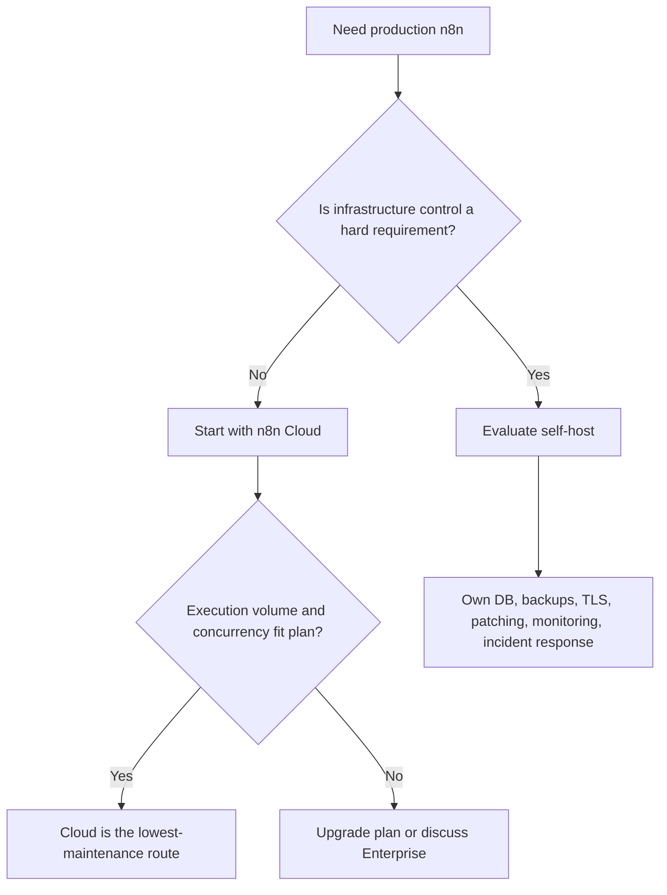
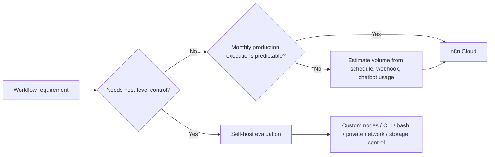

# Week 09｜n8n Cloud 與最低維運路線

> 執行日期：2026-05-27
> 目標：回答「什麼情況下最好的部署就是不要 self-host？」
> 本週結論：beginner 或非工程團隊預設應先選 n8n Cloud，除非已經有明確的 custom nodes、CLI、bash、host-level control、特殊資料治理或高階 scaling 需求。

## 1. 本週交付物總覽

| 交付物 | 狀態 | 檔案 |
| --- | --- | --- |
| Cloud 適用情境卡 | 完成 | 本文件第 3 節；`artifacts/week-09-cloud/week-09-cloud-fit-matrix.json` |
| execution volume 估算表 | 完成 | 本文件第 4 節；`artifacts/week-09-cloud/week-09-execution-volume-estimator.csv` |
| Cloud vs self-host 責任分界 | 完成 | 本文件第 5 節 |
| beginner / 非工程團隊建議 | 完成 | 本文件第 7 節 |
| Week 09 驗證腳本 | 完成 | `scripts/verify-week-nine.mjs` |

第 8 週證明本機可以透過 tunnel 收公開 webhook，但也證明 random tunnel 不該承擔 production callback。第 9 週把問題往前推一步：如果團隊真正需要的是穩定 public URL、低維運、可預估費用與快速上線，那最好的部署可能不是 VPS，也不是 Compose，而是 n8n Cloud。

## 2. 官方來源核對

| 主題 | 官方來源 | 本週採用的判斷 |
| --- | --- | --- |
| n8n Cloud / pricing snapshot | https://n8n.io/pricing/ | 官方 pricing page 顯示 Cloud Starter / Pro / Enterprise 的 executions、concurrency、saved executions、retention、projects、users 與部分功能差異；本文件數字是 2026-05-27 查核快照。 |
| execution quota | https://docs.n8n.io/workflows/executions/ | paid plan 的 quota 只計 production executions；manual executions 不計入 quota。 |
| Cloud data management | https://docs.n8n.io/manage-cloud/cloud-data-management/ | Cloud 仍有 memory、storage、execution data retention 與 pruning 限制；heavy workflow 需要降低保存資料與切批。 |
| Cloud concurrency | https://docs.n8n.io/manage-cloud/concurrency/ | Cloud 依 plan 限制 concurrent production executions；超過限制會排隊，且 regular mode 的 concurrency 是 instance-level。 |
| Cloud version update | https://docs.n8n.io/hosting/updating/cloud/ | Cloud 仍需要 owner 管理版本選擇；n8n 建議至少每月更新，且長期不更新會進入自動更新節奏。 |
| Cloud workflow export | https://docs.n8n.io/manage-cloud/download-workflows/ | Cloud instance owner 可從最新 backup 下載 workflows；trial 結束後有 90 天下載窗口。 |
| Projects / RBAC | https://docs.n8n.io/user-management/rbac/projects/ | n8n 用 projects 管理 workflows 與 credentials，並按角色控制權限；不同 plan 的 projects/roles 數量不同。 |

## 3. 交付物一：Cloud 適用情境卡

| 情境 | 建議 | 為什麼 |
| --- | --- | --- |
| beginner、創辦人、行銷或營運團隊要把 webhook 與 schedule workflow 放上正式環境 | Cloud first | 不需要自行管理 DNS、TLS、reverse proxy、PostgreSQL、volume、encryption key、OS patch、Docker image update。 |
| 小團隊有多個 production workflows，但沒有特殊 runtime 控制需求 | Cloud with plan review | 用 execution volume 和 concurrency 選 Starter、Pro 或 Enterprise，比一開始維運 VPS 更少摩擦。 |
| 團隊需要穩定 public URL 與 OAuth callback，但沒有 DevOps 能量 | Cloud first | Cloud 的 hosted URL 比本機 random tunnel 更適合長期 callback。 |
| 工作流程以 SaaS API、webhook、schedule、HTTP Request、Google Sheets、Slack、Notion、CRM 等常見節點為主 | Cloud first | 這些通常不需要主機層權限，讓團隊把精力放在 workflow correctness。 |
| 工作流程需要 custom nodes、CLI、bash scripts、host-level packages、私有網段直連、特殊 file system、特殊 binary storage | Self-host candidate | 這些需求不是單純 workflow 問題，而是 runtime / infrastructure control 問題。 |
| 工作流程長時間處理大型檔案、AI 批次、上萬列資料、影音或大量 binary data | Cloud only with proof | Cloud 有 memory 與 storage guardrails；先切批與降低 execution data saving，仍不夠才 self-host 或 Enterprise。 |

### Cloud-first 判斷圖

## 4. 交付物二：execution volume 估算表

執行量估算的核心規則很簡單：production execution 是 workflow 自動被 trigger、schedule、polling 或 webhook 啟動的一次完整執行。manual testing 不計入 paid execution quota，但仍會吃 instance memory。

| 工作負載 | trigger 型態 | 估算公式 | 月執行量 | 對 Cloud 的含義 |
| --- | --- | --- | ---: | --- |
| Daily CRM cleanup | schedule | `1 run/day * 31 days` | 31 | Starter 友善，主要看 credential 與錯誤通知。 |
| Hourly support digest | schedule | `24 runs/day * 31 days` | 744 | Starter 友善，但 7 天 execution retention 可能只夠短期 debug。 |
| Every 5 minute monitor | schedule | `12 runs/hour * 24 hours/day * 31 days` | 8,928 | 接近或超過 Pro 起點；要看 peak concurrency。 |
| Lead intake webhook | webhook | `80 events/day * 31 days` | 2,480 | 幾乎吃滿 Starter baseline，launch 前要留 buffer。 |
| Payment event webhook | webhook | `500 events/day * 31 days` | 15,500 | Pro 或 Enterprise candidate；burst concurrency 比平均值更重要。 |
| Support chatbot | chatbot | `120 conversations/week * 8 messages/conversation * 4.345 weeks/month` | 4,172 | 通常 Pro candidate；還要另估 AI provider 成本。 |
| AI document processing | webhook | `50 documents/day * 31 days` | 1,550 | execution 數不高，但 binary data 與 memory 可能先成為瓶頸。 |
| Manual workflow testing | manual | manual testing during development | 0 | 不計 quota，但大型 manual run 仍會消耗 memory。 |

### 估算公式

| 類型 | 公式 |
| --- | --- |
| schedule | `每次排程觸發 = 1 production execution`；每月量等於觸發次數。 |
| webhook | `外部事件數 = production executions`；每天事件數乘以 30 或 31。 |
| polling trigger | `polling 次數 = production executions`；即使沒有新資料，也要確認 trigger 行為與實際 execution 計算。 |
| chatbot | `conversation 數 * 平均 message 數`；每則 message 是否啟動一次 workflow 要按設計確認。 |
| manual test | 不計 paid execution quota；但仍可能造成 memory 壓力。 |

## 5. 交付物三：Cloud vs self-host 責任分界

| 責任項 | n8n Cloud | self-host |
| --- | --- | --- |
| public URL | 由 hosted instance 提供穩定入口 | 自行處理 DNS、TLS、reverse proxy、port、proxy headers、callback URL。 |
| database | 不需要自行維護 PostgreSQL | 自行維護 PostgreSQL、backup、restore、migration、capacity。 |
| encryption key | 不需要自行保存 host volume 的 key | 必須保存 `N8N_ENCRYPTION_KEY`，否則 credential 復原會出問題。 |
| updates | Cloud dashboard 管理版本；長期不更新會觸發自動更新節奏 | 自行決定 image、版本、maintenance window、rollback。 |
| execution quota | 按 plan 與 production executions 管理 | 仍可能有 license quota；硬體資源由自己負責。 |
| concurrency | plan-based production concurrency；超過會 queue | 可用 own sizing、queue mode、workers 調整，但維運成本上升。 |
| execution data retention | Starter / Pro / Enterprise 有不同 saved executions 與 retention | 自行設定 pruning、DB 容量、binary data storage。 |
| custom nodes | 需按 Cloud 支援與 policy | 自行安裝與維護，承擔供應鏈與相容性風險。 |
| CLI / bash / host-level control | 不適合作為主要理由 | self-host 的核心理由之一，但也意味著要負責安全邊界。 |
| incident response | Cloud 承擔底層 hosting，團隊仍要處理 workflow-level errors | 團隊要處理 infrastructure + workflow 雙層事故。 |

## 6. Cloud 方案快照與限制

| Plan | hosted by | execution 起點 | concurrency | saved executions | log retention | shared projects | 適合 |
| --- | --- | ---: | ---: | ---: | --- | ---: | --- |
| Starter | n8n | 2,500 / month | 5 | 2,500 | 7 days | 1 | 初學、低量正式 automation、早期 validation。 |
| Pro | n8n | 10,000 / month 起 | 20 | 25,000 | 30 days | 3 | 小團隊、需要 execution search、global variables、更多 collaboration。 |
| Enterprise | n8n or self-hosted | custom | 200+ | 50,000 | extended / unlimited per Cloud data docs | unlimited | governance、SLA、SSO、external secrets、log streaming、scale。 |

補充限制：

| 限制 | Starter | Pro | Enterprise | 設計含義 |
| --- | --- | --- | --- | --- |
| Memory | 320MiB RAM | Pro-1 640MiB；Pro-2 1280MiB | 4096MiB | execution 數低不代表安全；大型資料、Code node、binary data 仍可能 OOM。 |
| CPU | 10 millicore burstable | 20 或 80 millicore burstable | 80 millicore burstable | 長時間 CPU-heavy workflow 不應只用 execution count 判斷。 |
| Data storage | up to 100GB per instance | up to 100GB per instance | up to 100GB per instance | 要降低不必要 execution data 保存，避免靠人工 pruning 救火。 |
| Queue mode | 不適用 | 不適用 | Cloud Enterprise 可洽 n8n | 若 queue mode 是剛需，通常已不是 beginner 路線。 |

## 7. beginner 或非工程團隊為什麼應 Cloud 優先

對 beginner 或非工程團隊，n8n Cloud 優先不是因為 self-host 不好，而是因為它把錯誤面積縮小。前 8 週已經看到 self-host 要同時處理 volume、PostgreSQL、encryption key、public URL、tunnel、proxy、webhook、OAuth callback 與 cleanup。這些都不是 workflow automation 本身，卻都會讓 production 失敗。

Cloud 優先的理由：

| 理由 | 實際價值 |
| --- | --- |
| 少掉 infrastructure choices | 團隊不用先成為 Docker、PostgreSQL、DNS、TLS、reverse proxy 專家。 |
| stable public URL | webhook provider 與 OAuth callback 不必依賴 random tunnel。 |
| execution billing 可估算 | 用 schedule、webhook、chatbot 的觸發頻率估月量，比估 VPS incident 成本容易。 |
| manual testing 不計 quota | 初學者能先測 workflow correctness，不會因手動測試直接吃掉 paid execution quota。 |
| 可以晚點再 self-host | 只有在 custom nodes、CLI、bash、host-level control、data residency、heavy binary / AI workload 真的出現時再轉。 |

### 最小決策規則

| 問題 | 答案是「否」時 | 答案是「是」時 |
| --- | --- | --- |
| 需要 custom nodes 嗎？ | Cloud first | self-host candidate |
| 需要 CLI 或 bash 嗎？ | Cloud first | self-host candidate |
| 需要安裝 host-level packages 或私有網段直連嗎？ | Cloud first | self-host candidate |
| 月 production executions 能被估算嗎？ | 先做試算，不急著部署 | Cloud plan review |
| 有專人負責 DB / backup / TLS / patch / incident 嗎？ | Cloud first | 可以評估 VPS / Compose |
| 需要 queue mode、workers、external storage 或 multi-main 嗎？ | Cloud / Pro 足夠 | Enterprise 或成熟 self-host |

## 8. 留在 Cloud vs 需要 self-host 的工作負載

| 工作負載 | 建議 | 判斷理由 |
| --- | --- | --- |
| 小量 SaaS sync、daily report、CRM cleanup、Slack/Notion 通知 | 留在 Cloud | 低量、標準節點、低 runtime 控制需求。 |
| 穩定 webhook，例如 lead form、calendar booking、support ticket | 留在 Cloud | 需要 stable URL，Cloud 比 random tunnel 更合理。 |
| 小團隊 production workflows，月量 10k 左右 | Cloud Pro review | execution search、global variables、更多 concurrency 對 production debugging 有價值。 |
| 高峰 webhook burst、payment events、大量 chatbot message | Cloud Pro / Enterprise review | 要看 peak concurrency、retry、queue 行為，不只看月量。 |
| 大型檔案、影音、PDF、AI enrichment 批次 | Proof before Cloud | 先用小批量證明 memory 與 storage；必要時 self-host 或 Enterprise。 |
| 私有套件、custom nodes、shell scripts、內網 database 直連 | self-host | 這些是 runtime control，不只是 plan upgrade。 |
| 合規要求指定 data residency、private network、external secret store、central log streaming | Enterprise / self-host | 需求本質是 governance 與 control。 |

## 9. Week 09 完成檢查

| 檢查項 | 結果 |
| --- | --- |
| 已理解 n8n Cloud hosted plan 與 execution billing | 通過 |
| 已估算 schedule / webhook / chatbot 月執行量 | 通過 |
| 已列出 self-host 才適合的需求：custom nodes、CLI、bash、host-level control | 通過 |
| 已完成 Cloud 適用情境卡 | 通過 |
| 已完成 execution volume 估算表 | 通過 |
| 已完成 Cloud vs self-host 責任分界 | 通過 |
| 已能為 beginner 或非工程團隊提出 n8n Cloud 優先理由 | 通過 |

驗收結論：beginner 或非工程團隊若沒有硬性的 runtime control 需求，應先選 n8n Cloud。self-host 不是能力展示題，而是責任承接題；等需求真的超出 Cloud plan、Cloud policy 或 hosted runtime，再進入 Week 10 的 VPS + Docker Compose + Caddy 設計。

## 10. 下一週銜接

Week 10 會設計 VPS + Docker Compose + Caddy 藍圖。第 9 週留下的門檻是：只有當 Cloud 不符合需求，才值得承接 VPS 的 DNS、firewall、Caddy、PostgreSQL、n8n env、backup 與 public URL 責任。這能避免把「我想 self-host」誤當成「我已經準備好維運 production」。
