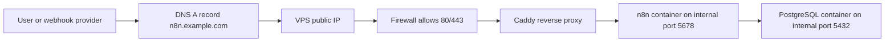

# Week 10｜VPS + Docker Compose + Caddy

> 執行日期：2026-05-27
> 目標：建立最平衡的 self-hosted n8n production 起點。
> 實作結果：完成 `https://n8n.example.com` 架構模擬，產出 VPS 藍圖、Compose、Caddyfile、env vars 解說與 firewall / DNS / HTTPS 檢查表；驗證重點是 production webhook URL 不會指回 `localhost`。

## 1. 本週交付物總覽

| 交付物 | 狀態 | 檔案 |
| --- | --- | --- |
| VPS 部署藍圖 | 完成 | `artifacts/week-10-vps-caddy/vps-deployment-blueprint.json` |
| Docker Compose 模擬檔 | 完成 | `artifacts/week-10-vps-caddy/compose.yaml` |
| Caddyfile 與 env vars 解說 | 完成 | `artifacts/week-10-vps-caddy/Caddyfile`；本文件第 5 節 |
| firewall / DNS / HTTPS 檢查表 | 完成 | `artifacts/week-10-vps-caddy/firewall-dns-https-checklist.csv` |
| Week 10 驗證腳本 | 完成 | `scripts/verify-week-ten.mjs` |



第 9 週的結論是：beginner 或非工程團隊應先 Cloud 優先。第 10 週則處理 Cloud 不適合時的第一個 self-host production 起點：單台 VPS、Docker Compose、PostgreSQL、Caddy automatic HTTPS。這條路線比 Kubernetes 簡單，但已經承接了 production 責任，所以文件裡會把 public URL、TLS、proxy、DB、volume、firewall 和 webhook URL 一起檢查。

## 2. 官方來源核對

| 主題 | 官方來源 | 本週採用的判斷 |
| --- | --- | --- |
| n8n reverse proxy webhook URL | https://docs.n8n.io/hosting/configuration/configuration-examples/webhook-url/ | n8n 在 reverse proxy 後方時，要設定 `WEBHOOK_URL`，並設定 `N8N_PROXY_HOPS=1`。 |
| n8n Docker + PostgreSQL | https://docs.n8n.io/hosting/installation/docker/ | n8n 支援 PostgreSQL；即使使用 PostgreSQL，仍建議持久化 `.n8n` 目錄，因為其中還有 encryption keys、logs、source control feature assets 等資料。 |
| n8n deployment env vars | https://docs.n8n.io/hosting/configuration/environment-variables/deployment/ | 本週固定 `N8N_HOST`、`N8N_PROTOCOL`、`WEBHOOK_URL`、`N8N_EDITOR_BASE_URL`、`N8N_PROXY_HOPS`、`N8N_ENCRYPTION_KEY`。 |
| n8n database env vars | https://docs.n8n.io/hosting/configuration/environment-variables/database/ | PostgreSQL 使用 `DB_TYPE=postgresdb` 與 `DB_POSTGRESDB_*`。 |
| n8n security env vars | https://docs.n8n.io/hosting/configuration/environment-variables/security/ | `N8N_SECURE_COOKIE=true` 適合 HTTPS production；`N8N_ENFORCE_SETTINGS_FILE_PERMISSIONS=true` 強化設定檔權限。 |
| Docker Compose | https://docs.docker.com/compose/ | Compose 用單一 YAML 定義 services、networks、volumes，並管理 start/stop/logs/lifecycle。 |
| Docker Compose services | https://docs.docker.com/reference/compose-file/services/ | 本週使用 `depends_on.condition: service_healthy`、named volumes、service networks 與不公開 n8n/PostgreSQL host ports。 |
| Caddy reverse proxy | https://caddyserver.com/docs/caddyfile/directives/reverse_proxy | Caddy `reverse_proxy` 將 request proxy 到 upstream；本週 upstream 是 Docker service name `n8n:5678`。 |
| Caddy automatic HTTPS | https://caddyserver.com/docs/automatic-https | Caddy 會自動管理憑證並把 HTTP 導向 HTTPS；public domain 需要 DNS 指到機器且 80/443 對外可達。 |
| Caddy reverse proxy quick-start | https://caddyserver.com/docs/quick-starts/reverse-proxy | 以 domain name 作為 Caddyfile site address，Caddy 會嘗試取得 publicly-trusted certificate。 |
| Ubuntu UFW firewall | https://ubuntu.com/server/docs/how-to/security/firewalls/ | Ubuntu 預設防火牆工具是 `ufw`；本週 checklist 僅開 SSH、HTTP、HTTPS，不開 5678/5432。 |
| DNS records | https://developers.cloudflare.com/dns/manage-dns-records/how-to/create-dns-records/ | DNS 需建立 `A` record，將 `n8n.example.com` 指向 VPS public IPv4；是否代理需依 provider 與 TLS 策略決定。 |

## 3. 交付物一：VPS 部署藍圖

| Layer | 設計 | 對外暴露 | 持久化 |
| --- | --- | --- | --- |
| DNS | `A n8n.example.com -> VPS_PUBLIC_IPV4` | public DNS | DNS provider |
| Firewall | allow `22/tcp`、`80/tcp`、`443/tcp`；deny public `5678/tcp`、`5432/tcp` | 22/80/443 only | OS firewall rules |
| Caddy | `caddy:2-alpine`，接收 80/443，reverse proxy 到 `n8n:5678` | 80/443 | `caddy_data`、`caddy_config` |
| n8n | `docker.n8n.io/n8nio/n8n:2.22.4`，只在 Docker network expose 5678 | no host port | `n8n_data` |
| PostgreSQL | `postgres:16-alpine`，只在 internal Docker network 5432 | no host port | `postgres_data` |

### 架構原則

| 原則 | 具體做法 |
| --- | --- |
| Public traffic 只走 Caddy | Compose 只有 `caddy` publish `80:80` 與 `443:443`。 |
| n8n 不直接對外 | `n8n` 使用 `expose: 5678`，不使用 `ports: 5678:5678`。 |
| PostgreSQL 不直接對外 | `postgres` 沒有 host `ports`，且只接到 `internal` Docker network。 |
| Webhook URL 必須是 public HTTPS | `WEBHOOK_URL=https://n8n.example.com/`，不是 `http://localhost:5678/`。 |
| Editor URL 必須是 public HTTPS | `N8N_EDITOR_BASE_URL=https://n8n.example.com/`。 |
| Proxy hop 明確 | `N8N_PROXY_HOPS=1`，代表 n8n 信任前方一層 Caddy reverse proxy。 |
| Encryption key 固定 | `N8N_ENCRYPTION_KEY` 由 `.env` 提供，不能讓 n8n 隨機生成後遺失。 |

## 4. Docker Compose 架構解說

| Compose 區塊 | 設計 | 解說 |
| --- | --- | --- |
| `services.caddy` | `image: caddy:2-alpine`，publish 80/443 | VPS 的唯一 public HTTP/HTTPS 入口。 |
| `services.caddy.volumes` | bind `./Caddyfile`，named volumes `caddy_data`、`caddy_config` | Caddyfile 由版本控管；certificate 與 Caddy runtime data 持久化。 |
| `services.n8n` | no host ports，`expose: 5678` | 只讓 Caddy 在 Docker network 內連到 n8n。 |
| `services.n8n.environment` | `DB_TYPE=postgresdb`、`WEBHOOK_URL=https://n8n.example.com/` | 同時處理 state layer 與 public URL layer。 |
| `services.n8n.volumes` | `n8n_data:/home/node/.n8n` | 保存 n8n user folder 內的重要資料。 |
| `services.postgres` | `postgres:16-alpine`，healthcheck `pg_isready` | n8n 要等 PostgreSQL healthy 後才啟動。 |
| `networks.frontdoor` | caddy + n8n | reverse proxy 到 app。 |
| `networks.internal` | n8n + postgres，`internal: true` | DB network 不接 public gateway。 |
| `volumes` | `caddy_data`、`caddy_config`、`n8n_data`、`postgres_data` | 更新 container 不等於刪除 state。 |

部署模擬檔：

```text
artifacts/week-10-vps-caddy/compose.yaml
```

這份 Compose 檔是 production-shaped blueprint，不會在本機直接啟動 public domain，因為 `n8n.example.com` 必須先有真實 DNS A record 指向 VPS public IP。驗證腳本會用 `docker compose config` 確認 YAML、env interpolation、services、ports、networks、volumes 都能正確 render。

## 5. 交付物二：Caddyfile 與 env vars 解說

### Caddyfile

```caddyfile
n8n.example.com {
	encode zstd gzip

	reverse_proxy n8n:5678 {
		header_up X-Forwarded-For {remote_host}
		header_up X-Forwarded-Host {host}
		header_up X-Forwarded-Proto {scheme}
	}
}
```

| 行為 | 解說 |
| --- | --- |
| `n8n.example.com` | Caddy 的 site address；有真實 public DNS 且 80/443 可達時，Caddy 會嘗試自動 HTTPS。 |
| `encode zstd gzip` | 對支援的 response 做壓縮。 |
| `reverse_proxy n8n:5678` | Docker network 內用 service name 找到 n8n。 |
| `X-Forwarded-For` | 告訴 n8n 原始 client IP 資訊。 |
| `X-Forwarded-Host` | 告訴 n8n 原始 public host。 |
| `X-Forwarded-Proto` | 告訴 n8n 原始 request 是 HTTPS。 |

### env vars

| 變數 | 範例值 | 目的 |
| --- | --- | --- |
| `N8N_DOMAIN` | `n8n.example.com` | n8n 對外 hostname。 |
| `N8N_PUBLIC_URL` | `https://n8n.example.com/` | 同時餵給 `WEBHOOK_URL` 與 `N8N_EDITOR_BASE_URL`。 |
| `N8N_HOST` | `${N8N_DOMAIN}` | n8n 自身 public host 設定。 |
| `N8N_PROTOCOL` | `https` | public access protocol。 |
| `WEBHOOK_URL` | `${N8N_PUBLIC_URL}` | webhook node 顯示與外部服務註冊使用的 base URL。 |
| `N8N_EDITOR_BASE_URL` | `${N8N_PUBLIC_URL}` | editor public URL，也會影響部分 redirect URL。 |
| `N8N_PROXY_HOPS` | `1` | n8n 前方有一層 reverse proxy。 |
| `N8N_ENCRYPTION_KEY` | fixed secret | 加密 credentials；必須備份。 |
| `N8N_SECURE_COOKIE` | `true` | production HTTPS cookie 安全設定。 |
| `DB_TYPE` | `postgresdb` | n8n 使用 PostgreSQL。 |
| `DB_POSTGRESDB_HOST` | `postgres` | Docker network 內的 Postgres service name。 |

重要判斷：`N8N_PROTOCOL=https` 與 `WEBHOOK_URL=https://n8n.example.com/` 描述的是 public side；n8n container 內部仍然聽 `5678`，由 Caddy 在 Docker network 內用 HTTP 代理。這是正常的 reverse proxy pattern。

## 6. 交付物三：firewall / DNS / HTTPS 檢查表

| Layer | 檢查 | 預期結果 |
| --- | --- | --- |
| DNS | `A n8n.example.com -> VPS_PUBLIC_IPV4` | 網域解析到 VPS。 |
| DNS | TTL 合理，例如 300 秒到 1 小時 | 初次部署與切換時不會被長 TTL 卡太久。 |
| Firewall | allow `22/tcp` from admin IP range | 能管理 VPS，且降低 SSH 暴露面。 |
| Firewall | allow `80/tcp` from internet | Caddy 可處理 HTTP redirect 與 ACME HTTP challenge。 |
| Firewall | allow `443/tcp` from internet | 使用者與 webhook provider 走 HTTPS。 |
| Firewall | deny public `5678/tcp` | n8n 不繞過 Caddy。 |
| Firewall | deny public `5432/tcp` | PostgreSQL 不暴露到 internet。 |
| HTTPS | `curl -I https://n8n.example.com` | 回應來自 Caddy 後方的 n8n，HTTP status 為 200 或 302。 |
| Caddy | `docker compose logs caddy` | 可看到 certificate issuance / renewal 或正常 HTTPS serving log。 |
| n8n | editor webhook base URL | 不出現 `localhost`、`127.0.0.1`、`:5678` public host。 |
| OAuth | provider callback URL | 使用 `https://n8n.example.com/rest/oauth2-credential/callback` 類型的 stable HTTPS URL。 |

### UFW 命令草案

```bash
sudo ufw allow 22/tcp
sudo ufw allow 80/tcp
sudo ufw allow 443/tcp
sudo ufw enable
sudo ufw status verbose
```

如果管理者 IP 固定，SSH 應改成只允許該 IP 或 VPN 範圍。`5678/tcp` 和 `5432/tcp` 不應開給 internet；Compose 也不 publish 這兩個 port。

## 7. `https://n8n.example.com` 模擬與驗收

本週沒有把 `n8n.example.com` 指到一台真 VPS，因此驗收採「完整架構模擬」：

| 驗收項 | 模擬方式 | 通過條件 |
| --- | --- | --- |
| Compose 可部署 | `docker compose --env-file .env.example -f compose.yaml config` | render 後有 `caddy`、`n8n`、`postgres`。 |
| Public ports 正確 | 檢查 rendered config | 只有 Caddy publish 80/443。 |
| n8n 不公開 host port | 檢查 rendered config | 不存在 `5678:5678`。 |
| PostgreSQL 不公開 host port | 檢查 rendered config | 不存在 `5432:5432`。 |
| Caddyfile 語法正確 | `caddy validate` | Caddyfile 可被 Caddy 接受。 |
| Webhook URL 正確 | 檢查 env/rendered config | `WEBHOOK_URL=https://n8n.example.com/`。 |
| Editor URL 正確 | 檢查 env/rendered config | `N8N_EDITOR_BASE_URL=https://n8n.example.com/`。 |
| localhost 不進入 public URL | 檢查 env/rendered config | `WEBHOOK_URL` 與 `N8N_EDITOR_BASE_URL` 不含 `localhost`、`127.0.0.1`、`:5678`。 |

最重要的驗收句：正式 webhook URL 不應顯示 `localhost`。如果 webhook node 顯示 `http://localhost:5678/webhook/...`，代表 public URL layer 沒設好，應先查 `WEBHOOK_URL`、`N8N_EDITOR_BASE_URL`、`N8N_PROXY_HOPS`、DNS、Caddyfile，而不是先改 workflow。

## 8. VPS 部署 runbook

| 步驟 | 命令或動作 | 驗收 |
| --- | --- | --- |
| 1 | 建立 VPS，取得 public IPv4 | 能 SSH 登入。 |
| 2 | 建立 DNS A record：`n8n.example.com -> VPS_PUBLIC_IPV4` | `dig n8n.example.com` 回 VPS IP。 |
| 3 | 安裝 Docker Engine 與 Compose plugin | `docker compose version` 成功。 |
| 4 | 放置 `compose.yaml`、`Caddyfile`、`.env` 到部署目錄 | `ls` 可看到三個檔案。 |
| 5 | 編輯 `.env`，替換 password 與 `N8N_ENCRYPTION_KEY` | 不使用 `CHANGE_ME`。 |
| 6 | 設定 firewall | 只開 22/80/443。 |
| 7 | 驗證 Compose render | `docker compose --env-file .env -f compose.yaml config` 成功。 |
| 8 | 啟動 stack | `docker compose --env-file .env -f compose.yaml up -d`。 |
| 9 | 查看 Caddy logs | 憑證取得或 HTTPS serving 無錯誤。 |
| 10 | 開啟 `https://n8n.example.com` | 能進入 n8n editor setup/login。 |
| 11 | 建立 webhook workflow | Production URL 顯示 `https://n8n.example.com/webhook/...`。 |
| 12 | 打外部 POST webhook | HTTP 200 或 workflow 預期 response。 |

### 部署前禁止項

| 禁止項 | 原因 |
| --- | --- |
| 不固定 `N8N_ENCRYPTION_KEY` | credential backup/restore 會失去可預期性。 |
| 不開 public `5678/tcp` | n8n 應在 Caddy 後方。 |
| 不開 public `5432/tcp` | PostgreSQL 不需要暴露給 internet。 |
| 不用 random tunnel URL 當 production callback | 會破壞 OAuth callback 與長期 webhook。 |
| 不讓 `WEBHOOK_URL` 指向 localhost | 外部服務無法呼叫使用者本機的 localhost。 |

## 9. 故障排除入口

| 症狀 | 優先檢查 |
| --- | --- |
| Caddy 拿不到憑證 | DNS A record 是否指向 VPS；80/443 是否開放；Caddy logs 是否出現 ACME challenge 錯誤。 |
| `https://n8n.example.com` 打不開 | VPS firewall、cloud provider security group、Caddy container、Caddyfile domain。 |
| editor 開了但 webhook URL 是 localhost | `WEBHOOK_URL`、`N8N_EDITOR_BASE_URL`、`N8N_PROXY_HOPS`、container env。 |
| OAuth callback mismatch | OAuth provider callback 是否使用 stable HTTPS domain；n8n editor URL 是否也一致。 |
| n8n 起不來 | `docker compose logs n8n`、PostgreSQL healthcheck、DB env vars、encryption key。 |
| workflow 或 credential 更新後消失 | named volumes 是否存在；是否誤刪 `n8n_data` 或 `postgres_data`。 |
| database connection refused | `postgres` service health、internal network、`DB_POSTGRESDB_HOST=postgres`。 |

## 10. 下一週銜接

Week 11 會比較 Railway、Zeabur、Render、Fly.io。第 10 週的底線會沿用到 PaaS：服務能啟動不等於 state 可長期存活，網址能開不等於 webhook URL 正確。任何平台都必須回答 persistent storage、managed PostgreSQL、custom domain、TLS、env vars 與 redeploy 後 state 是否保存。
