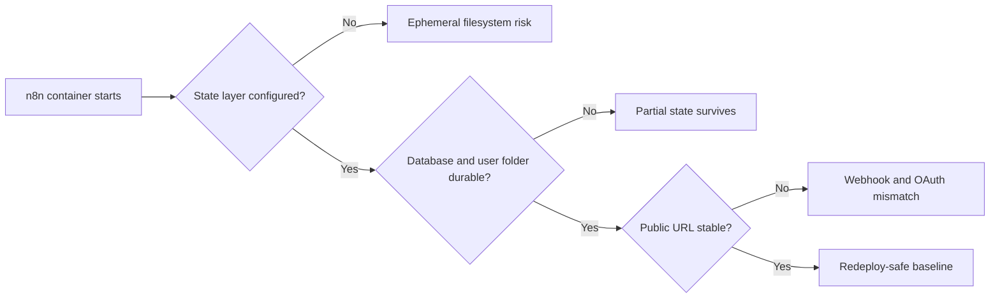
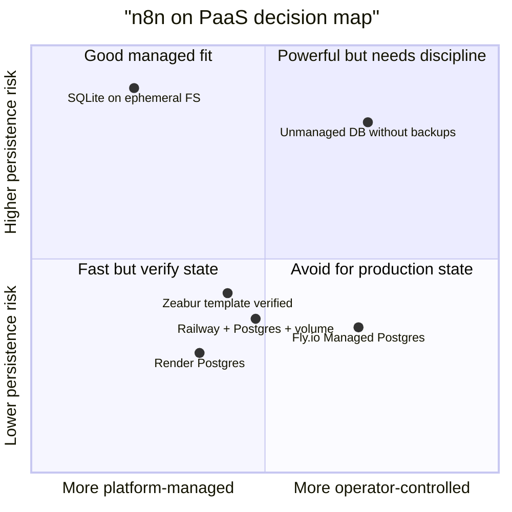
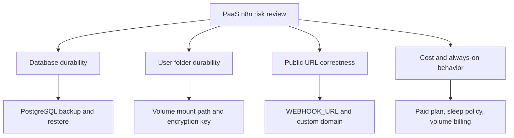

# Week 11｜Railway、Zeabur、Render、Fly.io

> 執行日期：2026-05-27
> 目標：比較四個 PaaS/container host 在 n8n self-host 情境下能省下的維運，以及最容易踩到的持久化陷阱。
> 實作結果：完成 PaaS 平台比較表、persistent storage risk card、平台選型建議，並把驗收重點鎖定在「服務能啟動不代表 n8n state 能在 redeploy 後存活」。

## 1. 本週交付物總覽

| 交付物 | 狀態 | 檔案 |
| --- | --- | --- |
| PaaS 平台比較表 | 完成 | `artifacts/week-11-paas/week-11-paas-platform-matrix.json`；本文件第 3 節 |
| persistent storage risk card | 完成 | `artifacts/week-11-paas/week-11-persistent-storage-risk-card.json`；本文件第 4 節 |
| 平台選型建議 | 完成 | `artifacts/week-11-paas/week-11-platform-selection-recommendations.csv`；本文件第 5 節 |
| n8n PaaS env vars 檢查表 | 完成 | 本文件第 7 節 |
| Week 11 驗證腳本 | 完成 | `scripts/verify-week-eleven.mjs` |

Week 10 的 VPS 架構把責任攤開：DNS、firewall、Caddy、PostgreSQL、volume、env vars 都要自己管理。Week 11 轉到 Railway、Zeabur、Render、Fly.io 這類平台，重點不是「它們能不能跑 Docker」，而是「平台替你省了哪些入口層維運，還有哪些 state layer 仍必須明確指定」。對 n8n 來說，只看到 editor 開起來不夠，必須確認 workflows、credentials、execution history、binary data、encryption key、webhook URL 在 redeploy、restart、sleep、scale、volume deletion 之後仍然有一致性。

## 2. 官方來源核對

| 主題 | 官方來源 | 本週採用的判斷 |
| --- | --- | --- |
| n8n Docker + PostgreSQL | https://docs.n8n.io/hosting/installation/docker/ | n8n 支援 PostgreSQL；即使用 PostgreSQL，仍建議持久化 `.n8n` user folder，因為其中包含 encryption keys、logs、source control assets 等資料。 |
| n8n reverse proxy webhook URL | https://docs.n8n.io/hosting/configuration/configuration-examples/webhook-url/ | reverse proxy 或 PaaS ingress 後方要設定 `WEBHOOK_URL`，讓 editor 與外部服務註冊正確 public webhook URL。 |
| n8n encryption key | https://docs.n8n.io/hosting/configuration/configuration-examples/encryption-key/ | self-host 時應固定 `N8N_ENCRYPTION_KEY`；credentials 依賴 encryption key 可解密。 |
| Railway volumes | https://docs.railway.com/reference/volumes | Railway volume 可讓服務有持久化資料，但一個 service 只能掛一個 volume，且使用 volume 會限制 replicas。 |
| Railway PostgreSQL | https://docs.railway.com/databases/postgresql/ | Railway PostgreSQL template 能快速建立 PostgreSQL service，會提供 `DATABASE_URL` 與 `PG*` 連線變數；Railway database templates 屬於平台模板，不等於完全代管資料庫營運。 |
| Railway public networking | https://docs.railway.com/reference/public-networking | Railway 提供 Railway domain、custom domain 與自動 SSL。 |
| Railway variables | https://docs.railway.com/variables | Railway 以 service variables、shared variables、reference variables 管理環境變數與 secrets。 |
| Render n8n guide | https://render.com/docs/deploy-n8n/ | Render 有 n8n 官方部署指南；建議使用 Render Postgres 儲存 workflow data，並提醒 free web service 會 idle spin down、free Postgres 會過期。 |
| Render persistent disks | https://render.com/docs/disks | Render service 預設 filesystem 是 ephemeral；persistent disk 只保存掛載路徑下的資料，且 disk 會取消 zero-downtime deploy。 |
| Render custom domains | https://render.com/docs/custom-domains/ | Render custom domain 會自動建立與更新 TLS certificates，HTTP 會 redirect 到 HTTPS。 |
| Render env vars | https://render.com/docs/configure-environment-variables/ | Render 使用 dashboard 或 environment groups 管理 service env vars 與 secrets。 |
| Zeabur volumes | https://zeabur.com/docs/en-US/data-management/volumes | Zeabur service 預設偏 stateless；需要持久化時必須把目錄掛到 Volume；啟用 Volume 後 restart 不再是 zero-downtime。 |
| Zeabur public networking | https://zeabur.com/docs/en-US/networking/public | Zeabur 支援 `*.zeabur.app` domain 與 custom domain。 |
| Zeabur env vars | https://zeabur.com/docs/en-US/deploy/special-variables | Zeabur 可在 service Variables tab 設定環境變數，並自動注入服務與資料庫相關變數。 |
| Zeabur templates | https://zeabur.com/docs/template | Zeabur templates 可一鍵部署 n8n、Postgres 等服務，並預先定義 service、env vars 與連線關係。 |
| Zeabur pricing | https://zeabur.com/en-US/pricing | Zeabur 目前採 subscription tier 加 resource usage fee；resource usage 包含 memory、network egress、persistent volume 等項目，需以最新 pricing page 為準。 |
| Fly.io volumes | https://fly.io/docs/volumes/overview/ | Fly Machine root filesystem 是 ephemeral；Fly Volumes 是 local persistent storage，volume 位於單一 server/region，且不自動複製。 |
| Fly.io Managed Postgres | https://fly.io/docs/mpg | Fly.io Managed Postgres 是 fully-managed database service，包含 HA、automatic failover、backups、monitoring、support 等能力。 |
| Fly Postgres unmanaged warning | https://fly.io/docs/postgres/getting-started/what-you-should-know/ | 傳統 Fly Postgres 不是 managed database；production 應優先使用 Managed Postgres 或外部 managed PostgreSQL。 |
| Fly.io custom domains | https://fly.io/docs/networking/custom-domain/ | Fly.io 支援 custom domain、DNS setup 與 TLS certificates。 |
| Fly.io secrets | https://www.fly.io/docs/apps/secrets/ | `fly secrets` 會把 secrets 注入 Fly App 的 Machines runtime environment。 |

## 3. 交付物一：PaaS 平台比較表

| 平台 | 持久化模型 | PostgreSQL 模型 | custom domain / TLS | env vars / secrets | usage pricing / always-on 成本 | n8n 適配判斷 |
| --- | --- | --- | --- | --- | --- | --- |
| Railway | App service filesystem 不能當 durable state；需要 volume 掛到 n8n user folder，PostgreSQL service 另有 volume。Volume 有 service-scoped、single volume、no replicas 等限制。 | PostgreSQL template 快速建立 service 並提供 `DATABASE_URL`、`PGHOST`、`PGUSER` 等變數；官方文件也提醒 database templates 屬 unmanaged service，需要自己處理 backups、monitoring、maintenance。 | 支援 Railway domain、custom domain、自動 SSL。 | Service variables、shared variables、reference variables，可引用 Postgres service 的連線變數。 | subscription + usage；always-on n8n 會持續吃 compute、memory、volume、egress。 | 適合 prototype、solo builder、小型 production，但要明確加 volume、Postgres、backup policy、固定 `N8N_ENCRYPTION_KEY`。 |
| Zeabur | 預設服務 restart 會回到預設 state；需要把持久化目錄掛到 Volumes。啟用 Volume 後 restart 不支援 zero-downtime。 | templates 與 Databases 流程可建立 PostgreSQL；n8n template 很快，但仍要確認 template 是 PostgreSQL 還是 SQLite/volume 路線。 | 支援 `*.zeabur.app`、custom domain 與 public networking；custom domain 需照 dashboard DNS 設定。 | Service Variables tab 設定，平台會注入 service host、port 與資料庫相關變數。 | subscription tier + resource usage fee；memory、network egress、persistent volume 會累積費用；suspend 可停 compute，但 volume 仍需檢查保留與費用。 | 最 beginner-friendly 的 PaaS 候選之一，尤其適合 template deployment；風險在於把「模板成功啟動」誤當成「state model 已驗證」。 |
| Render | 預設 filesystem 是 ephemeral。可選 Render Postgres 儲存 workflow data，或 paid persistent disk 儲存 SQLite/n8n local files；disk 只保存 mount path。 | Render 官方 n8n guide 推薦 Render Postgres；free Postgres 會過期，production 需 paid DB。 | 支援 custom domain、自動 TLS、HTTP redirect HTTPS。 | Environment variables、secrets、environment groups；Blueprint 可一起定義 service 與 DB。 | free web service idle 會 spin down，free Postgres 30 天過期；paid always-on 才適合 production。 | 最適合用「Render Postgres + n8n web service」當 low-maintenance PaaS 路線；不要用 free DB 做長期 state。 |
| Fly.io | Machine root filesystem 是 ephemeral。Fly Volumes 是 local persistent storage，單一 volume 綁單一 Machine/server/region，不自動複製。 | 可用 Fly.io Managed Postgres；傳統 Fly Postgres 是 unmanaged，不適合沒有 DB ops 能力的 production。 | 支援 `.fly.dev` 與 custom domain，透過 Fly Proxy 管理 TLS。 | `fly secrets` 注入 runtime env；`fly.toml` 管理 app config。 | 按 Machines、volumes、egress、Managed Postgres 計費；長期 always-on 和 Managed Postgres 會比簡單 VPS 更需要成本估算。 | 適合有工程能力、需要 global edge / Machines 控制的人；對 beginner 不是最低風險路線。 |

### 一眼辨認圖

### 平台省下的維運

| 維運項 | PaaS 通常會省下 | 仍需自己確認 |
| --- | --- | --- |
| Public ingress | 不用自己裝 Caddy/Nginx；平台提供 domain、routing、TLS。 | `WEBHOOK_URL` 是否是 public HTTPS URL；proxy headers 是否正確。 |
| Build/deploy | Git push、Docker image 或 template deploy 可自動化。 | image tag 是否 pin；更新後 workflows 是否回歸測試。 |
| Secrets UI | Dashboard 管理 env vars。 | `N8N_ENCRYPTION_KEY`、DB password、OAuth secrets 是否可備份與輪替。 |
| Database creation | 多數平台有 PostgreSQL template 或 managed DB。 | 是 managed DB 還是 unmanaged template；backup/restore/RPO/RTO 誰負責。 |
| Monitoring basics | Logs、metrics、restart controls 較容易。 | n8n execution backlog、DB storage growth、workflow failure alerts 仍要設計。 |

### PaaS 沒有自動省下的責任

| 責任 | 為什麼重要 |
| --- | --- |
| n8n state 分層 | workflows、credentials、executions 多在 DB；encryption key 與部分 user folder assets 仍不可忽略。 |
| Redeploy persistence | container image 更新常會建立新 instance；沒有 persistent DB/volume 時，啟動成功只是新空白實例成功。 |
| Backup / restore | volume 存在不等於有可用備份；DB snapshot 也要演練 restore。 |
| Public URL stability | webhook、OAuth callback、AI tool callback 都依賴 stable HTTPS domain。 |
| 成本上限 | subscription + usage 或 usage-based 平台容易因 always-on、memory、volume、egress、DB plan 而超過預期。 |

## 4. 交付物二：persistent storage risk card

| Risk ID | 風險卡 | 典型症狀 | 影響 | 第一個檢查 | 降低風險做法 |
| --- | --- | --- | --- | --- | --- |
| `ephemeral-filesystem` | 把 n8n state 寫在 ephemeral filesystem | redeploy 後 workflow/credential/execution 不見，或回到 setup 畫面 | 高 | 平台是否明說 filesystem ephemeral；n8n user folder 是否有 volume | 使用 PostgreSQL 儲存主要 state，並為 `/home/node/.n8n` 或平台等價 user folder 掛 durable storage 或固定 key/env。 |
| `managed-db-without-app-volume` | 有 DB 但忽略 n8n user folder | workflow 還在，但 encryption key、binary data、source-control assets、logs 或本機檔案相關功能異常 | 高 | 是否固定 `N8N_ENCRYPTION_KEY`；是否保存 `.n8n` user folder | 固定 `N8N_ENCRYPTION_KEY`，掛載 user folder，檢查 binary data mode。 |
| `app-volume-without-db-backup` | 只掛 volume，沒有 DB backup | redeploy 沒事，但 DB 壞掉或誤刪後無法還原 | 高 | 有沒有 Postgres backup/snapshot/restore drill | 設定 managed Postgres backup 或外部備份，建立 restore runbook。 |
| `free-or-sleeping-service` | 使用 free tier 跑 production webhook | webhook 延遲、timeout、DB 到期、service idle spin down | 高 | plan 是否會 sleep；free DB 是否會 expire | production 使用 paid always-on web service 與 paid DB。 |
| `single-region-local-volume` | 把 volume 視為跨區 durable storage | region/host 問題時 service 或資料不可用 | 中到高 | volume 是否 local to single host/region；是否自動 replication | 對 production 使用 managed DB 或多副本策略；設計 off-platform backup。 |
| `redeploy-reset` | 只驗證初次啟動，沒有驗證 redeploy | 第一次能登入，下一次 deploy 後資料消失 | 高 | 手動觸發 redeploy 後 workflows/credentials 是否仍在 | 建立 smoke test：新增 workflow、credential mock、redeploy、確認仍存在。 |
| `custom-domain-mismatch` | URL 能開但 n8n webhook base URL 不對 | webhook node 顯示平台臨時 URL、localhost、http 或舊 domain | 中到高 | `WEBHOOK_URL`、`N8N_EDITOR_BASE_URL`、domain/TLS | 固定 custom domain，設定 public HTTPS URL，更新 OAuth callback。 |
| `secret-loss-or-rotation` | secrets 沒有備份或亂輪替 | credentials 解不開，OAuth token 失效 | 高 | `N8N_ENCRYPTION_KEY` 是否固定且存在 secret manager | secrets 變更前備份 DB，記錄 rotation plan。 |
| `binary-data-location` | binary data 寫到不持久的路徑 | 檔案節點、附件、AI document processing 重跑或下載失敗 | 中 | workflow 是否產生 binary files；binary data mode 與 storage path | 把 binary data path 放在 durable volume；Enterprise 可評估 external storage。 |
| `execution-history-growth` | execution history 長期膨脹 | Postgres storage 增長、備份變慢、費用上升 | 中 | executions retention、DB storage trend | 設定 execution pruning、監控 DB size、定期驗證備份大小。 |

### 風險卡摘要

最危險的誤判是：把「平台會幫我 deploy container」理解成「平台會理解 n8n 的 state model」。PaaS 只知道 container、port、env、disk、DB，它不知道哪些 n8n workflows 是生意流程、哪些 credentials 不能失效、哪些 binary files 是客戶資料。這些資料是否 durable，要靠我們把 DB、volume、secret、domain、backup 明確接好。

## 5. 交付物三：平台選型建議

| 情境 | 首選 | 次選 | 不建議 | 理由 |
| --- | --- | --- | --- | --- |
| beginner / 非工程團隊 | n8n Cloud | Render Postgres blueprint | Fly.io unmanaged Postgres | 最低維運是 Cloud；如果要 PaaS，選有明確 n8n guide 與 Postgres blueprint 的路線。 |
| solo creator 想快速公開 webhook | Railway 或 Zeabur | Render paid service + Postgres | free tier 長期 production | Railway/Zeabur 上手快，但要檢查 volume、Postgres、custom domain、`WEBHOOK_URL`。 |
| 需要低維運又要官方 n8n PaaS guide | Render Postgres | Railway + Postgres | SQLite on ephemeral FS | Render 有 n8n guide，且文件直接區分 Postgres 與 persistent disk 儲存方法。 |
| 有工程能力、想靠近 global edge | Fly.io + Managed Postgres | Railway | Fly Postgres unmanaged without backup | Fly 強在 Machines/networking，但 DB 與 local volumes 要更懂操作。 |
| 需要 template 一鍵啟動 | Zeabur n8n template，並確認 PostgreSQL/volume | Railway template | 不明 template state model | template 可省 setup，但 template 內容要核對，不可只看 deploy 成功。 |
| 長期 production with low ops | n8n Cloud 或 managed DB PaaS | VPS + Compose + Caddy | free/sleeping PaaS | production 需要 always-on、backup、restore、stable domain、monitoring。 |
| 想學真實 self-host ops | Week 10 VPS route | Fly.io advanced route | 只用 PaaS dashboard 但不懂 state | VPS 能完整理解 DNS、proxy、DB、volume；PaaS 可作為下一層抽象比較。 |

### 選型結論

| 結論 | 建議 |
| --- | --- |
| 最低維運 | n8n Cloud。若必須 self-host，Render Postgres 是文件最清楚的低維運 PaaS 起點。 |
| 最快 PaaS 上手 | Zeabur 或 Railway，但必須完成 redeploy persistence test。 |
| 最佳學習深度 | VPS + Compose + Caddy，因為每個 layer 都看得見。 |
| 最適合工程玩家 | Fly.io + Managed Postgres，適合願意處理 Machines、volumes、regions、secrets 的人。 |
| 最應避免 | SQLite 或 user folder 寫在 ephemeral filesystem，尤其又搭配 free/sleeping service。 |

## 6. 四個平台的 n8n 狀態保存模型

### Railway

| Layer | 應設定 | 檢查重點 |
| --- | --- | --- |
| n8n container | Docker image 或 repo deploy | pin image tag，不要長期漂在 untracked `latest`。 |
| DB | Railway PostgreSQL service 或外部 managed Postgres | 確認 `DB_TYPE=postgresdb`、`DB_POSTGRESDB_*` 或 `DATABASE_URL` 對應方式，並建立 backup strategy。 |
| User folder | Railway volume mount 到 n8n user folder | Railway 一個 service 只能掛一個 volume，replicas 不能與 volume 一起用。 |
| Secrets | Railway service variables | 固定 `N8N_ENCRYPTION_KEY`，用 reference variables 接 DB credentials。 |
| Domain | Railway custom domain + automatic SSL | 設 `WEBHOOK_URL=https://你的網域/`。 |

Railway 的優點是速度快、UI 清楚、Postgres template 方便；主要風險是把 template database 當成完全免責任 managed database。官方文件已說 database templates 是 unmanaged service，production 應自己處理 backups、monitoring、security、maintenance。

### Zeabur

| Layer | 應設定 | 檢查重點 |
| --- | --- | --- |
| n8n container/template | 選 n8n template 或 Docker image | 確認 template 使用 PostgreSQL 還是 SQLite 路線。 |
| DB | Databases / PostgreSQL template | 確認 service variables 自動注入後，n8n 真的連到 Postgres。 |
| User folder | Zeabur Volume | Zeabur 文件明說 service 預設 restart 後會 reset data；需要持久化就掛 Volume。 |
| Secrets | Service Variables | 固定 `N8N_ENCRYPTION_KEY`，不要只依賴一次性生成。 |
| Domain | `*.zeabur.app` 或 custom domain | production 用 stable custom domain，並同步 `WEBHOOK_URL`。 |

Zeabur 的優點是 template-centric，上手很快；主要風險是「一鍵部署」讓人以為檢查結束。對 n8n，template 啟動後還要進行 redeploy persistence test：建立 workflow、加入 credential mock、觸發 redeploy、確認 workflow 與 credential 還在，並確認 webhook URL 沒變。

### Render

| Layer | 應設定 | 檢查重點 |
| --- | --- | --- |
| n8n web service | official n8n Docker image | 使用 Render n8n guide 或 Blueprint，pin n8n image tag。 |
| DB | Render Postgres | Render guide 推薦 Postgres 儲存 workflow data；free DB 會過期，production 要 paid。 |
| User folder | 依部署模式決定 | Postgres 保存 workflows/credentials/executions；仍需固定 `N8N_ENCRYPTION_KEY`，若使用 filesystem/binary data 要掛 disk。 |
| Persistent disk | 若用 SQLite 或需要 local files | Render disk only preserves mount path，且 disables zero-downtime deploy。 |
| Domain | custom domain + TLS | 設定 `WEBHOOK_URL` 為 `https://你的網域/` 或 service public URL。 |

Render 是四個平台中對 n8n 文件最直白的一個：它直接告訴使用者 storage method 有 Render Postgres 和 persistent disk 兩種，也直接說 free service/DB 的限制。這讓它很適合作為 Week 11 的 beginner PaaS 建議，但前提是 production 不停在 free tier。

### Fly.io

| Layer | 應設定 | 檢查重點 |
| --- | --- | --- |
| n8n Machine | Docker image + `fly.toml` | root filesystem ephemeral，不可放 durable state。 |
| DB | Fly.io Managed Postgres 或外部 managed Postgres | 傳統 Fly Postgres 是 unmanaged；沒有 DB ops 能力不要作為 production 預設。 |
| User folder | Fly Volume | volume local to single server/region，一個 volume attach one Machine，不自動 replication。 |
| Secrets | `fly secrets` | secrets 更新會使 Machine 更新或重啟，要回歸 credential 解密。 |
| Domain | `.fly.dev` 或 custom domain | `fly certs add`，DNS 與 TLS 檢查完成後設定 `WEBHOOK_URL`。 |

Fly.io 的價值是控制力與全球網路，而不是 beginner 省心。n8n 可以跑在 Fly，但 production 應使用 Managed Postgres 或外部 managed DB，並把 Fly Volumes 看成 local persistent storage，不要把它誤認為跨區自動複製的資料層。

## 7. n8n PaaS env vars 檢查表

| env var | 必要性 | 建議值或來源 | 為什麼重要 |
| --- | --- | --- | --- |
| `DB_TYPE` | PostgreSQL route 必填 | `postgresdb` | 避免 n8n 使用預設 SQLite 寫到 ephemeral filesystem。 |
| `DB_POSTGRESDB_HOST` | PostgreSQL route 必填 | 平台 DB host 或 private hostname | 連到 durable DB，不連到 container local DB。 |
| `DB_POSTGRESDB_PORT` | PostgreSQL route 必填 | 通常 `5432` | 明確連線到 PostgreSQL。 |
| `DB_POSTGRESDB_DATABASE` | PostgreSQL route 必填 | `n8n` 或平台建立的 database | workflows、credentials、executions 的主要 state。 |
| `DB_POSTGRESDB_USER` | PostgreSQL route 必填 | 平台 DB user | DB auth。 |
| `DB_POSTGRESDB_PASSWORD` | PostgreSQL route 必填 | platform secret/reference variable | DB auth secret 不進 Git。 |
| `DB_POSTGRESDB_SSL_ENABLED` 或平台等價設定 | 視平台而定 | managed DB 若要求 TLS 則開啟 | 外部 DB 連線常需要 TLS。 |
| `N8N_ENCRYPTION_KEY` | production 必填 | 固定、長度足夠、保存在 secret manager | credentials 解密依賴它；遺失會造成嚴重事故。 |
| `WEBHOOK_URL` | public webhook 必填 | `https://n8n.example.com/` | 外部服務註冊與 editor 顯示 production webhook URL。 |
| `N8N_EDITOR_BASE_URL` | 建議設定 | `https://n8n.example.com/` | editor redirect 與 public base URL 一致。 |
| `N8N_HOST` | 建議設定 | `n8n.example.com` | public hostname。 |
| `N8N_PROTOCOL` | 建議設定 | `https` | public side protocol。 |
| `N8N_PROXY_HOPS` | reverse proxy/PaaS ingress 建議 | `1` 或依 ingress hops 調整 | 告訴 n8n 信任前方 proxy headers。 |
| `N8N_SECURE_COOKIE` | HTTPS production 建議 | `true` | 強化 cookie 安全。 |
| `N8N_RUNNERS_ENABLED` | 新版 self-host 建議 | `true` | 對應 n8n Docker 文件中的 runner 建議。 |
| `EXECUTIONS_DATA_PRUNE` 與相關 retention vars | 長期 production 建議 | 依資料保留政策設定 | 控制 execution history 成長與 DB 成本。 |

## 8. 為什麼服務能啟動不代表 state 能在 redeploy 後存活

PaaS 的成功啟動通常只證明五件事：image 能拉下來、port 有 listen、health check 通過、env vars 基本可讀、平台 ingress 能連到服務。這些都不等於 n8n 的 state layer 被保存。

| 啟動成功代表 | 不代表 |
| --- | --- |
| container process 活著 | DB 是 durable，且有 backup。 |
| editor 可開 | workflows、credentials、executions 已寫到 persistent PostgreSQL。 |
| 可以建立帳號 | 下一次 redeploy 不會回到空白 setup。 |
| webhook URL 能顯示 | URL 是 stable custom domain，而不是暫時平台 domain 或 localhost。 |
| service restart 正常 | volume mount path 正確，binary data 和 encryption key 都能保留。 |

### 正確驗收流程

| 步驟 | 動作 | 通過條件 |
| --- | --- | --- |
| 1 | 部署 n8n service + PostgreSQL + volume/secret | n8n editor 可開，DB env vars 生效。 |
| 2 | 設定 `N8N_ENCRYPTION_KEY`、`WEBHOOK_URL`、`N8N_EDITOR_BASE_URL` | editor 顯示 public HTTPS URL。 |
| 3 | 建立測試 workflow 與測試 credential | workflow、credential 能儲存。 |
| 4 | 觸發一次 production webhook | 外部 request 成功打到 n8n。 |
| 5 | 手動 redeploy 或 restart service | redeploy 完成後不是空白 instance。 |
| 6 | 重新登入檢查 workflow、credential、execution | workflow 還在，credential 可用，execution history 符合保留政策。 |
| 7 | 檢查 DB backup 與 volume backup | 至少有明確可操作的 restore path。 |

驗收結論：服務能啟動只代表 runtime 起來了，不代表 n8n state 能在 redeploy 後存活。n8n 的持久化要同時檢查 PostgreSQL、user folder volume、`N8N_ENCRYPTION_KEY`、binary data storage、backup/restore、stable public URL；少任何一層，都可能出現「昨天能用，今天 redeploy 後資料不見」的事故。

## 9. Week 11 完成檢查

| 驗收條件 | 結果 | 證據 |
| --- | --- | --- |
| 完成 PaaS 平台比較表 | 通過 | `week-11-paas-platform-matrix.json` 與第 3 節 |
| 完成 persistent storage risk card | 通過 | `week-11-persistent-storage-risk-card.json` 與第 4 節 |
| 完成平台選型建議 | 通過 | `week-11-platform-selection-recommendations.csv` 與第 5 節 |
| 檢查 persistent volume、managed PostgreSQL、custom domain、TLS、env vars | 通過 | 第 2、3、6、7 節 |
| 辨認 Render/Fly/Zeabur/Railway 狀態保存模型 | 通過 | 第 6 節 |
| 理解 usage pricing 與 always-on 成本 | 通過 | 第 3、5 節 |
| 能說明服務能啟動不代表 state 能在 redeploy 後存活 | 通過 | 第 8 節 |

## 10. 下一週銜接

Week 12 會進入 Cloud Run、AWS App Runner、Lightsail、EC2、RDS 的比較。Week 11 的判斷會繼續沿用：任何平台選型都先問 state layer。Cloud Run 與 App Runner 更偏 stateless service，Lightsail/EC2 更像 VPS，RDS 則是 managed PostgreSQL 的典型選項。下一週要把「PaaS 的省心」和「hyperscaler 的組裝成本」分清楚，避免只因為品牌更大就誤以為部署更穩。
