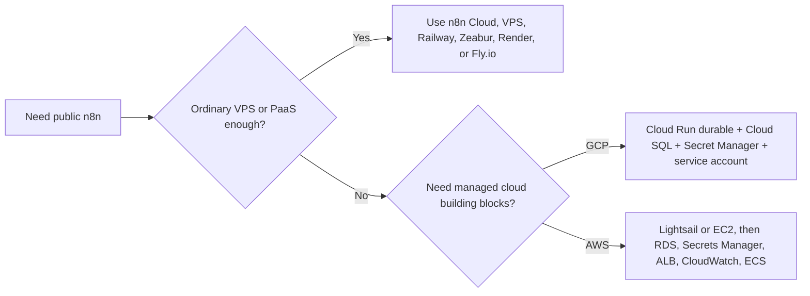
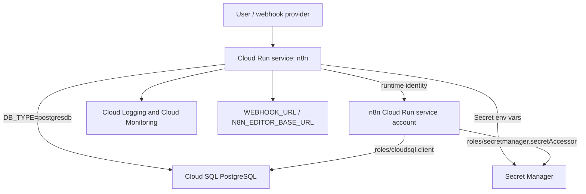
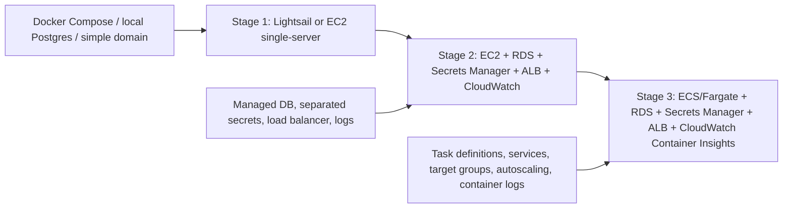

# Week 12｜Cloud Run Durable 與 AWS 路線

> 執行日期：2026-05-27
> 目標：判斷何時值得使用 hyperscaler，而不是普通 VPS 或 PaaS。
> 實作結果：完成 Cloud Run durable 架構圖、AWS 三階段演進圖、hyperscaler adoption checklist，並把驗收重點鎖定在「AWS 的強大來自 building blocks，也帶來組裝與維運成本」。

## 1. 本週交付物總覽

| 交付物 | 狀態 | 檔案 |
| --- | --- | --- |
| Cloud Run durable 架構圖 | 完成 | `artifacts/week-12-hyperscaler/week-12-cloud-run-durable-architecture.json`；本文件第 3 節 |
| AWS 三階段演進圖 | 完成 | `artifacts/week-12-hyperscaler/week-12-aws-three-stage-evolution.json`；本文件第 4 節 |
| hyperscaler adoption checklist | 完成 | `artifacts/week-12-hyperscaler/week-12-hyperscaler-adoption-checklist.csv`；本文件第 5 節 |
| Cloud Run easy mode vs durable mode 判斷 | 完成 | 本文件第 3 節 |
| AWS Lightsail/EC2/ECS/RDS/Secrets Manager/ALB/CloudWatch 階梯 | 完成 | 本文件第 4 節 |
| Week 12 驗證腳本 | 完成 | `scripts/verify-week-twelve.mjs` |

Week 11 的結論是：PaaS 能省下 ingress、TLS、deploy UI、logs、secrets UI，但 state layer 仍要明確設計。Week 12 往 hyperscaler 推進，判斷標準不是「GCP/AWS 比較大所以一定比較好」，而是你是否真的需要它們的 building blocks：managed database、IAM/service account、secret manager、load balancer、observability、autoscaling、VPC controls、backup/restore、multi-environment governance。這些能力很強，但每一塊都要組裝、命名、授權、監控、計費和維護。

## 2. 官方來源核對

| 主題 | 官方來源 | 本週採用的判斷 |
| --- | --- | --- |
| n8n on Google Cloud Run | https://docs.n8n.io/hosting/installation/server-setups/google-cloud-run/ | n8n 官方 Cloud Run guide 區分 Easy mode 與 Durable mode；Durable mode 加入 Cloud SQL、Secret Manager、service account 與正確 env vars。 |
| Cloud Run to Cloud SQL PostgreSQL | https://docs.cloud.google.com/sql/docs/postgres/connect-run | Cloud SQL 是 fully-managed database；Cloud Run 連 Cloud SQL 需要設定 instance connection，建議同區以降低 latency、成本與跨區故障風險。 |
| Cloud Run Secret Manager | https://docs.cloud.google.com/run/docs/configuring/services/secrets | Cloud Run 可把 Secret Manager secrets 掛成檔案或注入為環境變數；服務身分需要 `roles/secretmanager.secretAccessor`。 |
| Cloud Run service identity | https://docs.cloud.google.com/run/docs/configuring/services/service-identity | Cloud Run service identity 是 container 存取 Google Cloud API 的 service account；應使用 least-privilege user-managed service account。 |
| Cloud Run environment variables | https://docs.cloud.google.com/run/docs/configuring/services/environment-variables | Cloud Run env vars 綁定到 service revision；敏感值不應直接放普通環境變數，應使用 Secret Manager。 |
| Lightsail containers | https://docs.aws.amazon.com/lightsail/latest/userguide/amazon-lightsail-container-services.html | Lightsail container services 提供 container、default domain、custom domain、logs、metrics，比 ECS/Fargate 更像簡化的 AWS 入口。 |
| Lightsail custom domains | https://docs.aws.amazon.com/lightsail/latest/userguide/amazon-lightsail-enabling-container-services-custom-domains.html | Lightsail container service 可啟用 custom domains，需建立並驗證 SSL/TLS certificate。 |
| EC2 security groups | https://docs.aws.amazon.com/AWSEC2/latest/UserGuide/ec2-security-groups.html | EC2 security group 是 instance 的 virtual firewall；入站與出站 rules 仍由使用者設計。 |
| ECS Fargate tasks | https://docs.aws.amazon.com/AmazonECS/latest/developerguide/fargate-tasks-services.html | Fargate task 使用 `awsvpc` network mode，並有 task definition、CPU/memory/network/logging/storage 限制。 |
| RDS automated backups | https://docs.aws.amazon.com/AmazonRDS/latest/UserGuide/USER_ManagingAutomatedBackups.html | RDS 自動備份依 backup window 與 retention policy 執行；production 需要明確 retention、restore、maintenance window。 |
| AWS Secrets Manager | https://docs.aws.amazon.com/secretsmanager/ | Secrets Manager 用於加密、儲存、取回 database credentials 與其他 secrets，並支援 rotation。 |
| ALB target groups | https://docs.aws.amazon.com/elasticloadbalancing/latest/application/load-balancer-target-groups.html | Application Load Balancer 透過 target groups 將 request route 到 registered targets，並用 health checks 判斷 target 狀態。 |
| ECS logs to CloudWatch | https://docs.aws.amazon.com/AmazonECS/latest/developerguide/using_awslogs.html | ECS/Fargate tasks 可透過 `awslogs` log driver 將 container logs 發送到 CloudWatch Logs。 |
| CloudWatch Container Insights | https://docs.aws.amazon.com/AmazonCloudWatch/latest/monitoring/ContainerInsights.html | Container Insights 可收集、彙總 containerized applications 的 metrics/logs，支援 ECS/EKS/Fargate。 |

## 3. 交付物一：Cloud Run durable 架構圖

### Cloud Run easy mode vs durable mode

| 模式 | 適用 | state model | 主要資源 | 最大風險 |
| --- | --- | --- | --- | --- |
| Easy mode | demo、短期試跑、教學展示 | 容器內暫存或非 durable state | Cloud Run service + n8n image | scale to zero、redeploy、revision replacement 後資料不可靠。 |
| Durable mode | production-oriented self-host | Cloud SQL PostgreSQL 保存主要 state；Secret Manager 保存 secrets；service account 控制權限 | Cloud Run、Cloud SQL、Secret Manager、service account、env vars、public URL | 組件設定較多；如果 DB backup、IAM、secrets、public URL 沒設好，仍會 production 事故。 |

### 架構圖

### Durable components

| Component | 目的 | n8n 對應設定 |
| --- | --- | --- |
| Cloud Run service | 執行 n8n container，處理 editor、webhook、API request | n8n image、port `5678`、CPU/memory/concurrency/min instances 依 workload 設定。 |
| Cloud SQL PostgreSQL | 保存 workflows、credentials、executions 等主要 state | `DB_TYPE=postgresdb`、`DB_POSTGRESDB_HOST=/cloudsql/PROJECT:REGION:n8n-db`、`DB_POSTGRESDB_DATABASE=n8n`。 |
| Secret Manager | 保存 DB password、`N8N_ENCRYPTION_KEY` 與 OAuth/API secrets | Cloud Run `--update-secrets` 或 revision secret references。 |
| Service account | Cloud Run runtime identity，以最小權限存取 Cloud SQL 與 secrets | `roles/cloudsql.client`、`roles/secretmanager.secretAccessor`，不要把 broad Editor role 當預設做法。 |
| Public URL | 讓 webhook/OAuth callback 對外穩定 | `WEBHOOK_URL=https://n8n.example.com/`、`N8N_EDITOR_BASE_URL=https://n8n.example.com/`。 |
| Health endpoint | 避免 Cloud Run reserved path 衝突 | n8n guide 提到 Cloud Run 保留 `/healthz`，應改 `N8N_ENDPOINT_HEALTH`。 |
| Cloud Logging/Monitoring | 觀察 revision、errors、latency、request count、container logs | 建立 dashboard、alerts、error budget 與 incident playbook。 |

### Durable env var baseline

| env var | Cloud Run durable 建議 | 說明 |
| --- | --- | --- |
| `DB_TYPE` | `postgresdb` | 強制 n8n 使用 PostgreSQL，不把主 state 放在 container filesystem。 |
| `DB_POSTGRESDB_HOST` | `/cloudsql/PROJECT:REGION:n8n-db` | Cloud SQL Unix socket route；具體 connection name 依專案而定。 |
| `DB_POSTGRESDB_DATABASE` | `n8n` | n8n database name。 |
| `DB_POSTGRESDB_USER` | `n8n-user` | Cloud SQL DB user。 |
| `DB_POSTGRESDB_PASSWORD` | Secret Manager reference | 不放普通 env var，不寫入 image。 |
| `N8N_ENCRYPTION_KEY` | Secret Manager reference | credentials 解密與敏感資料保護的核心 key。 |
| `WEBHOOK_URL` | `https://n8n.example.com/` | production webhook base URL。 |
| `N8N_EDITOR_BASE_URL` | `https://n8n.example.com/` | editor public base URL。 |
| `N8N_ENDPOINT_HEALTH` | `health` 或其他非 `/healthz` path | 避免 Cloud Run reserved path 衝突。 |
| `N8N_PROXY_HOPS` | `1` 或依實際 proxy hops 調整 | Cloud Run/外部 proxy 後方要讓 n8n 正確理解 forwarded headers。 |

### Cloud Run durable 驗收

| 驗收項 | 通過條件 |
| --- | --- |
| Cloud SQL | n8n 實際連到 Cloud SQL PostgreSQL；redeploy 後 workflows/credentials/executions 不消失。 |
| Secret Manager | DB password 與 `N8N_ENCRYPTION_KEY` 由 Secret Manager 注入，service account 有最小必要權限。 |
| Service account | Cloud Run runtime 使用專用 service account，不依賴 broad default identity。 |
| URL | webhook node 顯示 stable HTTPS public URL，不是 localhost 或臨時 URL。 |
| Health | Cloud Run health check 不使用 `/healthz` 與 n8n reserved/conflicting route。 |
| Backup | Cloud SQL production 設定 backup retention、restore drill、maintenance window。 |

重要提醒：n8n 官方 Durable mode guide 的範例偏向教學起點，包含小型 Cloud SQL tier 與示範式設定。真正 production 應補上 automated backups、restore drill、region choice、connection limits、cost alert、Cloud Logging alert、image pinning 與 release rollback。

## 4. 交付物二：AWS 三階段演進圖

### 演進圖

### 三階段說明

| Stage | 適用情境 | AWS building blocks | 優點 | 組裝與維運成本 |
| --- | --- | --- | --- | --- |
| Stage 1：Lightsail 或 EC2 single-server | 想要 AWS 帳號內的 VPS-like 起點；流量小；團隊仍在學 self-host | Lightsail instance/container service，或 EC2 + security group + EBS + Docker Compose + domain/TLS | Mental model 接近 Week 10 VPS，成本與架構較容易理解。 | 仍要自己管理 OS patch、Docker update、firewall/security group、backup、Caddy/TLS 或 Lightsail certificate。 |
| Stage 2：EC2 + RDS + Secrets Manager + ALB + CloudWatch | n8n 已承載重要流程，需要 managed DB、分離 secrets、健康檢查、集中 logs | EC2、RDS PostgreSQL、Secrets Manager、Application Load Balancer、target groups、CloudWatch Logs/Metrics | DB、secrets、ingress、monitoring 開始拆成專門元件，資料層比單機更可靠。 | VPC/subnet/security group/IAM/ALB/target group/RDS/backup/logs 都要設計，費用項目變多。 |
| Stage 3：ECS/Fargate + RDS + Secrets Manager + ALB + CloudWatch | 需要 container orchestration、rolling deploy、scaling、task isolation、multi-environment pipeline | ECS cluster/service/task definition、Fargate、ECR、RDS、Secrets Manager、ALB target groups、CloudWatch Logs、Container Insights | 不再手管 EC2 host；部署、擴縮、observability 與 IAM boundary 更雲原生。 | task definition、IAM execution role/task role、network mode、log driver、autoscaling、DB connection limits、deployment rollback 都要成熟管理。 |

### AWS 階梯判斷

| 從 | 移到 | 當這些訊號出現 |
| --- | --- | --- |
| Lightsail/EC2 single-server | EC2 + RDS + Secrets Manager | SQLite 或 local Postgres 已不夠；需要 automated backups、DB restore、secret rotation、集中 logs。 |
| EC2 + RDS | EC2 + ALB + CloudWatch | 需要健康檢查、TLS termination、domain routing、instance replacement、incident metrics。 |
| EC2 + ALB + RDS | ECS/Fargate + RDS | deploy 頻率上升；需要 immutable task revisions、service autoscaling、container-level logs、清楚分離 execution role/task role。 |
| ECS/Fargate single service | ECS queue-mode architecture | workflow execution concurrency、webhook burst、worker separation、Redis queue mode 變成瓶頸議題。 |

### 不該過早進 AWS/ECS 的情境

| 情境 | 比較合理的路線 |
| --- | --- |
| 只有個人自動化、低流量 webhook、沒有合規要求 | n8n Cloud、VPS + Compose、Render Postgres、Railway/Zeabur verified template。 |
| 團隊還不能解釋 security group、IAM role、target group、RDS backup | 先做 Week 10 VPS 或 Week 11 PaaS，再進 AWS。 |
| 只是想要 custom domain + HTTPS | VPS+Caddy 或 PaaS 已足夠。 |
| 沒有人會看 CloudWatch alerts 或操作 restore | managed building blocks 只會變成未維護的帳單項目。 |

## 5. 交付物三：hyperscaler adoption checklist

| 類別 | 採用前問題 | 通過訊號 | 未通過時建議 |
| --- | --- | --- | --- |
| Durable state | workflows、credentials、executions 是否需要 managed PostgreSQL 與 restore drill？ | 已定義 RPO/RTO、backup retention、restore owner。 | 留在 VPS/PaaS，先完成 Postgres backup/restore。 |
| Secrets | `N8N_ENCRYPTION_KEY`、DB password、OAuth secrets 是否需要 secret manager 與 rotation？ | Secret Manager/Secrets Manager 權限和 rotation plan 已明確。 | 先用平台 secrets 或 password manager，避免把 AWS/GCP 當保險箱但沒設 IAM。 |
| IAM/service account | 是否能清楚分辨 deployer identity、runtime service account、task role？ | least privilege role 已列出，沒有 broad admin runtime identity。 | 先不要進 Stage 3，否則 debug 權限會吃掉大量時間。 |
| Ingress | 是否需要 ALB/Cloud Run custom domain、health check、TLS、target group routing？ | health path、TLS、domain、webhook URL 都可驗證。 | 若只需一個 domain，Caddy/PaaS 即可。 |
| Observability | 是否有人會維護 CloudWatch/Cloud Logging dashboards 與 alerts？ | 有 alert threshold、on-call owner、log retention policy。 | 不要只打開 logs，要先定義誰會看。 |
| Scaling | 是否真的需要 autoscaling、multiple tasks、worker separation？ | 有 execution volume、concurrency、webhook burst 證據。 | 單機或 PaaS paid plan 可能更穩。 |
| Cost guardrails | 是否能估算 compute、DB、load balancer、egress、logs、secret、backup 成本？ | 有 monthly estimate、budget alert、tagging policy。 | 先不要用多 building blocks，避免小系統變複雜帳單。 |
| Operations | 是否有 patch、upgrade、rollback、backup、restore、incident runbook？ | runbook 可演練，不只是架構圖。 | 先完成 Week 10/11 的基本 runbook。 |
| Compliance | 是否有 audit logs、IAM boundary、private networking、data residency 需求？ | 需求明確且普通 VPS/PaaS 無法合理滿足。 | 無合規需求時，不要為了品牌感進 hyperscaler。 |
| Team skill | 團隊是否能 debug VPC、security group、IAM、target group、DB connection limits？ | 至少一人能操作，一人能 review。 | 選 n8n Cloud 或低維運 PaaS。 |

### Go / No-Go 判斷

| 結果 | 判斷 |
| --- | --- |
| 多數需求是「穩定 URL、Postgres、HTTPS、便宜」 | 不需要 hyperscaler；VPS、PaaS 或 n8n Cloud 更合理。 |
| 需求包含 IAM、managed DB、central logs、autoscaling、private network、audit、multi-env | 可以進 Cloud Run durable 或 AWS Stage 2。 |
| 需求包含 container orchestration、rolling deploy、task isolation、worker autoscaling | 可以評估 AWS Stage 3 ECS/Fargate。 |
| 團隊不會維護 alerts、backup、IAM、cost | 暫停 hyperscaler adoption；先補操作能力。 |

## 6. Cloud Run 與 AWS 路線比較

| 路線 | 適合誰 | 最小合理組合 | 主要限制 |
| --- | --- | --- | --- |
| Cloud Run durable | 想用 GCP managed serverless container，但願意接受 stateless runtime + external state | Cloud Run + Cloud SQL PostgreSQL + Secret Manager + service account + Cloud Logging | 本機 filesystem 不應當主要 state；DB connection limits、cold start、revision/env var 管理要理解。 |
| AWS Stage 1 | 想留在 AWS，但仍要 VPS-like mental model | Lightsail container service 或 EC2 + Docker Compose + domain/TLS + backup | AWS building blocks 用得少，省心有限；仍有 server patch 與單點問題。 |
| AWS Stage 2 | 需要 managed DB/secrets/ingress/observability，但還不需要 ECS | EC2 + RDS + Secrets Manager + ALB + CloudWatch | 組裝元件多，IAM/security group/VPC/ALB/RDS 都要設計。 |
| AWS Stage 3 | 需要 container orchestration 與 production pipeline | ECS/Fargate + RDS + Secrets Manager + ALB + CloudWatch Container Insights | 學習曲線與營運成本最高；DB connection pooling、task sizing、log costs 不能忽略。 |

## 7. 成本與維運摘要

| 成本類型 | Cloud Run durable | AWS Stage 2/3 |
| --- | --- | --- |
| Compute | Cloud Run request/instance configuration 與 min instances 影響成本。 | EC2/Fargate 持續任務、service desired count、CPU/memory 直接影響成本。 |
| Database | Cloud SQL tier、storage、backup、region 設定。 | RDS instance class、storage、backup retention、Multi-AZ、I/O。 |
| Secrets | Secret Manager secret versions/access。 | Secrets Manager secret count、API calls、rotation Lambda 或 managed rotation。 |
| Ingress | Cloud Run domain/load balancing/network egress 規則。 | ALB hourly/LCU、Route 53、ACM、egress。 |
| Logs | Cloud Logging retention 與 ingest volume。 | CloudWatch Logs ingest/storage、Container Insights metrics。 |
| People | GCP IAM、Cloud SQL、Cloud Run revision 操作能力。 | VPC/IAM/security groups/ALB/ECS/RDS/CloudWatch 操作能力。 |

真正貴的通常不是單一 VM，而是「很多小 building blocks 每個都啟用一點點，再加上沒有人負責檢查」。hyperscaler 的價值要靠治理回收：標籤、budget alert、log retention、backup retention、least privilege、runbook、release rollback。

## 8. 驗收說明：AWS 的強大與代價

AWS 的強大來自 building blocks：你可以把 compute、networking、database、secrets、load balancing、logs、metrics、IAM、backup、container orchestration 拆成專門服務，再依需求組合。這種拆分讓 production 架構能逐步升級：從 Lightsail/EC2 single-server，到 EC2 + RDS + Secrets Manager + ALB + CloudWatch，再到 ECS/Fargate + RDS + ALB + Container Insights。

但這也帶來組裝與維運成本。每多一個 building block，就多一組 IAM 權限、網路邊界、健康檢查、計費項目、告警規則、備份策略、故障模式與文件責任。普通 VPS 或 PaaS 的價值是把很多選項收起來；hyperscaler 的價值是把每個選項交還給你。只有當你的可靠性、安全性、合規、擴展或治理需求真的需要這些選項時，進 AWS/GCP 才是升級，不是繞遠路。

## 9. Week 12 完成檢查

| 驗收條件 | 結果 | 證據 |
| --- | --- | --- |
| 完成 Cloud Run durable 架構圖 | 通過 | 第 3 節與 `week-12-cloud-run-durable-architecture.json` |
| 完成 AWS 三階段演進圖 | 通過 | 第 4 節與 `week-12-aws-three-stage-evolution.json` |
| 完成 hyperscaler adoption checklist | 通過 | 第 5 節與 `week-12-hyperscaler-adoption-checklist.csv` |
| 說明 Cloud Run easy mode vs durable mode | 通過 | 第 3 節 |
| 說明 Cloud SQL、Secret Manager、service account | 通過 | 第 2、3 節 |
| 說明 AWS Lightsail/EC2/ECS/RDS/Secrets Manager/ALB/CloudWatch 階梯 | 通過 | 第 4、6 節 |
| 說明何時用簡單平台，何時值得進 AWS/GCP | 通過 | 第 5、6、8 節 |
| 說明 AWS building blocks 與組裝維運成本 | 通過 | 第 8 節 |

## 10. 下一週銜接

Week 13 會進入資料庫、binary data 與容量規劃。Week 12 已經把 Cloud SQL/RDS 放進 durable state layer，下一週要更細地回答：PostgreSQL 應該怎麼備份、execution history 如何影響容量、binary data 應該放 DB、filesystem 還是 external storage，以及什麼時候需要 Redis queue mode 與 workers。
