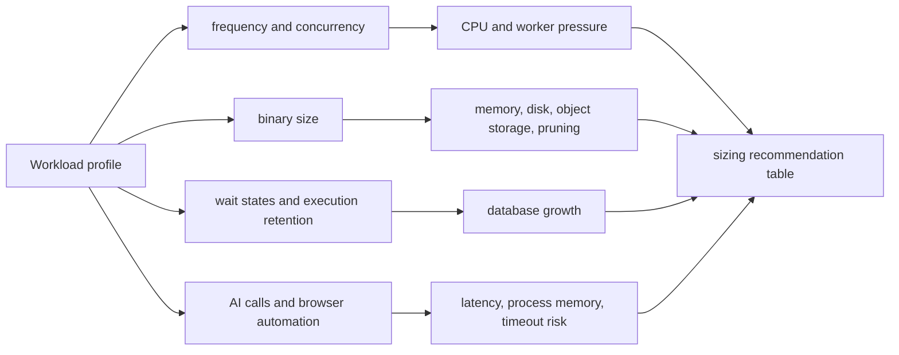
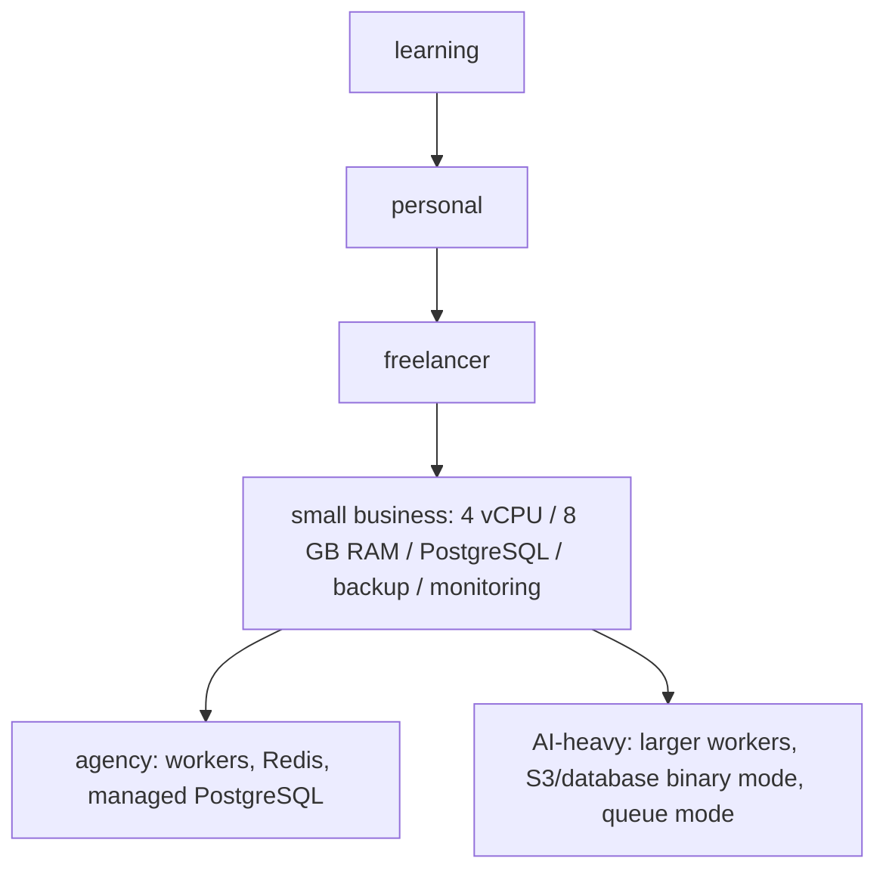
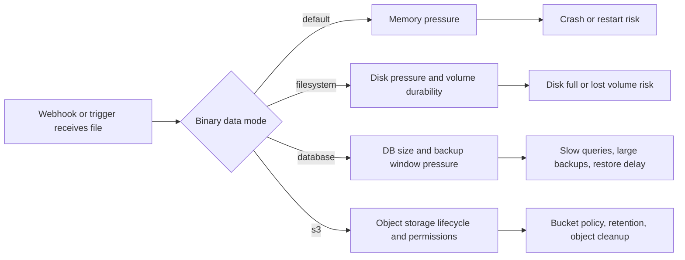

# Week 13｜資料庫、binary data 與容量規劃

> 執行日期：2026-05-27
> 目標：回答如何為不同負載選擇初始規格，並避免 binary-heavy workflow 拖垮記憶體。
> 實作結果：完成 sizing recommendation table、binary-heavy workflow 風險說明、容量觀察指標清單，並把驗收重點鎖定在 small business 的 `4 vCPU / 8 GB RAM / PostgreSQL / backup / monitoring` 合理起點與調整理由。

## 1. 本週交付物總覽

| 交付物 | 狀態 | 檔案 |
| --- | --- | --- |
| sizing recommendation table | 完成 | `artifacts/week-13-capacity/week-13-sizing-recommendation-table.json`；本文件第 3 節 |
| binary-heavy workflow 風險說明 | 完成 | `artifacts/week-13-capacity/week-13-binary-heavy-risk-register.json`；本文件第 4 節 |
| 容量觀察指標清單 | 完成 | `artifacts/week-13-capacity/week-13-capacity-observation-metrics.csv`；本文件第 5 節 |
| server sizing table 解讀 | 完成 | 本文件第 2、3 節 |
| frequency、concurrency、binary size、wait states、AI calls、browser automation 影響整理 | 完成 | 本文件第 6 節 |
| Week 13 驗證腳本 | 完成 | `scripts/verify-week-thirteen.mjs` |

Week 12 的結論是：Cloud SQL、RDS、Secret Manager、Secrets Manager、CloudWatch 這類 building blocks 讓 state、secrets、logs、backup 變得更 durable，但也讓你必須明確做容量規劃。Week 13 往下鑽到 n8n 最容易被低估的資源層：database、execution data、binary data、memory、queue、monitoring。核心判斷不是「規格越大越安全」，而是先看 workflow 的資料形狀與執行模式，再用觀察指標決定是否升級。

## 2. 官方來源核對

| 主題 | 官方來源 | 本週採用的判斷 |
| --- | --- | --- |
| server sizing table 與資源考量 | https://docs.n8n.io/hosting/oem-deployment/prerequisites/ | n8n 官方 prerequisites 提醒需求會依 users、workflows、executions 而變；CPU 通常不是最先卡住的資源，memory 與資料形狀更關鍵。 |
| performance factors | https://docs.n8n.io/hosting/scaling/performance-benchmarking/ | n8n 官方 performance page 把 workflow type、available resources、scaling configuration 列為效能因素；精準估算應做 benchmark。 |
| scaling overview | https://docs.n8n.io/hosting/scaling/overview/ | 大量 users、workflows、executions 時需要調整設定；queue mode 是主要 scaling 路線，execution data/pruning 會影響 database performance。 |
| supported databases | https://docs.n8n.io/hosting/configuration/supported-databases-settings/ | n8n self-host 預設 SQLite，也支援 PostgreSQL；重要流程與多人使用應優先把 state 放在 PostgreSQL。 |
| database environment variables | https://docs.n8n.io/hosting/configuration/environment-variables/database/ | `DB_TYPE=postgresdb` 是切換到 PostgreSQL 的核心設定。 |
| queue mode | https://docs.n8n.io/hosting/scaling/queue-mode/ | queue mode 用 Redis 與 workers 拆分 execution；n8n 建議 queue mode 使用 Postgres 13+，不建議 SQLite。 |
| concurrency control | https://docs.n8n.io/hosting/scaling/concurrency-control/ | regular mode 預設不限制 production executions，同時過多會造成 event loop thrash；可用 `N8N_CONCURRENCY_PRODUCTION_LIMIT` 控制。 |
| execution data | https://docs.n8n.io/hosting/scaling/execution-data/ | execution data pruning 預設啟用，會依 age 與 count 清理；`waiting` 狀態不會被 pruning。 |
| executions env vars | https://docs.n8n.io/hosting/configuration/environment-variables/executions/ | `EXECUTIONS_DATA_PRUNE`、`EXECUTIONS_DATA_MAX_AGE`、`EXECUTIONS_DATA_PRUNE_MAX_COUNT`、`N8N_CONCURRENCY_PRODUCTION_LIMIT` 是容量控制重點。 |
| binary data | https://docs.n8n.io/hosting/scaling/binary-data/ | n8n 預設把 binary data 放在 memory，處理大檔可能 crash；filesystem mode 可把資料寫到 disk；queue mode 不支援 filesystem mode。 |
| binary data env vars | https://docs.n8n.io/hosting/configuration/environment-variables/binary-data/ | `N8N_DEFAULT_BINARY_DATA_MODE` 可設為 `filesystem`、`s3` 或 `database`；active mode 會影響 binary data pruning。 |
| external storage | https://docs.n8n.io/hosting/scaling/external-storage/ | Self-hosted Enterprise 可把 binary data 放到 S3，用來避免依賴 filesystem 承載大量 binary data。 |
| memory-related errors | https://docs.n8n.io/hosting/scaling/memory-errors/ | memory 問題通常來自 workflow 資料量、binary files、複製資料、並發與 node 行為，需要以 workload 方式分析。 |
| monitoring | https://docs.n8n.io/hosting/logging-monitoring/monitoring/ | production 要開監控指標與健康檢查，尤其是 execution、queue、worker、process 指標。 |
| logging | https://docs.n8n.io/hosting/logging-monitoring/logging/ | logs 是定位 crash、timeout、queue backlog、DB connection、external API error 的第一層證據。 |
| waiting | https://docs.n8n.io/flow-logic/waiting/ | Wait node 會讓 workflow 暫停後再從同一份資料恢復，會把 execution state 留在系統裡。 |
| AI workflows | https://docs.n8n.io/advanced-ai/intro-tutorial/ | AI workflow 會引入 model latency、token payload、tool calls 與評估資料，容量規劃要把外部 API 時間與資料大小納入。 |
| host command execution | https://docs.n8n.io/integrations/builtin/core-nodes/n8n-nodes-base.executecommand/ | Execute Command 會在 host/container/worker 上執行 shell command；browser automation 若透過外部程序執行，會消耗 worker 所在節點的 CPU 與 memory。 |

本週的規格表不是把官方最小需求當 production 建議，而是把官方限制轉成操作規則：先用 workload profile 選一個保守起點，再用 metrics 決定升級。`4 vCPU / 8 GB RAM / PostgreSQL / backup / monitoring` 是 small business 的合理起點，前提是 workflow 不以超大 binary data、長時間 browser automation 或高併發 AI calls 為主。

## 3. 交付物一：sizing recommendation table

| Profile | 初始規格 | Database | Binary data mode | Backup | Monitoring | 合理使用範圍 |
| --- | --- | --- | --- | --- | --- | --- |
| learning | 1 vCPU / 1 到 2 GB RAM | SQLite 可接受 | default 或 filesystem | 手動 export workflows + credentials key 保存 | local logs | 學習 n8n UI、少量 manual executions、無重要 production webhook。 |
| personal | 2 vCPU / 4 GB RAM | SQLite 可用；重要流程改 PostgreSQL | filesystem 優先 | 每日 volume snapshot 或 DB dump | 基本 uptime + logs | 個人自動化、低頻 schedule、少量 webhook、binary file 偶發。 |
| freelancer | 2 vCPU / 4 GB RAM 起；客戶流程多時升到 4 vCPU / 8 GB RAM | PostgreSQL 建議 | filesystem；queue mode 時改 database | 每日 PostgreSQL backup + restore drill | HTTP、CPU、memory、disk、DB size | 多個客戶 workflow、需要穩定 webhook、仍是單機或低併發。 |
| small business | 4 vCPU / 8 GB RAM | PostgreSQL | filesystem；高併發或 queue mode 改 database/S3 | 每日自動備份 + 每月 restore drill | monitoring dashboard + alerts | 多人使用、固定 business workflow、moderate webhook、需要可恢復資料層。 |
| agency | 4 到 8 vCPU / 16 GB RAM 起；依 worker 數拆分 | Managed PostgreSQL | database 或 S3；避免單機 filesystem 鎖死 workers | PITR 或快照 + restore runbook | Prometheus/CloudWatch/Grafana + log alert | 多客戶、多 workflow、併發 webhook、需要 worker separation 與環境隔離。 |
| AI-heavy | 8 vCPU / 16 到 32 GB RAM 起；worker 獨立 sizing | Managed PostgreSQL + Redis queue mode | S3 或 database；大檔不放 memory | DB + object storage backup + retention policy | model latency、error rate、queue depth、worker memory | RAG、document processing、multi-step agents、browser automation、長 latency external API calls。 |

### small business 起點結論

small business 的合理起點是 `4 vCPU / 8 GB RAM / PostgreSQL / backup / monitoring`。理由有五個：

| 層面 | 判斷 |
| --- | --- |
| CPU | n8n 官方指出 CPU 通常不是最先卡住的資源，但 business workflow 會有多個 trigger、HTTP requests、transform、webhook response，4 vCPU 給 event loop、PostgreSQL client、background jobs、OS/container 留出餘裕。 |
| Memory | binary data、Code node、large JSON payload、AI response、browser automation 都會推高 memory，8 GB 比 2 到 4 GB 更能承受 business burst。 |
| Database | SQLite 適合學習與低風險個人使用；small business 需要 workflows、credentials、executions 可備份、可還原、可遷移，因此 PostgreSQL 是合理起點。 |
| Backup | business 不是只要「今天能跑」，而是要能從錯誤升級、誤刪 workflow、DB corruption、host failure 裡恢復；每日 backup 與 restore drill 是基本線。 |
| Monitoring | 沒有 monitoring 就無法知道是 CPU、memory、DB、binary disk、queue、AI API 還是 webhook latency 卡住；small business 起點必須把 alerts 納入，不是等事故後再看 logs。 |

### 調整理由

| 若觀察到 | 調整 |
| --- | --- |
| CPU 長時間高於 70%，execution latency 上升，但 memory 與 DB 正常 | 增加 vCPU，或把重 CPU workflow 拆到 queue workers。 |
| memory RSS 長時間高於 70%，有 container restart 或 JavaScript heap error | 降低 concurrency、改 binary filesystem/database/S3、拆分大型 Code node、增加 RAM。 |
| PostgreSQL CPU、connection、storage 增長快 | 調整 execution data save/prune、升級 DB tier、檢查長時間 waiting executions。 |
| webhook burst 導致 response time 升高 | 設 `N8N_CONCURRENCY_PRODUCTION_LIMIT`，或進 queue mode + workers + Redis。 |
| binary data disk 增長快 | 啟用 pruning、改 external storage、限制檔案大小、縮短 retention。 |
| AI calls 與 browser automation 佔用時間長 | 以 worker pool 隔離，設定 timeout/retry/rate limit，避免拖慢一般 webhook。 |

## 4. 交付物二：binary-heavy workflow 風險說明

binary-heavy workflow 指的是會處理 image、PDF、audio、video、large CSV、zip、document extraction、screenshots、headless browser downloads、AI document processing 的 workflow。這類 workflow 最大問題不是「檔案能不能進 n8n」，而是檔案在 execution 過程中會經過 memory、temporary storage、execution data、binary data mode、backup、pruning、download/upload API，每一層都可能被放大。

| 風險 | 為什麼危險 | 早期訊號 | 降低風險 |
| --- | --- | --- | --- |
| default memory mode 處理大檔 | n8n 預設 binary data 在 memory；大檔與多併發會讓 process crash。 | memory RSS 上升、container restart、workflow 卡在同一個 binary step。 | production 改 `N8N_DEFAULT_BINARY_DATA_MODE=filesystem`；queue mode 改 database 或 external storage。 |
| filesystem mode disk 增長 | 大量檔案會吃掉 volume；volume 沒持久化會在 redeploy 後遺失。 | disk usage 持續上升、binaryData 目錄過大、backup 時間增加。 | 使用 persistent volume、disk alert、pruning、retention policy。 |
| database mode 放大 DB | binary data 進 DB 會讓 storage、backup、restore、vacuum、query latency 都變重。 | DB size 快速成長、backup window 拉長、PostgreSQL I/O 高。 | 只在 queue mode 或共享 worker 需要時使用；大檔優先 external storage。 |
| S3/external storage lifecycle 不清楚 | object storage 可減輕 filesystem，但權限、retention、pruning mode 一定要一致。 | DB execution 已清理但 bucket 仍成長，或 workflow 找不到 object。 | bucket lifecycle、IAM least privilege、mode migration checklist、restore test。 |
| Wait node 與 binary data 結合 | `waiting` status 不會被 execution pruning 清掉；暫停的 execution 會保留資料直到恢復。 | waiting executions 數量上升、old execution data 保留、DB/storage 未下降。 | 對 wait states 設計上限，避免把大型 binary data 帶進長等待。 |
| AI calls 處理文件 | AI workflow 會疊加文件抽取、prompt payload、response、tool calls、external API latency。 | AI API latency 上升、retry 多、execution duration 拉長。 | 先縮小文件、分段處理、把長任務放 queue worker，設定 timeout 與 retry。 |
| browser automation | headless browser、screenshots、downloads 會在 host/container/worker 上吃 CPU、RAM、disk。 | worker memory spike、Chrome process 殘留、download 目錄暴增。 | worker 隔離、限制並發、清理 temp files、把 browser automation 與普通 webhook 分池。 |
| 大 webhook payload | 外部服務一次送大檔或高頻 burst，會同時壓 memory、disk、DB 與 response time。 | webhook latency 上升、HTTP timeout、queue backlog。 | 前置檔案大小限制、signed upload URL、queue mode、concurrency limit。 |

## 5. 交付物三：容量觀察指標清單

| 指標 | 為什麼要看 | 警訊 | 對應動作 |
| --- | --- | --- | --- |
| CPU usage | 判斷 event loop、transform、browser automation 是否吃滿 CPU | 5 到 15 分鐘平均高於 70% 且 latency 上升 | 增加 vCPU、拆 worker、降低並發。 |
| memory RSS / heap | binary data、large JSON、Code node、AI payload 會推高 memory | 高於 70% 且持續上升，或出現 restart | 調整 binary mode、增加 RAM、拆 workflow。 |
| container restarts / OOM | 直接反映 crash 與容量不足 | 任意非預期 restart | 查 logs、降低 concurrency、增加 memory、拆重任務。 |
| PostgreSQL storage | execution data 與 binary data 會讓 DB 成長 | DB 每週增長超出預期或 backup window 變長 | 調整 `EXECUTIONS_DATA_MAX_AGE`、prune count、改 binary storage。 |
| PostgreSQL connections | queue mode、workers、webhook burst 會增加 DB connection | 接近 DB limit 或連線等待 | 降低 worker 數、調 pool、升級 DB。 |
| execution count and duration | 直接描述實際 workload | duration p95 上升或 failed execution 增加 | 找出慢 workflow，拆分與加上 timeout。 |
| active / waiting executions | waiting executions 會保留 state | waiting 數量持續增加 | 設等待上限，避免長時間保留大型 payload。 |
| queue depth / worker backlog | queue mode 是否處理得過來 | queue depth 持續增加 | 增加 workers、調整 concurrency、拆分重任務。 |
| webhook latency | 外部系統最直接感受到的 SLA | p95 超過外部 provider timeout 風險 | 快速回應，重任務放 background queue。 |
| binary storage size | filesystem/S3/database 的容量風險 | binary storage 持續上升且 pruning 未下降 | 檢查 active mode、lifecycle、retention、檔案大小。 |
| AI API latency/error rate | 外部 model 會拖長 execution | latency 或 429/5xx 上升 | rate limit、retry backoff、fallback model。 |
| browser automation duration/memory | headless browser 容易吃掉 worker | duration 拉長、worker memory spike | 限制並發、獨立 worker pool、清 temp files。 |
| backup success and duration | backup 是可恢復性的底線 | backup 失敗或 restore 未演練 | 立即修復 backup，定期 restore drill。 |
| log error rate | 最早暴露 DB、queue、credentials、API、storage 問題 | 同類 error 增加 | 建立 alert，回到相關 runbook。 |

## 6. 負載因素如何改變初始規格

### frequency

frequency 是 workflow 啟動頻率。每分鐘一個 schedule 與每天一次 manual run 的容量模型完全不同。高 frequency 會累積 execution count、DB writes、logs、API calls；如果每次又保存完整 execution data，PostgreSQL 與 backup 會比 CPU 更早成為瓶頸。

### concurrency

concurrency 是同時間執行數。n8n regular mode 預設不限制 production executions，同時太多會讓 event loop thrash。small business 起點可先用 `N8N_CONCURRENCY_PRODUCTION_LIMIT` 控制 burst；如果 webhook burst 變成常態，才進 queue mode、Redis、workers。

### binary size

binary size 直接決定 memory、disk、DB、backup 壓力。default mode 下大檔會進 memory，filesystem mode 會壓 disk，database mode 會壓 DB，S3 mode 會壓 object lifecycle 與 permissions。binary-heavy workload 不應只看 vCPU/RAM，必須看檔案大小、保存時間、active binary mode 與 pruning。

### wait states

wait states 會把 execution 暫停，再用同一份資料恢復。這對 rate limit 與人工確認很有用，但 `waiting` status 不會被 pruning，長時間等待加大型 payload 會讓 DB/storage 保留資料。設計時要避免把大型 binary data 帶入長等待。

### AI calls

AI calls 的容量瓶頸常常不是 CPU，而是外部 API latency、token payload、retry、rate limit、document extraction 與 response size。AI-heavy workflow 應使用 queue workers、分段文件、timeout、retry backoff、model error monitoring，不要讓一般 webhook 和長 AI execution 搶同一個單機 process。

### browser automation

browser automation 若透過 Execute Command、自建 node 或 worker 外部程序跑 headless browser，CPU、RAM、download directory、temp files 會在執行節點上爆量。它要獨立 worker pool、低 concurrency、明確 cleanup、process timeout；不要把它當普通 HTTP Request node 估容量。

## 7. small business 起點建議

### 建議起點

| 項目 | 建議 |
| --- | --- |
| Runtime | 4 vCPU / 8 GB RAM |
| Database | PostgreSQL，避免把 business state 放在 SQLite |
| Binary data | 一般情境用 filesystem + persistent volume；queue mode 時改 database 或 external storage |
| Backup | 每日 automated backup，至少每月一次 restore drill |
| Monitoring | CPU、memory、restart、HTTP status、webhook latency、DB storage、DB connections、execution failures、binary storage、backup status |
| Concurrency | 先設定保守 `N8N_CONCURRENCY_PRODUCTION_LIMIT`，觀察後再增加 |
| Upgrade trigger | p95 latency 上升、memory 高水位、DB 增長過快、backup 超時、queue backlog、binary storage 成長不可控 |

### 為什麼不是直接 2 vCPU / 4 GB RAM

2 vCPU / 4 GB RAM 可以跑很多 personal 或 freelancer 場景，但 small business 有幾個差異：多人使用、重要 webhook、固定工作流、更多 execution history、更多 credentials、更多錯誤重試、需要可預測 backup。8 GB RAM 不是浪費，而是給 binary data、large JSON、AI response、browser automation、Node.js heap、PostgreSQL client、OS/container 留一個事故緩衝。

### 什麼時候升級

| 狀態 | 升級路線 |
| --- | --- |
| 單機 CPU/RAM 偶爾尖峰，但平均正常 | 先調 workflow、pruning、concurrency，不急著加 workers。 |
| webhook latency 受重任務影響 | 把重任務轉 background workflow，或使用 queue mode。 |
| execution 量增加，DB writes/reads 明顯上升 | 升級 PostgreSQL、調 retention、避免保存不必要成功 execution data。 |
| binary data 成為主要容量來源 | 轉 S3/external storage 或縮短 retention，並測 restore。 |
| AI-heavy 或 browser automation 成為主業務 | 建立獨立 worker pool，規格從 8 vCPU / 16 GB RAM 起測。 |

## 8. 規格調整 runbook

1. 先分類 workflow：learning、personal、freelancer、small business、agency、AI-heavy。
2. 填 frequency、concurrency、binary size、wait states、AI calls、browser automation 六項影響因素。
3. 選初始規格：small business 以 `4 vCPU / 8 GB RAM / PostgreSQL / backup / monitoring` 起步。
4. 設 execution data policy：成功 execution 是否保存、保存多久、最多保存幾筆、manual executions 是否保存。
5. 設 binary data mode：default 只適合小型與低風險；production binary-heavy 不使用 default memory mode。
6. 設 alerts：CPU、memory、restart、DB storage、DB connections、disk、binary storage、queue depth、failed executions、backup failure。
7. 跑 7 到 14 天觀察：看 p95 latency、memory high-water mark、DB growth、binary growth、backup duration。
8. 按瓶頸調整：CPU 加 vCPU，memory 加 RAM 或改 binary mode，DB 升級或 prune，webhook burst 進 queue mode，AI/browser automation 拆 worker。
9. 每次調整後做 restore drill，確認 backup 與 object storage lifecycle 沒有被規格變更破壞。

## 9. Week 13 完成檢查

| 驗收條件 | 結果 | 證據 |
| --- | --- | --- |
| 讀 server sizing table | 通過 | 第 2、3 節，採用 n8n prerequisites 與 performance 官方說明 |
| 整理 learning、personal、freelancer、small business、agency、AI-heavy 初始規格 | 通過 | 第 3 節與 `week-13-sizing-recommendation-table.json` |
| 辨認 frequency、concurrency、binary size、wait states、AI calls、browser automation 影響 | 通過 | 第 6 節 |
| 完成 sizing recommendation table | 通過 | 第 3 節與 JSON artifact |
| 完成 binary-heavy workflow 風險說明 | 通過 | 第 4 節與 risk register JSON |
| 完成容量觀察指標清單 | 通過 | 第 5 節與 CSV artifact |
| 能為 small business 提出 4 vCPU / 8 GB RAM / PostgreSQL / backup / monitoring 起點或調整理由 | 通過 | 第 3、7、8 節 |

## 10. 下一週銜接

Week 14 會進入備份、還原與更新流程。Week 13 已定義 PostgreSQL、binary data、execution data、backup、monitoring 的容量基線，下一週要把這些基線變成可演練的 restore drill、upgrade runbook、rollback checklist 與版本更新節奏。
