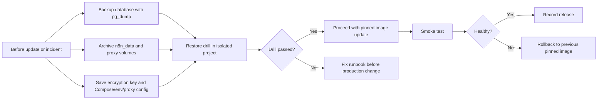
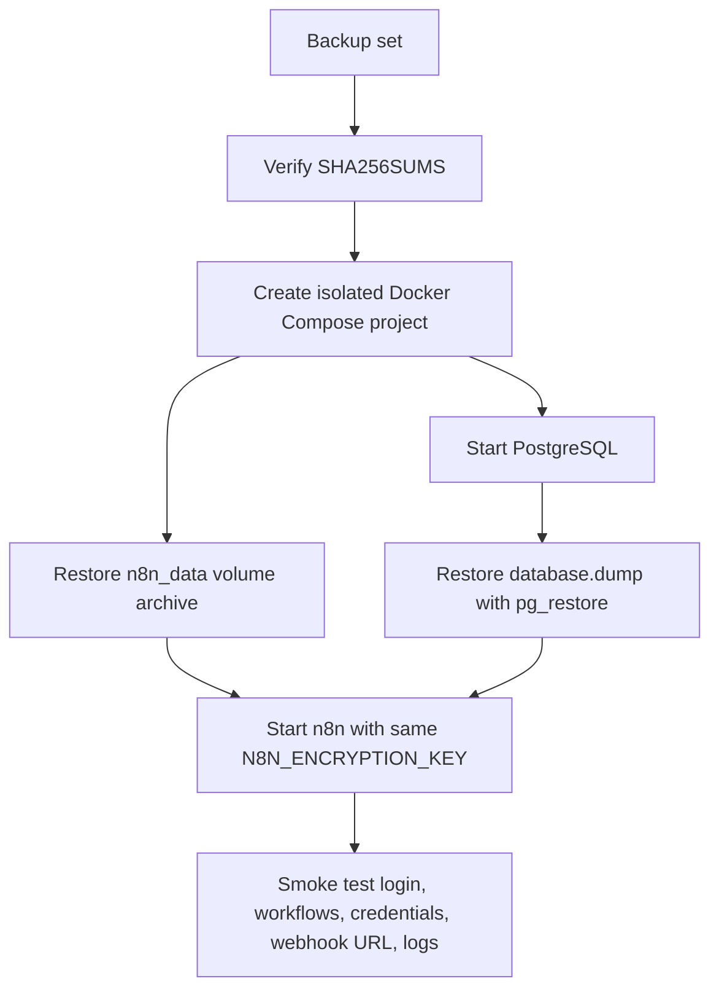

# Week 14｜備份、還原與更新流程

> 執行日期：2026-05-28
> 目標：回答如何讓 n8n 不只會跑，還能在升級失敗或資料遺失時回得來。
> 實作結果：完成 backup runbook、restore runbook、update / rollback checklist，並明確保存 database、volume、encryption key、Compose/env/proxy config，設計一次隔離還原演練。

## 1. 本週交付物總覽

| 交付物 | 狀態 | 檔案 |
| --- | --- | --- |
| backup runbook | 完成 | `artifacts/week-14-recovery/week-14-backup-runbook.json`；本文件第 3 節 |
| restore runbook | 完成 | `artifacts/week-14-recovery/week-14-restore-runbook.json`；本文件第 4 節 |
| update / rollback checklist | 完成 | `artifacts/week-14-recovery/week-14-update-rollback-checklist.csv`；本文件第 5 節 |
| pg_dump 與 volume archive | 完成 | 本文件第 3、4 節 |
| restore command 與演練 | 完成 | 本文件第 4、6 節 |
| release notes、image pinning、pull、restart、test、rollback | 完成 | 本文件第 5、7 節 |
| Week 14 驗證腳本 | 完成 | `scripts/verify-week-fourteen.mjs` |



Week 13 的結論是：small business 的合理起點不只是 `4 vCPU / 8 GB RAM / PostgreSQL / backup / monitoring`，還要真的能觀察與恢復。Week 14 把這個「backup」拆成可執行的四件事：database dump、volume archive、encryption key 保存、Compose/env/proxy config 保存。缺任何一件，都可能造成 n8n 可以啟動卻無法解密 credentials、找不到 binary data、失去 webhook/proxy URL，或升級後無法回到原狀。

## 2. 官方來源核對

| 主題 | 官方來源 | 本週採用的判斷 |
| --- | --- | --- |
| n8n Docker installation | https://docs.n8n.io/hosting/installation/docker/ | n8n Docker guide 建議 self-host 使用 Docker，並把 `n8n_data` volume 掛到 `/home/node/.n8n` 以保存資料；使用 PostgreSQL 時 `.n8n` 仍包含 encryption keys、logs、source control assets 等重要資料。 |
| n8n Docker Compose updating | https://docs.n8n.io/hosting/installation/docker/#updating-docker-compose | n8n 官方更新 Docker Compose 的基本流程是進 compose 目錄、`docker compose pull`、`docker compose down`、`docker compose up -d`；production 需要加上 backup、image pinning、smoke test 與 rollback。 |
| n8n release notes | https://docs.n8n.io/release-notes/ | n8n 發布節奏頻繁，release notes 說明 stable/beta、semantic versioning 與版本變更；升級前必須閱讀目標版本與中間版本資訊。 |
| n8n encryption key | https://docs.n8n.io/hosting/configuration/configuration-examples/encryption-key/ | n8n 用 encryption key 加密 credentials；若 key 遺失或更換，資料庫仍在也可能無法解密既有 credentials；queue mode 所有 workers 都要同一把 key。 |
| n8n database env vars | https://docs.n8n.io/hosting/configuration/environment-variables/database/ | PostgreSQL 模式需要保存 `DB_TYPE=postgresdb`、host、database、user、password、schema 等設定，還原時要與 backup 對應。 |
| n8n webhook URL | https://docs.n8n.io/hosting/configuration/configuration-examples/webhook-url/ | proxy/custom domain 後方要保存 `WEBHOOK_URL` 與 editor base URL，否則還原後 webhook 或 OAuth callback 會指錯位置。 |
| n8n binary data | https://docs.n8n.io/hosting/scaling/binary-data/ | binary data mode 會影響要備份的 storage；filesystem mode 需要 volume archive，database mode 會進 database dump，S3 mode 要另有 bucket/lifecycle/restore 策略。 |
| PostgreSQL pg_dump | https://www.postgresql.org/docs/current/app-pgdump.html | `pg_dump` 可匯出 PostgreSQL database；custom format `-Fc` 搭配 `pg_restore` 更適合還原演練與選擇性 restore。 |
| PostgreSQL pg_restore | https://www.postgresql.org/docs/current/app-pgrestore.html | `pg_restore` 可把 custom format dump 還原到指定 database；restore drill 應在隔離 database/project 中驗證，不直接覆蓋 production。 |
| Docker volumes | https://docs.docker.com/engine/storage/volumes/ | Docker volumes 是持久化資料層；volume archive 可用臨時容器把 volume 掛進去後用 tar 打包或解開。 |
| Docker Compose pull | https://docs.docker.com/reference/cli/docker/compose/pull/ | `docker compose pull` 取得 service image；本 runbook 要求先 pin 目標 tag 再 pull。 |
| Docker Compose up/down | https://docs.docker.com/reference/cli/docker/compose/up/ 與 https://docs.docker.com/reference/cli/docker/compose/down/ | `up -d` 啟動或重建 service；`down` 停止並移除 containers/networks，但不能搭配 `-v` 用在一般更新，避免誤刪 volumes。 |

本週文件採用 Week 10 的 VPS + Docker Compose + Caddy 架構作為範本：`postgres` 保存 database，`n8n_data` 保存 `/home/node/.n8n`，`caddy_data`/`caddy_config` 保存 reverse proxy 狀態，`compose.yaml`、`.env`、`Caddyfile` 保存 Compose/env/proxy config。若你的實際 production 是 Cloud Run、AWS、Railway、Zeabur、Render 或 Fly.io，四個不可缺項仍相同，只是實作工具改成平台的 managed backup、volume snapshot、secret manager export policy 與 IaC config backup。

## 3. 交付物一：backup runbook

### 備份範圍

| 類別 | 必須保存 | 原因 |
| --- | --- | --- |
| database | PostgreSQL dump：`database.dump` | workflows、credentials metadata、executions、users、settings 等主要 state。 |
| volume | `n8n_data.tgz`、必要時 `caddy_data.tgz`、`caddy_config.tgz` | `/home/node/.n8n` 仍可能保存 encryption keys、logs、source control assets；proxy volumes 可能保存 certificates 或 Caddy state。 |
| encryption key | `N8N_ENCRYPTION_KEY` 的受控副本 | credentials 解密依賴同一把 key；database 還原但 key 遺失仍會造成 credentials 無法使用。 |
| Compose/env/proxy config | `compose.yaml`、`.env`、`Caddyfile`、`docker-compose.rendered.yaml`、checksum manifest | 還原時要重建相同 image、env vars、DB connection、WEBHOOK_URL、N8N_EDITOR_BASE_URL、proxy routing 與 TLS 設定。 |

### 備份命令範本

以下命令以 `artifacts/week-10-vps-caddy` 架構為範本，production 使用前要在真正 compose 目錄執行，並確認 backup 目的地是加密磁碟、受控 object storage 或離線保管空間。

```bash
set -euo pipefail

APP_DIR="artifacts/week-10-vps-caddy"
BACKUP_ID="$(date -u +%Y%m%dT%H%M%SZ)"
BACKUP_DIR="backups/${BACKUP_ID}"

cd "${APP_DIR}"
mkdir -p "${BACKUP_DIR}"
chmod 700 "${BACKUP_DIR}"

set -a
. ./.env
set +a

docker compose --env-file .env -f compose.yaml config > "${BACKUP_DIR}/docker-compose.rendered.yaml"
cp compose.yaml .env Caddyfile "${BACKUP_DIR}/"
awk -F= '/^N8N_ENCRYPTION_KEY=/{print $2}' .env > "${BACKUP_DIR}/n8n-encryption-key.txt"
chmod 600 "${BACKUP_DIR}/.env" "${BACKUP_DIR}/n8n-encryption-key.txt"

docker compose --env-file .env -f compose.yaml exec -T postgres \
  pg_dump -U "${POSTGRES_USER}" -d "${POSTGRES_DB}" -Fc --no-owner --no-acl \
  > "${BACKUP_DIR}/database.dump"

docker run --rm \
  -v n8n-week10-vps_n8n_data:/source:ro \
  -v "${PWD}/${BACKUP_DIR}":/backup \
  alpine:3.20 \
  tar -czf /backup/n8n_data.tgz -C /source .

docker run --rm \
  -v n8n-week10-vps_caddy_data:/source:ro \
  -v "${PWD}/${BACKUP_DIR}":/backup \
  alpine:3.20 \
  tar -czf /backup/caddy_data.tgz -C /source .

docker run --rm \
  -v n8n-week10-vps_caddy_config:/source:ro \
  -v "${PWD}/${BACKUP_DIR}":/backup \
  alpine:3.20 \
  tar -czf /backup/caddy_config.tgz -C /source .

shasum -a 256 "${BACKUP_DIR}"/* > "${BACKUP_DIR}/SHA256SUMS"
find "${BACKUP_DIR}" -maxdepth 1 -type f -print | sort
```

### 備份驗收

| 檢查 | 通過條件 |
| --- | --- |
| database dump | `database.dump` 非空，`pg_restore -l database.dump` 可列出 archive contents。 |
| volume archive | `n8n_data.tgz` 非空，`tar -tzf n8n_data.tgz` 可列出檔案；若使用 filesystem binary data，能看到對應 binary data 路徑或設定。 |
| encryption key | `n8n-encryption-key.txt` 與 `.env` 中 `N8N_ENCRYPTION_KEY` 相同，檔案權限為 owner-only。 |
| Compose/env/proxy config | `compose.yaml`、`.env`、`Caddyfile`、rendered compose 都在同一份 backup set。 |
| checksum | `SHA256SUMS` 可在搬移後重新驗證。 |
| storage policy | backup set 已移到 production host 以外的位置，且存放位置加密、有存取紀錄、有 retention。 |

### 失敗規則

若 `database.dump`、`n8n_data.tgz`、`N8N_ENCRYPTION_KEY`、`compose.yaml`、`.env`、`Caddyfile`、`docker-compose.rendered.yaml` 任一項缺失，本次 backup 不算完成。不能在 backup 不完整時進行 production upgrade。

## 4. 交付物二：restore runbook

### 還原原則

還原演練必須在隔離 project 中進行，例如 `n8n-week14-restore-drill`。隔離的意思是：不使用 production container name，不接 production domain，不覆蓋 production volume，不讓外部 webhook provider 打到演練環境。演練目標是證明 backup set 可以重建出可登入、可解密 credentials、可查看 workflows、可連 PostgreSQL、可使用正確 proxy/env config 的 n8n。



### 隔離還原命令範本

```bash
set -euo pipefail

APP_DIR="artifacts/week-10-vps-caddy"
BACKUP_DIR="backups/20260528T000000Z"
RESTORE_PROJECT="n8n-week14-restore-drill"

cd "${APP_DIR}"

shasum -a 256 -c "${BACKUP_DIR}/SHA256SUMS"

docker compose -p "${RESTORE_PROJECT}" --env-file "${BACKUP_DIR}/.env" -f "${BACKUP_DIR}/compose.yaml" down --remove-orphans

docker volume rm "${RESTORE_PROJECT}_n8n_data" "${RESTORE_PROJECT}_caddy_data" "${RESTORE_PROJECT}_caddy_config" "${RESTORE_PROJECT}_postgres_data" 2>/dev/null || true
docker volume create "${RESTORE_PROJECT}_n8n_data"
docker volume create "${RESTORE_PROJECT}_caddy_data"
docker volume create "${RESTORE_PROJECT}_caddy_config"
docker volume create "${RESTORE_PROJECT}_postgres_data"

docker run --rm \
  -v "${RESTORE_PROJECT}_n8n_data":/target \
  -v "${PWD}/${BACKUP_DIR}":/backup:ro \
  alpine:3.20 \
  sh -c 'cd /target && tar -xzf /backup/n8n_data.tgz'

docker run --rm \
  -v "${RESTORE_PROJECT}_caddy_data":/target \
  -v "${PWD}/${BACKUP_DIR}":/backup:ro \
  alpine:3.20 \
  sh -c 'cd /target && tar -xzf /backup/caddy_data.tgz'

docker run --rm \
  -v "${RESTORE_PROJECT}_caddy_config":/target \
  -v "${PWD}/${BACKUP_DIR}":/backup:ro \
  alpine:3.20 \
  sh -c 'cd /target && tar -xzf /backup/caddy_config.tgz'

set -a
. "${BACKUP_DIR}/.env"
set +a

docker compose -p "${RESTORE_PROJECT}" --env-file "${BACKUP_DIR}/.env" -f "${BACKUP_DIR}/compose.yaml" up -d postgres

docker compose -p "${RESTORE_PROJECT}" --env-file "${BACKUP_DIR}/.env" -f "${BACKUP_DIR}/compose.yaml" exec -T postgres \
  sh -c "dropdb -U \"${POSTGRES_USER}\" --if-exists \"${POSTGRES_DB}\" && createdb -U \"${POSTGRES_USER}\" \"${POSTGRES_DB}\""

docker compose -p "${RESTORE_PROJECT}" --env-file "${BACKUP_DIR}/.env" -f "${BACKUP_DIR}/compose.yaml" exec -T postgres \
  pg_restore -U "${POSTGRES_USER}" -d "${POSTGRES_DB}" --no-owner --no-acl --exit-on-error \
  < "${BACKUP_DIR}/database.dump"

docker compose -p "${RESTORE_PROJECT}" --env-file "${BACKUP_DIR}/.env" -f "${BACKUP_DIR}/compose.yaml" up -d n8n
docker compose -p "${RESTORE_PROJECT}" --env-file "${BACKUP_DIR}/.env" -f "${BACKUP_DIR}/compose.yaml" ps
docker compose -p "${RESTORE_PROJECT}" --env-file "${BACKUP_DIR}/.env" -f "${BACKUP_DIR}/compose.yaml" logs --tail=120 n8n
```

### 還原演練驗收

| 驗收項 | 通過條件 |
| --- | --- |
| checksum | `shasum -a 256 -c SHA256SUMS` 全部通過。 |
| PostgreSQL restore | `pg_restore` exit code 為 0，logs 沒有 schema/owner/permission fatal error。 |
| n8n starts | `docker compose ps` 顯示 `n8n` 與 `postgres` running 或 healthy。 |
| credentials decrypt | 登入演練環境後，既有 credentials 不出現 encryption key 相關錯誤。 |
| workflows visible | 既有 workflows、tags、users、settings 可見。 |
| volume data | `.n8n` 相關資料存在；若使用 filesystem binary data，抽樣 execution 可讀取 binary data。 |
| Compose/env/proxy config | `WEBHOOK_URL`、`N8N_EDITOR_BASE_URL`、`N8N_PROXY_HOPS`、Caddy reverse proxy 設定與 production 設計一致。 |
| isolation | 演練環境未接 production DNS，沒有外部 provider 對它送 production webhook。 |

### 還原失敗時的定位順序

| 症狀 | 第一個檢查 |
| --- | --- |
| n8n 起來但 credentials 無法使用 | `N8N_ENCRYPTION_KEY` 是否與 backup 時完全相同。 |
| workflows 不見 | PostgreSQL restore 是否用錯 database、schema、project 或 `.env`。 |
| webhook URL 指錯位置 | `.env`、`WEBHOOK_URL`、`N8N_EDITOR_BASE_URL`、proxy config 是否保存並還原。 |
| binary data 讀不到 | binary data mode 是 filesystem、database 或 S3；對應 volume、DB 或 bucket 是否一起還原。 |
| Caddy/TLS 失效 | `Caddyfile`、`caddy_data`、`caddy_config`、domain DNS 是否一致。 |

## 5. 交付物三：update / rollback checklist

| 階段 | 必做事項 | 通過訊號 | 失敗時動作 |
| --- | --- | --- | --- |
| release notes | 閱讀 n8n release notes、目標版本與中間版本，標記 breaking changes、deprecated nodes、migration notes。 | upgrade ticket 中列出版本差異與風險。 | 不升級，先補測試案例或等 patch release。 |
| image pinning | 把 `docker.n8n.io/n8nio/n8n:2.22.4` 這類明確 tag 寫進 compose，不用浮動 `latest` 當 production 依據。 | `docker compose config` 顯示 pinned tag。 | 停止流程，先 pin tag。 |
| backup | 執行第 3 節 backup runbook，確認 database、volume、encryption key、Compose/env/proxy config 都保存。 | backup set 完整且 checksum 通過。 | 不升級。 |
| restore drill | 用第 4 節 restore runbook 在隔離 project 演練。 | 登入、credentials、workflows、webhook URL、logs 都通過。 | 不升級，先修 backup 或 restore。 |
| pull | 先 pull pinned target image。 | `docker compose pull n8n` 成功，image digest 已記錄。 | 不重啟 production。 |
| restart | 用 `docker compose up -d n8n` 重建 n8n service；必要時依官方流程使用 `docker compose down` 再 `up -d`，但一般更新不能加 `-v`。 | service 起來，`docker compose ps` 正常。 | 立即看 logs，必要時 rollback。 |
| test | 測 editor、login、workflow list、credential decrypt、manual execution、production webhook、proxy HTTPS、logs。 | smoke tests 全部通過。 | 啟動 rollback。 |
| rollback | 把 compose image tag 改回 previous version，`docker compose pull n8n`，`docker compose up -d n8n`，用 backup set 驗證資料未被破壞。 | previous version 起來，smoke tests 通過。 | 若 DB migration 已不可逆，改走 full restore plan。 |
| record | 記錄版本、image digest、backup id、restore drill result、測試結果、是否 rollback。 | release log 有完整證據。 | 不關閉 change window。 |

## 6. 還原演練設計

### 演練名稱

`week-14-restore-drill-small-business-compose-postgres`

### 演練目標

證明一份 backup set 可以在隔離 project 重建 n8n，並且 database、volume、encryption key、Compose/env/proxy config 都能一起工作。這不是只測 `pg_restore`，而是測「使用者真的能回到可用狀態」。

### 演練資料

| 資料 | 來源 |
| --- | --- |
| `database.dump` | `pg_dump -Fc` 產生的 PostgreSQL dump。 |
| `n8n_data.tgz` | Docker volume archive，來源為 `n8n_data:/home/node/.n8n`。 |
| `caddy_data.tgz`、`caddy_config.tgz` | proxy volume archive。 |
| `n8n-encryption-key.txt` | `.env` 中的 `N8N_ENCRYPTION_KEY`。 |
| `compose.yaml`、`.env`、`Caddyfile`、`docker-compose.rendered.yaml` | Compose/env/proxy config。 |
| `SHA256SUMS` | 備份完整性檢查。 |

### 演練時間線

| 時間 | 動作 |
| --- | --- |
| T-30 分鐘 | 宣告演練，不接 production DNS，不使用 production project name。 |
| T-20 分鐘 | 驗證 backup set 完整性與 checksum。 |
| T-15 分鐘 | 建立隔離 volumes，解開 `n8n_data` 與 proxy archives。 |
| T-10 分鐘 | 啟動 PostgreSQL，drop/create 演練 database，執行 `pg_restore`。 |
| T-5 分鐘 | 啟動 n8n，確認 logs 沒有 encryption、DB、migration、permission fatal error。 |
| T+0 分鐘 | 登入 editor，確認 workflows、credentials、webhook URL、manual execution。 |
| T+15 分鐘 | 記錄 RTO、restore duration、錯誤、修正項。 |
| T+20 分鐘 | 停止並清理演練 project，保留演練紀錄。 |

### 演練通過條件

1. `SHA256SUMS` 完整通過。
2. `pg_restore` exit code 為 0。
3. `n8n` 起動後 logs 沒有 credentials decryption error。
4. workflows、credentials、users、settings 可見。
5. `WEBHOOK_URL` 與 `N8N_EDITOR_BASE_URL` 仍指向預期 production domain 或演練覆寫 domain，沒有變成 localhost。
6. 若 binary data 使用 filesystem mode，至少抽樣一筆含 binary data 的 execution 可以讀取附件。
7. RTO 與 restore duration 有記錄，且不超過 small business 允許停機窗口。

## 7. 更新與 rollback runbook

### 更新前

1. 看 n8n release notes：確認 target version、previous version、semantic versioning 風險、breaking changes、deprecated nodes、migration notes。
2. 固定 image tag：把 `docker.n8n.io/n8nio/n8n:2.22.4` 改成目標版本，例如 `docker.n8n.io/n8nio/n8n:2.23.0`。
3. 生成 rendered compose：`docker compose --env-file .env -f compose.yaml config > docker-compose.pre-update.yaml`。
4. 執行 backup runbook，確認 database、volume、encryption key、Compose/env/proxy config 都在 backup set。
5. 執行 restore drill，確認 backup set 真的可用。

### 更新中

```bash
set -euo pipefail

docker compose --env-file .env -f compose.yaml pull n8n
docker compose --env-file .env -f compose.yaml up -d n8n
docker compose --env-file .env -f compose.yaml ps
docker compose --env-file .env -f compose.yaml logs --tail=120 n8n
```

若此次更新涉及 database migration、major version、queue workers 或 schema 變更，先在 staging 或 restore drill project 跑一次，再進 production change window。

### 更新後 smoke test

| 測試 | 通過條件 |
| --- | --- |
| editor | 可登入 n8n editor。 |
| workflows | workflow list 可讀取，重要 workflow 可打開。 |
| credentials | 既有 credentials 不出現 decrypt error。 |
| manual execution | 一條低風險 workflow 可手動執行成功。 |
| webhook | 測試 webhook 回傳預期 HTTP status，production URL 不指 localhost。 |
| proxy | HTTPS、Caddy reverse proxy、headers、`N8N_PROXY_HOPS` 正常。 |
| logs | 沒有 migration fatal error、DB connection error、permission error、encryption key error。 |
| monitoring | failed execution rate、latency、restart count 沒有異常上升。 |

### rollback

```bash
set -euo pipefail

PREVIOUS_IMAGE="docker.n8n.io/n8nio/n8n:2.22.4"

perl -0pi -e "s#docker\\.n8n\\.io/n8nio/n8n:[0-9]+\\.[0-9]+\\.[0-9]+#${PREVIOUS_IMAGE}#g" compose.yaml
docker compose --env-file .env -f compose.yaml pull n8n
docker compose --env-file .env -f compose.yaml up -d n8n
docker compose --env-file .env -f compose.yaml ps
docker compose --env-file .env -f compose.yaml logs --tail=120 n8n
```

rollback 不是萬能。若新版本已執行不可逆 database migration，單純改回 image tag 可能不夠，這時要走 full restore：停止 service、還原 database dump、還原 volumes、放回 encryption key、放回 Compose/env/proxy config，再用 previous image 起動。這也是為什麼本週要求更新前必須先做 restore drill。

## 8. 不可遺失資產清單

| 資產 | 若遺失會發生什麼 | 保存方式 |
| --- | --- | --- |
| PostgreSQL database | workflows、credentials metadata、executions、users 可能消失。 | `pg_dump -Fc`、managed backup、restore drill。 |
| `n8n_data` volume | `.n8n` 目錄內 encryption keys、logs、source control assets、binary data 可能遺失。 | Docker volume tar archive、persistent volume snapshot。 |
| `N8N_ENCRYPTION_KEY` | credentials 可能無法解密，workflow 雖在但無法連外部服務。 | `.env` 受控備份、secret manager、離線密鑰保管。 |
| `compose.yaml` | service、image、volumes、networks、env mapping 無法重建。 | Git/IaC、backup set、rendered compose。 |
| `.env` | DB password、public URL、timezone、encryption key、runtime settings 遺失。 | 加密備份、secret manager、權限 600。 |
| `Caddyfile` | reverse proxy、HTTPS、headers、upstream routing 遺失。 | Git/IaC、backup set。 |
| `caddy_data` / `caddy_config` | Caddy certificates/state 可能重新申請或失效。 | volume archive，或確保可由 DNS/TLS 自動重建。 |
| release log | 無法知道哪個版本、backup id、image digest、測試結果與 rollback 決策。 | 變更紀錄與 artifact checksum。 |

## 9. Week 14 完成檢查

| 驗收條件 | 結果 | 證據 |
| --- | --- | --- |
| 完成 backup runbook | 通過 | 第 3 節與 `week-14-backup-runbook.json` |
| 完成 restore runbook | 通過 | 第 4、6 節與 `week-14-restore-runbook.json` |
| 完成 update / rollback checklist | 通過 | 第 5、7 節與 `week-14-update-rollback-checklist.csv` |
| 包含 pg_dump 與 volume archive | 通過 | 第 3、4 節 |
| 包含 restore command 與演練 | 通過 | 第 4、6 節 |
| 包含 release notes、image pinning、pull、restart、test、rollback | 通過 | 第 5、7 節 |
| 明確保存 database、volume、encryption key、Compose/env/proxy config | 通過 | 第 3、8 節 |
| 做一次還原演練設計 | 通過 | 第 6 節 |

## 10. 下一週銜接

Week 15 會進入安全責任、使用者管理與 patch cadence。Week 14 已經定義更新前必須 backup、restore drill、image pinning、smoke test、rollback，下一週要把這套流程延伸到 access control、2FA、user lifecycle、secret rotation、patch cadence 與安全事件責任分工。
