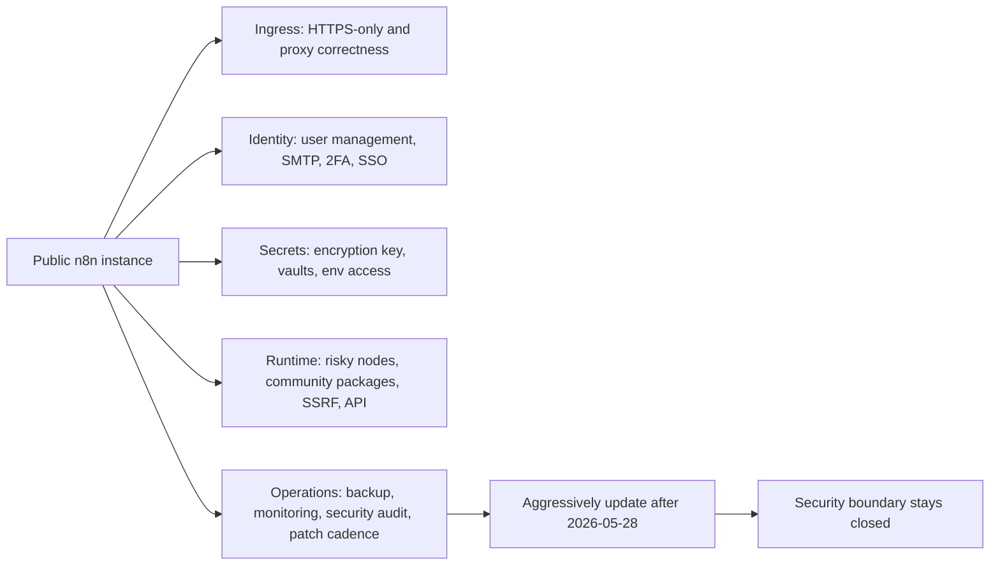
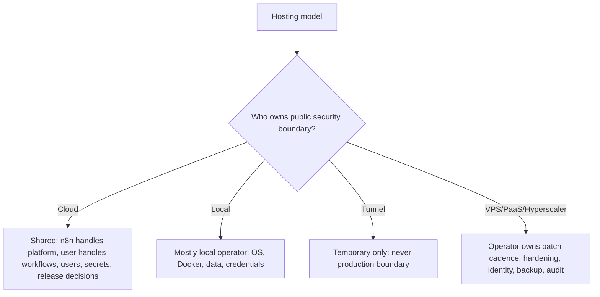
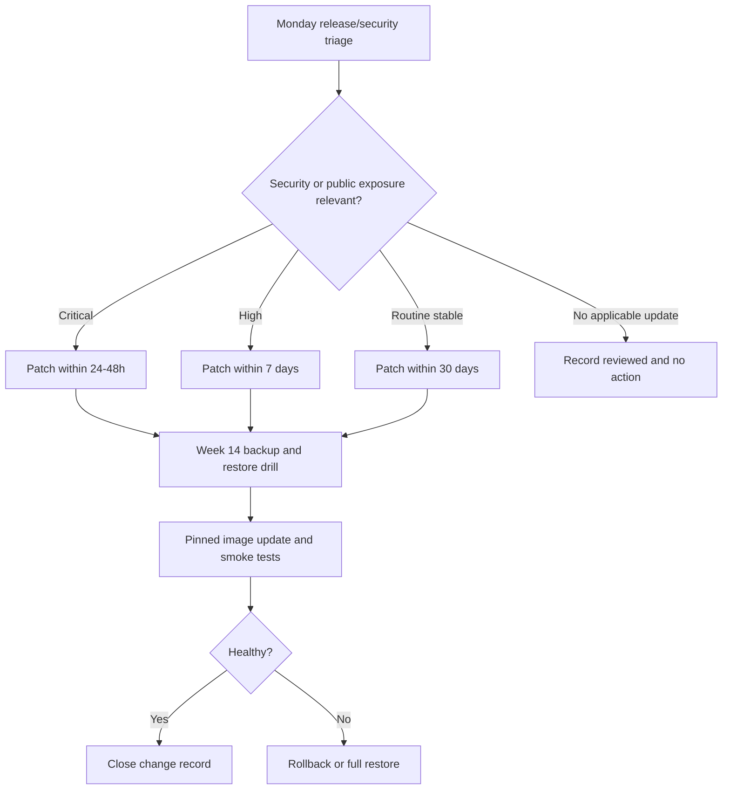

# Week 15｜安全責任、使用者管理與 patch cadence

> 執行日期：2026-05-28
> 目標：回答公開 self-hosted n8n 時，哪些責任會回到自己身上。
> 實作結果：完成 security responsibility matrix、public exposure hardening checklist、patch cadence policy，並把驗收重點鎖定在「公開 instance 不更新就是安全邊界破洞，升級不是只有新功能」。

## 1. 本週交付物總覽

| 交付物 | 狀態 | 檔案 |
| --- | --- | --- |
| security responsibility matrix | 完成 | `artifacts/week-15-security/week-15-security-responsibility-matrix.json`；本文件第 3 節 |
| public exposure hardening checklist | 完成 | `artifacts/week-15-security/week-15-public-exposure-hardening-checklist.csv`；本文件第 4 節 |
| patch cadence policy | 完成 | `artifacts/week-15-security/week-15-patch-cadence-policy.json`；本文件第 5 節 |
| Cloud/local/tunnel/VPS/PaaS/hyperscaler 責任分界 | 完成 | 本文件第 3、6 節 |
| HTTPS-only、secure cookies、SMTP/user management、2FA、SSO、secrets | 完成 | 本文件第 4、7 節 |
| 2026 之後 public instance 的 aggressively update 原則 | 完成 | 本文件第 5、8 節 |
| Week 15 驗證腳本 | 完成 | `scripts/verify-week-fifteen.mjs` |

Week 14 的結論是：backup、restore drill、image pinning、smoke test、rollback 是更新前的底線。Week 15 把更新放回安全語境：公開 n8n instance 本身就是一個 internet-facing application，會接收 webhook、登入請求、API requests、OAuth callbacks、檔案、workflow data、credentials 與第三方 token。當你 self-host，平台不再替你承擔完整的 upgrade、hardening、user lifecycle、secrets、logging、patch cadence。公開 instance 不更新就是安全邊界破洞，升級不是只有新功能。

## 2. 官方來源核對

| 主題 | 官方來源 | 本週採用的判斷 |
| --- | --- | --- |
| 選擇 Cloud 或 self-host | https://docs.n8n.io/choose-n8n/ | n8n 明確說 self-hosting 需要設定伺服器、資源、security、configuration；若沒有 server 管理經驗，建議 n8n Cloud。 |
| n8n Cloud | https://docs.n8n.io/choose-n8n/cloud/ | n8n Cloud 是 hosted solution，提供 no technical setup/maintenance、uptime monitoring、managed OAuth、one-click upgrades；但 workflow、credentials、users、資料處理仍要由使用者治理。 |
| n8n Cloud 更新 | https://docs.n8n.io/manage-cloud/update-cloud-version/ | n8n Cloud 也建議 regular updates、檢查 release notes、先測試；Cloud instance 長期不更新會被通知並自動更新。 |
| Docker self-host | https://docs.n8n.io/hosting/installation/docker/ | n8n Docker guide 說 self-hosting mistakes can lead to data loss, security issues, downtime；tunnel 是 local development/testing，不安全於 production。 |
| self-host 更新 | https://docs.n8n.io/hosting/installation/updating/ | n8n 官方建議 keep version up to date、frequent update、check release notes、至少每月一次、先用 test instance。 |
| release notes | https://docs.n8n.io/release-notes/ | n8n 發布頻率高，stable/beta 與 semantic versioning 會影響 public instance 的風險判斷；patch cadence 必須看 release notes。 |
| Securing n8n | https://docs.n8n.io/hosting/securing/overview/ | 官方安全總覽包含 security audit、SSL、SSO、2FA、redact execution data、disable public API、block nodes、SSRF protection、restrict account registration 等方向。 |
| Security audit | https://docs.n8n.io/hosting/securing/security-audit/ | n8n audit 可檢查 credentials、database、filesystem、nodes、instance，包括 unprotected webhooks、missing security settings、outdated instance。 |
| Disable public API | https://docs.n8n.io/hosting/securing/disable-public-api/ | 若不用 public REST API，官方建議設定 `N8N_PUBLIC_API_DISABLED=true`；API playground 也可停用。 |
| User management | https://docs.n8n.io/user-management/ | n8n user management 包含 login/password、adding/removing users、Owner/Admin/Member。 |
| Self-hosted user management | https://docs.n8n.io/hosting/configuration/user-management-self-hosted/ | Self-hosted n8n 建議設定 SMTP 以支援 invites 與 password resets；沒有 SMTP 時使用者不能 reset password。 |
| Manage users | https://docs.n8n.io/user-management/manage-users/ | 刪除 active user 時要決定移轉或永久刪除 workflows/credentials；offboarding 必須有資料歸屬決策。 |
| Account types | https://docs.n8n.io/user-management/account-types/ | Owner、Admin、Member 權限不同；官方建議 owner 建立 member-level account 做日常工作，降低覆寫他人工作風險。 |
| User management SMTP and 2FA env vars | https://docs.n8n.io/hosting/configuration/environment-variables/user-management-smtp-2fa/ | `N8N_EMAIL_MODE`、SMTP variables、`N8N_MFA_ENABLED`、`N8N_INVITE_LINKS_EMAIL_ONLY` 都是公開 instance 的 identity hardening 重點。 |
| SSO | https://docs.n8n.io/hosting/securing/set-up-sso/ | Business/Enterprise 可用 SAML/OIDC SSO；可用環境變數管理 SSO。 |
| Security env vars | https://docs.n8n.io/hosting/configuration/environment-variables/security/ | `N8N_SECURE_COOKIE`、`N8N_SAMESITE_COOKIE`、`N8N_BLOCK_ENV_ACCESS_IN_NODE`、`N8N_ENFORCE_SETTINGS_FILE_PERMISSIONS`、security policy env vars 都屬於公開 instance hardening。 |
| SSRF protection | https://docs.n8n.io/hosting/configuration/environment-variables/ssrf-protection/ | `N8N_SSRF_PROTECTION_ENABLED` 與 blocked/allowed ranges 用來限制 workflow nodes 連到內網或 metadata services。 |
| Nodes env vars | https://docs.n8n.io/hosting/configuration/environment-variables/nodes/ | `NODES_EXCLUDE` 可封鎖高風險 nodes，community packages 與 unverified packages 也可用環境變數控制。 |
| Community node risks | https://docs.n8n.io/integrations/community-nodes/risks/ | community nodes 可能有 system security、data security、breaking changes 風險；self-host 可停用 community nodes。 |
| External secrets | https://docs.n8n.io/external-secrets/ | Enterprise 可用 1Password、AWS Secrets Manager、Azure Key Vault、GCP Secrets Manager、HashiCorp Vault 管理 secrets，並用 project vaults 限制範圍。 |

本週採取的安全立場是：public exposure 不是只要 Caddy/HTTPS 起來就完成。公開 instance 的安全邊界由「版本新舊、登入與使用者管理、cookies、SMTP、2FA/SSO、secrets、API、SSRF、risky nodes、community nodes、logs、backup、audit、patch cadence」一起構成。任何一塊被長期忽略，都會讓公開服務變成慢性事故。

## 3. 交付物一：security responsibility matrix

| 架構 | 平台承擔 | 使用者仍要承擔 | 不可誤解 |
| --- | --- | --- | --- |
| n8n Cloud | Hosting、基礎維運、uptime monitoring、managed OAuth、one-click upgrades、自動更新過舊 Cloud instances。 | workflow 設計、credentials hygiene、user access、2FA/SSO 設定、execution data 管理、版本測試與 release notes 判讀。 | Cloud 不是把所有安全責任交給 n8n；你的 workflow 仍可外洩資料或誤用 credentials。 |
| local only | 幾乎沒有公開 ingress；主要由本機 Docker/Desktop 與 OS 提供隔離。 | 本機帳號、Docker Desktop、volume、credentials、`.env`、backup、版本更新。 | local only 不代表不需要 security，只是 attack surface 比 public instance 小。 |
| local tunnel | tunnel 服務提供暫時 public URL。 | 所有 n8n security、webhook exposure、credentials、版本更新、log review、關閉 tunnel。 | n8n 官方 tunnel 是 local development/testing，不安全於 production。 |
| VPS + Docker Compose + Caddy | VPS provider 提供 VM 與網路；Caddy 可處理 reverse proxy/HTTPS；Docker 提供 container packaging。 | OS patch、firewall、Docker update、n8n update、PostgreSQL、backup/restore、Caddy config、secrets、users、2FA、audit、monitoring。 | 80/443 開出去後，安全責任大部分都在你身上。 |
| PaaS | 平台通常處理 deploy、TLS、custom domain、logs、部分 secrets UI、managed PostgreSQL 選項。 | state persistence、env vars、database backup、n8n version、user access、2FA/SSO、public URL、cost、vendor limits。 | 服務能啟動不代表 state、安全設定、update cadence 正確。 |
| hyperscaler | Cloud Run/AWS 等提供 IAM、managed DB、secret manager、load balancer、logs、metrics、network controls。 | IAM least privilege、service account、security groups、secret scope、patch cadence、image pinning、backup/restore、incident response、cost controls。 | building blocks 強大，但組裝錯就是更大的 attack surface。 |

### 責任分界摘要

| 責任 | Cloud | local | tunnel | VPS | PaaS | hyperscaler |
| --- | --- | --- | --- | --- | --- | --- |
| HTTPS-only | Cloud 平台處理大多數 ingress | 通常不公開 | 暫時 URL，不做 production | Caddy/proxy/firewall | 平台或自訂 domain | LB/Cloud Run/ALB/API Gateway |
| n8n upgrade | Cloud dashboard + 自動更新政策 | 使用者 | 使用者 | 使用者 | 使用者或平台 image | 使用者 image/revision/task |
| user management | 使用者 | 使用者 | 使用者 | 使用者 | 使用者 | 使用者 |
| 2FA/SSO | 使用者設定 | 使用者設定 | 使用者設定 | 使用者設定 | 使用者設定 | 使用者設定 |
| SMTP/invite/password reset | Cloud 或使用者設定依方案 | 使用者 | 使用者 | 使用者 | 使用者 | 使用者 |
| secrets | Cloud features + 使用者治理 | `.env`/password manager | `.env`/password manager | `.env`/secret store | platform secrets | Secret Manager/Secrets Manager |
| backup/restore | 依 Cloud plan 與 export 能力 | 使用者 | 使用者 | 使用者 | 使用者確認 | 使用者設計 |
| audit/monitoring | Cloud 提供部分能力 | 使用者 | 使用者 | 使用者 | 平台 + 使用者 | Cloud logs + 使用者 |

## 4. 交付物二：public exposure hardening checklist

公開 instance 的 hardening 要把 ingress、identity、secrets、runtime、workflow、operations 放在同一張表，不要只做一個 reverse proxy 就宣稱 production-ready。

| 類別 | 檢查項 | 必要設定或證據 | 失敗時風險 |
| --- | --- | --- | --- |
| HTTPS-only | 所有 editor、webhook、OAuth callback 都走 HTTPS | `WEBHOOK_URL=https://n8n.example.com/`、`N8N_EDITOR_BASE_URL=https://n8n.example.com/`、proxy TLS 通過 | cookie、token、OAuth callback 暴露，外部 provider 指錯 URL。 |
| secure cookies | cookies 只在 HTTPS 傳送 | `N8N_SECURE_COOKIE=true`，`N8N_SAMESITE_COOKIE=lax` 或更嚴格 | session cookie 可在錯誤 transport 下暴露。 |
| reverse proxy | proxy headers 正確 | `N8N_PROXY_HOPS` 依實際 hops 設定，Caddy/ALB/Cloud Run headers 通過 smoke test | n8n 生成 URL、IP、redirect 判斷錯誤。 |
| owner account | Owner 不做日常 workflow 編輯 | owner 建立 member-level account 供日常使用 | owner 權限過大，誤改他人 workflow/credentials。 |
| user lifecycle | invite、remove、transfer 都有流程 | `Settings > Users` 清單月檢；offboarding 決定 workflow/credentials 移轉或刪除 | 離職帳號仍可登入或資料歸屬不明。 |
| SMTP | user invites/password reset 可用 | `N8N_EMAIL_MODE=smtp`、`N8N_SMTP_HOST`、`N8N_SMTP_SENDER`、SSL/STARTTLS | 無法安全邀請、無法 reset password，導致人工分享 invite links。 |
| invite links | invite links 不從 API 暴露 | `N8N_INVITE_LINKS_EMAIL_ONLY=true` | 高權限或程式化存取可取得 invite URL。 |
| 2FA | 所有互動使用者啟用 MFA | `N8N_MFA_ENABLED=true`，Business/Enterprise 可用 `N8N_MFA_ENFORCED_ENABLED=true` | 密碼外洩後沒有第二層防線。 |
| SSO | 有 IdP 的組織使用 SAML/OIDC | Business/Enterprise 啟用 SSO，role provisioning 決策已記錄 | 帳號 lifecycle 與企業 IdP 脫節。 |
| secrets | credentials secrets 不散落在 workflow text 或 `.env` | `N8N_ENCRYPTION_KEY` 保存；Enterprise 使用 external secrets 或平台 secret manager | secrets 複製、外洩、旋轉困難。 |
| environment access | workflow 使用者不能任意讀 env vars | `N8N_BLOCK_ENV_ACCESS_IN_NODE=true`，敏感 env 改用 secret store | Code node/expression 可能讀取 secrets。 |
| file access | 限制 workflow 讀寫檔案 | `N8N_BLOCK_FILE_ACCESS_TO_N8N_FILES=true`，`N8N_RESTRICT_FILE_ACCESS_TO` | workflow 可碰到不該碰的 host/container 檔案。 |
| SSRF | HTTP 類 nodes 不可打 metadata/internal ranges | `N8N_SSRF_PROTECTION_ENABLED=true`，blocked ranges 包含 default | workflow 可探測內網或 cloud metadata service。 |
| public API | 不用就關閉 | `N8N_PUBLIC_API_DISABLED=true`，`N8N_PUBLIC_API_SWAGGERUI_DISABLED=true` | 暴露不必要的管理 API surface。 |
| risky nodes | 高風險 nodes 要封鎖或限縮 | `NODES_EXCLUDE` 至少包含 `n8n-nodes-base.executeCommand` 與不信任的自訂風險 nodes | workflow 可在 host/container 執行命令或碰 filesystem。 |
| community nodes | 不信任供應鏈時停用或只允許 verified | `N8N_COMMUNITY_PACKAGES_ENABLED=false` 或 `N8N_UNVERIFIED_PACKAGES_ENABLED=false` | 安裝來自 npm 的未驗證程式碼。 |
| audit | 定期跑 n8n audit | `n8n audit` 或 API audit，記錄 credentials、database、filesystem、nodes、instance findings | unprotected webhooks、missing security settings、outdated instance 不被看見。 |
| execution data | 敏感 output 不長期保存 | redact execution data、成功 execution retention、manual execution discipline | logs/executions 成為敏感資料倉庫。 |
| backup | security change 前可還原 | Week 14 backup + restore drill 通過 | patch 失敗或帳號誤刪後不能回復。 |
| patch cadence | public instance aggressive update | 每週 release note triage；critical 24 到 48 小時；high 7 天內；routine 至少每月 | 公開安全邊界長期停在舊漏洞面。 |
| monitoring | 登入、errors、restart、audit findings 可追蹤 | logs、alerts、failed execution rate、restart count、HTTP 5xx | 攻擊、錯誤、版本問題無人發現。 |
| data ownership | user/project/workflow/credential ownership 清楚 | project roles、account type、offboarding checklist | credentials 留在個人帳號，無法交接。 |
| webhook exposure | public webhooks 經過 authentication 或 secret path | random path、shared secret、HMAC、provider signature、rate limit | webhook 被猜測、濫用或重放。 |
| change record | 安全設定有版本紀錄 | `.env`/compose/proxy config in Git or encrypted change log | 設定漂移後無法復原。 |

## 5. 交付物三：patch cadence policy

### 原則

從 2026-05-28 起，公開 self-hosted n8n 採用 aggressively update 原則：

1. 每週檢查 n8n release notes、Docker image、OS packages、reverse proxy、database、PaaS/hyperscaler runtime。
2. 每月至少完成一次 n8n stable update 或明確記錄為何不更新。
3. security-related release、authentication、SSRF、API、webhook、credentials、community nodes、risky nodes、sandbox、dependency CVE 相關修補，不能等到功能更新窗口。
4. critical public exposure 風險在 24 到 48 小時內處理；high 風險 7 天內處理；routine stable update 30 天內處理。
5. 每次更新都走 Week 14 流程：backup、restore drill、image pinning、pull、restart、test、rollback。

### cadence table

| 風險級別 | 例子 | SLA | 必要動作 |
| --- | --- | --- | --- |
| Critical | public auth bypass、RCE、SSRF to cloud metadata、credential leakage、actively exploited CVE | 24 到 48 小時 | 緊急 maintenance window、backup、restore drill、patch、smoke test、監控、事後紀錄。 |
| High | webhook/API/security hardening bug、dependency security fix、risky node sandbox fix、cookie/session fix | 7 天內 | staging 或 restore drill project 測試，production 更新，security audit。 |
| Medium | minor security improvement、new policy setting、community package supply-chain improvement | 14 天內 | 排入本週或下週更新批次，確認設定是否需要變更。 |
| Routine | feature release、bug fixes、performance fixes | 30 天內 | 至少每月更新，避免跨太多版本造成 disruptive update。 |
| Deferred | 與部署無關或明確有重大相容性風險 | 每週重新評估 | 記錄 deferred reason、owner、next review date、mitigation。 |

### public instance security boundary

公開 instance 不更新就是安全邊界破洞，升級不是只有新功能。原因是 public n8n 同時暴露 editor login、webhooks、API、OAuth callbacks、execution data、credentials usage、nodes that call external systems、possibly community code。更新不只帶來新節點或 UI 改善，也會包含 bug fixes、security hardening、dependency fixes、permission model changes、SSRF/identity/API/node safety improvements。越久不更新，公開邊界與現行威脅之間的距離越大。

## 6. Cloud/local/tunnel/VPS/PaaS/hyperscaler 責任分界

### Cloud

n8n Cloud 替你收掉 infrastructure maintenance、uptime monitoring、managed OAuth、one-click upgrades 等基礎工作。你仍要管理 users、2FA/SSO、workflow sharing、credentials、execution data、release timing、workflow security。Cloud 讓責任少很多，但不會替你判斷某個 workflow 是否把 customer data 發錯 API，也不會替你完成每個 user offboarding 決策。

### local

local n8n 的 public exposure 最小，但資料和 secrets 都在本機。你要保護 Docker Desktop、volume、`.env`、`N8N_ENCRYPTION_KEY`、local credentials、backup。local 適合 learning、prototype、private automation，不適合作為未 harden 的公開服務。

### tunnel

tunnel 只適合 local development/testing。它能快速讓 webhook provider 打到本機，但它不是 production boundary。若 tunnel URL 被外部知道，你仍承擔 n8n login、webhook path、credentials、workflow behavior、版本更新與關閉 tunnel 的責任。

### VPS

VPS 是最直覺的 self-host production 起點，也是責任最容易被低估的地方。OS patch、firewall、Docker、Caddy、PostgreSQL、n8n image、volume、backup、logs、users、2FA、SMTP、SSRF、API、nodes 都要自己管。這也是為什麼 Week 10 到 Week 15 一路要求 Caddy、PostgreSQL、backup、restore、update、hardening 連成一套。

### PaaS

PaaS 會替你處理 deploy、TLS、custom domain、logs、secrets UI、managed database 的一部分，但 n8n state、environment variables、backup/restore、user management、2FA/SSO、image tag、patch cadence 還是你的工作。PaaS 省掉一些主機維運，不會自動讓公開 instance 安全。

### hyperscaler

hyperscaler 給你 IAM、service account、Secret Manager/Secrets Manager、managed database、load balancer、CloudWatch/Cloud Logging、VPC/security group 等 building blocks。它讓安全治理更可控，也讓錯誤配置更危險。你的責任變成 least privilege、secret scope、network boundaries、image pinning、audit logs、cost guardrails、patch cadence、incident response。

## 7. 公開 instance hardening runbook

1. 確認 hosting model：Cloud、local、tunnel、VPS、PaaS、hyperscaler。
2. 若是 tunnel，標記為 development/testing，不進 production checklist。
3. 設 HTTPS-only：`WEBHOOK_URL`、`N8N_EDITOR_BASE_URL`、`N8N_PROXY_HOPS`、proxy TLS、secure redirect。
4. 設 cookies：`N8N_SECURE_COOKIE=true`，`N8N_SAMESITE_COOKIE=lax` 或更嚴格。
5. 設 user management：Owner/Admin/Member 最小權限，owner 日常使用 member account。
6. 設 SMTP：`N8N_EMAIL_MODE=smtp`、`N8N_SMTP_HOST`、`N8N_SMTP_SENDER`、SSL/STARTTLS。
7. 設 invite 安全：`N8N_INVITE_LINKS_EMAIL_ONLY=true`。
8. 設 MFA：`N8N_MFA_ENABLED=true`，可用 policy 時啟用 `N8N_MFA_ENFORCED_ENABLED=true`。
9. 有企業 IdP 時設定 SAML/OIDC SSO，並記錄 role provisioning 與手動登入例外。
10. 設 secrets：固定 `N8N_ENCRYPTION_KEY`，優先用 secret manager 或 external secrets，不把 secrets 寫進 workflow text。
11. 限制 env/file access：`N8N_BLOCK_ENV_ACCESS_IN_NODE=true`、`N8N_BLOCK_FILE_ACCESS_TO_N8N_FILES=true`、`N8N_RESTRICT_FILE_ACCESS_TO`。
12. 啟用 SSRF protection：`N8N_SSRF_PROTECTION_ENABLED=true`，使用 default blocked ranges，再加上組織內網範圍。
13. 若不用 public REST API，設定 `N8N_PUBLIC_API_DISABLED=true` 與 `N8N_PUBLIC_API_SWAGGERUI_DISABLED=true`。
14. 封鎖 risky nodes：用 `NODES_EXCLUDE` 管理 `executeCommand`、local file 類 nodes 與任何不信任的自訂高風險 node。
15. 控制 community nodes：不需要時停用；需要時只允許 verified 或固定版本與 checksum。
16. 設 execution data policy：敏感資料 redaction、成功 executions retention、manual execution discipline。
17. 跑 security audit：`n8n audit`，把 credentials、database、filesystem、nodes、instance findings 轉成 action items。
18. 接上 Week 14：backup、restore drill、image pinning、smoke test、rollback。
19. 接上 monitoring：HTTP 5xx、login anomalies、failed executions、restart count、audit findings、outdated version。
20. 接上 patch cadence：每週 triage，每月 update，critical/high security 依 SLA 處理。

## 8. 2026 之後 aggressively update 實務節奏

### weekly triage

每週固定一天檢查：

| 項目 | 證據 |
| --- | --- |
| n8n release notes | 目標版本、目前版本、跳過版本、breaking changes、security relevance。 |
| Docker image | pinned tag、digest、是否有 base image 或 dependency risk。 |
| OS/packages | VPS host patch、Docker Engine/Compose、Caddy、PostgreSQL patch。 |
| platform | PaaS/hyperscaler runtime、managed database、secret manager、load balancer updates。 |
| audit | `n8n audit` findings，尤其 outdated instance、missing security settings、risky nodes。 |

### monthly minimum

若沒有 critical/high security update，公開 instance 仍要每月至少更新一次或記錄延後理由。官方 self-host update guidance 建議至少每月更新，因為跨太多版本會提高 disruptive update 風險。對 public instance，月更是最低線，不是最佳線。

### emergency patch

若 release note、security advisory、dependency CVE、node sandbox、auth/session、SSRF、API、webhook、credential handling 相關修補出現，直接啟動 emergency patch：

1. 宣告 change window。
2. 執行 Week 14 backup。
3. 在 restore drill/staging project 測 target image。
4. 更新 production pinned image。
5. 跑 smoke tests：login、credentials decrypt、workflow list、manual execution、webhook、proxy、logs、monitoring。
6. 若失敗，先 rollback；若 DB migration 已不可逆，走 full restore。
7. 記錄版本、digest、backup id、測試結果、SLA 是否達成。

## 9. Week 15 完成檢查

| 驗收條件 | 結果 | 證據 |
| --- | --- | --- |
| 完成 security responsibility matrix | 通過 | 第 3、6 節與 `week-15-security-responsibility-matrix.json` |
| 完成 public exposure hardening checklist | 通過 | 第 4、7 節與 `week-15-public-exposure-hardening-checklist.csv` |
| 完成 patch cadence policy | 通過 | 第 5、8 節與 `week-15-patch-cadence-policy.json` |
| 覆蓋 Cloud/local/tunnel/VPS/PaaS/hyperscaler 責任分界 | 通過 | 第 3、6 節 |
| 覆蓋 HTTPS-only、secure cookies、SMTP/user management、2FA、SSO、secrets | 通過 | 第 4、7 節 |
| 覆蓋 2026 之後 public instance 的 aggressively update 原則 | 通過 | 第 5、8 節 |
| 能明確說出公開 instance 不更新就是安全邊界破洞，升級不是只有新功能 | 通過 | 第 1、5、9 節 |

## 10. 下一週銜接

Week 16 會進入 Scaling：單機、Redis queue、workers。Week 15 已定義公開 instance 的安全與 patch cadence，下一週要在這條安全基線上拆解 scaling：regular mode、Redis queue、workers、concurrency、webhook response、DB connections、worker separation 與 queue-mode security boundaries。
