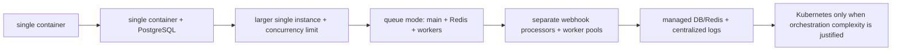
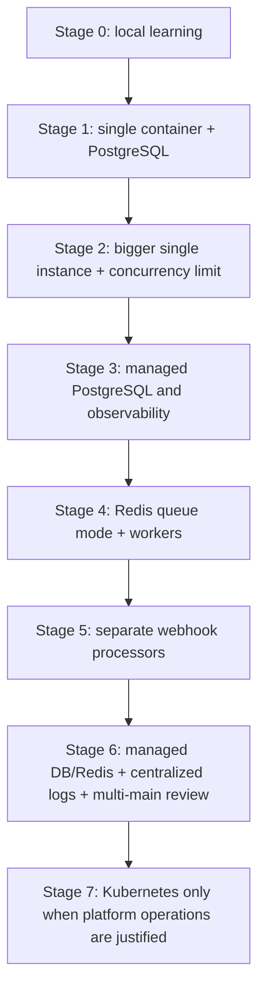
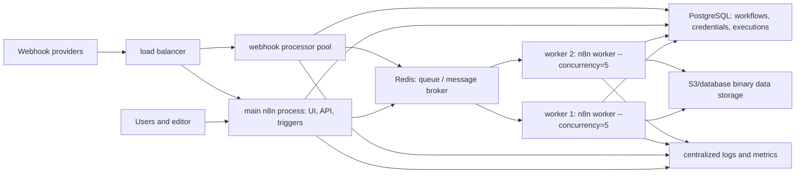
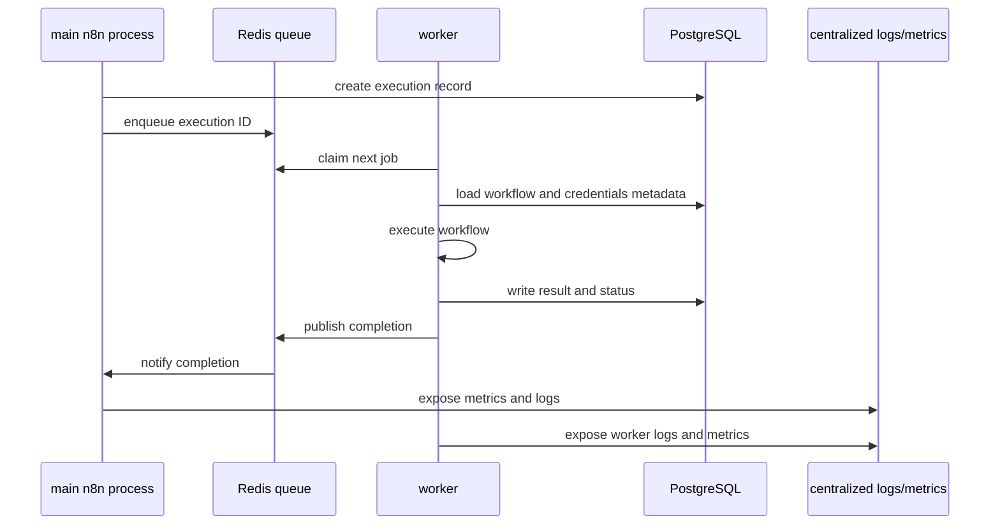

# Week 16｜Scaling：單機、Redis queue、workers

> 執行日期：2026-05-28
> 目標：回答何時該加大單機，何時該上 queue mode，何時才值得 Kubernetes。
> 實作結果：完成 scaling ladder、queue mode architecture diagram、anti-overengineering checklist，並把驗收重點鎖定在「從 single container + Postgres 到 Redis workers 的漸進路線，而不是一開始就上 Kubernetes」。

## 1. 本週交付物總覽

| 交付物 | 狀態 | 檔案 |
| --- | --- | --- |
| scaling ladder | 完成 | `artifacts/week-16-scaling/week-16-scaling-ladder.json`；本文件第 3 節 |
| queue mode architecture diagram | 完成 | `artifacts/week-16-scaling/week-16-queue-mode-architecture.json`；本文件第 4 節 |
| anti-overengineering checklist | 完成 | `artifacts/week-16-scaling/week-16-anti-overengineering-checklist.csv`；本文件第 5 節 |
| single instance first | 完成 | 本文件第 3、6 節 |
| PostgreSQL first | 完成 | 本文件第 3、6 節 |
| Redis queue mode 與 workers | 完成 | 本文件第 4、7 節 |
| separate webhook processors、managed DB/Redis、centralized logs | 完成 | 本文件第 4、7、8 節 |
| Week 16 驗證腳本 | 完成 | `scripts/verify-week-sixteen.mjs` |

Week 15 的結論是：公開 instance 的安全邊界要靠 hardening 與 patch cadence 維持。Week 16 把 scaling 放在這條安全基線上處理：先讓單機和 PostgreSQL 正確，再看 concurrency、execution data、binary data、logs、backup、worker pool。Kubernetes 不是 scaling 的第一步，它是你已經證明需要 orchestration、multi-service rollout、worker autoscaling、centralized observability、managed database/Redis、load balancer 與團隊操作能力之後，才值得承擔的複雜度。

## 2. 官方來源核對

| 主題 | 官方來源 | 本週採用的判斷 |
| --- | --- | --- |
| Scaling overview | https://docs.n8n.io/hosting/scaling/overview/ | n8n 官方說大量 users、workflows、executions 時需要調整配置；queue mode 提供最佳 scalability，execution data/pruning 也影響 database performance。 |
| Queue mode | https://docs.n8n.io/hosting/scaling/queue-mode/ | queue mode 使用 main instance、Redis message broker、workers、PostgreSQL；main 產生 execution，Redis 排隊，worker 從 DB 取 workflow information，完成後寫回 DB 並通知 Redis。 |
| Queue mode env vars | https://docs.n8n.io/hosting/configuration/environment-variables/queue-mode/ | `EXECUTIONS_MODE=queue`、`QUEUE_BULL_REDIS_HOST`、`QUEUE_BULL_REDIS_PORT`、`OFFLOAD_MANUAL_EXECUTIONS_TO_WORKERS`、`N8N_MULTI_MAIN_SETUP_ENABLED` 等設定決定 queue mode 行為。 |
| Concurrency control | https://docs.n8n.io/hosting/scaling/concurrency-control/ | regular mode 預設不限制 production executions；可用 `N8N_CONCURRENCY_PRODUCTION_LIMIT` 控制 production concurrency；queue mode 的 worker concurrency 是另一層機制。 |
| Execution data | https://docs.n8n.io/hosting/scaling/execution-data/ | execution data 保存與 pruning 會影響 database size/performance；scale 前應先確認是否保存太多成功 execution data。 |
| Binary data | https://docs.n8n.io/hosting/scaling/binary-data/ | binary data 預設在 memory；queue mode 不支援 filesystem binary data，需改 database 或 S3 external storage。 |
| External storage | https://docs.n8n.io/hosting/scaling/external-storage/ | Enterprise 可用 S3 作為 binary data external storage，避免大量 binary data 依賴 local filesystem。 |
| Prometheus metrics | https://docs.n8n.io/hosting/configuration/configuration-examples/prometheus/ | `N8N_METRICS=true` 可啟用 metrics；queue metrics 可追蹤 active、completed、failed、waiting jobs，main 與 workers 都可暴露 metrics。 |
| Monitoring | https://docs.n8n.io/hosting/logging-monitoring/monitoring/ | production scaling 要看 health、metrics、queue、worker 與 process 指標，而不是只看容器是否 running。 |
| Logging | https://docs.n8n.io/hosting/logging-monitoring/logging/ | 多 process/multi-worker deployment 需要 centralized logs；只有本機 stdout 會讓 worker 問題難以追蹤。 |
| Task runners | https://docs.n8n.io/hosting/configuration/task-runners/ | production task runners 建議 external mode；queue mode 下每個 worker 需要自己的 task runner sidecar。 |
| Execute Command | https://docs.n8n.io/integrations/builtin/core-nodes/n8n-nodes-base.executecommand/ | queue mode 下 production Execute Command 會在執行任務的 worker 上跑；manual execution 除非 offload，否則在 main 上跑。 |
| Kubernetes/OpenShift example | https://docs.n8n.io/hosting/installation/server-setups/openshift-crc/ | n8n 的 OpenShift/Kubernetes 範例使用 shared database、message queue、object storage、worker pods、webhook processors、multi-main；這證明 Kubernetes 是多組件成熟後的承載方式，不是最小 production 起點。 |

本週採用的判斷是：先 single instance first，再 PostgreSQL first，然後用 metrics 判斷是否加大單機、設定 regular concurrency、清 execution data、移 binary data；只有當 worker separation 和 queue backlog 是真瓶頸，才進 Redis queue mode 與 workers。Kubernetes 只在 queue mode 架構、managed DB/Redis、centralized logs、load balancer、rollout/rollback、team skill 都成熟時才合理。

## 3. 交付物一：scaling ladder

| 階段 | 架構 | 進入條件 | 主要設定 | 不要跳過的檢查 |
| --- | --- | --- | --- | --- |
| 0 | local / learning single container | 學習、demo、低風險 manual workflow | SQLite 或 local volume，沒有 public production webhook | 不放 business-critical credentials，不公開 tunnel 當 production。 |
| 1 | single container + PostgreSQL | workflow 開始承載真資料，需要 durable state | `DB_TYPE=postgresdb`、固定 `N8N_ENCRYPTION_KEY`、backup/restore | PostgreSQL backup、volume、env/proxy config 保存。 |
| 2 | larger single instance + PostgreSQL | CPU/memory 偶爾尖峰，但瓶頸仍可由單機處理 | 4 vCPU / 8 GB RAM 起，`N8N_CONCURRENCY_PRODUCTION_LIMIT`，execution pruning | p95 latency、memory high-water mark、DB growth、binary storage。 |
| 3 | single instance + managed PostgreSQL/Redis-ready observability | workload 穩定成長，需要先把 state/monitoring 做穩 | managed PostgreSQL、centralized logs、Prometheus metrics、alerts | 先證明 DB/backup/logs 可營運，再加 workers。 |
| 4 | Redis queue mode + workers | production executions 重疊且單機 event loop 或 webhook response 被重任務拖慢 | `EXECUTIONS_MODE=queue`、Redis、workers、shared `N8N_ENCRYPTION_KEY`、worker `--concurrency` | Redis/DB readiness、worker health、DB connection pool、binary data mode。 |
| 5 | separate webhook processors + worker pools | webhook burst 是入口瓶頸，需要獨立接收 webhook | webhook processors、load balancer route `/webhook/*` 與 `/webhook-waiting/*`，`N8N_DISABLE_PRODUCTION_MAIN_PROCESS=true` | main 不進 webhook LB pool，manual `/webhook-test/*` route 回 main。 |
| 6 | managed DB/Redis + centralized logs + multi-main evaluation | queue mode 已是核心生產架構，需要 HA 與操作治理 | managed PostgreSQL、managed Redis、centralized logs、metrics、backups、multi-main eligibility | all main/worker same version、sticky sessions、leader/follower 行為、cost。 |
| 7 | Kubernetes / OpenShift / EKS style orchestration | 需要 pod scheduling、replicas、rolling deploy、worker autoscaling、standard platform ops | main pods、worker pods、webhook processor pods、DB/Redis/object storage、Ingress/LB、secrets、logs | 沒有 platform skill、DB/Redis/logs/backup 成熟前，不進 Kubernetes。 |

### 驗收路線

一條合理漸進路線是：

1. `single container + Postgres`：n8n + PostgreSQL + persistent volume + fixed `N8N_ENCRYPTION_KEY` + backup。
2. `larger single instance + Postgres`：先加 CPU/RAM、設定 `N8N_CONCURRENCY_PRODUCTION_LIMIT`、修 pruning 與 binary data。
3. `observability first`：啟用 logs/metrics，確認 p95 latency、memory、DB connections、execution failures、binary storage。
4. `Redis queue mode + workers`：加 Redis，把 production executions 丟給 workers，main 保持 UI/triggers/webhook coordination。
5. `separate webhook processors`：入口流量高時再把 webhook processors 與 load balancer routing 拆出來。
6. `managed DB/Redis + centralized logs`：把 state、queue、logs、backup 變成可營運服務。
7. `Kubernetes`：只有當你需要 replicas、rolling updates、worker autoscaling、pod scheduling、multi-service platform governance 時才進。

## 4. 交付物二：queue mode architecture diagram

### process responsibility

| Process | 責任 | 關鍵設定 |
| --- | --- | --- |
| main | UI、API、trigger coordination、execution creation、non-HTTP triggers、pruning；queue mode 時不直接跑 production execution。 | `EXECUTIONS_MODE=queue`、`N8N_ENCRYPTION_KEY`、PostgreSQL env vars、Redis env vars。 |
| Redis | message broker，保存 pending executions queue，讓可用 worker 取 job。 | `QUEUE_BULL_REDIS_HOST`、`QUEUE_BULL_REDIS_PORT`、username/password/db/timeout。 |
| worker | 從 Redis 取 execution ID，從 PostgreSQL 讀 workflow information，執行後寫結果回 PostgreSQL，通知 Redis。 | `EXECUTIONS_MODE=queue`、shared `N8N_ENCRYPTION_KEY`、DB/Redis access、`n8n worker --concurrency=5` 起測。 |
| webhook processor | optional scaling layer，接大量 webhook request，送 execution 到 Redis；不把 main 放進 webhook pool。 | `EXECUTIONS_MODE=queue`、`WEBHOOK_URL`、load balancer route `/webhook/*`、`/webhook-waiting/*`。 |
| PostgreSQL | durable state：workflows、credentials、executions、users、settings。 | Postgres 13+、connection pool、backup/restore、execution pruning。 |
| binary storage | queue mode 不使用 filesystem binary data；改 database 或 S3 external storage。 | `N8N_DEFAULT_BINARY_DATA_MODE=database` 或 `s3`；S3 lifecycle。 |
| centralized logs/metrics | 對 main、webhook processors、workers、Redis、DB 進行 observability。 | `N8N_METRICS=true`、`N8N_METRICS_INCLUDE_QUEUE_METRICS=true`、集中 logs、alerts。 |

### queue mode sequence

### webhook processor routing

| Route | 目標 |
| --- | --- |
| `/webhook/*` | webhook processor pool |
| `/webhook-waiting/*` | webhook processor pool |
| `/webhook-test/*` | main process，用於 manual/test executions |
| editor static files、internal API、settings | main process |

n8n 官方提醒不建議把 main process 加進 webhook load balancer pool。若 main 同時承接大量 webhook，UI、API、trigger coordination 會被入口流量拖慢。當你已有 webhook processors 時，可以用 `N8N_DISABLE_PRODUCTION_MAIN_PROCESS=true` 讓 production webhooks 不在 main process 上處理。

## 5. 交付物三：anti-overengineering checklist

| 問題 | 若答案是否定 | 若答案是肯定 |
| --- | --- | --- |
| 是否已經使用 PostgreSQL，而不是仍在 SQLite/local-only state？ | 不上 Redis、不上 Kubernetes，先做 PostgreSQL。 | 繼續看 execution volume。 |
| 是否已做 backup/restore drill？ | 不上多節點，先完成 Week 14。 | 繼續看 metrics。 |
| 是否知道 p95 execution latency、active executions、failed executions、DB connections？ | 不上 Kubernetes，先啟用 logs/metrics。 | 繼續看瓶頸層。 |
| 問題是 CPU/RAM 偶發尖峰，而不是持續 queue/backlog？ | 先加大單機、降 concurrency、修 workflow。 | 可評估 workers。 |
| 是否已設定 `N8N_CONCURRENCY_PRODUCTION_LIMIT`？ | 先用 regular mode concurrency control。 | 看是否仍有 event loop thrash。 |
| execution data 或 binary data 是否造成 DB/storage 壓力？ | 先調 retention、pruning、binary mode。 | 若重任務仍拖慢，再加 workers。 |
| webhook burst 是否拖慢 editor/UI？ | 不拆 webhook processors，先觀察。 | 可拆 webhook processors 與 LB route。 |
| 是否有 Redis、PostgreSQL、workers 的 health/readiness 與 centralized logs？ | 不上 Kubernetes，先補 observability。 | 可進 queue mode production。 |
| 是否已有 managed DB/Redis 或能營運自管 DB/Redis？ | 不上 Kubernetes，否則 state/queue 會成為事故點。 | 可評估 orchestration。 |
| 是否需要 rolling deploy、worker autoscaling、pod scheduling、multi-service governance？ | 不上 Kubernetes，VPS/PaaS/queue workers 足夠。 | Kubernetes 開始有理由。 |
| 團隊是否能 debug Redis queue、DB connection pool、worker logs、LB routing？ | 不上 Kubernetes，先練 queue mode runbook。 | 可建立 Kubernetes spike。 |
| 是否能接受 Kubernetes 的成本與維運責任？ | 不上 Kubernetes，避免把小系統變成平台工程。 | 用 staging 先驗證。 |

## 6. single instance first 與 PostgreSQL first

### single instance first

single instance first 的意思不是永遠單機，而是先把最少 moving parts 做對。大多數 early production n8n 問題不是 Kubernetes 不夠，而是：

| 問題 | 應先處理 |
| --- | --- |
| workflow 保存太多 execution data | execution data pruning、成功 execution 不保存、DB storage monitoring。 |
| binary data 讓 memory 爆掉 | filesystem/database/S3 mode，限制檔案大小，避免 default memory mode。 |
| webhook response 慢 | workflow 拆分、早回應、concurrency limit、background processing。 |
| DB 未備份 | PostgreSQL backup、restore drill、RPO/RTO。 |
| logs 看不到 | centralized logs、metrics、alerts。 |
| 公開 instance 太舊 | Week 15 patch cadence。 |

### PostgreSQL first

PostgreSQL first 是進 queue mode 的前置條件。官方 queue mode 文件說分散式 queue setup 不支援 SQLite，並建議 Postgres 13+。PostgreSQL 讓 workflows、credentials、executions、users、settings 有 durable state，也讓 workers 可以共享 execution state。若還沒把 database 做穩，就先上 Redis workers，只會把資料層問題放大。

### 單機升級順序

1. 固定 `N8N_ENCRYPTION_KEY`。
2. 使用 PostgreSQL。
3. 設 `WEBHOOK_URL` 與 `N8N_EDITOR_BASE_URL`。
4. 設 backup/restore drill。
5. 開 logs 與 metrics。
6. 調整 execution pruning。
7. 設 `N8N_CONCURRENCY_PRODUCTION_LIMIT`。
8. 增加 vCPU/RAM。
9. 移除重 workflow 的同步 webhook 路徑。
10. 用 metrics 判斷是否真的需要 queue mode。

## 7. Redis queue mode 與 workers

### 何時該上 queue mode

| 訊號 | 解讀 |
| --- | --- |
| production executions 長時間重疊，regular mode concurrency control 造成等待但仍可觀察到 backlog | 需要 worker pool。 |
| 重 workflow 拖慢 editor/UI 或 webhook response | 需要把 execution 從 main 拆到 workers。 |
| CPU/memory 壓力來自 execution，而不是 UI/API | workers 可以水平擴充。 |
| 已有 PostgreSQL、Redis、centralized logs、backup/restore | queue mode 的 state/queue/logs 基礎已具備。 |
| binary data 已改 database/S3，不依賴 local filesystem mode | 符合 queue mode binary data 限制。 |

### queue mode baseline

| 設定 | baseline |
| --- | --- |
| Execution mode | `EXECUTIONS_MODE=queue` 用在 main、workers、webhook processors。 |
| Redis | `QUEUE_BULL_REDIS_HOST`、`QUEUE_BULL_REDIS_PORT`、username/password/db/timeout。 |
| Encryption key | main、workers、webhook processors 使用同一個 `N8N_ENCRYPTION_KEY`。 |
| Worker command | `n8n worker --concurrency=5` 起測，官方建議 worker concurrency 5 或更高，避免低 concurrency + 大量 workers 耗盡 DB connections。 |
| Worker health | 啟用 worker health/readiness endpoints，確認 DB/Redis ready。 |
| Metrics | `N8N_METRICS=true`、`N8N_METRICS_INCLUDE_QUEUE_METRICS=true`。 |
| Binary data | `N8N_DEFAULT_BINARY_DATA_MODE=database` 或 S3；不使用 filesystem mode。 |
| Task runners | queue mode 下每個 worker 需要自己的 task runner sidecar。 |

### 不該急著加 workers 的情境

| 情境 | 更合理的處理 |
| --- | --- |
| 只有一兩條慢 workflow | 拆 workflow、優化 API calls、加 timeout/retry、把大檔分批。 |
| DB storage 成長太快 | 先調 execution retention、pruning、binary storage。 |
| webhook response 只是需要立即回覆 | 使用 Respond to Webhook/早回應模式或拆 background workflow。 |
| memory 爆是 binary data default mode | 先改 binary mode。 |
| 沒有 centralized logs | 先補 logs，否則 workers 只會讓故障更分散。 |

## 8. separate webhook processors、managed DB/Redis、centralized logs

### separate webhook processors

webhook processors 是 queue mode 的下一層 scaling。當入口 webhook burst 很高時，webhook processors 可以把接收 request 的工作從 main 拆出去。load balancer 要把 `/webhook/*`、`/webhook-waiting/*` 送到 webhook processor pool，把 editor、internal API、settings、manual `/webhook-test/*` 留給 main。

### managed DB/Redis

一旦 Redis queue mode 變成 production path，PostgreSQL 與 Redis 不再是附屬元件，而是主系統。managed DB/Redis 的價值不是品牌，而是 backup、restore、metrics、patch、availability、access control、connection limits、alerting。如果團隊選擇自管，也要有同等的 runbook。

### centralized logs

多 workers 之後，本機 container logs 已不足以定位問題。至少要集中：

| Log source | 必看內容 |
| --- | --- |
| main | trigger、API、UI、pruning、queue enqueue、Redis notification。 |
| webhook processors | request volume、route、HTTP status、latency。 |
| workers | execution start/end、node errors、memory、timeouts、Execute Command location。 |
| Redis | connectivity、timeout、queue pressure、restarts。 |
| PostgreSQL | connection count、slow queries、storage、backup。 |
| load balancer | route mapping、5xx、timeout、sticky/session behavior。 |

## 9. Week 16 完成檢查

| 驗收條件 | 結果 | 證據 |
| --- | --- | --- |
| 完成 scaling ladder | 通過 | 第 3 節與 `week-16-scaling-ladder.json` |
| 完成 queue mode architecture diagram | 通過 | 第 4 節與 `week-16-queue-mode-architecture.json` |
| 完成 anti-overengineering checklist | 通過 | 第 5 節與 `week-16-anti-overengineering-checklist.csv` |
| 覆蓋 single instance first | 通過 | 第 3、6 節 |
| 覆蓋 PostgreSQL first | 通過 | 第 3、6 節 |
| 覆蓋 Redis queue mode 與 workers | 通過 | 第 4、7 節 |
| 覆蓋 separate webhook processors、managed DB/Redis、centralized logs | 通過 | 第 4、8 節 |
| 提出 single container + Postgres 到 Redis workers 漸進路線 | 通過 | 第 3 節「驗收路線」 |
| 避免一開始就上 Kubernetes | 通過 | 第 3、5、8 節 |

## 10. 下一週銜接

Week 17 會進入故障排除演練。Week 16 已經建立 single instance、PostgreSQL、queue mode、workers、webhook processors、DB/Redis/logs 的 scaling ladder，下一週要把這些元件轉成故障情境：DB down、Redis down、worker backlog、webhook 5xx、binary storage missing、memory OOM、version mismatch、load balancer route 錯誤。
