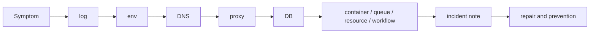
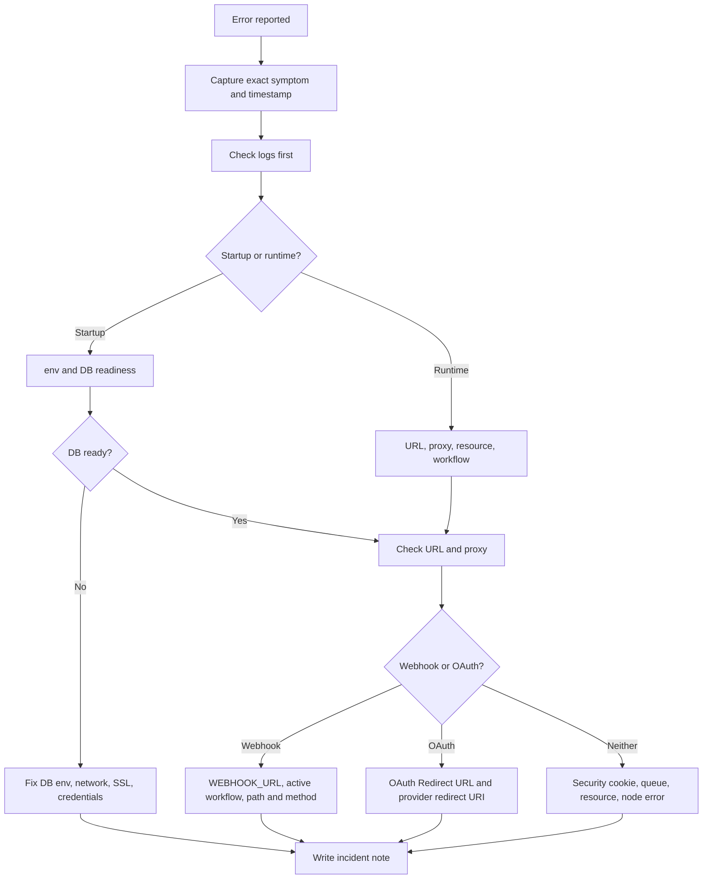
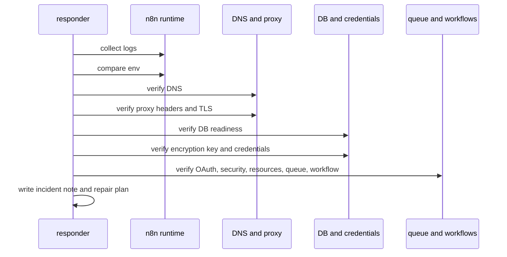

# Week 17｜故障排除演練

> 執行日期：2026-05-28
> 目標：遇到錯誤時，快速判斷是 container、DB、URL、proxy、OAuth、security 還是 resource 問題。
> 實作結果：完成 12 張故障排除卡、log/env/DNS/proxy/DB 檢查順序、incident note 範本，並針對 wrong webhook URL、lost credentials、database connection failed、secure cookie error 給出第一步與修復方向。

## 1. 本週交付物總覽

| 交付物 | 狀態 | 檔案 |
| --- | --- | --- |
| 12 張故障排除卡 | 完成 | `artifacts/week-17-troubleshooting/week-17-troubleshooting-cards.json`；本文件第 4 節 |
| log/env/DNS/proxy/DB 檢查順序 | 完成 | `artifacts/week-17-troubleshooting/week-17-check-order.json`；本文件第 5 節 |
| incident note 範本 | 完成 | `artifacts/week-17-troubleshooting/week-17-incident-note-template.md`；本文件第 6 節 |
| troubleshooting table 演練 | 完成 | 本文件第 4、7 節 |
| 常見問題第一檢查點 | 完成 | 本文件第 3、4、7 節 |
| 症狀轉排查流程 | 完成 | 本文件第 3、5 節 |
| Week 17 驗證腳本 | 完成 | `scripts/verify-week-seventeen.mjs` |

Week 17 把前 16 週累積的部署知識轉成故障排除肌肉記憶。核心原則是：先確認現象與最新變更，再用固定順序排除。不要一開始就改 workflow、重啟所有服務或重建容器；先拿 log、env、DNS、proxy、DB 的客觀證據。這樣可以避免把單一設定錯誤擴大成資料遺失、憑證失效或公開服務中斷。

## 2. 官方來源核對

| 主題 | 官方來源 | 本週採用的判斷 |
| --- | --- | --- |
| Webhook URL behind proxy | https://docs.n8n.io/hosting/configuration/configuration-examples/webhook-url/ | n8n behind reverse proxy 時要手動設定 `WEBHOOK_URL`，並設定 `N8N_PROXY_HOPS=1` 與 forwarded headers，否則 editor 顯示與第三方註冊的 webhook URL 可能錯。 |
| Webhook node common issues | https://docs.n8n.io/integrations/builtin/core-nodes/n8n-nodes-base.webhook/common-issues/ | Test URL 和 Production URL 行為不同；production webhook 需要 workflow active；同一路徑與 HTTP method 只能有一個 webhook。 |
| Telegram trigger issue | https://docs.n8n.io/integrations/builtin/trigger-nodes/n8n-nodes-base.telegramtrigger/common-issues/ | Telegram 要求 HTTPS webhook；behind proxy 時 wrong webhook URL 或 TLS 終止錯誤會造成 bad webhook。 |
| Database env vars | https://docs.n8n.io/hosting/configuration/environment-variables/database/ | `DB_TYPE=postgresdb`、`DB_POSTGRESDB_HOST`、port、user、password、pool size、SSL 設定是 database connection failed 的第一組檢查點。 |
| Supported databases | https://docs.n8n.io/hosting/configuration/supported-databases-settings/ | self-hosted 預設 SQLite，也可設定 PostgreSQL；production 事故要先確認實際 DB 類型與 state 位置。 |
| Logging | https://docs.n8n.io/hosting/logging-monitoring/logging/ | log level 可用 `error`、`warn`、`info`、`debug`；排查時先讀 container logs，再必要時提升到 debug。 |
| Logs env vars | https://docs.n8n.io/hosting/configuration/environment-variables/logs/ | `N8N_LOG_LEVEL`、`N8N_LOG_OUTPUT`、`N8N_LOG_FORMAT=json`、`DB_LOGGING_ENABLED` 能讓 production incident 更可追。 |
| Monitoring | https://docs.n8n.io/hosting/logging-monitoring/monitoring/ | `/healthz` 只代表 instance reachable，`/healthz/readiness` 才能驗證 DB 已連線且 migration ready；metrics 要用 `N8N_METRICS=true` 啟用。 |
| Security env vars | https://docs.n8n.io/hosting/configuration/environment-variables/security/ | `N8N_SECURE_COOKIE=true` 代表 cookie 只透過 HTTPS 傳送；secure cookie error 先查 scheme、proxy headers、TLS。 |
| SSL setup | https://docs.n8n.io/hosting/securing/set-up-ssl/ | 官方建議用 reverse proxy 處理 TLS；也可用 `N8N_SSL_CERT`、`N8N_SSL_KEY` 讓 n8n 直接提供 HTTPS。 |
| Custom encryption key | https://docs.n8n.io/hosting/configuration/configuration-examples/encryption-key/ | n8n 首次啟動會生成 encryption key，credentials 依賴該 key；queue workers 也必須使用同一個 `N8N_ENCRYPTION_KEY`。 |
| Encryption key rotation | https://docs.n8n.io/hosting/securing/encryption-key-rotation/ | rotation 是針對 data encryption key，instance `N8N_ENCRYPTION_KEY` 不應變更；啟用前要備份 DB，且所有 main/workers 共用同一 instance key。 |
| Deployment env vars | https://docs.n8n.io/hosting/configuration/environment-variables/deployment/ | `N8N_EDITOR_BASE_URL`、`N8N_PROTOCOL`、`N8N_HOST`、`N8N_PORT`、`N8N_ENCRYPTION_KEY`、proxy 相關 env 都會影響 URL、OAuth、cookie 與 credentials。 |
| OAuth credentials | https://docs.n8n.io/integrations/builtin/credentials/httprequest/ | OAuth1/OAuth2 credentials 需要把 n8n 顯示的 OAuth Redirect URL 填到外部服務；callback mismatch 先比對 redirect URI。 |
| Memory errors | https://docs.n8n.io/hosting/scaling/memory-errors/ | `Problem running workflow`、`Connection Lost`、`503 Service Temporarily Unavailable`、heap out of memory 都可能是 resource 問題。 |
| Queue mode | https://docs.n8n.io/hosting/scaling/queue-mode/ | queue mode 下 main、workers、webhook processors 要共享 DB、Redis 與 `N8N_ENCRYPTION_KEY`；worker 故障要分別查 Redis、DB、worker logs。 |

## 3. 症狀轉排查流程

故障排除要先把「看到的錯誤」轉成「可能的層」。本週採用七層分類：

| 層 | 常見症狀 | 第一檢查點 |
| --- | --- | --- |
| container | n8n 無法打開、重啟循環、`Connection refused` | `docker ps`、`docker logs`、volume mount、image tag。 |
| DB | `/healthz` 200 但 `/healthz/readiness` 不是 200、startup log 有 connection failed | `DB_TYPE`、`DB_POSTGRESDB_HOST`、port、password、SSL、DB container/network。 |
| URL | webhook 或 OAuth callback 指到 localhost、舊 domain、http | `WEBHOOK_URL`、`N8N_EDITOR_BASE_URL`、editor 中顯示的 URL。 |
| proxy | IP whitelist 失準、secure cookie、websocket 卡住、502/504 | `N8N_PROXY_HOPS`、`X-Forwarded-*` headers、TLS termination、route。 |
| OAuth | provider 回傳 redirect URI mismatch、connect account 失敗 | 外部 provider redirect URI 與 n8n OAuth Redirect URL 是否完全相同。 |
| security | secure cookie error、session 不保留、public API 暴露 | `N8N_SECURE_COOKIE`、HTTPS、`N8N_SAMESITE_COOKIE`、security audit。 |
| resource | 503、Connection Lost、heap out of memory、worker backlog | CPU/RAM、binary data、execution size、worker logs、queue metrics。 |

## 4. 交付物一：12 張故障排除卡

| 卡片 | 症狀 | 第一檢查點 | 修復方向 |
| --- | --- | --- | --- |
| T01 wrong webhook URL | 第三方打到 localhost、舊 domain、http URL 或回傳 bad webhook | 比對 editor 顯示的 webhook URL、`WEBHOOK_URL`、proxy 公開 URL | 設 `WEBHOOK_URL=https://n8n.example.com/`，重啟 n8n，重新啟用 workflow 或重新註冊 webhook。 |
| T02 lost credentials | 重建容器或搬 DB 後 credentials 無法解密 | 確認 `N8N_ENCRYPTION_KEY` 是否與建立 credentials 時一致 | 還原原 instance key；若 key 遺失，從含原 key 的備份還原；不要用新 key 覆蓋 production。 |
| T03 database connection failed | startup log 顯示 DB connect failed 或 readiness 不通過 | 查 `DB_TYPE=postgresdb` 與 `DB_POSTGRESDB_*` env、DB container/network、SSL | 修正 host、port、user、password、database、SSL；確認 DB ready 後重啟 n8n。 |
| T04 secure cookie error | 瀏覽器無法登入、session 不保留、HTTP 環境 cookie 失敗 | 查外部 URL 是否 HTTPS、proxy 是否送 `X-Forwarded-Proto=https`、`N8N_SECURE_COOKIE` | production 保持 HTTPS；local 測試可明確設 `N8N_SECURE_COOKIE=false`，不要把此設定帶到 public production。 |
| T05 OAuth callback mismatch | Connect account 後 provider 拒絕 redirect URI | 比對 n8n 顯示的 OAuth Redirect URL 與 provider 設定 | 修正 `WEBHOOK_URL`、`N8N_EDITOR_BASE_URL` 或 provider redirect URI，然後重新授權 credential。 |
| T06 proxy forwarded headers | IP whitelist、websocket、scheme 或 client IP 判斷錯 | 查 `N8N_PROXY_HOPS` 與 `X-Forwarded-For`、`X-Forwarded-Host`、`X-Forwarded-Proto` | 在最後一層 proxy 補 headers，設定正確 proxy hops，重測 webhook/IP whitelist。 |
| T07 DNS or TLS failure | domain 無法解析、憑證錯誤、HTTPS 不通 | `dig`/`nslookup` domain，`curl -Iv https://domain/healthz` | 修正 DNS A/AAAA/CNAME、TLS certificate、reverse proxy virtual host。 |
| T08 container restart loop | container 一直 restarting 或 n8n UI 開不起來 | `docker ps`、`docker logs`、volume mount、env file path | 修正 env、volume、permission、port collision；避免刪除資料 volume。 |
| T09 resource exhaustion | `503`、`Connection Lost`、heap out of memory、workflow 中斷 | 查 memory/CPU、container OOM、execution size、binary data mode | 增加資源、拆 workflow、降低 concurrency、調整 binary data 與 execution pruning。 |
| T10 queue worker stalled | queue mode 有 backlog，executions 不被 worker 消化 | 查 worker logs、`EXECUTIONS_MODE=queue`、`QUEUE_BULL_REDIS_HOST`、DB connectivity、shared `N8N_ENCRYPTION_KEY` | 修 Redis/DB env，確認 workers 與 main 同版同 key，調整 worker concurrency 與 DB pool。 |
| T11 webhook path or method conflict | webhook 顯示路徑被占用或 production URL 沒反應 | 查 workflow active、Test URL/Production URL、path + method 是否重複 | 停用衝突 workflow，換 path/method，production 前啟用 workflow。 |
| T12 missing logs or evidence | 事故後無法知道錯在哪個 process | 查 `N8N_LOG_LEVEL`、`N8N_LOG_OUTPUT`、`N8N_LOG_FORMAT`、centralized logs | 設 `N8N_LOG_FORMAT=json`，集中 main/worker/proxy/DB logs，incident note 保留時間線。 |

### 必考四題第一步

| 必考情境 | 第一步 | 修復方向 |
| --- | --- | --- |
| wrong webhook URL | 先比對 editor 中 webhook URL 與公開 domain，確認 `WEBHOOK_URL` 是否設定為 HTTPS public base URL。 | 修正 `WEBHOOK_URL` 與 proxy headers，重啟後重新啟用 workflow 或重新註冊第三方 webhook。 |
| lost credentials | 先確認 `N8N_ENCRYPTION_KEY` 是否與原 instance key 一致，並停止任何會覆蓋 key 的部署。 | 還原原 key 或從含原 key 的備份恢復；若原 key 不存在，既有 credentials 無法可靠解密，必須重新建立 credentials。 |
| database connection failed | 先打 `/healthz/readiness` 並讀 startup log，定位是 host、port、password、database、SSL 或 network。 | 修 `DB_TYPE=postgresdb` 與 `DB_POSTGRESDB_*`，確認 DB reachable、migration ready，再重啟 n8n。 |
| secure cookie error | 先確認使用者進站 URL 是 HTTPS，且最後一層 proxy 有 `X-Forwarded-Proto=https`。 | production 修 TLS/proxy；local-only 測試可設 `N8N_SECURE_COOKIE=false`，並在公開前改回安全設定。 |

## 5. 交付物二：log/env/DNS/proxy/DB 檢查順序

固定順序是 `log -> env -> DNS -> proxy -> DB`。這五步先跑完，再進 container、credentials、OAuth、security、resource、queue、workflow。原因是：log 先定義現象，env 定義 n8n 自己怎麼產生 URL/連 DB，DNS 定義外界能不能找到服務，proxy 定義外部 request 如何進到 n8n，DB 定義 state 是否可用。

| 順序 | Gate | 目的 | 代表性檢查 |
| --- | --- | --- | --- |
| 1 | log | 先拿客觀錯誤與時間線 | `docker logs --since 30m n8n`、centralized logs query、`N8N_LOG_LEVEL`。 |
| 2 | env | 確認 instance identity 與連線設定 | `WEBHOOK_URL`、`N8N_EDITOR_BASE_URL`、`N8N_ENCRYPTION_KEY`、`DB_POSTGRESDB_*`。 |
| 3 | DNS | 確認 public hostname 指到正確入口 | `dig n8n.example.com`、`curl -Iv https://n8n.example.com/healthz`。 |
| 4 | proxy | 確認 TLS、forwarded headers、routes | `X-Forwarded-Proto`、`X-Forwarded-Host`、`N8N_PROXY_HOPS`、`/webhook/*` route。 |
| 5 | DB | 確認 durable state ready | `/healthz/readiness`、PostgreSQL network、password、SSL、pool。 |
| 6 | container | 確認 process 與 volume | image tag、restart count、volume mount、port mapping。 |
| 7 | credentials | 確認 encryption key 與 credential state | 原 `N8N_ENCRYPTION_KEY`、credential decrypt error、DB backup。 |
| 8 | OAuth | 確認 redirect URI 與 provider 設定 | n8n OAuth Redirect URL、provider redirect URI、public base URL。 |
| 9 | security | 確認 cookie、SSO、API exposure | `N8N_SECURE_COOKIE`、HTTPS、SameSite、security audit。 |
| 10 | resource | 確認 CPU、memory、binary data、execution size | OOM logs、503、execution payload、binary data mode。 |
| 11 | queue | 確認 Redis 與 workers | Redis host/port/password、worker logs、shared key、queue metrics。 |
| 12 | workflow | 最後才改 workflow | node error、retry、timeout、webhook response mode、external API status。 |

## 6. 交付物三：incident note 範本

incident note 的功能不是寫漂亮報告，而是留下可重演證據。每次事故至少要記錄：

| 區塊 | 必填內容 |
| --- | --- |
| Incident header | incident id、owner、severity、start time、detect time、affected workflow、affected users。 |
| Symptom | exact error text、HTTP status、browser message、provider response、execution id、container name。 |
| Architecture context | deployment type、public URL、proxy、DB、Redis/workers、n8n version、last deploy。 |
| Check sequence | log、env、DNS、proxy、DB 的結果與時間。 |
| Hypothesis matrix | 每個可能層的 evidence、status、next action。 |
| Fix | 實際變更、指令、env diff、restarts、rollback point。 |
| Verification | health/readiness、webhook test、OAuth reconnect、credential decrypt、execution success。 |
| Root cause | direct cause、contributing cause、missed detection。 |
| Prevention | monitoring、backup、runbook、deployment guard、owner。 |

範本已落在 `artifacts/week-17-troubleshooting/week-17-incident-note-template.md`。它刻意把「已排除」和「仍需追蹤」分開，避免 incident 結束後只留下口頭印象。

## 7. troubleshooting table 演練

### Drill A：wrong webhook URL

| 項目 | 操作 |
| --- | --- |
| 症狀 | 外部服務打 webhook 失敗，或 provider 顯示 webhook URL 必須是 HTTPS。 |
| 第一檢查點 | 看 n8n editor 中 Webhook node 顯示的 Production URL，再比對 `WEBHOOK_URL` 與 public domain。 |
| 證據 | `curl -Iv https://n8n.example.com/webhook/path`、provider webhook 設定截圖、container env。 |
| 修復方向 | 設 `WEBHOOK_URL=https://n8n.example.com/`、`N8N_PROXY_HOPS=1`，proxy 補 `X-Forwarded-*` headers，重啟後重新註冊 webhook。 |
| 驗證 | workflow active 後，Production URL 收到 2xx，execution list 有新 execution。 |

### Drill B：lost credentials

| 項目 | 操作 |
| --- | --- |
| 症狀 | migration 或 container recreation 後，credentials 顯示無法解密，OAuth/token 失效。 |
| 第一檢查點 | 立即查目前 `N8N_ENCRYPTION_KEY`，與原部署 secret、備份、worker env 比對。 |
| 證據 | deployment secret history、old `.n8n` settings file、DB backup timestamp、worker env。 |
| 修復方向 | 還原原 `N8N_ENCRYPTION_KEY`；若原 key 遺失，從含原 key 的備份還原或重新建立 credentials。 |
| 驗證 | Credential test success，既有 workflow 可讀 credentials，queue workers 使用同一 key。 |

### Drill C：database connection failed

| 項目 | 操作 |
| --- | --- |
| 症狀 | n8n startup log 有 database connection failed，或 `/healthz/readiness` 回傳非 200。 |
| 第一檢查點 | 查 `DB_TYPE=postgresdb` 與 `DB_POSTGRESDB_HOST`、port、database、user、password、SSL 是否與 DB service 一致。 |
| 證據 | `docker compose ps`、DB logs、n8n startup logs、readiness status、network name。 |
| 修復方向 | 修正 DB env、Docker network、SSL CA、DB password；確認 DB ready 後重啟 n8n。 |
| 驗證 | `/healthz/readiness` 200，n8n UI 可登入，existing workflows 可讀。 |

### Drill D：secure cookie error

| 項目 | 操作 |
| --- | --- |
| 症狀 | 使用 HTTP public URL、behind proxy、或 browser console 顯示 secure cookie 相關錯誤，登入 session 不保留。 |
| 第一檢查點 | 確認使用者進站為 HTTPS，proxy 給 n8n 的 forwarded proto 是 `https`，`N8N_SECURE_COOKIE` 沒被錯誤關閉或錯誤保留。 |
| 證據 | `curl -I https://n8n.example.com`、proxy access log、response headers、container env。 |
| 修復方向 | production 修 TLS 與 proxy headers；local-only 測試可暫設 `N8N_SECURE_COOKIE=false`，但 public production 必須回到 HTTPS cookie。 |
| 驗證 | login session 穩定，browser 不再拒收 cookie，security env 與 public URL 一致。 |

## 8. Week 17 完成檢查

| 驗收條件 | 結果 | 證據 |
| --- | --- | --- |
| 完成 12 張故障排除卡 | 通過 | 第 4 節與 `week-17-troubleshooting-cards.json` |
| 完成 log/env/DNS/proxy/DB 檢查順序 | 通過 | 第 5 節與 `week-17-check-order.json` |
| 完成 incident note 範本 | 通過 | 第 6 節與 `week-17-incident-note-template.md` |
| wrong webhook URL 有第一步與修復方向 | 通過 | 第 4、7 節 T01/Drill A |
| lost credentials 有第一步與修復方向 | 通過 | 第 4、7 節 T02/Drill B |
| database connection failed 有第一步與修復方向 | 通過 | 第 4、7 節 T03/Drill C |
| secure cookie error 有第一步與修復方向 | 通過 | 第 4、7 節 T04/Drill D |
| 症狀可轉成排查流程 | 通過 | 第 3、5 節 |

## 9. 下一週銜接

Week 18 會進入平台選型與成本風險評估。Week 17 的 incident notes 可以回餵 Week 18：哪一類事故最常發生、哪一層最難維運、哪個平台能降低 DB/proxy/OAuth/security/resource 的操作風險。選型不只看月費，也要看它能不能減少真實事故的 MTTR。
