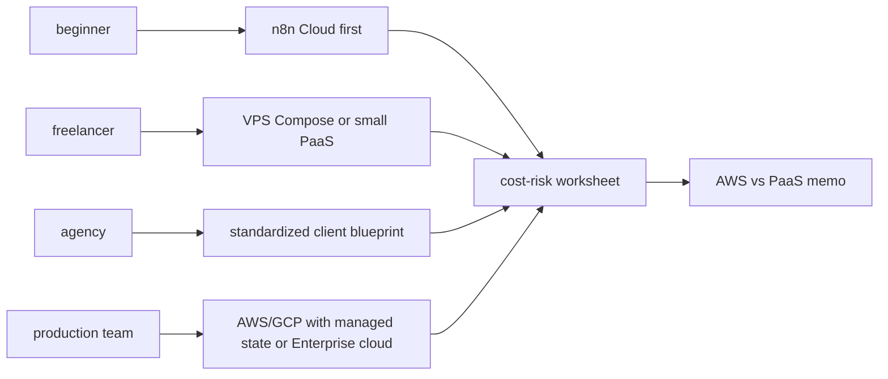
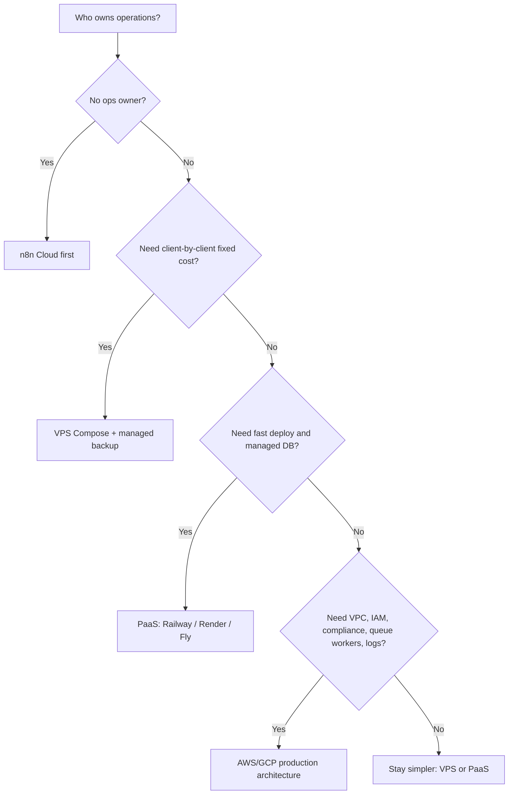

# Week 18｜平台選型與成本風險評估

> 執行日期：2026-05-28
> 目標：說清楚不同使用者類型應該選哪條部署路線，並把成本與維運責任攤開。
> 實作結果：完成 deployment recommendation matrix、cost-risk worksheet、AWS vs PaaS decision memo，並為 beginner、freelancer、agency、production team 分別提出首選、替代方案、避免事項。

## 1. 本週交付物總覽

| 交付物 | 狀態 | 檔案 |
| --- | --- | --- |
| deployment recommendation matrix | 完成 | `artifacts/week-18-platform-selection/week-18-deployment-recommendation-matrix.json`；本文件第 3 節 |
| cost-risk worksheet | 完成 | `artifacts/week-18-platform-selection/week-18-cost-risk-worksheet.csv`；本文件第 4 節 |
| AWS vs PaaS decision memo | 完成 | `artifacts/week-18-platform-selection/week-18-aws-vs-paas-decision-memo.md`；本文件第 5 節 |
| Week 18 回饋報告 | 完成 | `artifacts/week-18-platform-selection/week-18-feedback-report.md` |
| beginner、freelancer、agency、production team 選型 | 完成 | 本文件第 3、6 節 |
| AWS 與 simpler cloud options 比較 | 完成 | 本文件第 5 節 |
| usage-priced RAM/CPU/storage/egress 風險整理 | 完成 | 本文件第 4 節 |
| Week 18 驗證腳本 | 完成 | `scripts/verify-week-eighteen.mjs` |



Week 18 的判斷基準不是「哪個平台最酷」，而是「誰要承擔維運責任」。同一個 n8n，可以是 n8n Cloud、單機 VPS、PaaS、Cloud Run、AWS ECS/Fargate、或 Kubernetes；錯誤的選型會把 Week 14 的 backup、Week 15 的 security、Week 16 的 scaling、Week 17 的 troubleshooting 變成長期成本。

## 2. 官方來源核對

| 主題 | 官方來源 | 本週採用的判斷 |
| --- | --- | --- |
| n8n Docker install | https://docs.n8n.io/hosting/installation/docker/ | n8n 官方 Docker 文件明確要求 persistent volume；適合作為 VPS/Docker Compose 路線基礎。 |
| n8n scaling overview | https://docs.n8n.io/hosting/scaling/overview/ | 大量 users、workflows、executions 時要調整設定；queue mode 是擴展路線，不是 beginner 起點。 |
| n8n queue mode | https://docs.n8n.io/hosting/scaling/queue-mode/ | queue mode 需要 PostgreSQL、Redis、workers；production team 才應把它當主要架構。 |
| n8n execution data | https://docs.n8n.io/hosting/scaling/execution-data/ | execution retention 會影響 database size 與效能；成本 worksheet 必須包含 DB storage 與 pruning。 |
| n8n binary data | https://docs.n8n.io/hosting/scaling/binary-data/ | binary data 會影響 memory/storage；平台選型不能只看 app compute。 |
| n8n external storage | https://docs.n8n.io/hosting/scaling/external-storage/ | 大量 binary data 需要外部物件儲存；這會增加 storage、request、egress 風險。 |
| n8n logging | https://docs.n8n.io/hosting/logging-monitoring/logging/ | 多 process/multi-worker deployment 要 centralized logs；log retention 是成本項。 |
| n8n monitoring | https://docs.n8n.io/hosting/logging-monitoring/monitoring/ | production 需要 health/readiness/metrics；監控與告警是維運責任，不是可省略項。 |
| Render pricing | https://render.com/pricing | Render 以服務、Postgres、disk、bandwidth 等項目組合成本；適合簡化部署但仍需看 persistent disk 與 DB plan。 |
| Render free usage | https://render.com/free | free tier 有使用限制；不能把 free service 當 production webhook 承載。 |
| Railway pricing | https://docs.railway.com/pricing | Railway 採 base subscription fee + resource usage；RAM/CPU/storage/egress 會直接影響月費；適合快速部署但要設 usage alerts。 |
| Railway databases | https://docs.railway.com/databases | Railway database templates 是 unmanaged services；production 要自己負責 backup、DR、tuning、security、monitoring/maintenance，或改用 Enterprise / external managed database provider。 |
| Fly.io pricing | https://fly.io/pricing/ | Fly 以 machines、volumes、bandwidth 等項目計價；多 region 或 volume 成長會改變成本。 |
| Google Cloud Run pricing | https://cloud.google.com/run/pricing | Cloud Run 依 CPU、memory、requests、networking 等項目計費；scale-to-zero 有價值，但長時間常駐與 egress 要估算。 |
| AWS Fargate pricing | https://aws.amazon.com/fargate/pricing/ | Fargate 以 vCPU、memory、OS/CPU architecture、running time 計費；需搭配 RDS、logs、load balancer、data transfer 看總成本。 |
| Amazon RDS pricing | https://aws.amazon.com/rds/pricing/ | RDS 成本包含 instance、storage、I/O、backup、data transfer；production team 才應承擔完整雲端資料層。 |
| AWS data transfer pricing | https://aws.amazon.com/ec2/pricing/on-demand/#Data_Transfer | AWS egress 與跨區流量會變成成本風險；自動化傳大檔或 binary data 時要特別估算。 |
| Amazon Lightsail pricing | https://aws.amazon.com/lightsail/pricing/ | Lightsail 提供比較固定的 VPS 套餐；適合作為簡單 VPS 路線對照，但仍需自行維運 Docker、backup、安全更新。 |

## 3. 交付物一：deployment recommendation matrix

| User type | 首選 | 替代方案 | 避免事項 | 為什麼 |
| --- | --- | --- | --- | --- |
| beginner | n8n Cloud | Local Docker Desktop 學習環境 | 不要用 public tunnel 或自架 VPS 承載 production credentials | beginner 的主要風險是把 state、URL、backup、security 搞混；先讓平台承擔 hosting，自己學 workflow。 |
| freelancer | 單台 VPS + Docker Compose + PostgreSQL + Caddy | Railway/Render/Fly 小型 PaaS + managed or external PostgreSQL；Railway template DB 需另做 backup/monitoring/maintenance；或 n8n Cloud 交給客戶付費 | 不要為小客戶上 AWS ECS/RDS 或 Kubernetes | freelancer 需要可解釋月費與可控維運；VPS 固定成本清楚，PaaS 上線快但要控 usage。 |
| agency | 標準化 client blueprint：Compose/PaaS + managed or external PostgreSQL + backup + incident note | n8n Cloud Business/Enterprise 作為低維運交付 | 不要多客戶共用同一個未隔離 instance，不要沒有 budget alert 的 usage-priced 平台 | agency 的核心是可複製、可交接、可隔離；選型要降低每個客戶的維運變異。 |
| production team | AWS/GCP production architecture：managed PostgreSQL、Redis queue、centralized logs、IaC、budgets | n8n Cloud Enterprise 或成熟 PaaS + managed DB/Redis | 不要用單 VM 無 backup 無 logs，也不要未設 budget 的 autoscaling | production team 有 compliance、VPC、SSO、audit、queue workers、SLO，值得承擔雲端架構，但必須有 FinOps 與 on-call。 |

### 選型流程



### 四類使用者的決策摘要

| User type | 30 秒建議 |
| --- | --- |
| beginner | 先用 n8n Cloud；只在本機 Docker 學 state、volume、credentials，不要自己公開 production。 |
| freelancer | 有基本 Linux/Docker 能力就用 VPS Compose；若不想維護 VM，就用 PaaS 但設 monthly budget、backup、DB storage alert。 |
| agency | 建立一份標準交付藍圖，每個客戶獨立 instance、獨立 DB、獨立 credentials、獨立 backup；不要把多客戶塞進同一個省錢 instance。 |
| production team | 用 AWS/GCP 不是因為高級，而是因為你真的需要 VPC/IAM/audit/logging/queue/worker/DR；若沒有這些需求，PaaS 或 n8n Cloud 更理性。 |

## 4. 交付物二：cost-risk worksheet

成本風險分三類：

| 類型 | 說明 | 常見失控點 |
| --- | --- | --- |
| Fixed baseline | 即使沒有 executions 也會付的費用 | VPS、RDS instance、Redis instance、persistent disk、support plan。 |
| Usage variable | 用量增加才上升的費用 | CPU/RAM runtime、egress、request count、storage growth、logs ingestion、object storage operations。 |
| Human operations | 人工維護與事故處理成本 | patch、backup restore、incident response、security review、client support。 |

### RAM/CPU/storage/egress 風險表

| 成本項 | 風險 | 控制方式 |
| --- | --- | --- |
| App RAM | workflow 讀大 payload、binary data in memory、並行 executions | 限制 concurrency、拆 workflow、設定 binary data mode、監控 memory high-water mark。 |
| App CPU | 大量 transformation、code node、PDF/image processing、crypto/API batching | 將重工作排程化、queue workers、限制 execution timeout、觀察 CPU throttling。 |
| DB compute | execution history、credentials、workflow metadata、queue workers 共用 DB | PostgreSQL first、connection pool、execution pruning、slow query 與 readiness monitoring。 |
| DB storage | 保存太多 success executions、大量 binary metadata、backup snapshots | retention policy、pruning、storage alert、定期 restore drill。 |
| Object storage | binary data、attachments、workflow generated files | lifecycle policy、檔案大小限制、避免無限保存 debug artifacts。 |
| Egress | webhook 回傳大檔、跨區傳輸、第三方 API 同步大量資料 | 設 response size policy、避免跨區 DB/app、評估 CDN 或直接讓 client 拉檔。 |
| Logs | debug level 長期開啟、多 workers、多 requests | incident 才短期 debug、JSON logs、retention days、sampling。 |
| Autoscaling | scale-to-zero 或 horizontal scale 沒有上限 | 設 max instances、monthly budget alerts、queue backlog 門檻。 |
| Redis/queue | worker 增加造成 DB connections 與 Redis plan 升級 | worker concurrency、DB pool、queue metrics、Redis memory alert。 |
| Public IPv4/LB | cloud load balancer、公網 IP、TLS endpoint | 小案用 Caddy/VPS/PaaS managed endpoint；production 才上雲端 LB。 |
| Backup | DB backup、volume snapshot、object storage versioning | 決定 RPO/RTO、保留週期、restore drill，不只看備份大小。 |
| Support and SLO | 商業支援、on-call、incident SLA | 把支援成本寫進報價，不把 response time 當免費承諾。 |

### 最低估算公式

```text
monthly_total =
  app_compute_baseline
  + db_compute_baseline
  + persistent_storage
  + backup_storage
  + object_storage
  + egress
  + logs_and_metrics
  + redis_or_queue
  + public_endpoint_or_load_balancer
  + support_plan
  + maintenance_hours
```

這個公式的重點不是精準報價，而是提醒：PaaS 的表面月費常常沒有包含全部 variable；AWS 的服務單價也不是總價，RDS、CloudWatch、NAT/LB、data transfer、backup、Redis、on-call 都要一起看。

## 5. 交付物三：AWS vs PaaS decision memo

### Decision

預設從 simpler cloud options 開始，只有在需求明確跨過門檻時才選 AWS/GCP 類 hyperscaler。PaaS 的價值是速度、少維運、較少基礎設施決策；AWS 的價值是 VPC/IAM/compliance/observability/managed state/queue/region/networking 的完整控制。

### Use PaaS when

| 條件 | 理由 |
| --- | --- |
| 團隊沒有 dedicated cloud ops | PaaS 減少 VM patch、TLS、deploy pipeline、runtime 管理。 |
| workload 小到中等，且主要是 webhook/API automation | PaaS 足以承載 n8n + Postgres，重點是 backup 與 budget。 |
| 客戶需要快上線與可理解月費 | PaaS/VPS 的報價比多服務 AWS 容易說明。 |
| 不需要複雜 VPC/private networking | 避免為了少量 workflow 建整套 network architecture。 |
| incident response 主要是 app/env/DB/proxy | Week 17 runbook 在 PaaS/VPS 上比較容易執行。 |

### Use AWS/GCP when

| 條件 | 理由 |
| --- | --- |
| 有 production team、on-call、IaC、FinOps | 沒有這些，AWS 的自由度會變成事故面。 |
| 需要 VPC、private database、IAM、audit、SSO、compliance boundary | 這些是 hyperscaler 的強項，也是它值得複雜的原因。 |
| 需要 queue mode、workers、managed Redis、centralized logs、separate webhook processors | Week 16 的 scaling ladder 已進入多元件架構。 |
| 需要明確 RPO/RTO、multi-AZ DB、backup policy、security review | production 的責任已經超過單 VM/PaaS 的舒適區。 |
| 需要和既有 AWS/GCP 資產整合 | 例如 private APIs、internal data stores、VPC peering、IAM-based access。 |

### Do not choose AWS just because

| 錯誤理由 | 更好的選擇 |
| --- | --- |
| 想看起來 enterprise | n8n Cloud Business/Enterprise 或標準化 PaaS 交付更可靠。 |
| 以為 AWS 一定便宜 | 先把 RDS、egress、logs、LB、NAT、backup、maintenance hours 算進去。 |
| 只有一兩個客戶 workflow | VPS Compose 或 PaaS 比多服務 AWS 更好維護。 |
| 還沒有 backup/restore drill | Week 14 完成前，不要擴大平台複雜度。 |
| 還沒有 troubleshooting runbook | Week 17 完成前，AWS 只會增加排查層數。 |

### Recommendation by maturity

| Maturity | Platform |
| --- | --- |
| Learning | n8n Cloud 或 Local Docker Desktop。 |
| First paid automation | VPS Compose + PostgreSQL，或 PaaS + managed/external PostgreSQL。 |
| Repeatable client delivery | Standardized PaaS/VPS blueprint + backup + incident note + budget alerts。 |
| Production operations | AWS/GCP + managed PostgreSQL + Redis queue + logs + IaC + budget + on-call。 |

## 6. 驗收：四類 user type 的首選、替代、避免事項

| User type | 首選 | 替代方案 | 避免事項 |
| --- | --- | --- | --- |
| beginner | n8n Cloud，因為先避開 hosting、backup、public URL、secure cookie、database 維運 | Local Docker Desktop 學習 volume、credentials、workflow 匯出 | public tunnel 當 production、自架 VPS 放真客戶 credentials、跳 AWS/Kubernetes |
| freelancer | VPS Docker Compose + PostgreSQL + Caddy，成本固定、可控、容易向客戶說明 | Railway/Render/Fly + managed/external PostgreSQL；Railway template DB 需自己處理 backup、DR、security、monitoring；或客戶願付時用 n8n Cloud | 沒 backup 的單容器、free tier production、未設 budget 的 usage-priced 平台、AWS multi-service 起手 |
| agency | 標準化 blueprint：每客戶獨立 instance、獨立 DB、backup、patch cadence、incident note | n8n Cloud Business/Enterprise，或 PaaS + managed DB 作為低維運交付 | 多客戶共用未隔離 instance、同一組 credentials、手工散裝部署、沒有維護合約 |
| production team | AWS/GCP production stack：managed PostgreSQL、Redis queue、workers、centralized logs、IaC、budget alerts | n8n Cloud Enterprise；或成熟 PaaS + managed DB/Redis 作為過渡 | 單台 VPS 承擔高 SLO、沒有 RPO/RTO、未控 autoscaling、無 logs/alerts 的 queue mode |

## 7. Week 18 完成檢查

| 驗收條件 | 結果 | 證據 |
| --- | --- | --- |
| 完成 deployment recommendation matrix | 通過 | 第 3 節與 `week-18-deployment-recommendation-matrix.json` |
| 完成 cost-risk worksheet | 通過 | 第 4 節與 `week-18-cost-risk-worksheet.csv` |
| 完成 AWS vs PaaS decision memo | 通過 | 第 5 節與 `week-18-aws-vs-paas-decision-memo.md` |
| beginner 有首選、替代、避免事項 | 通過 | 第 3、6 節 |
| freelancer 有首選、替代、避免事項 | 通過 | 第 3、6 節 |
| agency 有首選、替代、避免事項 | 通過 | 第 3、6 節 |
| production team 有首選、替代、避免事項 | 通過 | 第 3、6 節 |
| usage-priced 平台 RAM/CPU/storage/egress 風險已整理 | 通過 | 第 4 節 |
| AWS 與 simpler cloud options 已比較 | 通過 | 第 5 節 |

## 8. 下一週銜接

Week 19 會進入 Capstone：建立可複製部署作品。Week 18 的結論會變成作品包的入口選單：先選 user type，再套用對應 blueprint、成本 worksheet、incident note、backup checklist、security cadence。Capstone 不只要能部署，還要能交接給下一個維護者。
