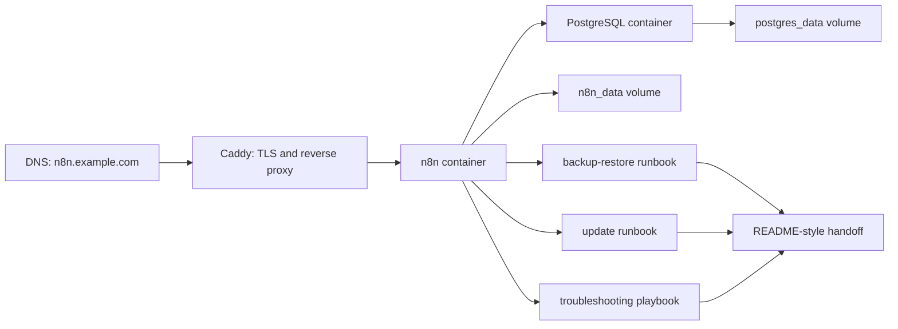
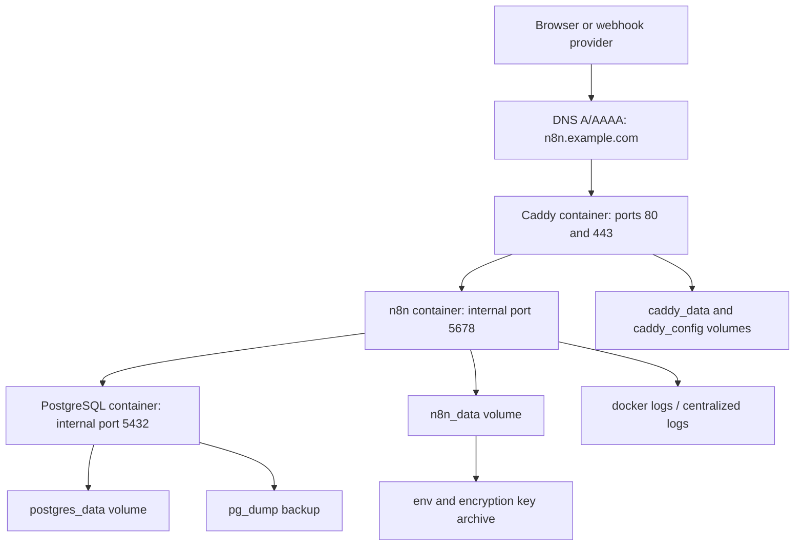

# Week 19｜Capstone：建立可複製部署作品

> 執行日期：2026-05-28
> 目標：把前 18 週學到的內容變成另一位同仁可以接手的部署作品包。
> 主路線：VPS Docker Compose + PostgreSQL + Caddy。
> 實作結果：完成部署作品包、README-style handoff、final demo checklist，並補齊 architecture、env template、DNS/TLS notes、backup/update/troubleshooting。

## 1. 本週交付物總覽

| 交付物 | 狀態 | 檔案 |
| --- | --- | --- |
| 部署作品包 | 完成 | `artifacts/week-19-capstone/deployment-package/` |
| README-style handoff | 完成 | `artifacts/week-19-capstone/deployment-package/README.md` |
| final demo checklist | 完成 | `artifacts/week-19-capstone/deployment-package/final-demo-checklist.csv` |
| deployment package manifest | 完成 | `artifacts/week-19-capstone/week-19-deployment-package-manifest.json` |
| env template | 完成 | `artifacts/week-19-capstone/deployment-package/.env.template` |
| architecture、DNS/TLS notes、backup/update/troubleshooting | 完成 | 本文件第 3、4、5、6 節與作品包 runbooks |
| Week 19 驗證腳本 | 完成 | `scripts/verify-week-nineteen.mjs` |

Week 19 選 VPS Docker Compose + PostgreSQL + Caddy 作為主部署路線，原因是它最適合做成可複製作品：成本相對固定、架構容易理解、能完整演示 DNS/TLS、persistent state、PostgreSQL、backup/restore、update、troubleshooting，也能自然銜接 Week 20 的最終建議報告。

## 2. 官方來源核對

| 主題 | 官方來源 | 本週採用的判斷 |
| --- | --- | --- |
| Docker self-hosting | https://docs.n8n.io/hosting/installation/docker/ | n8n 官方建議 Docker 適合多數 self-hosting；persistent volume 必須保存 `/home/node/.n8n`。 |
| Docker Compose setup | https://docs.n8n.io/hosting/installation/server-setups/docker-compose/ | Compose 範例把 n8n data volume 視為 state；作品包用 Compose 固化 n8n、PostgreSQL、Caddy。 |
| DigitalOcean Caddy route | https://docs.n8n.io/hosting/installation/server-setups/digital-ocean/ | 官方 Caddy 範例使用 `reverse_proxy n8n:5678`；作品包沿用 Caddy 作為 TLS reverse proxy。 |
| Webhook URL behind proxy | https://docs.n8n.io/hosting/configuration/configuration-examples/webhook-url/ | reverse proxy 後要設定 `WEBHOOK_URL`、`N8N_PROXY_HOPS=1` 與 `X-Forwarded-*` headers；作品包把它放入 env template 與 DNS/TLS notes。 |
| SSL setup | https://docs.n8n.io/hosting/securing/set-up-ssl/ | production 要使用 HTTPS；Caddy 自動處理 TLS，n8n 內部仍以 `n8n:5678` 服務。 |
| Database settings | https://docs.n8n.io/hosting/configuration/supported-databases-settings/ | self-hosted 可使用 PostgreSQL；作品包使用 `DB_TYPE=postgresdb` 與 `DB_POSTGRESDB_*`。 |
| Custom encryption key | https://docs.n8n.io/hosting/configuration/configuration-examples/encryption-key/ | `N8N_ENCRYPTION_KEY` 是 credentials 可解密的關鍵；handoff 明確要求保存與交接。 |
| Update self-hosted n8n | https://docs.n8n.io/hosting/installation/updating/ | 更新前要檢查 release notes、測試環境、備份；作品包提供 update runbook。 |
| Logging | https://docs.n8n.io/hosting/logging-monitoring/logging/ | 作品包預設 `N8N_LOG_FORMAT=json`，incident 時可短期提高 log level。 |
| Monitoring | https://docs.n8n.io/hosting/logging-monitoring/monitoring/ | 作品包用 `/healthz` 與 `/healthz/readiness` 做啟動與交接驗收。 |
| Execution data | https://docs.n8n.io/hosting/scaling/execution-data/ | handoff 要說明 execution data retention 與 DB storage 風險。 |
| Binary data | https://docs.n8n.io/hosting/scaling/binary-data/ | 作品包預設 `N8N_DEFAULT_BINARY_DATA_MODE=database`，避免把 binary data 放在 ephemeral memory。 |

## 3. 主部署路線與架構

| 決策 | 選擇 |
| --- | --- |
| User type | freelancer / agency baseline，可被 production team 擴展。 |
| Primary route | VPS Docker Compose + PostgreSQL + Caddy。 |
| Runtime | Docker Compose 管理 `n8n`、`postgres`、`caddy`。 |
| Public endpoint | Caddy 對外 80/443，自動 TLS，反代到 `n8n:5678`。 |
| State | `postgres_data` 保存 PostgreSQL；`n8n_data` 保存 n8n local state 與設定檔。 |
| Secrets | `.env` 由 `.env.template` 建立，必須安全保存 `N8N_ENCRYPTION_KEY` 與 DB password。 |
| Backup | `pg_dump` + volume snapshot/export + env secret archive。 |
| Update | backup -> pull image -> compose up -> readiness -> rollback path。 |
| Troubleshooting | Week 17 的 `log -> env -> DNS -> proxy -> DB` 順序。 |

### Architecture map

## 4. 部署作品包內容

| 檔案 | 用途 | 接手者要知道什麼 |
| --- | --- | --- |
| `README.md` | README-style handoff | 先讀這份，理解架構、啟動、備份、風險與下一步。 |
| `compose.yaml` | Docker Compose runtime | 啟動 `postgres`、`n8n`、`caddy`，使用 named volumes 保存 state。 |
| `.env.template` | env template | 建立 `.env` 的來源；不得提交真實 secrets。 |
| `Caddyfile` | DNS/TLS reverse proxy | 對外 domain 綁 Caddy，內部反代 `n8n:5678`。 |
| `backup-restore-runbook.md` | 備份與還原 | 說明 backup scope、pg_dump、volume、env secret、restore verification。 |
| `update-runbook.md` | 更新流程 | 說明 update 前後檢查、rollback point、readiness 驗收。 |
| `troubleshooting-playbook.md` | 故障排除 | 直接接 Week 17 的檢查順序與四個高風險情境。 |
| `final-demo-checklist.csv` | 期末展示清單 | 逐項驗證架構、啟動方式、備份方式、風險與下一步。 |

### README handoff 的最低閱讀順序

1. 讀 `README.md` 的 architecture summary。
2. 檢查 `.env.template` 的 secrets 與 public URL。
3. 對照 `compose.yaml` 確認 state volumes。
4. 對照 `Caddyfile` 確認 DNS/TLS route。
5. 跑 final demo checklist 的 dry run。
6. 看 backup/update/troubleshooting runbooks，確認能交接給下一位維護者。

## 5. env template、DNS/TLS notes

`.env.template` 把必填設定分成五類：

| 類別 | 代表設定 | 風險 |
| --- | --- | --- |
| Public URL | `N8N_DOMAIN`、`WEBHOOK_URL`、`N8N_EDITOR_BASE_URL` | wrong webhook URL、OAuth callback mismatch、secure cookie error。 |
| Database | `POSTGRES_USER`、`POSTGRES_PASSWORD`、`DB_POSTGRESDB_*` | database connection failed、DB restore mismatch。 |
| Encryption | `N8N_ENCRYPTION_KEY` | lost credentials；此值遺失會導致既有 credentials 無法可靠解密。 |
| Runtime | `GENERIC_TIMEZONE`、`TZ`、`N8N_RUNNERS_ENABLED` | schedule nodes、task execution、runtime consistency。 |
| Logs/security | `N8N_LOG_FORMAT=json`、`N8N_SECURE_COOKIE=true` | troubleshooting evidence、HTTPS session behavior。 |

DNS/TLS notes 的接手規則：

| 項目 | 規則 |
| --- | --- |
| DNS | `N8N_DOMAIN` 必須解析到 VPS public IP。 |
| Firewall | VPS 必須開 80/443 給 Caddy；5678 不對外開。 |
| TLS | Caddy 取得與更新 certificate；n8n 內部只接受 Caddy 反代。 |
| Proxy headers | Caddy 要帶 `X-Forwarded-Proto`、`X-Forwarded-Host`、`X-Forwarded-For`。 |
| Webhook URL | `WEBHOOK_URL=https://N8N_DOMAIN/` 必須與實際 HTTPS domain 一致。 |

## 6. backup、update、troubleshooting 交接

### Backup

| Scope | 方法 | 驗收 |
| --- | --- | --- |
| PostgreSQL | `pg_dump` 匯出 DB | restore 到 staging 後 `/healthz/readiness` 200。 |
| n8n local state | 保存 `n8n_data` volume | settings 與 encryption key path 可追蹤。 |
| Secrets | 安全保存 `.env` 與 `N8N_ENCRYPTION_KEY` | 新環境可用同 key 解密 credentials。 |
| Caddy | 保存 `Caddyfile` 與 Caddy volumes | domain 可重新取得 TLS。 |

### Update

| Step | 動作 |
| --- | --- |
| 1 | 閱讀 n8n release notes，確認 breaking changes。 |
| 2 | 執行 DB、volume、env secret backup。 |
| 3 | 在 staging 或 maintenance window 更新 image。 |
| 4 | 檢查 `/healthz`、`/healthz/readiness`、workflow execution、webhook URL。 |
| 5 | 若失敗，回到前一個 image tag 並 restore backup。 |

### Troubleshooting

| Incident | 第一檢查點 |
| --- | --- |
| wrong webhook URL | 比對 editor URL、`WEBHOOK_URL`、Caddy domain。 |
| lost credentials | 比對 `N8N_ENCRYPTION_KEY` 與原部署 secret。 |
| database connection failed | 查 `/healthz/readiness`、PostgreSQL logs、`DB_POSTGRESDB_*`。 |
| secure cookie error | 查 HTTPS、Caddy proxy headers、`N8N_SECURE_COOKIE`。 |

## 7. final demo checklist 摘要

final demo checklist 的展示順序是：

1. 展示作品包檔案與架構圖。
2. 說明 `.env.template` 如何變成 `.env`。
3. 說明 DNS 指向、Caddy TLS、內部 reverse proxy。
4. 說明 `compose.yaml` 的 volumes 與 state ownership。
5. 朗讀 backup runbook 的 restore 驗收。
6. 朗讀 update runbook 的 rollback point。
7. 用 troubleshooting playbook 回答四個必考 incident。
8. 用 Week 18 矩陣說明何時改選 n8n Cloud、PaaS、AWS/GCP。

## 8. Week 19 完成檢查

| 驗收條件 | 結果 | 證據 |
| --- | --- | --- |
| 完成部署作品包 | 通過 | `artifacts/week-19-capstone/deployment-package/` |
| 完成 README-style handoff | 通過 | `deployment-package/README.md` |
| 完成 final demo checklist | 通過 | `deployment-package/final-demo-checklist.csv` |
| 選定一條主部署路線 | 通過 | VPS Docker Compose + PostgreSQL + Caddy |
| 整理 architecture | 通過 | 本文件第 3 節與 package README |
| 整理 env template | 通過 | `.env.template` |
| 整理 DNS/TLS notes | 通過 | `Caddyfile`、README、本文件第 5 節 |
| 整理 backup/update/troubleshooting | 通過 | 三份 runbook |
| 另一位同仁只看作品包即可接手 | 通過 | README + manifest + checklist 覆蓋架構、啟動、備份、風險、下一步 |

## 9. 下一週銜接

Week 20 會做期末驗收與下一階段導入排序。Week 19 的作品包會成為 Week 20 的展示核心：先證明可交接，再提出 90 天維運節奏、平台升級路線與最後建議。
