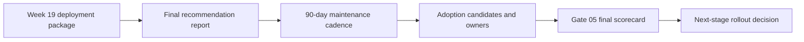
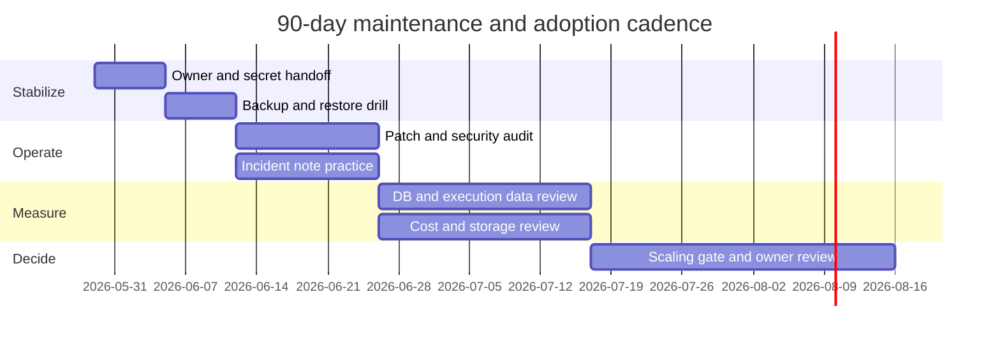

# Week 20｜期末驗收與下一階段導入排序

> 執行日期：2026-05-28
> 目標：把 20 週部署能力轉成下一階段導入判斷。
> 實作結果：完成最終建議報告、90 天維運節奏、導入候選清單與 owner，並把期末驗收從「n8n 有跑」提升到能回答「為什麼選這條路、風險在哪、如何備份、如何更新、何時擴展」。

## 1. 本週交付物總覽

| 交付物 | 狀態 | 檔案 |
| --- | --- | --- |
| 最終建議報告 | 完成 | `artifacts/week-20-final/final-recommendation-report.md`；本文件第 3 節 |
| 90 天維運節奏 | 完成 | `artifacts/week-20-final/week-20-90-day-maintenance-cadence.csv`；本文件第 4 節 |
| 導入候選清單與 owner | 完成 | `artifacts/week-20-final/week-20-adoption-candidates-and-owners.csv`；本文件第 5 節 |
| 3 小時成果交流 agenda | 完成 | `artifacts/week-20-final/week-20-three-hour-showcase-agenda.json`；本文件第 2 節 |
| Gate 05 final scorecard | 完成 | `artifacts/week-20-final/week-20-final-scorecard.json`；本文件第 6 節 |
| Week 20 驗證腳本 | 完成 | `scripts/verify-week-twenty.mjs` |

## 2. 官方來源核對與 3 小時成果交流

| 主題 | 官方來源 | 本週採用的判斷 |
| --- | --- | --- |
| n8n Cloud pricing and plan shape | https://n8n.io/pricing/ | n8n Cloud 以 workflow executions 估用量，並提供 Cloud/Self-hosted/Enterprise 等不同操作責任；beginner 與低維運團隊可優先評估。 |
| Docker self-hosting | https://docs.n8n.io/hosting/installation/docker/ | self-hosting 需要技術能力，Docker 需要 persistent volume；不是只啟動容器就算 production。 |
| Docker Compose setup | https://docs.n8n.io/hosting/installation/server-setups/docker-compose/ | Compose route 可作為 VPS 作品包基礎，但 state、env、backup 要交接清楚。 |
| Webhook URL behind proxy | https://docs.n8n.io/hosting/configuration/configuration-examples/webhook-url/ | reverse proxy 後要設定 `WEBHOOK_URL`、`N8N_PROXY_HOPS` 與 forwarded headers；這是 wrong webhook URL 的第一風險。 |
| Updating self-hosted n8n | https://docs.n8n.io/hosting/installation/updating/ | 更新要查 release notes、測試與備份；90 天維運節奏必須包含每月更新窗口。 |
| Security audit | https://docs.n8n.io/hosting/securing/security-audit/ | production 前要能跑 security audit，檢查 credentials、database、file system、nodes、instance 風險。 |
| Logging | https://docs.n8n.io/hosting/logging-monitoring/logging/ | incident response 需要 logs，不能只靠 UI 現象；維運節奏要包含 log review。 |
| Monitoring | https://docs.n8n.io/hosting/logging-monitoring/monitoring/ | `/healthz` 與 `/healthz/readiness` 是基本營運驗收，metrics 則支撐 scale decision。 |
| Scaling overview | https://docs.n8n.io/hosting/scaling/overview/ | 大量 users、workflows、executions 會推動 scaling；queue mode 是 scale path，不是初始答案。 |
| Queue mode | https://docs.n8n.io/hosting/scaling/queue-mode/ | queue mode 需要 PostgreSQL、Redis、workers 與 shared encryption key；列為 90 天後依負載評估的候選。 |
| Concurrency control | https://docs.n8n.io/hosting/scaling/concurrency-control/ | 擴展前先控制 production concurrency，觀察 active executions 與 queue 行為。 |
| Execution data | https://docs.n8n.io/hosting/scaling/execution-data/ | execution retention 會影響 DB size/performance；維運節奏要包含 pruning 與 storage review。 |
| Binary data | https://docs.n8n.io/hosting/scaling/binary-data/ | binary data 會影響 memory/storage；導入候選需標記 binary-heavy workflow 風險。 |

### 3 小時成果交流 agenda

| 時間 | 主題 | 期望產出 |
| --- | --- | --- |
| 00:00-00:20 | Executive summary | 決策者知道首選路線、替代方案、避免事項。 |
| 00:20-01:00 | 部署作品展示 | 看到 Week 19 作品包、architecture、env template、DNS/TLS。 |
| 01:00-01:35 | Runbook drill | 能說明 backup、restore、update、rollback、troubleshooting。 |
| 01:35-02:10 | 風險與成本 | 看懂 Week 18 cost-risk worksheet 與主要失控點。 |
| 02:10-02:40 | Scaling gate | 說清楚何時留在 VPS/PaaS，何時上 queue mode，何時評估 AWS/GCP。 |
| 02:40-03:00 | 下一步排序 | 確認 90 天節奏、導入候選、owner、驗收指標。 |

## 3. 交付物一：最終建議報告摘要

最終建議是：**以 Week 19 的 VPS Docker Compose + PostgreSQL + Caddy 作品包作為第一個可交接 self-hosted baseline；beginner 或低維運團隊優先選 n8n Cloud；agency 以此作品包標準化客戶交付；production team 只有在 VPC、IAM、audit、RPO/RTO、queue workers、centralized logs 都成為真需求時，才進 AWS/GCP 或 n8n Enterprise 路線。**

### 為什麼選這條路

| 判斷 | 結論 |
| --- | --- |
| 可交接性 | Week 19 作品包含 README、compose、env template、Caddyfile、backup/update/troubleshooting、demo checklist。 |
| 成本可解釋 | VPS + Compose 的 baseline 成本比多服務 AWS 容易說明；PaaS 與 n8n Cloud 可作為低維運替代。 |
| 風險可控 | 風險集中在 URL、DB、encryption key、backup、updates、storage growth，可用 runbook 管。 |
| 可擴展性 | PostgreSQL first 後可漸進到 concurrency control、queue mode、Redis workers、managed DB/Redis。 |
| 不過度工程 | Kubernetes/AWS 不是第一步；先證明 workflow value、backup、security、incident process。 |

### 期末必答五題

| 問題 | 答案 |
| --- | --- |
| 為什麼選這條路？ | 因為它能在固定成本、可交接性、可維運性之間取得平衡，並覆蓋 DNS/TLS、PostgreSQL、backup、update、troubleshooting。 |
| 風險在哪？ | `N8N_ENCRYPTION_KEY` 遺失、wrong webhook URL、DB connection failed、secure cookie error、execution data growth、binary data storage、更新失敗。 |
| 如何備份？ | 備份 PostgreSQL dump、`n8n_data`、Caddy state、`.env`、`N8N_ENCRYPTION_KEY`，並用 staging restore 驗證。 |
| 如何更新？ | 先看 release notes，備份，維護窗口 pull image，啟動後檢查 `/healthz`、`/healthz/readiness`、credentials、webhook，失敗則 rollback。 |
| 何時擴展？ | 當 p95 latency、active executions、DB connections、worker backlog、memory/storage growth 連續超過門檻時，先調 concurrency，再導入 queue mode 與 workers。 |

## 4. 交付物二：90 天維運節奏

90 天節奏分成四段，每段都要產出可驗收證據。

| 階段 | 天數 | 主題 | 主要產出 |
| --- | --- | --- | --- |
| Phase 1 | Day 1-14 | Stabilize baseline | owner、secrets、backup、health checks、first restore drill。 |
| Phase 2 | Day 15-30 | Operate safely | patch cadence、security audit、incident note、cost baseline。 |
| Phase 3 | Day 31-60 | Measure and tune | execution pruning、DB/storage review、workflow risk register、monitoring。 |
| Phase 4 | Day 61-90 | Decide next stage | queue mode gate、PaaS/n8n Cloud/AWS comparison、owner sign-off。 |

### 維運節奏圖

## 5. 交付物三：導入候選清單與 owner

| 候選 | Owner | 優先級 | 進入條件 | 90 天內驗收 |
| --- | --- | --- | --- | --- |
| Adopt Week 19 VPS package as baseline | Deployment owner | P0 | 有客戶或內部 workflow 需要 self-hosted baseline | staging deploy、restore drill、handoff sign-off。 |
| Add monthly backup restore drill | Operations owner | P0 | 任一 production workflow 開始承載真資料 | 每月一份 restore evidence。 |
| Add security audit cadence | Security owner | P0 | instance 對外公開或處理 credentials | 每月 audit output 與 remediation list。 |
| Add execution data pruning policy | Data owner | P1 | DB storage 成長或 executions 查詢變慢 | retention policy、DB size trend、pruning evidence。 |
| Add centralized logs | Operations owner | P1 | incident note 無法定位 process | main/proxy/DB logs 可按時間查詢。 |
| Add cost-risk budget alert | Finance owner | P1 | 使用 PaaS、Cloud Run、AWS 或多客戶交付 | budget alert、storage alert、egress review。 |
| Evaluate n8n Cloud for beginner/low-ops cases | Product owner | P1 | 沒有 dedicated ops owner | execution estimate、plan fit、migration note。 |
| Evaluate queue mode | Platform owner | P2 | concurrency 或 webhook latency 連續超門檻 | Redis/worker spike、DB connection review、rollback plan。 |
| Evaluate AWS/GCP production architecture | Platform owner | P3 | 需要 VPC/IAM/audit/RPO/RTO/on-call | architecture review、FinOps estimate、security sign-off。 |

## 6. Gate 05 final scorecard

| Gate 05 問題 | 結論 | 證據 |
| --- | --- | --- |
| 是否能提出合理部署建議？ | 通過 | Week 18 選型矩陣 + Week 20 最終建議報告。 |
| 是否能展示部署作品包？ | 通過 | Week 19 deployment package。 |
| 是否能回答架構？ | 通過 | README architecture + compose + Caddyfile。 |
| 是否能回答啟動方式？ | 通過 | README Startup + final demo checklist。 |
| 是否能回答備份方式？ | 通過 | backup-restore-runbook + 90 天 restore drill。 |
| 是否能回答風險？ | 通過 | Week 17 cards + Week 18 cost-risk + Week 20 risk register。 |
| 是否能回答如何更新？ | 通過 | update-runbook + monthly patch cadence。 |
| 是否能回答何時擴展？ | 通過 | Week 16 scaling ladder + Week 20 scaling gate。 |
| 是否能排出 90 天導入優先順序？ | 通過 | 90 天維運節奏 + adoption candidates and owners。 |

## 7. Week 20 完成檢查

| 驗收條件 | 結果 | 證據 |
| --- | --- | --- |
| 完成最終建議報告 | 通過 | `final-recommendation-report.md` |
| 完成 90 天維運節奏 | 通過 | `week-20-90-day-maintenance-cadence.csv` |
| 完成導入候選清單與 owner | 通過 | `week-20-adoption-candidates-and-owners.csv` |
| 完成 3 小時成果交流 | 通過 | `week-20-three-hour-showcase-agenda.json` |
| 能回答為什麼選這條路 | 通過 | 第 3 節 |
| 能回答風險在哪 | 通過 | 第 3、5、6 節 |
| 能回答如何備份 | 通過 | 第 3、4、6 節 |
| 能回答如何更新 | 通過 | 第 3、4、6 節 |
| 能回答何時擴展 | 通過 | 第 3、5、6 節 |

## 8. 20 週結論

20 週的最終成果不是一個跑起來的 n8n instance，而是一套可交接的部署判斷能力：能從 user type 選平台，能從 state 判斷資料風險，能用 DNS/TLS 正確公開 webhook，能用 PostgreSQL 保存 production state，能備份與還原，能用 runbook 排查事故，能在成本和維運責任之間做選擇，最後能把下一階段導入拆成 owner、節奏與驗收指標。
